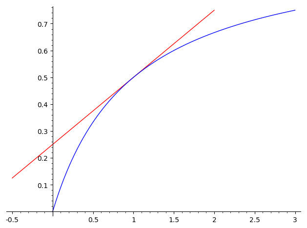
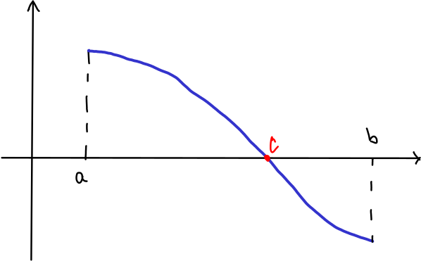

% Derivace & friends II
% Robert Mařík
% 2019

\iffalse

# Motivace: Derivace dělá funkci předvídatelnoulnou

V minulé přednášce jsme si ukázali, že pokud má funkce $f$ v bodě $x_0$ derivaci $f'(x_0)$ a pokud se veličina $x$ změní z hodnoty $x_0$ o hodnotu $\Delta x$ (tj. nová hodnota je $x_0+\Delta x$), potom se $f$ mění přibližně o $f'(x_0)\Delta x$. 

Nyní tento koncept rozšíříme. Nejprve se budeme snažit aproximovat celou funkci (a ne jenom její změnu) a poté budeme aproximaci zpřesňovat.

\fi

# Lineární aproximace v 1D

> Věta.
Buď $f:\mathbb R\to\mathbb R$ funkce, která má derivaci. V okolí bodu $x_0$ platí přibližný vzorec $$f(x)\approx f(x_0)+ f'(x_0)(x-x_0)$$ neboli
$$f(x)\approx f(x_0)+ \frac{\mathrm df(x_0)}{\mathrm dx}(x-x_0).$$

Výše uvedený vzorec není těžké rozšifrovat.

* Veličina $f(x)$ je funkční hodnota v bodě $x$, tu chceme odhadnout.
* Veličina $f(x_0)$ je známá funkční hodnota v bodě $x_0$, to je
  výchozí bod pro odhad.
* veličina $f'(x_0)(x-x_0)$ je odhad změny veličiny $f$ vyvolané
  změnou veličiny $x$ z $x_0$ o $\Delta x=x-x_0$ tak, jak jsme jej
  používali v minulé přednášce.

**Příklad (růst stromu).** Strom má v roce 2019 výšku 3 metry a roste
  rychlostí 0.5 metru za rok. V roce $x$ je jeho výška dána vzorcem
  $$h(x)=3+0.5(x-2019).$$

**Příklad (aproximace důležitých funkcí v okolí nuly).** Ve cvičení
ukážeme platnost následujících přibližných vzorců, které platí pro $x$
blízké k nule.  $$\sin x\approx x, \quad \cos x\approx 1,\qquad
(1+x)^n=1+nx.$$ První dva vzorce využijeme později při popisu malých
rotací v rovině.
 

**Příklad (gravitační potenciál v malých výškách nad zemí).**
Gravitační potenciál $V$ ve vzdálenosti $r$ od středu koule
o hmotnosti $M$ je dán vztahem $$V(r)=-G\frac Mr=-GMr^{-1},$$ kde $G$
je gravitační konstanta. Najdeme lineární aproximaci v bodě $R$.

Dosazením obdržíme $$V(R)=-GMR^{-1}$$ a derivováním $$\frac{\mathrm
dV}{\mathrm dr}=GMr^{-2}, \quad \frac{\mathrm dV(R)}{\mathrm
dr}=GMR^{-2}.  $$ Odsud poté získáme lineární aproximaci $$V(r)\approx
-GMR^{-1}+GMR^{-2}(r-R)$$ Pro Zemi jako kouli o poloměru $R$ je $r-R$
výška nad Zemí $h$ a aproximaci je možno po přeznačení napsat ve tvaru
$$V(r)\approx V_0 +gh.$$ V tomto označení je $V_0=-GMR^{-1}$ konstanta
související s volbou nulové hladiny potenciálu a vzhledem
k libovolnosti volby nulové hladiny je tato hodnota
nepodstatná. Veličina $g=GMR^{-2}$ je tíhové zrychlení vyjádřené
pomocí gravitační konstanty $G$ a parametrů Země. Veličina $gh$ je
potenciál v tíhovém poli Země. Tuto veličinu známe lépe ze vzorce pro
potenciální energii tělesa o hmotnosti $m$, který má tvar $$E=mgh.$$

[Online výpočet tíhového zrychlení](https://sagecell.sagemath.org/?z=eJxNjrEKgzAUAPdA_uFBB6Ngmlir7fDGji4OjoVHRQ22Rp6p31916nhwHDfSPBMWuihzc0usearU2hjgBD3T6oLzE73h5acl0BSkqLG4lNYYsytMrfsu4Dt4EIdBigqv-l5mRyfLj8yHln-DcSVWEUexFI3iGNNxP0iq8wYgRY-Nbl3XbaQY683qf4UjLIo=&lang=sage)

**Poznámka.** Lineární aproximace funkce je vlastně aproximace tečnou. Protože 
pojem tečna ze střední školy chápeme jenom intuitivně, můžeme nyní pomocí
derivace tečnu dokonce definovat. Z geometrického pohledu je tečna přímka
bodem $[x_0,f(x_0)]$, která má směrnici $f'(x_0)$. Proto se o derivaci
často mluví jako o směrnici tečny.

> Definice (tečna). Nechť $f$ je funkce, která má v bodě $x_0$ derivaci $f(x_0)$. Přímka $$y=f(x_0)+f'(x_0)(x-x_0)$$ se nazývá *tečna ke grafu funkce* $f$ v bodě $x_0$.

# Motivace: Je možné chtít více než je lineární aproximace?

Lineární aproximace vychází z předpokladu, že rychlost růstu (nebo
poklesu) se příliš nemění. Někdy můžeme mít dodatečnou informaci o tom, jak se tato rychlost změní. Například pokud se bude rychlost
zpomalovat, bude skutečná hodnota funkce menší než lineární
aproximace. 

Je otázka, zda a jak je možné informaci o tom, jak rychle roste
rychlost, případně jak rychle roste rychlost růstu rychlosti, využít.
To znamená že budeme studovat derivaci derivace, derivaci derivace
derivace atd.

# Taylorův polynom a polynomiální aproximace v 1D

> Definice (druhá a další vyšší derivace).
>
>* *Druhou derivací* rozumíme derivaci derivace. Označujeme $f''(x)$ nebo $\frac{\mathrm d^2 f}{\mathrm dx^2}$. 
>* Podobně *$k$-tou derivací* rozumíme derivaci $(k-1)$-ní derivace. Označujeme $f^{(k)}(x)$ nebo $\frac{\mathrm d^k f}{\mathrm dx^k}$. 
>
>Platí tedy $$\frac {\mathrm d^2 f}{\mathrm dx^2}=\frac {\mathrm d}{\mathrm dx} \left(\frac {\mathrm d f}{\mathrm dx}\right),\quad  
\frac {\mathrm d^kf}{\mathrm dx^k}=\frac {\mathrm d}{\mathrm dx}
\left(\frac {\mathrm d^{k-1}f}{\mathrm dx^{k-1}}\right)  $$
aneb
$$f''=(f')', 
\quad f'''=(f'')', \quad f^{(k)}={(f^{(k-1)})'}.$$

Označení derivací pomocí čárek se nazývá Lagrangeova notace, označení
pomocí podílu diferenciálů Leibnizova notace. Ještě se někdy používá i
Eulerova notace, používající $\mathrm Df$, $\mathrm D^2 f$ a $\mathrm
D^k f$ pro první, druhou a $k$-tou derivaci.

**Příklad.** 

* Exponenciální funkce $e^x$ má všechny derivace stejné. 
* U mocninné funkce se každým derivováním sníží exponent. Je-li
exponentem přirozené číslo, po konečném počtu kroků se exponent sníží
na nulu, funkce tedy bude konstantní a všechny další derivace budou
nulové. 
* Polynomy mají všechny derivace od jistého řádu rovny nule.

> Definice (Taylorův polynom).
> *Taylorův polynom* stupně $n$ pro funkci $f$ v bodě $x_0$ je polynom 
\dm$$T(x)=f(x_0)+f'(x_0)(x-x_0)+\frac{1}{2!}f''(x_0)(x-x_0)^2+\cdots +\frac{1}{n!}f^{(n)}(x_0)(x-x_0)^n,$$ 
tj.
\dm$$T(x)=f(x_0)+\frac {\mathrm df(x_0)}{\mathrm dx}(x-x_0)+\frac{1}{2!} \frac {\mathrm d^2f(x_0)}{\mathrm dx^2} (x-x_0)^2+\cdots +\frac{1}{n!}\frac {\mathrm d^nf(x_0)}{\mathrm dx^n}(x-x_0)^n.$$

> Věta (Taylorova věta s Lagrangeovým tvarem zbytku).
> Platí $$f(x)-T(x)=\frac{1}{(n+1)!}\frac {\mathrm d^{n+1}f(\xi)}{\mathrm dx^{n+1}}(x-x_0)^{n+1},$$
kde $\xi\in(x_0,x)$ je vhodné číslo. Pravá strana této rovnice je blízká k nule, pokud je $n$ dostatečně velké, $x$ dostatečně blízko k $x_0$ a $(n+1)$-ní derivace funkce $f$ je relativně malá. V těchto případech je $$f(x)\approx T(x).$$

**Příklad.** $$
\begin{aligned}
\ln \frac{1+x}{1-x}&\approx 2x+\frac 23 x^3+\frac 25 x^5+\frac 27 x^7 +\frac 29 x^9\\
\ln 2=\ln\frac {1+\frac 13}{1-\frac 13}&\approx 0.69314604
\end{aligned}$$
Po tomto výpočtu je prvních pět cifer aproximace $\ln 2$ správně. Tady vidíme i jeden zajímavý trik. Pokud bychom se snažili napsat Taylorův polynom funkce $\ln (x+1)$, která vypadá příjemněji, chyba aproximace by byla mnohem větší.

[Online výpočet.](https://sagecell.sagemath.org/?z=eJx1jrsKwkAQRfuF_YcBmxmMidHKws4_0E4sloQ8IJkJMYm7fr2bNSAErGY4F869BVo6N4yYbi0lmO4skVblQmeolVYbuEwGbsY10svkoJPGsbROqyIeAkUb7aMTxc9KXjgb_vDZdfUONlxDJTnL4MA3HQgM5JOMYLpebN2arPY1rfjTj292WfXr9_-yYNQqmO9BETNStFqEaXL8BuU6CPhBH7pTT2k=&lang=sage)

**Příklad.** Výraz $$V(r)=\frac 1{r^{12}}-\frac 2{r^6}=r^{-12}-2r^{-6}$$ je (až na konstanty, které pro pohodlí volíme pevně) Lennard-Jonesův potenciál často používaný pro interakci mezi atomy nebo molekulami. Napíšeme Taylorův polynom druhého stupně v bodě $r=1$. K tomu potřebujeme znát funkční hodnotu a hodnotu prvních dvou derivací v tomto bodě.
$$\begin{aligned}
V(1)&=1-2=-1\\
\frac{\mathrm dV}{\mathrm dr}&=-12r^{-13}-2(-6)r^{-7}\Bigr|_{r=1}=-12+12=0\\
\frac{\mathrm d^2V}{\mathrm dr^2}&=12\cdot 13 r^{-14}-2\cdot6\cdot 7r^{-8}\Bigr|_{r=1}=12\cdot 13-12\cdot 7=72\\
V(r)&\approx -1+\frac 12 72 (r-1)^2
\end{aligned}
$$
Konstanta $-1$ je nezajímavá, souvisí s nulovou hladinou potenciálu a nulovou hladinu potenciálu si můžeme volit libovolně.

Lineární člen chybí a kvadratický člen je analogický potenciální
energii pružiny o tuhosti $k$ ve tvaru $$U=\frac 12 kx^2.$$ Molekuly či
atomy popsané tímto potenciálem se chovají jako tělesa na pružině o tuhosti $k=72$. Pro atom o hmotnosti $m$ tedy například platí vzorec pro
úhlovou frekvenci oscilací $\omega = \sqrt{\frac km}$, odvozený
původně pro těleso na pružině. Veličina $r-1$ je výchylka z rovnovážného stavu.

[Online výpočet a obrázek.](https://sagecell.sagemath.org/?z=eJxljkEKwjAQRfeF3GF2SXCMzVi6yy1KlkJQQaE1YSya3t7JQjfuHv-_-cwrsdGsreoiBPAHPnmCPZDAqLpJsujWtM2ZDaNHErEu9wfWJVUpe3dEUl3xwmXOq4mGLYK4P8vKSaFvP_33COcs-0Hz9dIeed7y28jiDgohbKIEj9D80LuxUUvcYD-S5jQL&lang=sage)

# Motivace: Jak najít minimum potenciálu?

V příkladě s aproximací potenciálu pomocí Taylorova polynomu se nám
povedlo potenciál aproximovat pomocí kvadratické funkce v okolí
vrcholu paraboly. To je častá úloha, protože systémy s potenciální
energií se často nacházejí ve stavu blízkému minimu této
energie. Otázka je, jak toto minimum najít. Budeme řešit poněkud
obecnější úlohu, jak hledat nejenom minimální hodnotu, ale i maximální
hodnotu. Zaměříme se na minima a maxima, která jsou lokální (platná
pouze na určitém intervalu, třeba i krátkém). 

# Lokální extrémy spojitých funkcí

> Definice (lokální extrémy). Nechť $f\colon \mathbb R\to\mathbb R$.
>
>* Řekneme, že $f$ má v bodě $x_0$ *lokální maximum*, pokud platí $$f(x)\leq f(x_0)$$ pro všechna $x$ z nějakého okolí bodu $x_0$.
>* Řekneme, že $f$ má v bodě $x_0$ *lokální minimum*, pokud platí $$f(x)\geq f(x_0)$$ pro všechna $x$ z nějakého okolí bodu $x_0$.
>* Řekneme, že $f$ má v bodě $x_0$ *lokální extrém*, pokud v tomto bodě má buď lokální maximum nebo lokální minimum.

Přímo z definice lokálních extrémů a rostoucí a klesající funkce plyne, že funkce nemůže mít lokální extrém v bodě, kde je rostoucí nebo kde je klesající. Tuto skutečnost vyjadřuje pomocí derivací následující věta.

>Věta (Fermatova o lokálním extrému). Má-li funkce $f$ v bodě $x_0$ lokální extrém, potom je derivace funkce $f$ v bodě $x_0$ nulová, nebo neexistuje. 

Předchozí věta eliminuje obrovské množství bodů z definičního oboru
funkce. V prakticky využitelných případech nám po této eliminaci často
zůstane jenom jediný bod, podobně jako v následující úloze.

**Příklad.** Z kulatiny o průměru $d$ chceme vyříznout nosník
obdélníkového tvaru, který se při zatížení co nejméně prohýbá. Z
fyzikálních úvah plyne, že musí být maximální součin $bh^3$, kde $b$
je šířka a $h$ výška nosníku.

*Trik 1: Budeme měřit jednotky v násobcích průměru.* Proto je
$d=1$. Můžeme tedy bez újmy na obecnosti předpokládat, že kulatina má
jednotkový průměr.

Z Pythagorovy věty (nakreslete si průřez, tj. obdélník vepsaný do
kružnice) plyne $b=\sqrt{1-h^2}$ a snažíme se tedy řešit úlohu
$$bh^3=h^3 \sqrt{1-h^2}\to \mathrm{MAX},$$
která má fyzikální smysl na intervalu $(0,\infty)$.

*Trik 2: Protože uvažujeme jenom 
kladné délky, je funkce kladná a bude maximální tam, kde bude
maximální její druhé mocnina.* Je tedy možné studovat ekvivalentní
úlohu
$$(bh^3)^2=h^6(1-h^2)=h^6-h^8\to \mathrm{MAX}$$
na intervalu $(0,\infty)$. Výhoda je zřejmá: místo součinu dvou
funkcí, z nichž jedna je navíc složená, studujeme dvoučlenný
polynom. Pro funkci $$f(h)=h^6-h^8$$ dostáváme
$$ \frac{\mathrm df}{\mathrm dh}=6h^5-8h^7=2h^5(3-4h^2).$$
Tato derivace je nulová pro 
$$h^2=\frac 34$$
tj. $$h=\frac{\sqrt 3}2.$$ Pro tuto výšku bude mít nosník maximální
hodnotu tuhosti. Šířka nosníku bude
$$b=\sqrt{1-h^2}=\sqrt{1-\frac 34}=\sqrt{\frac 14}=\frac 12.$$
Poměr výšky a šířky u nosníku maximální tuhosti tedy bude $\sqrt{3}:1$
a šířka bude rovna polovině průměru.

[Online výpočet.](https://sagecell.sagemath.org/?z=eJwrSyzSUM9QSFHX5OVK08jQtM2IM9YqLiwq0UiJM9LNiDMCihdn5JdrpOmlZKaBVGAI6BXn55SlgmQAYWkWzQ==&lang=sage)

**Poznámka.** Někdy se při studiu lokálních extrémů hodí dva následující triky.

1. Vhodnou volbou jednotek dokážeme eliminovat některé
parametry. Přesněji, vhodnou volnou jednotek dokážeme některým
parametrům dát konkrétní numerickou hodnotu. Vyšetřovaná funkce je
potom často jednodušší.
1. Je-li $g$ rostoucí, potom z definice rostoucí funkce plynou ekvivalence
$$
\begin{gathered}
  f(x)\leq f(x_0) \iff   g(f(x))\leq g(f(x_0)),\\
    f(x)\geq f(x_0) \iff   g(f(x))\geq g(f(x_0))
\end{gathered}
$$
a proto funkce $f(x)$ a $g(f(x))$ mají lokální extrémy ve stejných
bodech. Toho je možné využít, pokud vidíme, že při vhodné volbě funkce
$g$ by byla funkce $g(f(x))$ vhodnější pro hledání lokálních
extrémů. Podobně je možné uvažovat i pro klesající funkce $g$, ale
protože klesající funkce obrací směr nerovností, mění se lokální
maximum na lokální minimum a naopak.

Pokud řešíme úlohu s praktickým zadáním, je z povahy úlohy často
zřejmé, že lokální extrém požadovaného typu existuje a často to bývá
jediný bod, kde je derivace nulová. Pokud takových bodů máme více,
nebo pokud je situace méně zřejmá, můžeme existenci lokálního extrému
posoudit pomocí následující věty.

> Věta (postačující podmínka pro lokální extrémy). Je-li $f$ spojitá v bodě $x_0$ a mění-li se v bodě $x_0$ funkce $f$ z rostoucí na klesající, má funkce $f$ v bodě $x_0$ lokální maximum. Analogicky, lokální minimum nastává při změně z klesající na rostoucí.

Podle této věty jsou intervaly monotonie zásadní informací pro
nalezení lokálních extrémů. Vzhledem k souvislosti monotonie s
derivací je tedy nutné se věnovat nalezení intervalů, kde má funkce
kladnou derivaci a intervalů, kde má funkce zápornou derivaci.

# Bolzanova věta

Bolzanova věta je poměrně názorné tvrzení. Hlavním přínosem pražského
matematika Bernarda Bolzana bylo, že si uvědomil, že toto tvrzení není
snadným důsledkem definice spojitosti a že přes názornost tohoto
tvrzení je nutno podat jeho přesný důkaz, který rozhodně není
jednoduchý. Jiná, zdánlivě nevinná tvrzení, však pravdivá být
nemusí. Zde se nabízí souvislost se spojitostí funkce a nakreslitelností jedním tahem. Bolzano například našel funkci, která je spojitá, ale její
graf je tak komplikovaný, že se nedá nakreslit.

Podmínka $f(a)f(b)<0$ v následující větě znamená, že funkční hodnoty
funkce $f$ v bodech $a$ a $b$ se liší znaménkem.

> Věta (Bolzanova věta). Nechť $f$ je spojitá funkce na intervalu $[a,b]$ a $f(a)f(b)<0$. Potom existuje $c$ na intervalu $(a,b)$ takové, že platí $f(c)=0.$

**Důsledek.**

* Na intervalu, kde je funkce spojitá a různá od nuly, se zachovává
znaménko funkce, tj. funkce je zde buď pořád kladná nebo pořád
záporná. Mezi oběma variantami se můžeme rozhodnout testováním
znaménka funkce v jednom libovolném bodě intervalu.
* Na intervalu, kde má funkce spojitou a od nuly různou derivaci, se
zachovává monotonie funkce, tj. funkce je zde buď pořád rostoucí nebo
pořád klesající. Mezi oběma variantami se můžeme rozhodnout testováním
monotonie (tj. znaménka derivace) v jednom libovolném bodě intervalu.

**Poznámka.** Lokální extrém nastává tam, kde je funkce spojitá a kde
se mění monotonie. Nenastává tam, kde se monotonie spojité funkce
nemění. Přirozeně nenastává ani tam, kde funkce není definována.

**Příklad.** Najděte lokální extrém funkce $y=\frac x{x^2+1}$. Derivace je $y'=\frac{(1+x)(1-x)}{(x^2+1)^2}$. 

**Příklad.** Najděte lokální extrém funkce $y=\frac{x^3}{x+2}$. Derivace je $y'=\frac{2(x+3)x^2}{(x+2)^2}$.

Řešení příkladů bude na přednášce. Další příklady ve cvičení.

# Lineární aproximace rovinné transformace

Následující pasáže rozšiřují lineární aproximaci na případ, kdy chceme
popsat transformaci roviny. Protože v tomto případě pracujeme se dvěma
souřadnicemi, je nutno uvažovat dvě funkce (pro každou souřadnici
jednu funkci) a každá funkce závisí na dvou proměnných (na obou
souřadnicích). Popis, který si představíme, využijeme při popisu
matematického namáhání při odvození veličin, na nichž je založen obecný
Hookův zákon dávající do souvislosti deformaci materálu a působení
vnější síly.

Lineární aproximaci funkce jedné proměnné můžeme zapsat ve tvaru
$$f(x+\Delta x)\approx f+\frac{\mathrm df}{\mathrm dx}\Delta x,$$
kde na pravé straně pro stručnost nevypisujme závislost na
$x$. Podobně můžeme zapsat lineární aproximaci pro funkci dvou
proměnných $x_{1}$ a $x_{2}$ ve tvaru
$$
f(x_{1}+\Delta x_{1}, x_{2})\approx f +\frac{\partial f}{\partial x_{1}},\qquad
f(x_{1}, x_{2}+\Delta x_{2})\approx f +\frac{\partial f}{\partial x_{2}}.
$$

Uvažujme nyní mechanické namáhání, kdy se těleso posunuje, rotuje a
deformuje vlivem působení vnější síly a bod $(x_{1}, x_{2})$ se
transformuje na bod $(u_{1}(x_{1},x_{2}),u_{2}(x_{1},x_{2})).$
Čtverec $ABCD$ na obrázku se zobrazí na obrazec $A'B'C'D'$. Pomocí lineárních
aproximací
$$
\begin{aligned}
  u_{1}(x_{1}+\Delta x_{1}, x_{2})&\approx u_{1}+\frac{\partial u_{1}}{\partial x_{1}}\Delta x_{1}\\
  u_{2}(x_{1}+\Delta x_{1}, x_{2})&\approx u_{2}+\frac{\partial u_{2}}{\partial x_{1}}\Delta x_{1}\\
  u_{1}(x_{1}, x_{2}+\Delta x_{2})&\approx u_{1}+\frac{\partial u_{1}}{\partial x_{2}}\Delta x_{2}\\
  u_{2}(x_{1}, x_{2}+\Delta x_{2})&\approx u_{2}+\frac{\partial u_{2}}{\partial x_{2}}\Delta x_{2}\\
  u_{1}(x_{1}+\Delta x_{1}, x_{2}+\Delta x_{2})&\approx u_{1}+\frac{\partial u_{1}}{\partial x_{1}}\Delta x_{1}+\frac{\partial u_{1}}{\partial x_{2}}\Delta x_{2}\\
  u_{2}(x_{1}+\Delta x_{1}, x_{2}+\Delta x_{2})&\approx u_{2}+\frac{\partial u_{2}}{\partial x_{1}}\Delta x_{1}+\frac{\partial u_{2}}{\partial x_{2}}\Delta x_{2}
  \end{aligned}
$$
dostáváme aproximace polohy bodů $B'$, $C'$ a $D'$ založené na
relativní poloze bodů $B$, $C$ a $D$ vzhledem k $A$ a na změně polohy
bodu $A$. Bod $C$ je od bodu $A$ vzdálen o $\Delta x_{1}$ ve
vodorovném směru a o $\Delta x_{2}$ ve svislém směru. Bod $C'$ je
vzhledem k bodu $A'$ umístěn o $\frac{\partial u_{1}}{\partial
x_{1}}\Delta x_{1}+\frac{\partial u_{1}}{\partial x_{2}}\Delta x_{2}$
doprava a $\frac{\partial u_{2}}{\partial x_{1}}\Delta
x_{1}+\frac{\partial u_{2}} {\partial x_{2}}\Delta x_{2}$ nahoru. Při
transformaci ve $3D$ je situace podobná, jenom jsou zde další členy
od třetích souřadnic. Aby se situace nestala nepřehlednou, je klasický
způsob zápisu neudržitelný. Nástroj pro přehlednou formulaci lineární
aproximace dostaneme k dispozici později po probrání maticového počtu
a maticového násobení. Poté budeme díky lineární aproximaci schopni
zformulovat souvislost mezi deformací a působením vnější síly.

Za výše uvedenou lineární aproximaci však platíme jistou daň. Lineární
zobrazení mimo jiné transformuje přímky na přímky a rovnoběžky na
rovnoběžky. Deformaci nakreslenou na obrázku tím pádem nemůžeme
podchytit. Lineární aproximace je přesná jenom pro relativně malé
deformace. Proto se také výsledný produkt, ke kterému se v průběhu
semestru dopracujeme, nazývá tenzor malých deformací.

