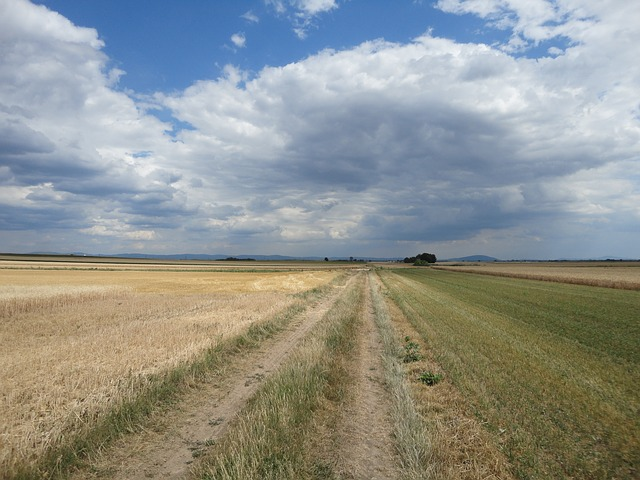
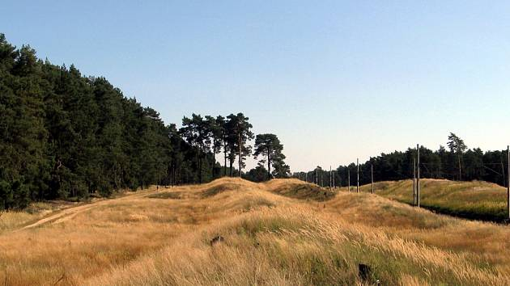
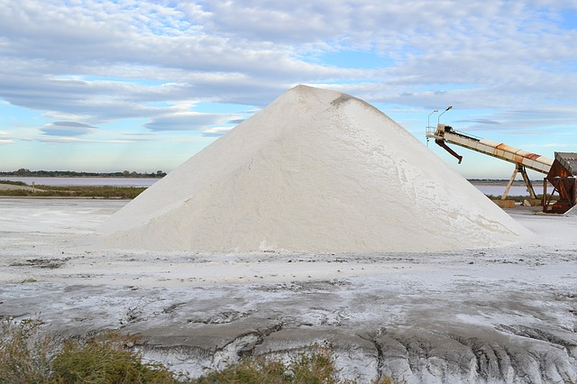
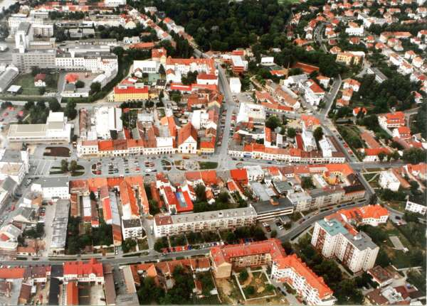

% Výpočet derivací

Derivaci budeme chápat jako zobrazení, které funkci přiřadí jinou
funkci. Proč je tak nesmírně užitečná zjistíme v následujících
týdnech.

## Základní vzorce.

1. $( c)'=\frac{\mathrm d}{\mathrm dx}( c)=0$
1. $( x^n)'=\frac{\mathrm d}{\mathrm dx}( x^n)=n x^{n-1}$
1. $( e^x)'=\frac{\mathrm d}{\mathrm dx}( e^x)=e^x$
1. $( \ln x)'=\frac{\mathrm d}{\mathrm dx}( \ln x)=\frac 1x$
1. $( \sin x)'=\frac{\mathrm d}{\mathrm dx}( \sin x)=\cos x$
1. $( \cos x)'=\frac{\mathrm d}{\mathrm dx}( \cos x)=-\sin x$
1. $( \mathop{\mathrm{arctg}} x)'=\frac{\mathrm d}{\mathrm dx}( \mathop{\mathrm{arctg}} x)=\frac 1{1+x^2}$

Zde $c\in\mathbb R$ je konstanta a zbytek jsou vzorce,
které platí vždy, když je výraz napravo definovaný.

## Triky, které se často hodí.

1. $\sqrt x=x^{\frac 12}$
1. $\sqrt[k] x=x^{\frac 1k}$
1. $\frac {1}{x^k}=x^{-k}$
1. $\frac {f(x)}c=\frac 1c f(x)$
1. $\frac {c}{f(x)}=c f^{-1}(x)$
1. $a^x=e^{x\ln a}$
1. $\log_ax=\frac{\ln x}{\ln a}$
1. $\sqrt x(x+1)=x^{\frac 32}+x^{\frac 12}$
1. $\frac  {x^3+4}{x^2}=x+4x^{-2}$

## Derivace matematických operací mezi funkcemi

Nechť $f$, $g$ jsou funkce a $c\in\mathbb R$ konstanta. Platí

1. ${\left[cf\right]}'=cf'$
1. ${\left[f\pm g\right]}'=f'\pm g'$
1. ${\left[fg\right]}'=f'g+fg'$
1. ${\left[\frac{f}{g}\right]}'=\frac{f'g-g'f}{g^2}$
1. $\left[f(g(x))\right]'=\frac{\mathrm df}{\mathrm dg}\frac{\mathrm dg}{\mathrm dx}=f'(g(x))g'(x)$

# Výpočet derivace

Určete derivace následujících funkcí, kde $a,b,\mu\in\mathbb{R}$.

1. $f(x)=x^6+\frac 1{x^6}.$
1. $f(x)=x^2+2x+6.$
1. $f(r)=r^3+2r^2-1$
1. $f(x)=3x\sqrt x+9x^5.$
1. $f(x)=1-e^{bx}.$
1. $f(x)=(x^2-1)^4.$
1. $f(x)=\frac{1}{\sqrt \pi}e^{ax^2}.$
1. $f(x)=\frac 1{(x+6)^2}.$
1.  $f(x)=\frac{a}{(\mu x+b)^2}.$

1. $f'(x)=6x^5-\frac{6}{x^7}$
1. $f'(x)=2x+2$
1. $f'(r)=3r^2+4r$
1. $f'(x)=(3x^{3/2}+9x^5)'=\frac 92\sqrt x+45x^4$
1. $f'(x)=-be^{bx}$
1. $f'(x)=4(x^2-1)^32x=8x(x^2-1)^3$
1. $f'(x)=\frac 1{\sqrt \pi} e^{ax^2}2ax$
1. $f'(x)=\frac{-2}{(x+6)^3}$
1. $f'(x)=\frac{-2a\mu}{(\mu x+b)^3}$

# Růst ryby
Biologové navrhli funkci
$$
    l=0.03937 t^3 - 0.945 t^2 + 10.033 t + 3.073
  $$
  jako model délky jistého druhu ryby, kde $l$ je délka ryby v centimetrech, a $t$ je věk v letech.  Vypočtěte derivaci
  $\frac{\mathrm{d}l}{\mathrm {d}t}$. Určete jednotku této derivace a
  slovní interpretaci hodnoty derivace v bodě $t=12$.

_Upraveno podle Stewart, Day: Biocalculus. Calculus for the life siences. V tomto příkladě se setkáváme s klasickou interpretací derivace jako rychlosti změny, tj. hodnoty o kterou se změní závislá veličina, když se nezávislá veličina změní o jednotku._

 Jednotkou derivace je $\left[\frac{\mathrm dl}{\mathrm dt}\right]=\mathrm{cm}/\mathrm{rok}$, tj. centimetr za rok. Derivace udává (v centimetrech za rok) jaká je okamžitá rychlost růstu ryby. Přesněji je touto rychlostí růstu je myšlena rychlost, s jakou roste délka ryby v čase.

Závislost délky na čase je vyjádřena polynomem. Použitím pravidel pro derivování je snadné ukázat, že pro derivaci délky podle času platí
$$
    \frac{\mathrm dl}{\mathrm dt} =3\cdot 0.03937 t^2 - 2\cdot 0.945 t + 10.033 =
    0.11811 t^2 -1.89 t + 10.033 
  $$
  a pro $t=12\,\mathrm{let}$ dostáváme 
$$
   \frac{\mathrm dl}{\mathrm dt}\Bigr\vert_{t=12} =4.4\, \mathrm{cm}/\mathrm{rok}.
  $$
  Dvanáctiletá ryba roste rychlostí přibližně $4.4$ centimetrů za rok,
tj. mezi dvanáctým a třináctým rokem vyroste přibližně o $4.4$
centimetru. (Slovo přibližně je použito proto, že derivace je okamžitá rychlost růstu a není zaručeno, že tato rychlost se udrží po celou jednotku času, tj. po celý rok.) 

# Bazální metabolismus
Bazální metabolismus $M$ (ve wattech) souvisí s hmotností $W$ vztahem
$$M=AW^n,$$ kde $n$ je pro mnoho živočišných druhů blízké číslu $0.75$ a
$A$ je konstanta, která je specifická pro daný druh a v rámci daného
druhu klesá s věkem. Určete derivaci $$\frac{\mathrm d M}{\mathrm dW}$$
a určete i fyzikální jednotku a slovní interpretaci této derivace.

_Zpracováno podle Monteith, Unsworth: Principles of Environmental Physics. Tady je opět klasická interpretace derivace jako rychlosti změny. Rychlost změny ale nemusí být jenom klasické chápání rychlosti jako závislosti na čase. Derivace vyjadřuje, jak závislá veličina reaguje na změny nezávislé veličiny. Pro pochopení, co derivace vyjadřuje, hraje velkou roli i jednotka této derivace. Označení je ponecháno z původní literatury, mimo jiné $M$ není hmotnost a $W$ není watt. Vztah je v literatuře znám jako Kleiberův zákon. Vysvětluje se pomocí něj rozdílná délka života různých živočišných druhů._

Pro výpočet si stačí uvědomit, že funkce je konstantním násobkem mocninné funkce a umíme ji tedy zderivovat podle pravidla pro derivaci konstantního násobku a pravidla pro derivaci mocninné funkce. 
Derivace je $$\frac {\mathrm dM}{\mathrm dW}=\frac {\mathrm d}{\mathrm dW}(AW^n)=nAW^{n-1}$$ podle pravidla pro
derivaci konstantního násobku a pro derivaci mocniny. Jednotka je watt
na kilogram, tj.
$$\left[\frac {\mathrm dM}{\mathrm dW}\right]=\frac{\mathrm W}{\mathrm
  {kg}}.$$ Derivace udává rychlost, s jakou se projeví změna hmotnosti na bazálním metabolismu. Je to nárůst bazálního metabolismu způsobený nárůstem hmotnosti a přepočtený na jednotkovou změnu hmotnosti. Přibližně také změna bazálního metabolismu ve wattech při změně hmotnosti o kilogram u velkých živočichů nebo v miliwatech při změně hmotnosti o gram u drobných živočichů. Například u malých ptáčků nemá smysl uvažovat nárůst hmotnosti o kilogram a pro interpretaci raději přejdeme k jednotkám tisíckrát menším.

# Mezní náklady (marginal cost)

Náklady na produkci $x$ letadel za rok jsou (v milionech
Euro) dány funkcí
$$C(x) = 6 + \sqrt{4x + 4},\qquad  0 \leq x \leq 30.$$
Platí $C'(15)=0.25$. Určete, jakou tato derivace má slovní
interpretaci a určete i jednotku této derivace.

_Toto je jedna z nejrozšířenější aplikací derivací mimo přírodní vědy. Zajímáme se o to, jak rychle rostou ekonomické veličiny, protože ekonomika je za vším. Veličiny, které v ekonomii získáváme derivováním, obsahují zpravidla slovo "mezní", nebo též "marginální". Podle Wikipedie nastupující technická revoluce nazývaná Průmysl 4.0 přinese výrobu s velmi malými mezními náklady. Tedy derivace nákladů na výrobu podle množství vyrobeného zboží bude malá. To odpovídá představě výroby v robotizovaných halách, kde hlavním nákladem je vybudování výrobního zařízení._

Jednotka derivace $C'(x)$ je $\mathrm{milion\ Euro}/\mathrm{kus}$, resp. 
$\mathrm{milion\ Euro}/\mathrm{letadlo}$, resp. milion Euro, podle toho, jak nazveme jednotky v nichž měříme počet letadel.

Derivace $C'(15)$ vyjadřuje rychlost, s jakou rostou náklady při produkci $15$ letadel. Je to cena vztažená na jednotkový přírůstek, tj. jedná se vlastně o cenu výroby šestnáctého letadla. Šestnácté letadlo má výrobní náklady 0.25 milionů euro.

*Poznámka:* Jinou cestou jak určit cenu šestáctého letadla je použít rozdíl $$C(16)-C(15)\approx 0.246.$$ Toto je cesta, která se zdá výhodnější, protože není nutné derivovat. Ale tato cesta zpravidla vede ke složitějším postupuům, jakmile tento výpočet vstupuje jako jedna z komponent do složitějšího modelu. Odhad ceny dalšího letadla při produkci $x$ letadel je bez derivace roven
$$C(x+1)-C(x)=\sqrt{4(x+1)+4}-\sqrt{4x+1}$$ a s derivací
$$C´(x)=\frac{2}{\sqrt{4x+4}}.$$ Ve druhém případě máme zlomek s konstantním čitatelem (vlastně se jedná o mocninnou funkci s exponentem $-\frac 12$), v prvním případě máme rozdíl dvou odmocnin. Druhá metoda tedy vede k jednodušší funkci a tato jednoduchost může být kriticky důležitá, pokud námi odvozená cena dalšího letadla vstupuje do dalšího výpočtu. 

# Vzdálenost k horizontu

Vzdálenost k horizontu pro pozorovatele ve výšce $h$ nad Zemí je dána funkcí $H=\sqrt {2Rh},$ kde $R=6.371\times 10^6\,\mathrm m$ je poloměr Země (\url{https://aty.sdsu.edu/explain/atmos_refr/horizon.html}). Po dosazení a vydělení faktorem 1000, aby $H$ vycházelo v kilometrech, dostáváme vzorec $$H=3.57\sqrt{h},$$ kde $h$ je v metrech a $H$ v kilometrech. Určete hodnotu této derivace $\frac{\mathrm d H}{\mathrm dh}$ pro $h=5\,\mathrm{m}$ (včetně jednotky) a slovní interpretaci této derivace.

_Někdy je rozměr veličiny derivované stejný, jako rozměr veličiny, podle které se derivuje. Potom je derivace vlastně bez rozměru. Někdy je však vhodné pro srozumitelnější interpretaci jednotky nevykrátit, obzvlášť v případě jako je tento, kdy se obě délky udávají v jiných jednotkách (metry versus kilometry)._

Pro $H=3.57\sqrt h$ platí $$\frac{\mathrm dH}{\mathrm dh}=\frac 12 \times 3.57 \times \frac {1}{\sqrt h}$$ a numericky
$$\frac{\mathrm dH}{\mathrm dh}(5)=\frac{3.57}{2\sqrt 5}\approx 0.7983 \frac {\mathrm{km}}{\mathrm m}\approx 0.8 \frac {\mathrm{km}}{\mathrm m}.$$ Vzdálenost k horizontu pro pozorovatele ve výšce $5$ metrů roste rychlostí 0.8 kilometru na každý metr výšky navíc. Toto je interpretace pro praktické využití. Kromě toho se jednotky dají upravit a ve skutečnosti derivace žádný fyzikální rozměr nemá
$$\frac{\mathrm dH}{\mathrm dh}(5)=0.7983 \times \frac {1000\, \mathrm{m}}{\mathrm m}=798$$ a každá změna výšky pozorovatele se na vzdálenosti k horizontu projeví svým $800$-násobkem.

# Rychlost s jakou roste obsahu kruhu

Váté písky je bezlesý
pruh podél železniční trati nedaleko Bzence, kde je extrémní sucho
(Moravská Sahara). V dřívějších dobách byly v pruhu podél železnice velmi časté
požáry kvůli provozu parních vlaků. Předpokládejme, že požár se v této
vysušené oblasti šíří ve tvaru kruhu. V určitém okamžiku je poloměr $50$
metrů a roste rychlostí $1.5$ metrů za minutu. Zapište zadání pomocí
derivací a určete jak rychle roste plocha zasažená ohněm.

_V tomto příkladě se učíme, že ze znalosti vztahů mezi veličinami můžeme odvodit vztah, mezi rychlostmi změn, tj. do statických vzorců můžeme dodat dynamiku vývoje. V praxi někdy jde příklad tohoto typu obejít úvahou: teď je poloměr 50 metrů, tomu odpovídá jakási plocha, za minutu  bude poloměr 51.5 metru, tomu odpovídá opět jakási plocha a provnáním s plochou původní snadno zjistím přírůstek. To pro nás může být kontrola, že aparát funguje. Pro nás je teď důležité naučit se tento aparát na malých věcech, abyste mohli později dělat věci velké._

Ze zadání známe poloměr $r=50\,\mathrm{m}$ a rychlost růstu poloměru $\frac {\mathrm dr}{\mathrm dt}=1.5\,\text{m}\,\text{min}^{-1}$. Zajímá nás rychlost růstu obsahu $\frac{\mathrm dS}{\mathrm dt}$.

Derivováním vztahu $$S=\pi r^2$$ podle $r$ získáváme $$\frac {\mathrm dS}{\mathrm dr}=2\pi r.$$ Derivováním podle $t$ dostaneme
$$\frac{\mathrm dS}{\mathrm dt} =
\frac{\mathrm dS}{\mathrm dr}
\frac{\mathrm dr}{\mathrm dt}=
2\pi r \frac{\mathrm dr}{\mathrm dt}$$
a numericky
$$\frac{\mathrm dS}{\mathrm dt} = 2\pi \times 50 \times 1.5 \approx 471 \,\mathrm{m}^2\,\text{min}^{-1}.$$

# Sůl nad zlato

V pohádce _Sůl nad zlato_ sype Maruška z bezedné slánky sůl na hromadu soli ve tvaru kužele, který roste tak, že objem je v každém okamžiku svázán s výškou vzorcem $$V=\frac 14h^3.$$ Výška je $0.5$ metru a vydatnost solničky $10$ litrů (tj. $0.01$ krychlových metrů) soli za minutu. Určete, jak rychle roste hromada soli do výšky.

Podle zadání je $\frac{\mathrm dV}{\mathrm dt}=0.01$ krychlových metrů za minutu, $h=0.5$ metru a chceme znát $\frac{\mathrm dh}{\mathrm dt}$. Derivováním dostáváme
$$\frac{\mathrm dV}{\mathrm dt} = \frac{\mathrm dV}{\mathrm dh} \frac{\mathrm dh}{\mathrm dt} = \frac 34 h^2 \frac{\mathrm dh}{\mathrm dt}.$$
Odsud
$$\frac{\mathrm dh}{\mathrm dt} = \frac 43 \frac{\mathrm dV}{\mathrm dt} \frac 1{h^2}$$
a po dosazení
$$\frac{\mathrm dh}{\mathrm dt} = \frac 43 \times 0.01 \times \frac 1{0.5^2} \,\mathrm{m}\,\mathrm{min}^{-1}=0.053 \,\mathrm{m}\,\mathrm{min}^{-1}.$$
Hromada roste do výšky rychlostí 5.3 centimetru za minutu.

# Rychlost s jakou roste obsahu kruhu II

Město má přibližně tvar kruhu o poloměru $10\,\mathrm{km}$ a žije v něm $300\,000$ obyvatel. Jak rychle musí růst poloměr kruhu (velikost
města), pokud počet obyvatel roste rychlostí $10\,000$ obyvatel za rok
a chceme udržet stejnou hustotu osídlení?

_Toto je mírná modifikace příkladu s požárem. Protože město má konstantní hustotu osídlení, jsou počet obyvatel i rozloha přímo úměrné a je to podobné, jako bychom jednu veličinu vyjadřovali ve dvou různých jednotkách._

Ze zadání: $r=10\,\mathrm{km}$, $N=300\,000$, $\sigma=\frac{N}{\pi r^2}$ je hustota osídlení a ta je konstantní, $\frac {\mathrm dN}{\mathrm dt}=10\,000 \,\text{rok}^{-1}$. Zajímá nás $\frac{\mathrm dr}{\mathrm dt}$.

Výpočet: Pro počet obyvatel platí $N=\sigma \pi r^2$ a derivováním $$\frac{\mathrm dN}{\mathrm dt}
=\frac{\mathrm dN}{\mathrm dr}\frac{\mathrm dr}{\mathrm dt}=\sigma \pi 2r\frac{\mathrm dr}{\mathrm dt}.$$ Odsud
$$
\frac{\mathrm dr}{\mathrm dt}=\frac 1{2\pi r\sigma}\frac{\mathrm dN}{\mathrm dt}
$$
a protože $\pi r\sigma=\frac Nr$, máme
$$
\frac{\mathrm dr}{\mathrm dt}=\frac {r}{2N}\frac{\mathrm dN}{\mathrm dt}=\frac {10}{2\times 300\,000}\times 10\,000=0.166 \,\mathrm{km}\,\mathrm{rok}^{-1}\approx 170\,\mathrm m\,\mathrm{rok}^{-1}
$$

Existuje ještě poněkud přímočařejší, ale na provedení mírně náročnější postup, protože je nutné derivovat podíl funkcí. Zderivujeme přímo definiční vztah pro hustotu osídlení $\sigma=\frac{N}{\pi r^2}$ podle času. Vlevo je derivace konstanty, tj. nula, vpravo derivace podílu. Proto
$$0=\frac{\frac{\mathrm dN}{\mathrm dt} \pi r^2 - N2\pi r\frac{\mathrm dr}{\mathrm dt}}{(\pi r^2)^2}$$
a odsud
$$\frac{\mathrm dN}{\mathrm dt} \pi r^2 - N2\pi r\frac{\mathrm dr}{\mathrm dt}=0.$$
Nyní osamostatníme derivaci poloměru a dostaneme
$$
\begin{aligned}
\frac{\mathrm dN}{\mathrm dt} \pi r^2 &= N2\pi r\frac{\mathrm dr}{\mathrm dt}\\
\frac{\mathrm dr}{\mathrm dt} &= \frac{\mathrm dN}{\mathrm dt} \frac r{2N} 
\end{aligned}
$$
a výsledek je stejný jako v předchozím postupu.

