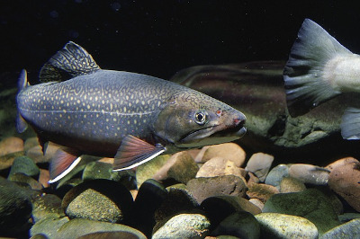

% Lokální extrémy

> * Naučíme se hledat lokální extrémy funkce

# Lokální extrémy bez slovního zadání

V úlohách z praxe často
víme, že existuje optimální řešení a studovaná funkce má jediný bod s nulovou derivací. Pokud studujeme funkci bez jakéhokoliv kontextu,
musíme posuzovat to, zda v daném bodě opravdu extrém je a
jaký. Nejlépe tak, že současně určíme i intervaly monotonie. Za
povšimnutí stojí, že při hledání bodů, kde jsou lokální extrémy,
vlastně ani nemusíme znát původní funkci. Stačí nám o ní informace
týkající se spojitosti a poté stačí znát derivaci. I s takovým
případem se v praxi setkáváme.

Najděte lokální extrémy a intervaly monotonie následujících funkcí. Spolu s funkcí je zadána i její derivace.

1. $y=\frac x{(x+1)^2}$, $y'=\frac{1-x}{(x+1)^3}$
1. $y=\frac{x^2}{x+1}$, $y'=\frac{x(x+2)}{(x+1)^2}$
1. $y=\frac{x^2}{x^2+1}$, $y'=\frac{2x}{(x^2+1)^2}$
1. $y=(5-x)\sqrt x$, $y'=\frac{1}{2\sqrt x}(5-3x)$
1. $y=x^2 e^{-x}$, $y'=-(x - 2)xe^{-x}$
1. $y$ je spojitá na $\mathbb R\setminus\{2\}$,\\ $y'=\frac{(x^2+3)(x^2-3)}{2-x}$

*1.* $y=\frac x{(x+1)^2}$, $y'=\frac{1-x}{(x+1)^3}$

Nulové body derivace jsou řešení rovnice $$1-x=0.$$ Tato rovnice má jediné řešení $$x=1.$$

Body nespojitosti derivace jsou řešení rovnice $$(x+1)^3=0.$$ Tato rovnice má jediné řešení $$x=-1.$$

Body nespojitosti a nulové body rozdělí reálnou osu na tři podintervaly.

* Interval $(-\infty,-1)$. Dosazením reprezentanta $x=-2$ z tohoto intervalu máme $$y'(-2)=\frac{1-(-2)}{(-2+1)^3}<0$$ a proto je derivace na tomto intervalu záporná a funkce klesá.
* Interval $(-1,1)$. Dosazením reprezentanta $x=0$ z tohoto intervalu máme $$y'(0)=\frac{1-0}{(0+1)^3}>0$$ a proto je derivace na tomto intervalu kladná a funkce roste.
* Interval $(1,\infty)$. Dosazením reprezentanta $x=2$ z tohoto intervalu máme $$y'(2)=\frac{1-2}{(2+1)^3}<0$$ a proto je derivace na tomto intervalu záporná a funkce klesá.
  \end{itemize}

  V bodě $x=1$ se monotonie funkce mění spojitě z klesající na rostoucí (nakreslete si schema) a funkce má lokální minimum.

  V bodě $x=-1$ se monotonie funkce mění z rostoucí na klesající, ale lokální extrém zde není, protože funkce ani její derivace v tomto bodě nejsou definovány.

  
*2.* $y=\frac {x^2}{x+1}$, $y'=\frac{x(x+2)}{(x+1)^2}$

Nulové body derivace jsou řešení rovnice $$x(x+2)=0.$$ Tato rovnice má dvě řešení $$x_1=0, \ x_2=-2.$$

Body nespojitosti derivace jsou řešení rovnice $$(x+1)^2=0.$$ Tato rovnice má jediné řešení $$x=-1.$$

Body nespojitosti a nulové body rozdělí reálnou osu na čtyři podintervaly.

* Interval $(-\infty,-2)$. Dosazením reprezentanta $x=-10$ z tohoto intervalu máme $$y'(-10)=\frac{(-10)(-10+2)}{(\dots )^2}>0$$ a proto je derivace na tomto intervalu kladná a funkce roste. Všimněte si, že jmenovatel je stále kladný a znaménko podílu nijak neovlivní.
* Interval $(-2,-1)$. Dosazením reprezentanta $x=-1.5$ z tohoto intervalu máme $$y'(-1.5)=\frac{-1.5(-1.5+2)}{(\dots)^2}<0$$ a proto je derivace na tomto intervalu záporná a funkce klesá.
* Interval $(-1,0)$. Dosazením reprezentanta $x=-0.5$ z tohoto intervalu máme $$y'(-0.5)=\frac{-0.5(-0.5+2)}{(\dots)^2}<0$$ a proto je derivace na tomto intervalu záporná a funkce klesá.
 * Interval $(0,\infty)$. Dosazením reprezentanta $x=1$ z tohoto intervalu máme $$y'(1)=\frac{1(1+2)}{(\dots)^2}>0$$ a proto je derivace na tomto intervalu kladná a funkce roste.
  \end{itemize}

  V bodě $x=-2$ se monotonie funkce mění spojitě z rostoucí na klesající (nakreslete si schema) a funkce má v tomto bodě lokální maximum.

  V bodě $x=0$ se monotonie funkce mění spojitě z klesající na rostoucí (nakreslete si schema) a funkce má v tomto bodě lokální minimum.

  V bodě $x=-1$ se monotonie funkce nemění. Navíc funkce v tomto bodě ani není definována a existenci lokálního extrému tedy ani neuvažujeme

    
*3.* $y=\frac {x^2}{x^2+1}$, $y'=\frac{2x}{(x^2+1)^2}$

Nulové body derivace jsou řešení rovnice $$2x=0.$$ Tato rovnice má jediné řešení $$x=0.$$

Body nespojitosti derivace jsou řešení rovnice $$(x^2+1)^2=0.$$ Tato rovnice nemá v oboru reálných čísel žádné řešení.

Body nespojitosti nejsou a jeden nulový bod rozdělí reálnou osu na dva podintervaly. Z derivace je zřejmé, že derivace má stejné znaménko jako $x$, tj. derivace je záporná nalevo od nuly a kladná napravo od nuly. To znamená, že v nule se funkce mění z klesající na rostoucí a funkce má v tomto bodě lokální minimum. 
  

# Krabička z papíru

V každém rohu papíru A4 vystřihneme čtverec a zbylý papír podél stran
poohýbáme nahoru, aby vznikla (až se to slepí) krabička bez horního
víka. Jak velké čtverce musíme odstříhat, pokud chceme, aby výsledná
krabička měla co největší objem?

_Toto je klasický příklad přítomný snad v každé učebnici
diferenciálního počtu. Zajímavý je tím, že A4 má ve výuce zpravidla
každý před sebou a může si tipnout, jaký očekává výsledek a kolik
maximální objem bude. Pro odhad objemu si můžeme představit třeba
litrovou krabici mléka a porovnávat s tímto referenčním kvádrem._

 Papír A4 má rozměry $210\times 297\,\mathrm{mm}$ a je-li vystřižený čtverec o straně $x$, má krabička rozměry $(210-2x)\times(297-2x)\times x$ a objem
$$
V(x)=(210-2x)(297-2x)x=4 x^3 - 1014 x^2 + 62370 x.
$$
Derivováním dostaneme
$$
  \frac{\mathrm dV}{\mathrm dx} = 12x^2 - 2028x + 62370
$$
a nulové body derivace jsou řešeními rovnice 
$$
   12x^2 - 2028x + 62370 = 0.
 $$
 Tato rovnice má pro naši úlohu jediné smysluplné řešení $x=40.4$ (další řešení $x=128.5$ neodpovídá realizovatelnému výrobku). Optimální krabička vznikne vystřižením čtverců o stranách $40.4\,\mathrm{mm}$. Objem je
 $$
   V(40.4)=1.12 \times 10^6\,\mathrm {mm}^3=1.12\,\mathrm{l}.
 $$
 

 

# Plot ze tří stran pozemku

Chceme oplotit pozemek obdélníkového tvaru, jehož jedna strana je
rovná přirozená hranice. Stavíme plot tedy jenom na zbylých třech
stranách.

1. Jaký tvar pozemku zvolit, pokud je dána délka pletiva a chceme mít plochu pozemku co největší?
1. Jaký tvar pozemku zvolit, pokud je dána plocha pozemku a chceme mít co nejmenší spotřebu pletiva?

_Než začnete řešit, tak si zkuste tipnout jestli optimální je čtverec
nebo obdélník. Pokud obdélník, tak zda podél přirozené hranice nebo
kolmo na ni. Také si zkuste tipnout, zda je řešení obou úloh stejné
(tj. stejný tvar obdélníku, například stejný poměr stran). Úlohy řešte
s co nejmenším množstvím parametrů. Uvažujte tedy, že máte jednu
délkovou jednotku pletiva v prvním případě a že chcete oplotit pozemek
o jednotkovém obsahu v případě druhém._

Obsah obdélníka o stranách $x$ a $y$ je součin délek dvou sousedních stran
$$
  S=xy
$$
délka plotu bude délka strany podél hranice (např $x$) a dvojnásobek délky strany kolmé na hranici (např. $y$)
$$
  L=x+2y
$$
\textbf{Maximální plocha při daném obvodu.}
Měřeno v násobcích délky plotu je $L=1$ a ze vztahu
$$
  x+2y=1
$$
dostaneme
$$
  x=1-2y.
$$
Potom platí
$$
  S=xy=(1-2y)y=y-2y^2.
$$
Derivací obdržíme
$$
  \frac{\mathrm dS}{\mathrm dy}=1-4y
$$
a derivace je rovna nule pro $y=\frac 14$, tedy kratší strana je čtvrtina celkové délky plotu. Na delší strana tedy zbude polovina (dvakrát odkrojím čtvrtinu) a obdélník má poměr stran $2:1$.

*Minimální obvod při daném obsahu.*
Měřeno v jednotkách, ve kterých je obsah $S$ roven jedné (tj. v násobcích délky strany čtverce o stejném obsahu jako náš obdélník) dostáváme ze vztahu
$$
  xy=1
$$
vztah
$$
  y=\frac 1x.
$$
Potom platí
$$
  L=x+2y=x+\frac 2x=x+2x^{-1}
$$
Derivací obdržíme
$$
  \frac{\mathrm dL}{\mathrm dx}=1+2(-1)x^{-2}=1-\frac 2{x^2}
$$
a derivace je rovna nule pro $x^2=2$, tj. pro $x=\sqrt{2}$ (uvažujeme jenom kladné hodnoty $x$). Ze vztahu $y=\frac 1x$ dostáváme
$$
  y=\frac 1{\sqrt 2}=\frac{\sqrt{2}}2=\frac x2
$$
a kratší strana je polovinou délky delší strany. Jako v předchozím případě, obdélník má poměr stran $2:1$.

# Optimální trám vyřezaný z kulatiny
Ukažte, že pro vyřezání nebo vytesání trámu o maximálním objemu z kulatiny válcového tvaru je nutné vyřezat trám se čtvercovým
průřezem. Návod: Uvažujte válec, ze kterého chceme vyříznout
hranol. Zvolte jako jednotku délky průměr kulatiny a hledejte maximum
druhé mocniny obsahu průřezu. Zdůvodněte, že tento postup je
korektní. Maximum paraboly najděte ze znalosti toho, že vrchol
paraboly leží v polovině mezi kořeny.

Poté zopakujte předchozí úlohu pro maximum veličin $bh^2$ a $bh^3$, kde $h$
je výška a $b$ šířka průřezu trámu. V prvním případě maximalizujeme
nosnost a ve druhém tuhost nosníku. Použijte stejný postup jako v minulé úloze, ale už nebude stačit najít vrchol paraboly. (Poznámka: Jedna z těchto funkcí se maximalizovala na přednášce a proto tento případ nemusíte dopočítávat.)

\textit{Tento příklad je zajímavý spíše z aplikačního hlediska: nejvíce dřeva neznamená největší nosnost a nosník, který nejvíce unese, vychází jinak, než nosník, který se nejméně prohýbá.}

V jednotkách průměru platí $h^2+b^2=1$
a mají se postupně maximalizovat funkce obsah $S=bh$, nosnost $N=bh^2$ a tuhost $T=bh^3$. Protože $b$ se pomocí $h$ vyjadřuje pomocí druhé odmocniny a naopak, bude výhodnější maximalizovat funkce, kde aspoň jedna mocnina je sudá. To je jenom u nosnosti, u obsahu a tuhosti si sudé mocniny vyrobíme umocněním na druhou a budeme dosazovat $$b^2=1-h^2,$$ tj.
$$
\begin{aligned}
S^2(h)&=b^2h^2=(1-h^2)h^2,\\
N(b)&=b(1-b^2)=b-b^3,\\
T^2(h)&=b^2h^6=(1-h^2)h^6=h^6-h^8.
\end{aligned}
$$
Postup je korektní, protože veličiny jsou kladné a funkce $y=x^2$ je pro kladné $x$ rostoucí. Proto bude veličina maximální tam, kde je maximální její druhá mocnina.

*Obsah:* Funkce $f(h)=(1-h^2)h^2$ je parabola v proměnné $h^2$ a proto má maximum pro $h^2=\frac 12$ a $h=\frac {1}{\sqrt 2}$. Druhý rozměr vychází
$$b=\sqrt{1-h^2}=\sqrt{1-\frac 12}=\frac{1}{\sqrt 2}$$ a trám má v tomto případě (maximalizujeme objem) průřez čtverce.

*Nosnost:* Funkce $f(b)=b-b^3$ má derivaci $\frac{\mathrm df}{\mathrm db}=1-3b^2$ a derivace je pro $b>0$ nulová, jestliže $b^2=\frac 13$, tj. $b=\frac{1}{\sqrt 3}$.  Druhý rozměr vychází
$$h=\sqrt{1-b^2}=\sqrt{1-\frac 13}=\frac{\sqrt 2}{\sqrt 3}$$ a trám má v tomto případě (maximalizujeme nosnost) průřez obdélníka s poměrem stran $h:b=\sqrt 2:1$.

*Tuhost:* Funkci $f(h)=h^6-h^8$ jsme maximalizovali na přednášce a  trám má v tomto případě průřez obdélníka s poměrem stran $\sqrt 3:1$.
Vskutku. Funkce $f(h)=h^6-h^8$ má derivaci $\frac{\mathrm df}{\mathrm dh}=6h^5-8h^7=2h^5(3-4h^2)$ a derivace je pro $h>0$ nulová, jestliže $h^2=\frac 34$, tj. $h=\frac{\sqrt 3}{2}$.  Druhý rozměr vychází
$$b=\sqrt{1-h^2}=\sqrt{1-\frac 34}=\frac{1}{2}$$ a trám má v tomto případě  průřez obdélníka s poměrem stran $h:b=\sqrt 3:1$.

# Ryba migrující proti proudu

Ryba ve vodě vydává za časovou jednotku
energii úměrnou třetí mocnině rychlosti vzhledem k vodě. Pro překonání
určité vzdálenosti proti proudu o rychlosti $v$ je proto potřeba
energie $$E= k \frac 1x (x+v)^3,$$ kde $x$ je rychlost ryby vzhledem
ke břehu a $x+v$ rychlost vzhledem k vodě. Najděte pro rybu optimální
cestovní rychlost při migraci na dlouhé vzdálenosti, tj. rychlost, při
které je minimalizován nutný energetický výdaj.

_Než začnete řešit, uvědomte si, že pokud měříme rychlosti v jednotkách rychlosti vody v řece, platí $v=1$ a po vynechání konstanty $k$, která nemá vliv na polohu a kvalitu lokálních extrémů, hledáme lokální minimum funkce
$$
  \frac{(x+1)^3}x
$$_

_Podle Stewart, Day: Biocalculus. Calculus for the life siences._

Měřeno v násobcích rychlosti vody máme minimalizovat funkci
$$
  y=\frac{(x+1)^3}x.
$$
Platí
$$
  \frac{\mathrm dy}{\mathrm dx}=\frac{3(x+1)^2\cdot 1\cdot x-(x+1)^3\cdot 1}{x^2}=\frac{(x+1)^2(3x-(x+1))}{x^2}=\frac{(x+1)^2(2x-1)}{x^2}
$$
Derivace je rovna nule pro $x=-1$ (ryba plave rychlostí stejnou jako voda, ale po proudu) a $x=\frac 12$ (ryba plave proti proudu takovou rychlostí, že její rychlost vzhledem k břehu je poloviční ve srovnání s rychlostí vody v protiproudu). Smysluplné je pouze řešení $x=\frac 12$ tj polovina rychlosti proudu. Například v proudu o rychlosti $20\,\mathrm{km}\,\mathrm{hod}^{-1}$ ryba plave tak, že vzhledem k nehybnému pozorovateli na břehu plave rychlostí $10\,\mathrm{km}\,\mathrm{hod}^{-1}$. Ve vodě tedy plave rychlostí $30\,\mathrm{km}\,\mathrm{hod}^{-1}$, proud $20\,\mathrm{km}\,\mathrm{hod}^{-1}$ ji strhává zpět a výsledná rychlost je $10\,\mathrm{km}\,\mathrm{hod}^{-1}$

_Pozorování potvrdila, že migrující ryby "znají" řešení předchozího
příkladu a proto plavou proti proudu rychlostí o polovinu větší než
rychlost proudu. Vzhledem ke břehu je tedy jejich "cestovní rychlost
proti proudu" poloviční jako je rychlost proudu. Mimo jiné, v rychlé
vodě plavou rychle a v pomalejší pomaleji._

_Příklad typu jaký jsme řešili u migrace ryb se ale ve skutečnosti
často objevuje naopak. Například následovně._

* _Pozorujeme specifické chování ryb. Někdo si to toho nevšímá,
  někdo to bere jako fakt, ale někomu to vrtá hlavou. Proč to tak je?
  Asi si přirozeně minimalizují energii._
* _Jakou musíme učinit hypotézu aby tato hypotéza vedla k pozorovanému jevu? Jaká musí být souvislost energie s rychlostí, aby
  minimalizace energie vedla k tomu, co pozorujeme?_
* _Po nalezení odpovědi na předchozí otázku je přirozené
  předpokládat, že jsme našli podstatu jevu. Tedy třeba, že energie je
  úměrná třetí mocnině rychlosti. V tomto smyslu matematika
  zviditelnila neviditelné._
* _Někdy je potřeba při konfrontaci s jinými pozorováními hypotézu
  poopravit, zpřesnit nebo bohužel zamítnout. To však je přirozené při
  poznávání světa._

<!-- 
%
% # Průběh funkce

% Dle instrukcí cvičícího.
% \begin{itemize}
% \item Dokončení příkladů, které se nestihly.
% \item Ukázka využití
%   derivací k vyšetření průběhu funkce.
% \item Shrnutí diferenciálního počtu, další ukázky a příklady.
% \end{itemize}
-->

