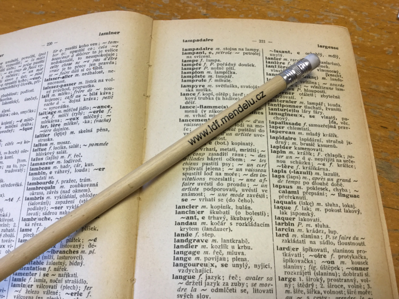

% Integrály I

> * Naučíme se hledat neurčitý integrál funkce. Stačí mít po ruce vzorce.
> * Naučíme se hledat určitý integrál funkce.
> * Procvičíme si interpretaci integrálu v kontextu změny veličiny, která se mění nekonstantní rychlostí.

# Výpočet integrálu

Najděte následující integrály.

1. $\int x^2+2x\mathrm dx$
1. $\int \sqrt{x}\Bigl(x+\sqrt{x}\Bigr)\mathrm dx$
1. $\int \frac 1{\sqrt x}+\sqrt x\mathrm dx$
1. $\int \frac{x^2-1}x\mathrm dx$
1. $\int e^x+e^{2x}\mathrm dx$
1. $\int \sin\left(x+\frac \pi 3\right)\mathrm dx$
1. $\int \frac 1{4x^2}\mathrm dx$
1. $\int \frac 1{4+x^2}\mathrm dx$
1. $\int \frac 1{1+4x^2}\mathrm dx$
1. $\int \frac 1{r^2}-\frac 1{r^6}\,\mathrm dr$
1. $\int _0^{\frac \pi 2} \cos x\mathrm dx$
1. $\int _0^1(x-1)^3\mathrm dx$
1. $\int _{-1}^{1} 3x^2+x^5\mathrm dx$
1. $\int_0^{10} e^{-0.1 t}\,\mathrm dt$
1. $\int_{-a}^{a} u^3\,\mathrm du$

Používáme vzorce $\int x^n\,\mathrm dx=\frac 1{n+1}x^{n+1}+c$, $\int e^x\,\mathrm dx=e^x+c$, $\int e^{ax}\,\mathrm dx=\frac 1a e^{ax}+c$ a dále linearitu (integrál zachovává součet a konstantní násobek)

1.   $\int x^2+2x\,\mathrm dx=\frac 13 x^3 + 2\frac 12 x^2 = \frac 13 x^3+x^2+c$
1.  $\int \sqrt x(x+\sqrt x)\,\mathrm dx=\int x\sqrt x+\sqrt x\sqrt x\,\mathrm dx=\int x^{\frac 32}+x\,\mathrm dx=\frac 25 x^{\frac 52}+\frac 12 x^2+c$
1.  $\int \frac 1{\sqrt x}+\sqrt x \,\mathrm dx=\int x^{-\frac 12}+x^{\frac 12}\,\mathrm dx=2x^\frac 12+\frac 23 x^{\frac 32}+c$
1. $\int \frac{x^2-1}{x}\,\mathrm dx=\int x-\frac 1x \,\mathrm dx=\frac {x^2}{2} - \ln|x|+C$
1. $\int e^x+e^{2x}\,\mathrm dx=e^x+\frac 12 e^{2x}+c$
1. $\int \sin\left(x+\frac\pi 3\right)=-\cos\left(x+\frac \pi3\right)+C$
1. $\int\frac{1}{4x^2}\,\mathrm dx=\frac 14 \int x^{-2}\,\mathrm dx=\frac 14  (-1)x^{-1}=-\frac {1}{4x}+c$
1. $\int \frac{1}{4+x^2}\,\mathrm dx=\frac 12 \mathop{\mathrm{arctg}} \frac x2 +C$
1. $\int \frac{1}{1+4x^2}\,\mathrm dx=\int \frac{1}{1+(2x)^2}\,\mathrm dx=\frac 12 \mathop{\mathrm{arctg}} 2x +C$
1. $\int \frac 1{r^2}-\frac 1{r^6}\,\mathrm dr=\int r^{-2}-r^{-6}\,\mathrm dr=(-1)r^{-1}+\frac 15 r^{-5}=-\frac 1r+\frac 1{5r^5}+c$
1. $\int_0^{\frac \pi2}\cos(x)\,\mathrm dx=[\sin x]_0^{\frac \pi2}=\sin\frac \pi2- \sin 0=1$
1. $\int_0^1 (x-1)^3\,\mathrm dx=\left[\frac 14 (x-1)^4\right]_0^1=\frac 14 (1-1)^4- \frac 14 (0-1)^4=-\frac 14$
1. $\int_{-1}^1 3x^2+x^5\,\mathrm dx=\left[x^3+\frac 16 x^6\right]_{-1}^1=\left(1^3+\frac 16 1^6\right)-\left((-1)^3+\frac 16 (-1)^6\right)=2$
1. $\int_0^{10} e^{-0.1 t}\,\mathrm dt=\left[-10 e^{-0.1t}\right]_0^{10}=-10 e^{-0.1\times 10}-\left(-10 e^{-0.1\times 0}\right)=-10 e^{-1}+10$
1.  $\int_{-a}^{a} u^3\,\mathrm du=\left[\frac 14 u^4\right]_{-a}^a=\frac 14 a^4 - \frac 14 (-a)^4 = 0$

# Vytékání oleje

Najděte slovní interpretaci integrálu
$$
  \int_0^{10} r(t)\mathrm dt,
$$
kde $r(t)$ je rychlost s jakou vytéká olej z děravé nádrže (v litrech
za hodinu) a $t$ je čas v hodinách. Vypočtěte integrál pro $r(t)=200-4t$.

_Toto a další příklady jsou klasické aplikace integrálu, kdy integrálem rychlosti, s jakou se mění nějaká veličina, je změna této veličiny._

 Integrál udává objem oleje, který vyteče za prvních 10 hodin. Pro zadanou funkci dostáváme
$$
    \int_0^{10}r(t)\mathrm{d}t= \int_0^{10}(200-4t)\mathrm{d}t=
    \left[200t-2t^2\right]_0^{10}= 2000-200-(0-0)=1800.
  $$
  Za 10 hodin vyteče 1800 litrů oleje.

# Populace včel

Populace včel o počáteční velikosti 100 včel se rozmnožuje rychlostí $r(t)$. Najděte slovní interpretaci výrazů
$$
  \int_0^{15} r(t)\mathrm dt,
$$
a
$$
  100+\int_0^{15} r(t)\mathrm dt.
$$

 První integrál značí přírůstek populace včel za patnáct jednotek času, druhý integrál značí celkovou velikost populace včel po uplynutí patnácti jednotek času. (Jednotky času nejsou v zadání specifikovány.)

# Napouštění nádrže

Chemikálie teče do nádrže rychlostí
$180+3t$ litrů za minutu, kde $t\in [0,60]$ je čas v minutách. Určete, kolik chemikálie
nateče do nádrže během prvních 20 minut.

(Podle Stewart: Calculus.)

Změna množství v nádrži je integrál rychlosti, tj. 
$$
  \int_0^{20} (180+3t)\,\mathrm dt=180\times 20 + \left[\frac 32 t^2\right]_0^{20}=4\, 200 \,\mathrm l.
$$

# Prasklá kanalizace

Prasklá kanalizace způsobila znečištění jezera v rekreační
oblasti. Koncentrace bakterií $C(t)$ (v bakteriích na kubický
centimetr, $t$ je čas ve dnech) se po ošetření úniku pro $t\in[0,6]$  vyvíjí
rychlostí $$C'(t)=10^3(t-7).$$ Jaká je změna koncentrace bakterií mezi
čtvrtým a šestým dnem?

(Podle Mardsen, Weinstein: Calculus I.)

Změna koncentrace je integrál z rychlosti s jakou se koncentrace mění, tj. 
$$
  \int_4^6 10^3(t-7)\,\mathrm dt= \left[10^3\left (\frac 12 t^2-7t\right)\right]_4^6=-4000
$$
a koncentrace poklesne o $4000$ jednotek (bakterií na kubický centimetr).

# Rychlost učení

Nechť $W(t)$ je počet francouzských slovíček,
které se naučíme po $t$ minutách. Typicky může být (pro první dvě hodiny učení)
$$W(0)=0\quad \text {a} \quad W'(t)=\frac{4t}{100}-3\left (\frac  t{100}\right)^2.$$ Najděte pomocí integrálu funkci $W(t)$.

(Podle Mardsen, Weinstein: Calculus I.)

 Výsledná funkce integrálem rychlosti učení, tj.
$$
W(t)=\int W'(t) \,\mathrm dt  =  \int \frac{4t}{100}-3\left (\frac  t{100}\right)^2 \,\mathrm dt  =\frac {2t^2}{100}-\frac{t^3}{10000} +C,
$$
kde $C$ je integrační konstanta. Protože musí platit $W(0)=0$, je $C=0$ a proto
$$
  W(t)=\frac {2t^2}{100}-\frac{t^3}{10000}.
$$

Jiné řešení je pomocí určitého integrálu najít změnu a poté přičíst k počáteční hodnotě. Aby nedošlo ke kolizi mezi označením integrační proměnné $t$ a mezi koncem časového intervalu, budeme tento konec časového intervalu označovat $T$. Tedy platí
$$
  w(T)=w(0)+\int_0^T w'(t)\,\mathrm dt=
  0+ \int_0^T \frac{4t}{100}-3\left (\frac  t{100}\right)^2 \,\mathrm dt  =\frac {2T^2}{100}-\frac{T^3}{10000}.
$$
Tedy
$$
  w(T)=\frac {2T^2}{100}-\frac{T^3}{10000}
$$
a po přeznační proměnné máme stejný výsledek jako předešlým postupem.

# Určení parametru tak, aby integrál měl zadanou hodnotu

V praktických úlohách je někdy situace, kdy integrujeme funkci s parametrem a hodnotu parametru je nutno doladit tak, aby integrál měl
předem stanovenou hodnotu.  Určete hodnotu reálného parametru $a$ tak,
aby byl integrál $$\int_0^{10} a \sqrt x\,\mathrm dx$$ roven hodnotě
2019.

$$\int _0^{10} a\sqrt x=\left[a\frac 23 x^{\frac 32}\right]_0^{10}=\frac {2a}{3}(10)^{\frac 32}$$

$$\begin{aligned}
  2019&=\frac {2a}{3}(10)^{\frac 32}\\
  a&=\frac 32 2019 (10)^{-\frac 32}\end{aligned}$$

# Práce na pružině

Síla působící na pružinu je úměrná
deformaci pružiny. Natáhneme-li pružinu z rovnovážného stavu o hodnotu
$x$, je nutno působit silou $kx$, kde $k$ je konstanta (tuhost
pružiny). Vypočtěte práci nutnou k natažení pružiny z nedeformovaného
stavu o jednotkovou délku a poté o délku $l$.

Po obecném výpočtu vypočtěte práci pro pružinu o zadané tuhosti $k$ a
deformaci $\Delta x$. Výpočet proveďte určitým integrálem třikrát,
postupně pro jednotku délky centimetr, decimetr a metr. Až po
dokončení výpočtu převeďte na joule (newton krát metr).

$$k=10 \,\mathrm{N}/\mathrm{cm}=100 \,\mathrm{N}/\mathrm{dm}=1000 \,\mathrm{N}/\mathrm{m}, \qquad \Delta x=10\,\mathrm{cm}=1\,\mathrm{dm}=0.1\,\mathrm{m}$$

_Všimněte si, že v každém případě se integruje jiná funkce a v jiných
mezích. Protože však všechny výpočty charakterizují stejnou situaci,
výsledky jsou po převedení na stejné jednotky stejné, což je
očekávané. 
Změna jednotek je speciální případ substituce, kdy proměnnou podle
které integrujeme nahradíme proměnnou jinou. Tuto metodu si pro
integrál představíme na přednášce._

Jednotková délka:
$$W=\int_0^1 F\,\mathrm dx = \int_0^1 kx\,\mathrm dx = \left[k\frac 12 x^2\right]_0^1=\frac 12 k-0=\frac 12 k$$

Délka $l$:
$$W=\int_0^l F\,\mathrm dx = \int_0^l kx\,\mathrm dx = \left[k\frac 12 x^2\right]_0^l=\frac 12 kl^2-0=\frac 12 kl^2$$

Výpočet v centimetrech:
$$W=\int_0^{10}  10 x\,\mathrm dx = \left[5 x^2\right]_0^{10}=5\times 100=500\,\mathrm N \mathrm{cm}=5\,\mathrm N\mathrm m$$

Výpočet v decimetrech:
$$W=\int_0^{1}  100 x\,\mathrm dx = \left[50 x^2\right]_0^{1}=50\,\mathrm N \mathrm{dm}=5\,\mathrm N\mathrm m$$

Výpočet v metrech:
$$W=\int_0^{0.1}  1000 x\,\mathrm dx = \left[500 x^2\right]_0^{0.1}=500\times 0.01\,\mathrm N \mathrm{m}=5\,\mathrm N \mathrm{m}$$

