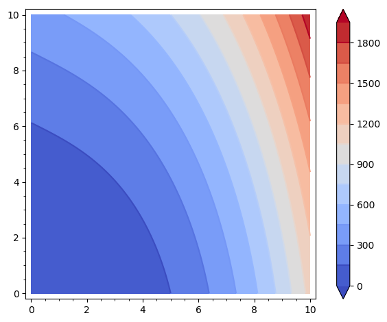

% Parciální derivace, rovnice vedení tepla

# Difuzní rovnice ve 2D

Rozepište difuzní rovnici
$$\frac{\partial u}{\partial t}=\sigma+\nabla\cdot (D\nabla u)$$
ve dvourozměrném případě do kartézských souřadnic za předpokladu, že souřadné osy jsou ve vlastních směrech difuzní matice.

Okomentujte, jak předpoklady o vlastnostech materiálu a o modelovaném procesu (stacionárnost, existence či neexistence zdrojů, homogenita materiálu, stejné chování v různých směrech apod.) ovlivní výslednou rovnici.

Difuzní rovnice ve 2D v kartézských souřadnicích má tvar
$$\frac{\partial u}{\partial t}
=\sigma +
\frac{\partial }{\partial x}\left(D_x \frac{\partial u}{\partial x}\right)
+
\frac{\partial }{\partial y}\left(D_y \frac{\partial u}{\partial y}\right)
$$
Toto je nejobecnější tvar a bohužel také nejsložitější. Kdykoliv to jde, zjednodušujeme co se dá. To se dá ovšem udělat pouze v případě některých speciálních vlastností studovaného systému.

* Obecný tvar má schopnosti zachytit i nestacionární děj, děj probíhající v různé časové okamžiky jinou intenzitou. Pokud nás zajímá jenom stacionární stav kdy je hodnota stavové veličiny konstantní, můžeme rovnici zjednodušit předpokladem $$\frac{\partial u}{\partial t}=0.$$
* Obecný tvar má díky přitomnosti zdrojů schopnosti zachytit i proces vzniku či zániku stavové veličiny. Pokud k tomuto nedochází, je rovnice bezzdrojová a můžeme ji zjednodušit předpokladem $$\sigma=0.$$
* Obecný tvar má díky přitomnosti dvou různých difuzních koeficientů $D_x$ a $D_y$ schopnosti zachytit chování materiálu, který má odlišné vlastnosti v odlišných směrech, anizotropii či ortotropii. Vždy však toto není potřeba. Někdy je materiál izotropní, tj. má ve všech směrech stejné vlastnosti. V tomto případě stačí uvažovat jedinou difuzní konstantu $$D=D_x=D_y,$$ což rovnici zjednodušuje.
* Pro konstantní difuzní koeficient je možno difuzní členy zjednodušit pomocí pravidla pro derivaci konstantního násobku, tj.
$$
\frac{\partial }{\partial x}\left(D_x \frac{\partial u}{\partial x}\right)
=
D_x \frac{\partial^2 u}{\partial x^2}
$$
a analogicky pro další proměnné. Tento matematický předpoklad prakticky odpovídá homogennímu materiálu ve kterém je lineární konstitutivní zákon.

# Stacionární vedení tepla, lineární materiál

Najděte rozložení teploty v homogenní stěně při stacionárním vedení tepla a v materiálu s lineární materiálovou odezvou (koeficient tepelné vodivosti je konstantní).
Jinými slovy, najděte všechny funkce splňující
$$\frac{\partial}{\partial x} \left(k \frac{\partial T}{\partial x}\right)=0$$
pro $T=T(x)$ a $k\in \mathbb R^+$.

_Poznámka: Výsledek se dá použít i pro stěnu složenou z různých vrstev. Postupuje se tak, že se jednotlivé vrstvy nahradí ekvivalentními vrstvami z jednoho materiálu. Například vrstva z materiálu s polovičním koeficientem tepelné vodivosti se nahradí vrstvou, která je dvojnásobně silná._

_Poznámka: Na stejnou úlohu se stejnou rovnicí a stejným řešením vede například {\bfseries proudění podzemní vody ve zvodni s napjatou hladinou} (představou může být podzemní voda protékající půdou a shora i zdola ohraničená nepropustnou vrstvou)._

Rovnici můžeme vydělit konstantou $k$

Po zintegrování dostáváme $$ \frac{\partial T}{\partial x}=C_1$$
a po dalším zintegrování $$T=C_1x+C_2.$$ Teplota se mění lineárně. Dvě konstanty se určí pomocí dvou teplot na hranicích stěny.

# Stacionární vedení tepla, nelineární materiál

Najděte rozložení teploty v homogenní stěně při stacionárním vedení
tepla a v materiálu s nelineární materiálovou odezvou (koeficient
tepelné vodivosti není konstantní).  Použijte lineární závislost
koeficientu tepelné vodivosti na teplotě.  Jinými slovy, najděte
všechny funkce splňující
$$\frac{\partial}{\partial x} \left(k \frac{\partial T}{\partial x}\right)=0$$
pro $T=T(x)$ a $k=a+bT$, $a,b\in \mathbb R$.

_Poznámka: Výpočet necháme kvalitativní abychom viděli, že teplotní profil ve stěně není lineární. Pro užitečnost v inženýrských aplikacích je vhodné přidat okrajové podmínky a vyjádřit řešení pomocí parametrů v těchto okrajových podmínkách. To jsou typicky teploty na jednotlivých stranách stěny._

_Poznámka: Na stejnou úlohu se stejnou rovnicí a stejným řešením, pouze pro $a=0$, vede například proudění podzemní vody ve zvodni s volnou hladinou  na rozdíl od předchozího příkladu chybí horní nepropustná vrstva)._

Po zintegrování dostáváme
$$(a+bT)\frac{\partial T}{\partial x}=C_1$$
a rovnici řešíme jako diferenciální rovnici se separovanými proměnnými.
Odseparováním získáme
$$(a+bT)\mathrm dT=C_1\mathrm dx$$
a po zintegrování
$$aT+\frac 12bT^2 = C_1x+C_2.$$
Řešením je
parabola otočená naležato. Dvě konstanty se určí pomocí teplot na hranicích stěny. Pro správný profil je nutné si vybrat
správnou část paraboly tak, aby teplota zůstala mezi teplotami na
krajích stěny.

# Stacionární vedení tepla v žebru chladiče

Výjimečně jsme nuceni do rovnice vedení tepla zahrnout i zdroje. 
Modelujte vedení tepla v žebru chladiče. Úlohu uvažujte jako
jednorozměrnou, materiál homogenní izotropní s konstantní tepelnou
vodivostí. Kolem chladiče proudí vzduch a teplotě $T_0$ a chladič
ztrácí teplo rychlostí úměrnou rozdílu teploty žebra v daném místě a
teploty okolního vzduchu. (Koeficient úměrnosti je dán koeficient přestupu tepla a šířkou žebra). Uvažujte stacionární děj.

$$0=-h(T-T_0)+\frac{\mathrm d}{\mathrm dx}\left(\lambda \frac{\mathrm dT}{\mathrm dx}\right)$$

Ke stejnému závěru je možné dojít i přesnou analýzou ve 3D, viz Cengel, Heat transfer, kapitola 3–6 Heat transfer from finned surfaces.

# Výpočet  parciálních derivací

1. $\frac{\partial }{\partial x}(x^2y+2xy^3+x+1)$
1. $\frac{\partial }{\partial y}(x^2y+2xy^3+x+1)$
1. $\frac{\partial }{\partial x}(5x^4y^3-3xy^5+x^2)$
1. $\frac{\partial }{\partial y}(5x^4y^3-3xy^5+x^2)$

1. $\frac{\partial }{\partial x}(x^2y+2xy^3+x+1)=2x\cdot y+2y^3+1+0=2xy+2y^3+1$
1. $\frac{\partial }{\partial y}(x^2y+2xy^3+x+1)=x^2+2x\cdot 3y^2+0+0=x^2+6xy^2$
1. $\frac{\partial }{\partial x}(5x^4y^3-3xy^5+x^2)=20x^3y^3-3y^5+2x$
1. $\frac{\partial }{\partial y}(5x^4y^3-3xy^5+x^2)=15x^4y^2-15xy^4+0=15x^4y^2-15xy^4$

<!--
%## Gradient, anizotropní vedení tepla

%
-->

# Rovnice vedení tepla v dvourozměrném materiálu

<!--
%sage: x,y = var('x,y')
%sage: contour_plot((x+2*y)^2+x^3, (x,0,10), (y,0,10), contours=15, cmap="coolwa%rm", plot_points=150, colorbar=True)
-->

Teplota ve dvourozměrné desce pro $0\leq x\leq 10$ a $0\leq y\leq 10$ zachycené v určitém okamžiku termokamerou je popsána rovnicí
  $$T(x,y)=2y^2+x^3.$$
  Rozměry jsou v centimetrech, teplota ve stupních Celsia. (Formálně to nevychází, ale ke každému členu můžeme dodat konstantu, která rozměr opraví tak, aby výsledek opravdu vycházel ve stupních Celsia. Pro jednoduchost tuto komplikaci vynecháme.)

1. Vypočtěte gradient $\nabla T$  a tok tepla $-\lambda \cdot \nabla T.$
Součinitel tepelné vodivosti (pro jednoduchost s celými čísly a bez jednotky) je $\lambda=
  \begin{pmatrix}
    5 & 1\\1&2
  \end{pmatrix}.$ 
1. Určete, zda na levém okraji desky ($x=0$) teče teplo dovnitř desky nebo z desky ven.
1. Vypočtěte divergenci toku tepla, tj. $\nabla\cdot(-\lambda \cdot \nabla T).$
1. V desce nejsou zdroje tepla. Ochlazuje se deska uprostřed, nebo otepluje?

1. Parciální derivace jsou
$$
\begin{aligned}
  \frac{\partial T}{\partial x}&=3x^2,\\
  \frac{\partial T}{\partial y}&=4y.\\
\end{aligned}
$$
Odsud dostáváme gradient $$\nabla T=
\begin{pmatrix}
  3x^2 \\ 4y
\end{pmatrix}
$$
a tok	 tepla
$$
\vec q=-\lambda \nabla T=-(3x^2)
\begin{pmatrix}
  5 \\ 1
\end{pmatrix}
-4y
\begin{pmatrix}
1\\2  
\end{pmatrix}
=
\begin{pmatrix}
  -15 x^2 -4y\\-3x^2-8y
\end{pmatrix}
.
$$
1. Pro $x=0$  a $y>0$ je první komponenta toku záporná a teplo teče doleva, tj. ven z desky.
1. Divergence je
$$\nabla \cdot\vec q=\frac{ \partial}{\partial x} (-15x^2-4y)+\frac{\partial }{\partial y}(-3x^2-8y) = -30x-8.$$
1. Pro $x>0$ je tato divergence záporná a tok tepla slábne. To znamená, že se deska ohřívá. V každém místě a tedy i uprostřed. 

 

