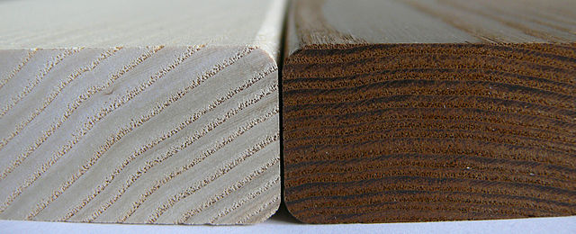

% Derivace & friends
% Robert Mařík
% 2019

\iffalse

# Koncept (různé pojetí rychlosti)

* Jak rychle (v kilometrech za hodinu) se pohybuje atlet, kůň nebo baseballový balon?
* Jak rychle (v metrech za rok) roste strom do výšky?
* Jak rychle (v kubických metrech za rok) roste strom (tj. jak rychle přibývá na objemu)?
* Jak rychle (ve stupních Celsia za hodinu) klesá teplota uvnitř stavby?
* Jak rychle (ve stupních Celsia na centimetr) se mění teplota ve vnější zdi oddělující vytopený dům a venkovní prostředí?
* Jak rychle (v newtonech na metr) klesá gravitační síla při vzdalování se od Země?
* Jak rychle (v Kč na litr) rostou náklady výrobce pivovaru při zvyšování produkce?
* Jak rychle (v metrech krychlových na metr) klesá hustota vzduchu s výškou nad zemí?
* Jak rychle (v litrech na kilometr za hodinu) roste spotřeba auta při vyšší průměrné cestovní rychlosti?

# Koncept (průměrná rychlost a okamžitá)

Průměrnou rychlost určujeme tak, že změnu sledované veličiny
přepočteme na jednotku času (u závislosti na čase), délky (u
závislosti na poloze) nebo obecně na jednotku veličiny, na které
sledovaná veličina závisí.

Průměrná rychlost zastírá, co přesně se děje uvnitř intervalu, přes který průměrujeme.

Počítáme-li průměr přes stále kratší interval, nevýhoda průměrné
rychlosti mizí. Cílem je počítat průměr přes interval prakticky
nerozlišitelný od nuly. To by dalo okamžitou rychlost.

Pokud průměrujeme za stále kratší čas, čitatel i jmenovatel se blíží k
nule a jsou potíže s interpretací zlomku. Nulou totiž není možné
dělit. Musíme vytvořit koncept, který umožní sledovat, co se děje s
funkčními hodnotami funkce, pokud se vstupními daty jdeme "na krev" ke
kraji definičního oboru.

K vyřešení problému použijeme pojem limita. Budeme se (zatím) soustředit na
tzv. vlastní limitu ve vlastním bodě.

\fi

# Limita

Buď $f\colon \mathbb R\to\mathbb R$ funkce jedné proměnné

> Definice (okolí). *Okolím* bodu $x_0$ rozumíme libovolný otevřený
interval obsahující bod $x_0$.

> Definice (limita). Řekneme, že funkce $f$ má v bodě $x_0$ *limitu*
rovnu číslu $L$ právě tehdy, když pro libovolnou předem zadanou
toleranci (i extrémně malou) existuje okolí bodu $x_0$ takové, že
všechny body z okolí bodu $x_0$ různé od $x_0$ mají funkční hodnotu v
rámci uvažované tolerance stejnou jako $L$.

**Pozorování.** Většina funkcí má v bodech, kde jsou definované,
limitu rovnu funkční hodnotě. Přesněji tuto myšlenku vystihuje koncept
spojitosti.

# Spojitost

> Definice (spojitost). Řekneme, že funkce $f$ je *spojitá v bodě* $x_0$ jestliže je
> v tomto bodě definovaná a má limitu rovnu funkční hodnotě. Řekneme,
> že funkce $f$ je *spojitá* na otevřeném intervalu, je-li spojitá v
> každém jeho bodě.

> Definice (elementární funkce). Všechny mnohočleny, goniometrické, cyklometrické,
  exponenciální a logaritmické funkce a obecná mocnina se nazývají
  *základní elementární funkce* Všechny funkce, které ze základních
  elementárních funkcí získáme konečným počtem operací sčítání,
  odečítání, násobení, dělení a skládání těchto funkcí navzájem se
  nazývají *elementární funkce*.

> Věta. Všechny elementární funkce jsou spojité v každém vnitřním
  bodě svého definičního oboru.

> Poznámka. Body, v jejichž okolí je funkce ohraničená, ale je zde porušena spojitost, jsou například následující.
> 
**skok**
: Na jeho odhalení stačí zvolit toleranci v definici limity menší, než je výška skoku. Například $f(x)=\frac{|x|+x}{2x}$ je jednotkový skok v nule.
>
**odstranitelná nespojitost**
: Tato nespojitost nás zajímá nejvíce. Je to nespojitost, která zmizí pokud vhodně dodefinujeme funkční hodnotu v bodě nespojitosti. Například funkce $$f(x)=
\begin{cases}
  \frac {\sin x}{x}& x\neq 0\\
  1& x=0
\end{cases}
$$
je spojitá funkce. Vznikla doplněním jedné funkční hodnoty do definice funkce $\frac{\sin x}x$, která má odstranitelnou nespojitost v bodě $x=0$.
>
> [Grafy.](https://sagecell.sagemath.org/?z=eJxL06jQtNWo0NZITCoGMjU19TWMtCo0ebnSQRLFmXlASr-ClyvA0DZNryAnv0RDo0JH11THVBOoJsDINh1VUEchOT8nv8hWvSg1RR2kwlA7wAgAMsAaHQ==&lang=sage)

# Derivace

Teď jsme připraveni (alespoň teoreticky) počítat průměrnou rychlost na
intervalu, jehož délka je nerozlišitelná od nuly.

Buď $y=f(x)$ funkce definovaná na nějakém otevřeném intervalu.

> Definice (derivace). *Derivací* funkce $f$ v bodě $x$ rozumíme
limitu
$$\frac{\mathrm df}{\mathrm dx}=\lim_{h\to 0}\frac{f(x+h)-f(x)}{h},$$
pokud tato limita existuje a je konečná.

Derivaci funkce $f$ v bodě $x_0$ označujeme $f'(x_0)$ nebo
$\frac{\mathrm df(x_0)}{\mathrm dx}$. Derivaci v libovolném bodě potom
$f'$, $f'(x)$ nebo $\frac{\mathrm df}{\mathrm dx}$.

> Poznámka. Rozšifrování definice derivace:
>
* Výraz z čitatele, tj. $f(x+h)-f(x)$, je změna veličiny $f$ na intervalu $[x,x+h]$. Často označujeme též $\Delta f$.
* Podíl, tj. $\frac{f(x+h)-f(x)}h$ je změna veličiny $f$ na intervalu $[x,x+h]$ přepočítaná na jednotku veličiny $x$, tj. v jistém smyslu průměrná rychlost na tomto intervalu. Často označujeme též $\frac{\Delta f}{\Delta x}$.
* Limita v definici derivace je průměrná rychlost na intervalu, jehož délka je prakticky nerozlišitelná od nuly, tj. okamžitá rychlost.

Jednotka derivace je stejná, jako jednotka podílu $\frac {f(x)}x$.

Derivace $f'(x)$ udává, jak se mění veličina $f$ při změnách veličiny
$x$. Interpretace derivace v nematematických disciplínách je okamžitá
rychlost s jakou veličina $f$ reaguje na změny veličiny $x$.

> Věta. Má-li funkce $f$ derivaci na intervalu $I$, je na tomto intervalu spojitá.

> Věta.
>
* Má-li funkce $f$ kladnou derivaci na intervalu $I$, je na tomto intervalu rostoucí.
* Má-li funkce $f$ zápornou derivaci na intervalu $I$, je na tomto intervalu klesající.

**Příklad.** Těleso o teplotě $T$ je v místnosti o teplotě $T_0>T$. Z
fyziky je známo (Newtonův zákon tepelné výměny), že rychlost s jakou
roste teplota tělesa je úměrná teplotnímu rozdílu $T_0-T$.

* Veličina $T$ měřená ve stupních Celsia je teplota tělesa.
* Veličina $t$ je čas měřený například v hodinách.
* Derivace $\frac{\mathrm dT}{\mathrm dt}$ měřená ve stupních Celsia
za hodinu je rychlost, s jakou roste teplota tělesa.
* Matematickým vyjádřením toho, že rychlost s jakou roste teplota a
teplotní rozdíl $T_0-T$ jsou úměrné je rovnice $$\frac{\mathrm
dT}{\mathrm dt}=k(T_0-T),$$ kde $k$ je konstanta úměrnosti. Neznámou v
této rovnici je funkce a v rovnici figuruje derivace této
funkce. Takové rovnice se naučíme řešit později.

# Narozeniny - uhlík 14C

Dne 27.2.1940 (zítra 79 let) byl objeven uhlík $^{14}C$. Jedná se o
radioaktivní prvek s mnoha skvělými vlastnostmi. Jednou z nich je
vhodná rychlost rozpadu, která jej činí vhodným pro datování
archeologických nálezů pozůstatků živých organismů

* Rychlost, s jakou se mění množství (a tedy i koncentrace $y$ v daném
  vzorku) nerozpadnutého radioaktivního materiálu je popsána rovnicí
  $$\frac{\mathrm dy}{\mathrm dt}=-\lambda y,$$
  kde $\lambda$ je konstanta úměrnosti. Tato rovnice je přirozeným
  důsledkem toho, že pro daný nestabilní izotop mají všechny atomy
  stejnou pravděpodobnost, že u nich dojde k rozpadu a tato
  pravděpodobnost se s časem nemění.
* Uhlík je na datování vhodný, protože jej během života absorbují živé organismy.

# Výpočet derivace

Viz přednáška a cvičení.

# Aplikace derivací (přibližná změna)

> Poznámka.
Buď $f:\mathbb R\to\mathbb R$ funkce taková, že má derivaci. Pokud se veličina $x$ změní z hodnoty $x_0$ na hodnotu $\Delta x$ (tj. nová hodnota je $x_0+\Delta x$), potom se $f$ mění přibližně o $f'(x_0)\Delta x$, tj. $$\Delta f\approx f'(x_0)\Delta x$$ neboli
$$\Delta f\approx \frac{\mathrm df(x_0)}{\mathrm dx}\Delta x.$$ Tato aproximace je použitelná pro malé hodnoty $\Delta x$. 

Co se rozumí malou hodnotou $\Delta x$ závisí na více faktorech,
například i na tom, jak se funkce "vzpírá" tomu, být aproximována
výrazem úměrným $\Delta x$. Přesněji tuto podmínku zformulujeme po
probrání Taylorova polynomu, kdy se použije o něco obecnější postup.

**Příklad.** Nosník výšky $h$, šířky $a$ a délky $L$ je uprostřed
  zatížený silou $F$. Průhyb $s$ uprostřed nosníku je dán vztahem
  $$s=\frac {F L^3}{4Ebh^3},\tag{♣}$$ kde $E$ je materiálová
  konstanta. Pro $h=20\,\mathrm{cm}$ je průhyb
  $s=10\,\mathrm{cm}$. Jak se průhyb změní, pokud se $h$ sníží na
  $18\,\mathrm{cm}$?

**Řešení.** Relevantními veličinami jsou $s$ a $h$ a vzorec je tedy
možno shrnout do tvaru $$s=\frac k{h^3},$$ kde $k$ je konstanta
charakterizující danou situaci. Pro zadané hodnoty výšky a průhybu
vychází konstanta $$k=s h^3=10\times 20^3=80\,000.$$ Vzorec (♣) tedy
redukujeme na $$s={80\,000}{h^{-3}}.$$ Derivováním obdržíme
$$\frac{\mathrm ds}{\mathrm dh}=80\,000\times(-3)
h^{-4}=-\frac{3\times 80\,000}{h^4}.$$ Změna výšky nosníku je $$\Delta
h=18-20=-2\,\mathrm{cm}$$ a tomu odpovídá změna průhybu $$\Delta
s=-\frac{3\times 80\,000}{(20)^4}(-2)=3\,\mathrm{cm}.$$ Průhyb se tedy
zvětší o $3\,\mathrm{cm}$.

> Poznámka. Proč nepočítáme přesně? Stačila by selská logika a změna
funkce $s=\frac k{h^3}$ by byla
$$\Delta s=\frac k{(h+\Delta h)^3}-\frac k{h^3}.\tag{♠}$$ Odpověď je
překvapivá: pomocí derivací je vyjádření změny v naprosté většině
případů jednodušší. V tomto našem případě máme
$$\Delta s\approx -\frac{3k}{h^4}\Delta h,$$ což je na další práci
mnohem příjemnější výraz, než rozdíl dvou zlomků (♠). Skutečnost, že platí
pouze pro malé $\Delta h$ nás nijak neomezuje. Většinou se tento
aparát používá tam, kde se chyba limitním přechodem "stáhne na
nulu".

\iffalse

# Koncept (parciální derivace)

Derivace je vhodná ke studiu fyzikálních procesů na makroskopické
úrovni těles. Pro vyjadřování procesů jako jsou rychlost změny teploty
tělesa nebo množství tekutiny v daném objemu jsou vhodné (obyčejné)
derivace.

Někdy však požadujeme detailnější informace o celém procesu, abychom
měli přesnější popis a dokázali odhalit vliv všech relevantních
parametrů. U tepelné výměny bychom například sledovali, jak se teplo
předává z jednoho místa tělesa do druhého místa a jak prostupuje
tělesem. Takový pohled je nutný například při studiu procesu, který
není stacionární v čase. Při tomto pohledu již musíme znát teplotu
nejen jako funkci času, ale i jako funkci prostorových souřadnic.
Musíme tedy pracovat modelem, kdy teplota, nebo obecně nějaká stavová
veličina, závisí na více faktorech. Musíme tedy pracovat s funkcemi
více proměnných a studovat, jak se mění vzhledem k jednotlivým
proměnným. To je přesně úkol pro diferenciální počet funkcí více
proměnných a *parciální derivace*.

Výsledkem tohoto přístupu je formulace zákonů v diferenciálním
tvaru. Tento tvar říká, co se děje v konkrétním místě a dává lepší
náhled na fyzikální podstatu. Proto tomuto přístupu často dáváme
přednost před makroskopickým pohledem na těleso jako na jeden
celek. 

\fi

# Parciální derivace

> Definice (parciální derivace). Buď $f\colon \mathbb R^2\to\mathbb R$ funkce dvou proměnných,  $x$ a $y$, tj. $f(x,y)$. Výraz
$$\frac{\partial f}{\partial x}=\lim_{h\to 0}\frac{f(x+h,y)-f(x,y)}h$$ se nazývá *parciální derivace funkce $f$ podle $x$*. Podobně,
$$\frac{\partial f}{\partial y}=\lim_{h\to 0}\frac{f(x,y+h)-f(x,y)}h$$ je *parciální derivace funkce $f$ podle $y$*.

Podobně můžeme definovat parciální derivaci pro funkce libovolného
konečného počtu proměnných. V těchto parciálních derivacích vlastně
sledujeme, jak reaguje veličina $f$ na změny jenom v jedné
proměnné. Proměnná, přes kterou se nederivuje, má vlastně roli
parametru, nijak se nemění.

# Rovnice vedení tepla  v 1D

Studujme vedení tepla v jednorozměrné tyči. Teplota je funkcí dvou
proměnných, polohy a času.

> Poznámka. Potřebujeme fyzikální zákony řídící vedení tepla.  Bez nich matematika
model vedení tepla nemá jak naformulovat. Tyto zákony je potřeba matematice "dodat zvenku" a jsou následující.
>
* Rozdíl teplot má za následek pohyb tepla. Velikost toku tepla je úměrná
teplotnímu rozdílu.
* Tok tepla je aditivní veličina, tj. celkový tok průřezem je součinem
toku vztaženého na jednotku průřezu a obsahu průřezu.
* Teplota se zvyšuje dodáním tepla. Pro zvýšení teploty tělesa o
hmotnosti $m$ o hodnotu $\Delta T$ je nutné dodat $$Q=mc\Delta T,\tag{**}$$ kde
$c$ je měrná tepelná kapacita.

V dalším už nastupuje matematický popis a ve vhodných chvílích vždy
použijeme výše uvedené fyzikální zákony. Mluvíme o teple, ale jako
mechanický model si můžeme představit proudění tekutiny (pro
jednoduchou představu) nebo proudění vlhkosti (pro odvození rovnice
difuze namísto rovnice vedení tepla).

* *Potřebujeme vědět, jak moc se mění teplota podél tyče.* Změny v prostorovém rozložení teploty zachycuje derivace
$\frac{\partial T}{\partial x}$ v jednotkách (například) stupeň Celsia
na centimetr.
* *Potřebujeme změnu teploty podél tyče převést na veličinu popisující
  proudění tepla.* Rychlost toku tepla průřezem o obsahu $S$ tyče je
  $q=-kS\frac{\partial T}{\partial x}$.
    * Znaménko mínus vyjadřuje dává do souladu skutečnosti, že teplo teče z míst s vyšší teplotou
    do míst s menší teplotou a že tok uvažujeme kladný, pokud teče ve
    směru osy $x$. Přesněji, pokud teplota roste směrem doprava, parciální
    derivace je kladná, ale teplo teče doleva, tedy tok musí být záporný.
    * Veličina $k$ je konstanta úměrnosti
    umožňující překalibrování změny prostorového rozložení teploty na
    rychlost toku tepla.
    * Průřez $S$ ve vzorci figuruje z fyzikálního zákona. Vyjadřuje
    zřejmý fakt, že pokud máme při jinak stejných podmínkách tyč násobně
    většího průřezu, teče tyčí více tepla.
* *Potřebujeme zjistit, kolik tepla, které přiteče do nějakého bodu, v
tomto bodě "zůstane" a kolik tepla odteče dále.* Tedy potřebuji vědět, jak se mění tok tepla podél tyče. Rychlost s jakou
roste rychlost toku podél tyče je $\frac{\partial q}{\partial x}$. My pro kladný ohřev
potřebujeme pokles toku tepla, tedy násobíme záporným znaménkem a dostáváme
$-\frac{\partial q}{\partial x}$.
* *Víme, kolik tepla se v daném místě spotřebuje na zvýšení teploty a tuto hodnotu musíme převést na změnu teploty. Opět se jedná o jakési překalibrování, které ještě souvisí s dalšími fyzikálními vlastnostmi jako je tepelná kapacita a hmotnost v daném místě. Tedy přesněji hustota hmotnosti.* Teplo $-\frac{\partial q}{\partial x}$ je teplo, které každou časovou jednotku "zůstává" v
bodě $x$. Toto teplo se "použije" na zvýšení teploty. Vztažením
rovnice (**) na jednotku délky  a času dostáváme
$$\frac{Q}{\Delta x\Delta t}=\frac {m}{\Delta x} c\frac{\Delta T}{\Delta t}$$ a v bodě $x$ a v čase $t$ ("nekonečně malá oblast" a "nekonečně krátký časový interval" ) proto platí
$$-\frac {\partial q}{\partial x}=S\rho c\frac{\partial T}{\partial t}.$$ Zde jsme navíc využili hustotu (přesněji objemovou hustotu hmotnosti) $\rho = \frac mV =\frac{m}{S\Delta x}$.
* Po dosazení za $q$ dostáváme
$$-\frac{\partial}{\partial x}\left(-kS\frac{\partial T}{\partial x}\right)=S\rho c\frac{\partial T}{\partial t}.$$
* Derivace konstantního násobku je konstantní násobek
derivace. Veličina $k$ by v nehomogenním prostředí konstantní být
nemusela a proto ji z opatrnosti necháme na svém místě, znaménko mínus a obsah průřezu $S$
však konstantní jsou. Obsah $S$ je navíc na obou stranách rovnice a zkrátí se. Toto vede na finální tvar
$$\frac{\partial}{\partial x}\left(k\frac{\partial T}{\partial x}\right)=\rho c\frac{\partial T}{\partial t}.$$

**Shrnutí.** V odvození vidíme, že rovnice vedení tepla je vlastně
bilance toku tepla. Rozdíl o kolik se v daném místě snižuje tok tepla
udává, kolik tepla se v daném místě spotřebovalo. Tato spotřeba tepla
se projeví zvýšením teploty v daném bodě.

# Gradient

Rovnici vedení tepla ve 2D a 3D uvedeme později. Může nastat problém s
tím, že teplo neteče stejným směrem jaký odpovídá gradientu
teploty. Je to podobné, jako pohyb vzduchu nebo podzemní vody
způsobený rozdílem tlaku: voda nebo vzduch míří do míst s nižším
tlakem, ale přitom volí cestu menšího odporu. Problém vyřešíme
nástrojem, který umožní změnit směr vektoru: matice a maticové
násobení. Teď uvedeme jenom veličinu, která umožní kvantifikovat,
jakým směrem působí síla uvádějící příslušnou stavovou veličinu do
pohybu.

> Definice (gradient). Buď $f(x,y)$ funkce dvou proměnných, která má
parciální derivace. *Gradientem* funkce $f$ rozumíme
vektor
$$\mathop{\text{grad}}f=\left(\frac{\partial f}{\partial
    x},\frac{\partial f}{\partial y}\right).$$

**Poznámka.** Formálně též často píšeme
$$\left(\frac{\partial}{\partial x},\frac\partial{\partial y}\right)f$$
nebo
$$\nabla f,$$
kde
$\nabla=\left(\frac{\partial}{\partial x},\frac\partial{\partial
    y}\right)$ je operátor, se kterým pracujeme jako s
vektorem. Nazývá se *nabla* nebo *Hamiltonův operátor*. Výsledkem
gradientu je vektor ve směru maximálního růstu veličiny $f$. V praxi
nás většinou zajímá směr maximálního poklesu, tj. $-\nabla f$.

