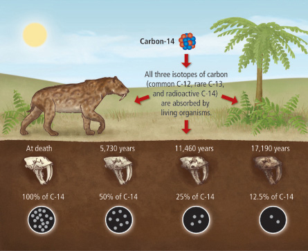

% Derivace & friends
% Robert Mařík
% 2019

# Funkce jedné proměnné

Příklad: Je dán vetknutý nosník na konci zatížený svislou silou $F$. Deformace nosníku $\delta$ na konci souvisí (skalární veličina) s velikostí zatěžující síly (skalární veličina). Pro studium problému je vhodné mít převodní pravidlo, které pro každé zatížení udává deformaci. Toto pravidlo bude z matematického úhlu pohledu funkce (funkce jedné proměnné). Může mít například formu
$$\delta=\frac 1k F,$$
kde $k$ je konstanta pro daný nosník (tuhost).

> Definice (funkce jedné proměnné).
  Buďte $A$ a $B$ neprázdné podmnožiny množiny reálných čísel.
  Pravidlo $f$, které každému prvku množiny $A$ přiřadí jediný prvek
  množiny $B$ se nazývá *funkce* (přesněji: *reálná
    funkce jedné reálné proměnné*).  Zapisujeme 
  $f:A\to B$.  Skutečnost, že prvku $a\in A$ je přiřazen
  prvek $b\in B$ zapisujeme  $f(a)=b$. Přitom říkáme,
  že $b$ je *obrazem prvku* $a$ při zobrazení $f$, resp. že $a$
  je *vzorem prvku* $b$ při zobrazení $f$.

> Poznámka (terminologie).  Množina $A$ z definice
  funkce se nazývá *definiční obor funkce $f$*.  Označujeme 
  $\mathrm D(f)$ (resp.  $\mathrm{Dom}(f)$). Je-li $M$ podmnožina definičního oboru, definujeme množinu $f(M)$ jako množinu všech obrazů bodů množiny $M$. Množina $f(\mathrm{Dom}(f))=b$ se nazývá *obor
    hodnot funkce $f$*.  Označujeme  $\mathrm H(f)$ (resp.
  $\mathrm{Im}(f)$).
>
>  Je-li $y=f(x)$ nazýváme proměnnou $x$ též *nezávislou
    proměnnou* a proměnnou $y$ *závislou proměnnou*.
  *Grafem* funkce rozumíme množinu všech uspořádaných dvojic
  $[x,y]\in\mathbb R^2$ s vlastností $y=f(x)$.

# Přímá a nepřímá úměrnost

Výsadní postavení při popisu dějů a jevů v přírodě mají přímá a
nepřímá úměrnost, známé ze střední školy.

> Definice (přímá a nepřímá úměrnost). Veličina $y$ je *přímo úměrná* veličině $x$ jestliže existuje konstanta $k$ taková, že platí $$y=kx.$$
Veličina $y$ je *nepřímo úměrná* veličině $x$ jestliže existuje konstanta $k$ taková, že platí $$y=\frac kx.$$

**Příklad.**

* Při pohybu konstantní rychlostí je dráha $s$ úměrná času $t$. Příslušnou konstantou úměrnosti je rychlost $v$, tj. $s=vt$.
* Při pohybu po předem stanovené dráze $s$ je čas nepřímo úměrný rychlosti $v$. Platí $t=\frac sv$.
* Při periodickém pohybu je frekvence $f$ nepřímo úměrná periodě $T$. Příslušnou konstantou úměrnosti je jednička, tj. $f=\frac 1T$.
* Objem $V$ koule o poloměru $r$ je přímo úměrný třetí mocnině poloměru. Příslušnou konstantou úměrnosti je objem koule o poloměru $1$. Platí tedy $V=\frac 43 \pi r^3$.

> Poznámka (podobnost). Dva útvary jsou podobné, jestli jeden vznikne z druhého zvětšením všech délek na jejich $k$-násobek. Pro $k$-krát zvětšený útvar platí, že všechny jeho rozměry jsou $k$-krát větší, všechny jeho plochy jsou $k^2$-krát větší a všechny jeho objemy jsou $k^3$-krát větší. Podobné útvary jsou vždy definovány jedním parametrem, například u kruhu a koule stačí zadat poloměr. U krychle stačí zadat délku jedné strany nebo délku stěnové uhlopříčky nebo délku tělesové uhlopříčky. U válce, který má stejnou výšku jako průměr podstavy stačí zadat výšku nebo poloměr podstavy. U kužele s vrcholovým úhlem $45^\circ$ stačí zadat výšku nebo poloměr podstavy a je tím dán celý kužel. U takových těles platí pro jakýkoliv povrch (povrch koule, povrch kužele, povrch pláště kužele, povrch válce, povrch válcové plochy, ...)
$$S=k_1r^2$$ a pro jakýkoliv objem
$$V=k_2r^3,$$ kde $k_1$ a $k_2$ jsou konstanty a $r$ vhodný délkový parametr.  Tyto konstanty mají dokonce pěknou interpretaci - odpovídají obsahu nebo objemu pro $r=1$ a ve většině případů je známe, protože například pro kouli nebo kužel máme přesný vzorec založený na poloměru.
Díky tomuto je dokonce možné snadno najít vztahy mezi objemem a povrchem $$V=k_3 S^{2/3}$$ a $$S=k_4 V^{3/2}.$$ Tyto vztahy je snadné si pamatovat, stačí se řídit tím, že mocnina musí být taková, aby vycházely správné jednotky. Metodami středoškolské matematiky dokonce dokážeme dokonce konstanty $k_1$ až $k_4$ najít pro jednotlivá tělesa jako je koule apod. Často nás však přesná hodnota konstanty nezajímá a jde nám jenom o charakter funkční závislosti, o přímou úměrnost mezi vhodnými mocninami. Vztahy stejného typu platí například i pro kužel s konstantním úhlem u vrcholu. To je možné využít při skladování sypkého materiálu (písek nasypaný na hromadu zaujme tvar kužele, úhel u vrcholu je daný vlastnostmi písku) nebo vyprazdňování nádrže ve tvaru trychtýře. Podobnost nacházíme i v živé přírodě, výrazná je například u ryb, kdy velká ryba je často tvarově blízká zvětšené malé rybě (viz S. Vogel, Comparative biomechanics, kap. 3). Formálně je podobné úvahy možno zobecnit pomocí [Buckinghamova $\Pi$ teorému](http://geo.mff.cuni.cz/seismosoft/Pi-teorem.pdf).

# Vlastnosti funkcí jedné proměnné (monotonie)

V následující definici jsou nejdůležitější pojmy
rostoucí a  klesající funkce. Názorně
řečeno, jsou to funkce které zachovávají (rostoucí) nebo obracejí
(klesající) směr nerovnosti při aplikaci funkce na obě strany
nerovnice.

> Definice (monotonie funkce).   Nechť $f$ je funkce a $M\subseteq \mathrm{Dom}(f)$ podmnožina definičního oboru   funkce $f$.
> 
> * Řekneme, že funkce $f$ je na množině $M$ *rostoucí*
>  jestliže pro každé $x_1, x_2\in M$ s vlastností $x_1<x_2$, platí
>  $f(x_1)<f(x_2)$.
>  * Řekneme, že funkce $f$ je na množině $M$ *klesající*
>  jestliže pro každé $x_1, x_2\in M$ s vlastností $x_1<x_2$, platí
>  $f(x_1)>f(x_2)$.
>  * Řekneme, že funkce $f$ je na množině $M$ *(ryze) monotonní*
>  je-li buď rostoucí, nebo klesající na $M$.
>
> Nespecifikujeme-li množinu $M$, máme na mysli, že uvedená vlastnost platí na celém definičním oboru funkce $f$.

> Poznámka (monotonie z hlediska řešitelnosti nerovnic). Je-li funkce $f$ rostoucí nebo klesající, je i prostá a nerovnice uvedené v předchozí definici jsou dokonce ekvivalentní. Můžeme tedy na obě strany nerovnice aplikovat tutéž rostoucí funkci, nebo rostoucí funkci z obou stran nerovnice vynechat.
>
>* Je-li $f$ rostoucí, platí $$x_1\leq x_2 \iff f(x_1)\leq f(x_2).$$
>* Je-li $f$ klesající, platí $$x_1\leq x_2 \iff f(x_1)\geq f(x_2).$$
>* Stejné vztahy platí i pro ostré nerovnosti.

Tyto poučky použijeme vždy, když rozvažujeme, zda můžeme k oběma
stranám nerovnice přičíst stejné číslo (můžeme), zda můžeme obě strany
nerovnice vynásobit stejným nenulovým číslem (můžeme, ale pokud
násobíme záporným číslem, obrací se směr nerovnosti), zda můžeme obě
strany nerovnice logaritmovat logaritmem o stejném základě (můžeme,
ale v případě logaritmu a základě menším než $1$ se obrací směr
nerovnosti), umocnit (nemůžeme, leda bychom měli dodatečnou informaci
například o tom, že obě strany nerovnice jsou kladné nebo obě strany
nerovnice jsou záporné) apod. Takových situací je mnoho a protože není
v lidských silách si všechny pamatovat, stačí je míst spojeny s
definicí rostoucí a klesající funkce.

**Příklad.** Funkce $\ln x$ a $\sqrt x$ jsou rostoucí a proto z nerovnic $$\ln x>\ln 6$$ a $$\sqrt x>\sqrt 6$$ plyne $$x>6.$$ Zejména v druhém případě je nutné si uvědomit, že používáme definici rostoucí funkce a poznámku připojenou za tuto definici. Nestačí říct, že umocňujeme obě strany nerovnice, jak by někdo mohl tento krok dezinterpretovat. Umocněním obou stran nerovnice se obecně může změnit obor pravdivosti, proto tato operace u nerovnic není povolena. My máme speciální případ nerovnice s nezápornými stranami.

**Příklad.** Funkce $\frac 1x$ a $y=x^2$ nejsou ani rostoucí ani klesající a proto z žádné z nerovností
$$\frac 1x \leq \frac 15$$
a
$$x^2 \leq 5^2$$
neplyne ani $x\leq 5$ ani $x\geq 5$.

**Příklad.** Funkce $\sqrt x$ nabývá nezáporných hodnot a funkce $\frac 1x$ je klesající na $(0,\infty)$. Proto z nerovnosti
$$\frac 1{\sqrt x} \leq \frac 15$$
plyne $$\sqrt x\geq 5=\sqrt {25}.$$ Druhá mocnina je na intervalu $(5,\infty)$ rostoucí a proto odsud plyne dále $$x\geq 25.$$

\iffalse

# Koncept (různé pojetí rychlosti)

Budeme sa zajímat o to, jak rychle se mění funkční hodnoty v čase nebo při změnách vstupních dat.

* Jak rychle (v kilometrech za hodinu) se pohybuje atlet, kůň nebo baseballový balon?
* Jak rychle (v metrech za rok) roste strom do výšky?
* Jak rychle (v kubických metrech za rok) roste strom (tj. jak rychle přibývá na objemu)?
* Jak rychle (ve stupních Celsia za hodinu) klesá teplota uvnitř stavby?
* Jak rychle (ve stupních Celsia na centimetr) se mění teplota ve vnější zdi oddělující vytopený dům a venkovní prostředí?
* Jak rychle (v newtonech na metr) klesá gravitační síla při vzdalování se od Země?
* Jak rychle (v Kč na litr) rostou náklady výrobce pivovaru při zvyšování produkce?
* Jak rychle (v metrech krychlových na metr) klesá hustota vzduchu s výškou nad zemí?
* Jak rychle (v litrech na kilometr za hodinu) roste spotřeba auta při vyšší průměrné cestovní rychlosti?

# Koncept (průměrná rychlost a okamžitá)

Průměrnou rychlost určujeme tak, že změnu sledované veličiny
přepočteme na jednotku času (u závislosti na čase), délky (u
závislosti na poloze) nebo obecně na jednotku veličiny, na které
sledovaná veličina závisí.

Průměrná rychlost s jakou se mění funkce $f$ na intervalu $[x,x+h]$ je dána vztahem $$\frac{f(x+h)-f(x)}h.$$

Průměrná rychlost pracuje jenom s informací v koncových bodech intervalu a proto bohužel neobsahuje informaci, co přesně se děje uvnitř intervalu, přes který průměrujeme. Počítáme-li ale průměr přes stále kratší interval, nevýhoda průměrné
rychlosti mizí. Cílem je počítat průměr přes interval prakticky
nerozlišitelný od nuly. To by dalo okamžitou rychlost. [Numerický experiment](https://sagecell.sagemath.org/?z=eJyNkEtOwzAQhveVeoeRZak2MS0tCyQk36ELWKVplTi2HJQ6wU7ABXEQxIoDIA5RuBeTFpDYYcm_Z8b65nWXe2CTCBZyKECBm_DxyDf3QaYpoYZFTokgS__5vv148W7_Cn6nbN2EDlwONI0iJjajArqbKdDVyvhcPSKWWH460E8WeSDLz2ddKts87N8g1E3fagWtb4BaeUZJlo1HpvFgoHLAoshPYlKIuF4M1nqRFOgr9M_xXgiYz6KYz7DGnItw6zssIyBU7vDG4we_HI8AD44iUyMYw2bkT1cycj6zfBqqbVtXZrcxfV0znh2Rzu--4UMCyf4FY6AvAsN5-BHWUem2-5OJXLtSm8rpkvx2F-QgSYqKMmyiy4tasyEqwOq81H4zTHHley0A97vVB5t_AUUzhdA=&lang=sage&interacts=eJyLjgUAARUAuQ==) ukazuje, že u některých funkcí toto funguje pěkně, u některých bohužel ne.

Pokud průměrujeme za stále kratší čas, čitatel i jmenovatel se blíží k
nule a jsou potíže s interpretací zlomku. Nulou totiž není možné
dělit. Musíme vytvořit koncept, který umožní sledovat, co se děje s
funkčními hodnotami funkce, pokud se vstupními daty jdeme "na krev" ke
kraji definičního oboru.

K vyřešení problému použijeme pojem limita. Budeme se (zatím) soustředit na
tzv. vlastní limitu ve vlastním bodě.

\fi

# Limita

Buď $f\colon \mathbb R\to\mathbb R$ funkce jedné proměnné

> Definice (okolí). *Okolím* bodu $x_0$ rozumíme libovolný otevřený
interval obsahující bod $x_0$.

> Definice (limita). Řekneme, že funkce $f$ má v bodě $x_0$ *limitu*
rovnu číslu $L$ právě tehdy, když pro libovolnou předem zadanou
toleranci (i extrémně malou) existuje okolí bodu $x_0$ takové, že
všechny body z okolí bodu $x_0$ různé od $x_0$ mají funkční hodnotu v
rámci uvažované tolerance stejnou jako $L$.

**Pozorování.** Většina funkcí má v bodech, kde jsou definované,
limitu rovnu funkční hodnotě. Přesněji tuto myšlenku vystihuje koncept
spojitosti.

# Spojitost

> Definice (spojitost). Řekneme, že funkce $f$ je *spojitá v bodě* $x_0$ jestliže je
> v tomto bodě definovaná a má limitu rovnu funkční hodnotě. Řekneme,
> že funkce $f$ je *spojitá* na otevřeném intervalu, je-li spojitá v
> každém jeho bodě.

> Definice (elementární funkce). Všechny mnohočleny, goniometrické, cyklometrické,
  exponenciální a logaritmické funkce a obecná mocnina se nazývají
  *základní elementární funkce* Všechny funkce, které ze základních
  elementárních funkcí získáme konečným počtem operací sčítání,
  odečítání, násobení, dělení a skládání těchto funkcí navzájem se
  nazývají *elementární funkce*.

> Věta (spojitost elementárních funkcí). Všechny elementární funkce jsou spojité v každém vnitřním
  bodě svého definičního oboru.

Podobně jako spojitost funkce jedné proměnné je definována spojitost funkcí více proměnných. Zůstane dokonce v platnosti předchozí věta. V naprosté většině základních praktických aplikací vystačíme s popisem pomocí elementárních funkcí a proto jsou funkce, se kterými pracujeme, zpravidla automaticky spojité. Opatrnost je nutné pouze tam, kde se od elementárních funkcí odchýlíme, například při použití nekonečných řad.

> Poznámka. Body, v jejichž okolí je funkce ohraničená, ale je zde porušena spojitost, jsou například následující.
> 
**skok**
: Na jeho odhalení stačí zvolit toleranci v definici limity menší, než je výška skoku. Například $f(x)=\frac{|x|+x}{2x}$ je jednotkový skok v nule.
>
**odstranitelná nespojitost**
: Tato nespojitost nás zajímá nejvíce. Je to nespojitost, která zmizí pokud vhodně dodefinujeme funkční hodnotu v bodě nespojitosti. Například funkce $$f(x)=
\begin{cases}
  \frac {\sin x}{x}& x\neq 0\\
  1& x=0
\end{cases}
$$
je spojitá funkce. Vznikla doplněním jedné funkční hodnoty do definice funkce $\frac{\sin x}x$, která má odstranitelnou nespojitost v bodě $x=0$.
>
> [Grafy.](https://sagecell.sagemath.org/?z=eJxL06jQtNWo0NZITCoGMjU19TWMtCo0ebnSQRLFmXlASr-ClyvA0DZNryAnv0RDo0JH11THVBOoJsDINh1VUEchOT8nv8hWvSg1RR2kwlA7wAgAMsAaHQ==&lang=sage)

# Derivace

Teď jsme připraveni (alespoň teoreticky) počítat průměrnou rychlost na
intervalu, jehož délka je nerozlišitelná od nuly.

Buď $y=f(x)$ funkce definovaná na nějakém otevřeném intervalu.

> Definice (derivace). *Derivací* funkce $f$ v bodě $x$ rozumíme
limitu
$$\frac{\mathrm df}{\mathrm dx}:=\lim_{h\to 0}\frac{f(x+h)-f(x)}{h},$$
pokud tato limita existuje a je konečná.

Derivaci funkce $f$ v bodě $x_0$ označujeme $f'(x_0)$ nebo
$\frac{\mathrm df(x_0)}{\mathrm dx}$. Derivaci v libovolném bodě potom
$f'$, $f'(x)$ nebo $\frac{\mathrm df}{\mathrm dx}$. Zápis $\frac{\mathrm df}{\mathrm dx}$ je Leibnizova notace, zápis $f'$ je Lagrangeova notace. 

> Poznámka. Rozšifrování definice derivace:
>
* Výraz z čitatele, tj. $f(x+h)-f(x)$, je změna veličiny $f$ na intervalu $[x,x+h]$. Často označujeme též $\Delta f$.
* Podíl, tj. $\frac{f(x+h)-f(x)}h$ je změna veličiny $f$ na intervalu $[x,x+h]$ přepočítaná na jednotku veličiny $x$, tj. v jistém smyslu průměrná rychlost na tomto intervalu. Často označujeme též $\frac{\Delta f}{\Delta x}$.
* Limita v definici derivace stahuje délku intervalu, na kterém počítáme průměrnou rychlost, k nule. Tím se z průměrné rychlosti stane okamžitá rychlost.

Jednotka derivace je stejná, jako jednotka podílu $\frac {f(x)}x$.

Derivace $f'(x)$ udává, jak se mění veličina $f$ při změnách veličiny
$x$. Interpretace derivace v nematematických disciplínách je okamžitá
rychlost s jakou veličina $f$ reaguje na změny veličiny $x$.

> Věta (existence derivace implikuje spojitost). Má-li funkce $f$ derivaci na intervalu $I$, je na tomto intervalu spojitá.

> Věta (znaménko derivace implikuje monotonii).
>
* Má-li funkce $f$ kladnou derivaci na intervalu $I$, je na tomto intervalu rostoucí.
* Má-li funkce $f$ zápornou derivaci na intervalu $I$, je na tomto intervalu klesající.

# Aplikace derivací 1: Jak rychle? (změna v čase)

\iffalse

\fi

Derivace v bodě, pokud ji nahlížíme z hlediska časové změny veličiny,
která nás zajímá, je okamžitá rychlost s jakou se mění tato
veličina. 

### Zákon ochlazování

Horké těleso o teplotě $T$ je v chladnější místnosti o teplotě $T_0$. Z
fyziky je známo (Newtonův zákon tepelné výměny), že rychlost s jakou
klesá teplota tělesa je úměrná teplotnímu rozdílu. Tento rozdíl je $T-T_0$ (od většího odečítáme menší).

* Veličina $T$ je teplota tělesa měřená například ve stupních Celsia.
* Veličina $t$ je čas měřený například v hodinách.
* Derivace $\frac{\mathrm dT}{\mathrm dt}$ ve stupních Celsia
za hodinu je rychlost, s jakou roste teplota tělesa.
* Matematickým vyjádřením toho, že rychlost s jakou roste teplota a
teplotní rozdíl $T-T_0$ jsou úměrné je rovnice $$\frac{\mathrm
dT}{\mathrm dt}=-k(T-T_0),$$ kde $k$ je konstanta úměrnosti a záporné znaménko vyjadřuje, že teplota klesá. Neznámou v
této rovnici je funkce a v rovnici figuruje derivace této
funkce. Takové rovnice se naučíme řešit později.

> Poznámka (smysl předchozího příkladu). Předchozí příklad je často v různých obměnách používán na modelování ochlazování kávy, což je proces, který většina lidí důvěrně zná. Nemáme pochopitelně ambice se domnívat, že bychom dokázali z této rovnice odvodit nějaké zásadní výsledky aplikovatelné při pití ranní kávy nebo při konzumaci horké polévky. Učíme se na malých věcech, abychom později mohli dělat věci velké. Na známých věcech se učíme aparát, který bude naším jediným nástrojem tam, kde intuice začne selhávat. Z tohoto příkladu je nutné si odnést, že derivace, jako rychlost změny, hraje roli při kvantitativním popisu dějů a při studia procesů, kdy se mění veličiny. Ať už doopravdy (studium pohybu nebo dějů, probíhajících v čase) nebo virtuálně (problémy spojené s mechanikou, včetně statiky, stability a deformací, často pracují s virtuálními změnami, tj. se změnami, které jsou sice z hlediska úlohy přípustné, ale příroda je z nějakého důvodu nerealizuje). Tedy naprostá většina dějů a jevů, které studujeme a chceme jim rozumět. Jakmile se v popisu fyzikálního zákona objeví slovo *rychlost*, někdy nahrazené souslovím *časová změna*, znamená to, že kvantitativní popis se děje pomocí derivací.

\iffalse

\fi

### Uhlík 14C a datování organických nálezů

V roce 1940 byl objeven uhlík $^{14}C$. Jedná se o
radioaktivní prvek s mnoha skvělými vlastnostmi. Jednou z nich je
vhodná rychlost rozpadu, která jej činí vhodným pro datování
archeologických nálezů pozůstatků živých organismů

* Rychlost, s jakou se mění množství (a tedy i koncentrace $y$ v daném
  vzorku) nerozpadnutého radioaktivního materiálu je úměrná jeho množství (a tedy i koncentraci). Tato skutečnost je přirozeným
  důsledkem toho, že pro daný nestabilní izotop mají všechny atomy
  stejnou pravděpodobnost, že u nich dojde k rozpadu a tato
  pravděpodobnost se s časem nemění. Kvantitativně je proces rozpadu popsán rovnicí
  $$\frac{\mathrm dy}{\mathrm dt}=-\lambda y,$$
  kde $\lambda$ je konstanta úměrnosti. 
* Uhlík je na datování vhodný, protože jej během života absorbují živé organismy a protože poločas rozpadu jej činí vhodným pro datování většiny archeologicky zajímavých nálezů. (Pro datování vzorků stařích než 50 tisíc let je nutné použít jiný prvek, protože v tomto případě již uhlíku $^{14}C$ ve vzorku zůstane málo.)

# Aplikace derivací 2: Jak strmě? (změna v prostoru)

Derivace v bodě, pokud ji nahlížíme z hlediska prostorové změny
veličiny, která nás zajímá, je míra, jak nerovnomerně je veličina
rozložena v prostoru. Často se tato veličina nazývá gradient, zejména pokud nepracujeme v jednorozměrném případě, ale pokud popisujeme děj probíhající v rovině nebo v prostoru. 

### Vedení tepla (dřevařství, nábytek, dřevostavby)

Nerovnoměrnost rozložení teploty v tělese vede k vyrovnávání teplot
přenosem tepla. Uvažujme teplotu $T$ tyče jako funkci polohy $x$ na
tyči. Ke kvantitativnímu vyjádření vedení tepla je nutné vědět, jaký
rozdíl teplot připadá na jednotku délky. V homogenním případě vydělíme
teplotní rozdíl vzdáleností. V obecném případě rychlost s jakou se
mění teplota podél tyče (gradient teploty) vyjadřujeme pomocí derivace
$$\frac{\mathrm dT}{\mathrm dx}.$$ Využívá se v posuzování izolačních
vlastností a při sušení dřeva.

\iffalse

\fi

### Koryto řeky (krajinářství)

Uvažujme příčný řez korytem řeky, jak je na obrázku. 
Z tohoto obrázku je
zřejmé, že při zvyšování obsahu průřezu roste hladina. Pokud by stěny byly svislé (tj. $B$ nezávislé na $h$), byla  by změna průřezu $\Delta A$ (například v milimetrech čtverečních) vyvolaná změnou výšky $\Delta h$ (například v milimetrech) rovna šířce řeky $B$ v milimetrech, protože koryto by bylo obdélníkové a podíl obsahu obdélníka a jeho výšky je šířka. V případě nekonstantního $B$ dostáváme místo podílu derivaci, tj. $$\frac{\mathrm d A}{\mathrm dh}=B.$$ 
Derivace průřezu koryta podle výšky koryta hraje důležitou roli například při přechodu říčního proudění v bystřinné. Tato veličina vyjadřuje,
jak rychle se mění obsah průřezu s rostoucí hladinou. 
V praxi je
 možné ji spočítat pro speciální tvary koryta, proto jsou vzorce pro
vodní skok související s tímto přechodem k dispozici jenom ve speciálních případech, jako například
koryto obdélníkového tvaru.

# Výpočet derivace

* **Nikdy** (nebo alespoň skoro nikdy) nederivujeme pomocí definice, ale používáme vzorce pro derivace základních elementárních funkcí a pro derivace matematických operací s funkcemi.
* Viz cvičení v prvním týdnu.

\iffalse

# Koncept (parciální derivace)

Derivace je vhodná ke studiu fyzikálních procesů na makroskopické
úrovni těles. Pro vyjadřování procesů jako jsou rychlost změny teploty
tělesa nebo množství tekutiny v daném objemu jsou vhodné (obyčejné)
derivace.

Někdy však požadujeme detailnější informace o celém procesu, abychom
měli přesnější popis a dokázali odhalit vliv všech relevantních
parametrů. U tepelné výměny bychom například sledovali, jak se teplo
předává z jednoho místa tělesa do druhého místa a jak prostupuje
tělesem. Takový pohled je nutný například při studiu procesu, který
není stacionární v čase. Při tomto pohledu již musíme znát teplotu
nejen jako funkci času, ale i jako funkci prostorových souřadnic.
Musíme tedy pracovat modelem, kdy teplota, nebo obecně nějaká stavová
veličina, závisí na více faktorech. Musíme tedy pracovat s funkcemi
více proměnných a studovat, jak se mění vzhledem k jednotlivým
proměnným. To je přesně úkol pro diferenciální počet funkcí více
proměnných a *parciální derivace*.

Výsledkem tohoto přístupu je formulace zákonů v diferenciálním
tvaru. Tento tvar říká, co se děje v konkrétním místě a dává lepší
náhled na fyzikální podstatu. Proto tomuto přístupu často dáváme
přednost před makroskopickým pohledem na těleso jako na jeden
celek. 

\fi

# Parciální derivace

> Definice (parciální derivace). Buď $f\colon \mathbb R^2\to\mathbb R$ funkce dvou proměnných,  $x$ a $y$, tj. $f(x,y)$. Výraz
$$\frac{\partial f}{\partial x}:=\lim_{h\to 0}\frac{f(x+h,y)-f(x,y)}h$$ se nazývá *parciální derivace funkce $f$ podle $x$*. Podobně,
$$\frac{\partial f}{\partial y}:=\lim_{h\to 0}\frac{f(x,y+h)-f(x,y)}h$$ je *parciální derivace funkce $f$ podle $y$*.

Podobně můžeme definovat parciální derivaci pro funkce libovolného
konečného počtu proměnných. V těchto parciálních derivacích vlastně
sledujeme, jak reaguje veličina $f$ na změny jenom v jedné
proměnné. Proměnná, přes kterou se nederivuje, má vlastně roli
parametru, nijak se nemění.

# Rovnice vedení tepla  v 1D

Studujme vedení tepla v jednorozměrné tyči. Teplota je funkcí dvou
proměnných, polohy a času.

> Poznámka. Potřebujeme fyzikální zákony řídící vedení tepla.  Bez nich matematika
model vedení tepla nemá jak naformulovat. Tyto zákony je potřeba matematice dodat "z venku", z aplikované vědy. Tou je v tomto případě fyzika, jindy může být biologie nebo geologie. Jakmile jsou potřebné zákony a případně materiálové vztahy k dispozici, stavé se problém čistě matematickým a fyzika přijde ke slovu při závěrečné interpretaci. Použijeme následující fyzikální fakta. 
>
* Rozdílem teplot vzniká tok tepla. Velikost toku tepla je úměrná
teplotnímu rozdílu.
* Teplota se zvyšuje dodáním tepla. Pro zvýšení teploty tělesa o
hmotnosti $m$ o hodnotu $\Delta T$ je nutné dodat $$Q=mc\Delta T,\tag{**}$$ kde
$c$ je měrná tepelná kapacita.
* Budeme vztahy formulovat pro změny za časovou jednotku a pro jednotkový objem (tedy místo hmotnosti $m$, změny teploty $\Delta T$ a tepla $Q$ máme hustotu $\rho$, rychlost změny teploty $\frac{\partial T}{\partial t}$ a rychlost s jakou dodáváme teplo do daného místa vztažená na jednotkový objemu).

V dalším už nastupuje matematický popis a ve vhodných chvílích vždy
použijeme výše uvedené fyzikální zákony. Mluvíme o teple, ale jako
mechanický model si můžeme představit proudění tekutiny (pro
jednoduchou představu) nebo proudění vlhkosti (pro odvození rovnice
difuze namísto rovnice vedení tepla).

* *Potřebujeme vědět, jak moc se mění teplota podél tyče.* Změny v prostorovém rozložení teploty zachycuje derivace
$\frac{\partial T}{\partial x}$ v jednotkách (například) stupeň Celsia
na centimetr.
* *Potřebujeme změnu teploty podél tyče převést na veličinu popisující
  proudění tepla.* Tok tepla je úměrný veličině popisující změnu rozložení tepla v prostoru,
  $$q=-k\frac{\partial T}{\partial x}.\tag{***}$$
    * Znaménko mínus vyjadřuje skutečnost, že teplo teče z míst s vyšší teplotou
    do míst s menší teplotou a že tok uvažujeme kladný, pokud teče ve
    směru osy $x$. Přesněji, pokud teplota roste směrem doprava, parciální
    derivace je kladná, ale teplo teče doleva, tedy tok musí být záporný.
    * Veličina $k$ je konstanta úměrnosti
    umožňující překalibrování změny prostorového rozložení teploty na
    tok tepla jendotkovým průřezem (první odrážka).
* *Potřebujeme zjistit, kolik tepla za jednotku času přiteče do nějakého bodu a v
tomto bodě "zůstane". Množství, které zůstane, je rozdílem mezi množstvím, které přiteče, a množstvím, které odteče.* Tedy potřebuji vědět, jak se mění tok tepla podél tyče. Rychlost s jakou
roste rychlost toku podél tyče je $\frac{\partial q}{\partial x}$. My pro kladný ohřev
potřebujeme pokles toku tepla, tedy násobíme záporným znaménkem a dostáváme
$-\frac{\partial q}{\partial x}$.
* *Víme, kolik tepla se v daném místě spotřebuje na zvýšení teploty a tuto hodnotu musíme převést na změnu teploty (třetí odrážka). Opět se jedná o jakési překalibrování, které ještě souvisí s dalšími fyzikálními vlastnostmi jako je měrná tepelná kapacita a hmotnost jednotkového množství látky objemu v daném místě.* Teplo $-\frac{\partial q}{\partial x}$ je teplo, které každou časovou jednotku "zůstává" v
bodě $x$. Toto teplo se "použije" na zvýšení teploty. Z
rovnice (**) pro jednotku času a jednotku objemu 
$$-\frac {\partial q}{\partial x}=\rho c\frac{\partial T}{\partial t}.$$
* Po dosazení za $q$ dostáváme
$$-\frac{\partial}{\partial x}\left(-k\frac{\partial T}{\partial x}\right)=\rho c\frac{\partial T}{\partial t}.$$
* Derivace konstantního násobku je konstantní násobek
derivace. Veličina $k$ by konstantní být
nemusela a proto ji z opatrnosti necháme na svém místě. Může v ní být nehomogenita nebo se může měnit s teplotou, tj. vztah (***) může být nelineární. Znaménko mínus reprezentuje násobení konstantou $-1$. Toto vede na finální tvar
$$\frac{\partial}{\partial x}\left(k\frac{\partial T}{\partial x}\right)=\rho c\frac{\partial T}{\partial t}.$$

**Shrnutí.** V odvození vidíme, že rovnice vedení tepla je vlastně
bilance toku tepla. Rozdíl o kolik se v daném místě snižuje tok tepla
udává, kolik tepla se v daném místě spotřebovalo. Tato spotřeba tepla
se projeví zvýšením teploty v daném bodě.

# Shrnutí, hlavní myšlenky

\iffalse

\fi

* Aplikované vědy (fyzika, biologie, nauka o materiálu, hydrologie) přirozeně formulují své zákony a poznatky mimo jiné i kvantitavině a pomocí pojmů vyjadřujících rychlosti změn. Doteď jsme aparátem střední školy uměli počítat jenom průměrně rychlosti za daný časový interval, s derivací dostáváme do ruky nástroj pro práci s okamžitými rychlostmi. 
* Jakmile ve slovním popisu procesu slyšíme slovo rychlost, znamená to, že při matematickém modelování hraje pravděpodobně důležitou roli derivace. Okamžitá rychlost je derivace. Jenom v krásných případech probíhajících konstantní rychlostí můžeme tuto rychlost počítat pomocí podílu, jak to známe u rychlosti pohybu. 
* Naučili jsme se nebo se naučíme pomocí vzorců derivovat bežné funkce.
* Derivace umožní předpovědět, co se stane s veličinou, která závisí na jiné veličině a tato jiná veličina se mění známou rychlostí. Ze vztahu, který dává do souvislosti hodnoty dvou veličin, můžeme určit pomocí derivací vztah, dávající do souvislosti rychlosti změn těchto veličin.
* V případě nutnosti umíme rozšířit derivace i do světa funkcí více proměnných. Děláme to tak, že sledujeme rychlost změny způsobenou vždy změnou jenom jedné veličiny. Proto příslušné derivace nazýváme parciální. (Parciální znamená v tomto smyslu částečný.)

