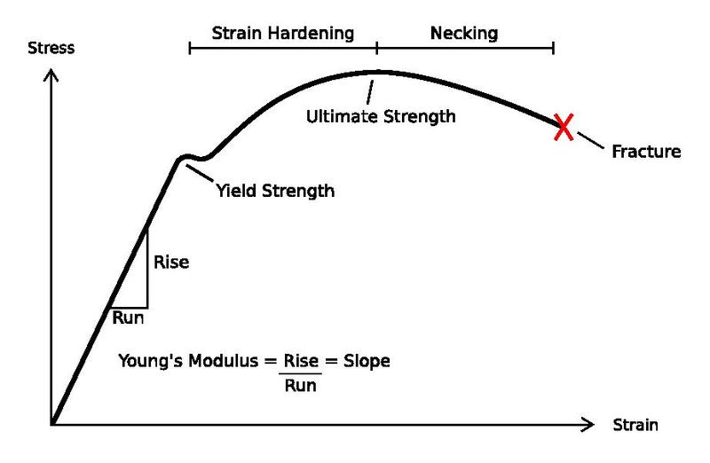

% Derivace a lineární aproximace
% Robert Mařík
% 2020

\iffalse

# Připomenutí derivací z ptačí perspektivy

S využitím aparátu derivací jsme v minulé přednášce poznali a naučili nebo naučíme se ve cvičení řešit úlohy tří základních různých typů:

1. *K funkci najdi její derivaci, tj. rychlost změny.* Toto je klasické derivování, případně doplněné o slovní interpretaci derivace. Použijeme vzorce a jedná se o čistě manuální dovednost. Vstupem je funkce, výstupem její derivace a případně slovní interpretace této derivace. Příkladů je spousta na webu i v učebnicích.
1. *Ze zadaného vztahu mezi dvěma veličinami najdi vztah mezi rychlostmi změn těchto veličin.* Jako vedlejší produkt mimo jiné využíváme dovednosti derivování z předchozího bodu a vždy derivujeme složenou funkci: vzorec vyjadřující jednu veličinu pomocí druhé je vnější složka a druhá veličina, resp. její závislost na čase, je složka vnitřní. Vstupem je vztah mezi veličinami a rychlost, s jakou se jedna z veličin mění, výstupem je rychlost, s jakou se mění veličina druhá.
1. *Ze zadaného slovního popisu nějakého děje sestav matematický model.* Ve slovním modelu je zmíněna rychlost, tu matematicky přepisujeme jako derivaci a tato rychlost je v nějaké relaci s ostatními veličinami. Odsud sestavujeme rovnici. Vstupem je mechanismus popisující vývoj systému, výstupem matematický model ve formě rovnice obsahující neznámou funkci popisující stav systému a její derivaci. V průběhu semestru se takovéto rovnice naučíme řešit, nejprve se však detailněji koukneme na to, abychom poznali i další role derivace.

\fi

# Aplikace derivací 3: Jak citlivě? (reakce na změnu)

Derivace v bodě, pokud ji nahlížíme z hlediska citlivosti reakce
funkce na změnu vstupních dat, udává, jaký vliv má jednotková změna ve
vstupních datech na změnu funkční hodnoty funkce. Pokud změna ve
vstupních datech není jednotková ale násobek jednotkové změny, je i
odezva násobná.

> Poznámka (derivace jako měřítko citlivosti funkce na změnu vstupních dat).
Buď $f:\mathbb R\to\mathbb R$ funkce taková, že má derivaci. Pokud se veličina $x$ změní z hodnoty $x_0$ o hodnotu $\Delta x$ (tj. nová hodnota je $x_0+\Delta x$), potom se $f$ mění přibližně o $f'(x_0)\Delta x$, tj. $$\Delta f\approx f'(x_0)\Delta x$$ neboli
$$\Delta f\approx \frac{\mathrm df(x_0)}{\mathrm dx}\Delta x.$$ Tato aproximace je použitelná pro malé hodnoty $\Delta x$. 

Co se rozumí malou hodnotou $\Delta x$ závisí na více faktorech,
například i na tom, jak se funkce "vzpírá" tomu, být aproximována
výrazem úměrným $\Delta x$. Přesněji tuto podmínku zformulujeme po
probrání Taylorova polynomu, kdy se použije o něco obecnější postup.

**Příklad.** Nosník výšky $h$, šířky $a$ a délky $L$ je uprostřed
  zatížený silou $F$. Průhyb $s$ uprostřed nosníku je dán vztahem
  $$s=\frac {F L^3}{4Ebh^3},\tag{♣}$$ kde $E$ je materiálová
  konstanta. Pro $h=20\,\mathrm{cm}$ je průhyb
  $s=10\,\mathrm{cm}$. Zjistěte, jak se průhyb mění při změnách výšky nosníku. Odhadněte, jak se průhyb změní, pokud se $h$ sníží na
  $18\,\mathrm{cm}$?

**Řešení.** Relevantními veličinami jsou $s$ a $h$ a vzorec je tedy
možno shrnout do tvaru $$s=\frac k{h^3},$$ kde $k$ je konstanta
charakterizující danou situaci. Pro zadané hodnoty výšky a průhybu
vychází konstanta $$k=s h^3=10\times 20^3=80\,000.$$ Vzorec (♣) tedy
redukujeme na $$s={80\,000}{h^{-3}}.$$ Derivováním obdržíme
$$\frac{\mathrm ds}{\mathrm dh}=80\,000\times(-3)
h^{-4}=-\frac{3\times 80\,000}{h^4}.$$ Změna výšky nosníku je $$\Delta
h=18-20=-2\,\mathrm{cm}$$ a tomu odpovídá změna průhybu $$\Delta
s=-\frac{3\times 80\,000}{(20)^4}(-2)=3\,\mathrm{cm}.$$ Průhyb se tedy
zvětší o $3\,\mathrm{cm}$.

> Poznámka (smysl předchozího příkladu). Proč nepočítáme přesně? Stačila by selská logika a změna
funkce $s=\frac k{h^3}$ by byla
$$\Delta s=\frac k{(h+\Delta h)^3}-\frac k{h^3}.\tag{♠}$$ Odpověď je
překvapivá: pomocí derivací je vyjádření změny v naprosté většině
případů jednodušší. V tomto našem případě máme
$$\Delta s\approx -\frac{3k}{h^4}\Delta h,$$ což je na další práci
mnohem příjemnější výraz, než rozdíl dvou zlomků (♠). Skutečnost, že platí
pouze pro malé $\Delta h$ nás nijak neomezuje. Většinou se tento
aparát používá tam, kde se chyba limitním přechodem "stáhne na
nulu". Navíc, ukazujeme koncept. *Důležité je si z příkladu odnést, že derivace umožní analyzovat, jak vypočítané veličiny reagují na změny ve vstupních datech. Výsledkem může být například maximální teoretická přesnost se kterou je možné vypočítat výslednou veličinu při vstupních datech zatížených chybou nebo nějakým způsobem nejistých (zákon šíření chyb).*

# Lineární aproximace v 1D

Pokud se funkce mění, můžeme odhad změny z přechozího odstavce přičíst k
funkční hodnotě a tím máme odhad funkční hodnoty po změně. Toto je
principem lineární aproximace, neuvěřitelně jednoduché a přitom velice
mocné techniky používané inženýry k tomu, aby se popis problémů a
řešení úloh vůbec daly efektivně zvládnout.

> Věta.
Buď $f:\mathbb R\to\mathbb R$ funkce, která má derivaci. V okolí bodu $x_0$ platí přibližný vzorec $$f(x)\approx f(x_0)+ f'(x_0)(x-x_0)$$ neboli
$$f(x)\approx f(x_0)+ \frac{\mathrm df(x_0)}{\mathrm dx}(x-x_0).$$

> Poznámka (slovní intepretace vzorce pro lineární aproxiamci). Výše uvedený vzorec není těžké rozšifrovat.
>
>* Veličina $f(x)$ je funkční hodnota v bodě $x$, tu chceme odhadnout.
>* Veličina $f(x_0)$ je známá funkční hodnota v bodě $x_0$, to je
>  výchozí bod pro odhad.
>* Veličina $f'(x_0)$ je odhad změny veličiny $f$ způsobený jednotkovou změnou vstupních dat (zvýšení hodnoty $x_0$ o jednotku). Tento faktor ještě v dalším kroku musíme přizpůsobit tomu, že změna vstupních dat není jednotková, což uděláme s využitím přímé úměrnosti.
>* Veličina $f'(x_0)(x-x_0)$ je odhad změny veličiny $f$ vyvolané
>  změnou veličiny $x$ z $x_0$ o $\Delta x=x-x_0$ tak, jak jsme jej
>  používali v minulé přednášce.

> Poznámka (alternativní vzorec pro lineární aproxiamci). Vzorec pro lineární aproximaci se často píše v ekvivalentním tvaru
$$f(x+h)\approx f(x)+f'(x)h,$$
což získáme dosazením $x+h$ za $x$ a $x$ za $x_0$.

**Příklad (růst stromu).** Strom má v roce 2019 výšku 3 metry a roste
  rychlostí 0.5 metru za rok. V roce $x$ je jeho výška dána vzorcem
  $$h(x)=3+0.5(x-2019).$$

**Příklad (aproximace důležitých funkcí v okolí nuly).** Ve cvičení
ukážeme platnost následujících přibližných vzorců, které platí pro $x$
blízké k nule.  $$\sin x\approx x, \quad \cos x\approx 1,\qquad
(1+x)^n=1+nx.$$ První dva vzorce využijeme později při popisu malých
rotací v rovině. Mnoho důležitých aplikací těchto vzorců ve fyzice je na webu [fyzikální olympiády](http://fyzikalniolympiada.cz/studijni-texty) v dokumentu [Aproximace ve fyzikálních úlohách](http://fyzikalniolympiada.cz/texty/aproxim.pdf).

# Lineární aproximace v některých fyzikáních zákonech

\iffalse

\fi

**Příklad (gravitační potenciál v malých výškách nad zemí).**
Gravitační potenciál $V$ ve vzdálenosti $r$ od středu koule
o hmotnosti $M$ je dán vztahem $$V(r)=-G\frac Mr=-GMr^{-1},$$ kde $G$
je gravitační konstanta. Najdeme lineární aproximaci v bodě $R$.

Dosazením obdržíme $$V(R)=-GMR^{-1}$$ a derivováním $$\frac{\mathrm
dV}{\mathrm dr}=GMr^{-2}, \quad \frac{\mathrm dV(R)}{\mathrm
dr}=GMR^{-2}.  $$ Odsud poté získáme lineární aproximaci $$V(r)\approx
-GMR^{-1}+GMR^{-2}(r-R)$$ Pro Zemi jako kouli o poloměru $R$ je $r-R$
výška nad Zemí $h$ a aproximaci je možno po přeznačení napsat ve tvaru
$$V(r)\approx V_0 +gh.$$ V tomto označení je $V_0=-GMR^{-1}$ konstanta
související s volbou nulové hladiny potenciálu a vzhledem
k libovolnosti volby nulové hladiny je tato hodnota
nepodstatná. Veličina $g=GMR^{-2}$ je tíhové zrychlení vyjádřené
pomocí gravitační konstanty $G$ a parametrů Země. Veličina $gh$ je
potenciál v tíhovém poli Země. Tuto veličinu známe lépe ze vzorce pro
potenciální energii tělesa o hmotnosti $m$, který má tvar $$E=mgh.$$

[Online výpočet tíhového zrychlení](https://sagecell.sagemath.org/?z=eJxNjrEKgzAUAPdA_uFBB6Ngmlir7fDGji4OjoVHRQ22Rp6p31916nhwHDfSPBMWuihzc0usearU2hjgBD3T6oLzE73h5acl0BSkqLG4lNYYsytMrfsu4Dt4EIdBigqv-l5mRyfLj8yHln-DcSVWEUexFI3iGNNxP0iq8wYgRY-Nbl3XbaQY683qf4UjLIo=&lang=sage)

**Příklad (potenciální a kinetická energie).**
V předchozím příkladě je možné využít vztah 
$$(1\pm x)^n\approx 1\pm nx
,\quad \text{pro malé }x.$$
Přepsáním gravitačního potenciálu $V$ do tvaru obsahujícího výšku nad zemí $h$
a využitím lineární aproximace získáme
\dm $$V = -G \frac{M}{R+h} =-G \frac{M}{R}\left (1+\frac hR\right)^{-1} \approx -G \frac MR\left(1+(-1)\frac hR\right) =-G \frac{M}{R} + G \frac{M}{R^2} h$$
a po zavedení nových konstant
$$ V\approx V_0+ g h,$$
kde $g=G \frac{M}{R^2}$.

Podobně
aproximací přesných vztahů plynoucích z\ Einsteinovy teorie relativity získáme složku energie související s pohybem, tj. kinetickou energii
\dm $$E=\frac{m_0c^2}{\sqrt{1-\frac {v^2}{c^2}}} =m_0 c^2 \left(1-\frac {v^2}{c^2}\right)^{-1/2} \approx m_0c^2+\frac 12 m_0v^2 $$
pro $v$ mnohem menší než $c$. Snadno rozšifrujeme, že s rychlostí souvisí jenom druhý sčítanec a že se jedná o klasický vzorec pro kinetickou energii $\frac 12 mv^2$.

 Ač se jedná "jenom" o\ lineární aproximaci, je  vzorec $E=\frac 12 mv^2$ dokonce mnohem použitelnější, protože výpočet kinetické energie pomocí univerzálně platného relativistického vzorce při malých rychlostech v praxi obvykle zhavaruje na [zaokrouhlovacích chybách](https://sagecell.sagemath.org/?z=eJyVUTtvwjAQ3pH4DydYHFRI7Ja2DBnTpUOl_AAkY06NiR80DlbDr-8lPJqlQyUP9t3n73Fns5yvYQ6V9a3zoQW_O2DdnqYTlYvN5mUjntavQICmU5XpASFiayREsIuwZUueTCcxF1n6uHoew648cPRVtzsdtNKVh4B3gAaRQW3Tyu_h2GDEPToJdH5pp5Njo10Ls3ftsNWqloAOm0-NUBsZqNBZiGffKLTE4cFKMxKY3f7zVCxstohbca2MqD92qFw3sKAaSIze-eiNG1vd-9o7heTfVDJSeO38Cc7S140_ESZKpVUFiqKSasFzklO9XCFydrmnLHw1LeNLspHSO0ko4RwuNgoOo4dYOZbcHLJCLAuejEr_df8A_VgC4HfboKXOOXYB-wA09-CGgLGjPTivKInrB1dCDiVK86bR7BnPsmHLJbvs-W6uZOzveMtLJ0l-AGuRw0Q=&lang=sage&interacts=eJyLjgUAARUAuQ==).

# Lineární aproximace a jednorozměrné materiálové vztahy

\iffalse

\fi

V inženýrské praxi často potřebujeme modelovat odezvu materiálu reagujícího na vnější podnět. Může se jednat například o změnu délky při mechanickém namáhání, tok tepla materiálem při tepelném namáhání, tok tekutiny porézním materiálem (dřevo, půda) při difuzi nebo rozdílu tlaků a podobně. 

Pokusíme se modelovat funkci dávající do souvislosti velikost podnětu a reakci materiálu.

* Je přirozené, že při nulovém podnětu není žádná odezva a proto funkce  prochází počátkem.
* S velikostí podnětu odezva na tento podnět roste a proto funkce v okolí počátku má kladnou derivaci a roste.
* Z lineární aproximace vidíme, že pro $x_0=0$ a $f(0)=0$ se vzorec pro lineární aproximaci redukuje na $$f(x)\approx f'(0)x,$$ tj. na přímou úměrnost.
* Ukazuje se, že v řadě praktických úloh je uvedená aproximace dobrá na dostatečně dlouhém intervalu a podle typu úlohy má tato aproximace povahu fyzikálního zákona a svůj vlastní název.  Nejčastěji se setkáme se s *Hookovým zákonem* pro deformaci materiálu (relativní prodloužení je úměrné normálovému napětí), *Darcyho zákonem* pro tok tekutiny půdou (filtrační rychlost je úměrná záporně vzatému hydraulickému gradientu), *Fickovým zákonem* pro difuzi (hustota difuzniho toku je úměrná záporně vzatému gradientu koncentrace) a *Fourierovým zákonem* pro vedení tepla v materiálu (hustota tepelného toku je úměrná záporně vzatému gradientu teploty). Později, v přednášce o zákonech zachování ve vektorovém poli ke konci semestru, si tyto závislosti naformulujeme ve vícerozměrném prostředí a hlavně ve tvaru, který umožní zohlednit práci s neizotropními materiály (různé fyzikální vlastnosti v různých směrech).
* Matematicky je tedy povaha přímé úměrnosti v materiálových vztazích zřejmá a experimentálně je možné ověřit, pro jaké oblasti platí. Toto nám však mnohdy nestačí a snažíme se tyto vztahy ještě odvodit ze základních fyzikálních vztahů a z představy jak daný proces funguje. To otevírá možnosti potvrdit si, že naše představa o chování materiálu je správná.
* V některých velmi speciálních případech dokonce umíme určit materiálovou charakteristiku výpočtem namísto měření. Pro praktické využití tato dovednost není významná (můžeme vypočítat například koeficient filtrace pro půdu složenou z částic ve tvaru stejně velkých kuliček, v praxi se však s takovým materiálem setkáme nanejvýš při speciálních aplikacích v laboratoři), ale dává nám to důležitý prostor pro ověření fyzikálních hypotéz a matematických postupů.

# Derivace a tečna

Lineární aproximace funkce je vlastně aproximace tečnou. Protože 
pojem tečna ze střední školy chápeme jenom intuitivně, můžeme nyní pomocí
derivace tečnu dokonce definovat. Z geometrického pohledu je tečna přímka
bodem $[x_0,f(x_0)]$, která má směrnici $f'(x_0)$. Proto se o derivaci
často mluví jako o směrnici tečny.

> Definice (tečna). Nechť $f$ je funkce, která má v bodě $x_0$ derivaci $f(x_0)$. Přímka $$y=f(x_0)+f'(x_0)(x-x_0)$$ se nazývá *tečna ke grafu funkce* $f$ v bodě $x_0$.

Díky souvislosti derivace s tečnou je derivace jedinečným nástrojem při popisu vlastností křivek. Příslušná oblast se nazývá diferenciální geometrie a je to jakási oblast mezi geometrií a diferenciálním počtem.

# Motivace: Je možné chtít více než je lineární aproximace?

\iffalse

\fi

Lineární aproximace vychází z předpokladu, že rychlost růstu (nebo
poklesu) se příliš nemění. Někdy můžeme mít dodatečnou informaci o tom, jak se tato rychlost změní. Například pokud se bude rychlost
zpomalovat, bude skutečná hodnota funkce menší než lineární
aproximace. 

Je otázka, zda a jak je možné informaci o tom, jak rychle roste
rychlost, případně jak rychle roste rychlost růstu rychlosti, využít.
To znamená že budeme studovat derivaci derivace, derivaci derivace
derivace atd.

Aproximaci funkce $\cos x\approx 1$ zmíněnou výše (odvodíme ve
cvičení), kdy aproximujeme vlastně konstantní funkcí, je možné také
chápat jako selhání lineární aproximace. Následující slidy a pojem
Taylorův polynom nám umožní najít prostředek pro aproximaci i v těchto
případech.

# Derivace vyšších řádů

> Definice (druhá a další vyšší derivace).
>
>* *Druhou derivací* rozumíme derivaci derivace. Označujeme $f''(x)$ nebo $\frac{\mathrm d^2 f}{\mathrm dx^2}$. 
>* Podobně *$k$-tou derivací* rozumíme derivaci $(k-1)$-ní derivace. Označujeme $f^{(k)}(x)$ nebo $\frac{\mathrm d^k f}{\mathrm dx^k}$. 
>
>Platí tedy $$\frac {\mathrm d^2 f}{\mathrm dx^2}:=\frac {\mathrm d}{\mathrm dx} \left(\frac {\mathrm d f}{\mathrm dx}\right),\quad  
\frac {\mathrm d^kf}{\mathrm dx^k}:=\frac {\mathrm d}{\mathrm dx}
\left(\frac {\mathrm d^{k-1}f}{\mathrm dx^{k-1}}\right)  $$
aneb
$$f'':=(f')', 
\quad f'''=(f'')', \quad f^{(k)}={(f^{(k-1)})'}.$$

Označení derivací pomocí čárek se nazývá Lagrangeova notace, označení
pomocí podílu diferenciálů Leibnizova notace. Ještě se někdy používá i
Eulerova notace, používající $\mathrm Df$, $\mathrm D^2 f$ a $\mathrm
D^k f$ pro první, druhou a $k$-tou derivaci.

**Příklad.** 

* Exponenciální funkce $e^x$ má všechny derivace stejné. 
* U mocninné funkce se každým derivováním sníží exponent. Je-li
exponentem přirozené číslo, po konečném počtu kroků se exponent sníží
na nulu, funkce tedy bude konstantní a všechny další derivace budou
nulové. 
* Polynomy mají všechny derivace od jistého řádu rovny nule.

Podobně je možné pracovat s parciálními derivacemi parciálních derivací. Například $$\frac{\partial ^2 f}{\partial x^2}:=\frac{\partial }{\partial x}\left(\frac{\partial f}{\partial x}\right)$$
$$\frac{\partial ^2 f}{\partial y^2}:=\frac{\partial }{\partial y}\left(\frac{\partial f}{\partial y}\right)$$
nebo 
$$\frac{\partial ^2 f}{\partial x\partial y}:=\frac{\partial }{\partial y}\left(\frac{\partial f}{\partial x}\right).$$

# Taylorův polynom a polynomiální aproximace v 1D

> Definice (Taylorův polynom).
> *Taylorův polynom* stupně $n$ pro funkci $f$ v bodě $x_0$ je polynom 
\dm$$T(x)=f(x_0)+f'(x_0)(x-x_0)+\frac{1}{2!}f''(x_0)(x-x_0)^2+\cdots +\frac{1}{n!}f^{(n)}(x_0)(x-x_0)^n,$$ 
tj.
\dm$$T(x)=f(x_0)+\frac {\mathrm df(x_0)}{\mathrm dx}(x-x_0)+\frac{1}{2!} \frac {\mathrm d^2f(x_0)}{\mathrm dx^2} (x-x_0)^2+\cdots +\frac{1}{n!}\frac {\mathrm d^nf(x_0)}{\mathrm dx^n}(x-x_0)^n.$$

Taylorův polynom je nejlepší aproximace funkce $f$ polynomem. Je možné
ukázat, že rozdíl $$f(x)-T(x)$$ je blízký k nule, pokud je $n$
dostatečně velké, $x$ dostatečně blízko k $x_0$ a $(n+1)$-ní derivace
funkce $f$ je relativně malá. V těchto případech je $$f(x)\approx
T(x).$$  V tomto případě dostáváme
následující větu. V ní $O((x-x_0)^{n+1})$ je takzvané [Landauovo velké
O](https://cs.wikipedia.org/wiki/Landauova_notace). Tímto zápisem je
vyjádřen člen, který je pro $x$ blízká k $x_0$ v absolutní hodnotě
menší než násobek funkce $(x-x_0)^{n+1}$, tj. v bodě $x_0$ konverguje k nule
stejně rychle nebo rychleji jako mocniná funkce s exponentem $n+1$.

> Věta (Taylorova aproximace v okolí nuly) Platí
\dm$$f(x)=T(x)+O((x-x_0)^{n+1}),$$
resp. pro $x=x_0+h$
\dm$$f(x_0+h)=f(x_0)+f'(x_0)h+\frac{1}{2!}f''(x_0)h^2+\cdots +\frac{1}{n!}f^{(n)}(x_0)h^n+O(h^{n+1}),$$
pokud existují spojité derivace funkce $f$ do řádu $n+1$.

Často používáme aproximaci v nule. Potom dostáváme pro proximaci v okolí nuly
\dm$$f(x)=f(0)+f'(0)x+\frac{1}{2!}f''(0)x^2+\cdots +\frac{1}{n!}f^{(n)}(0)x^n+O(x^{n+1}).$$

**Příklad.** $$
\begin{aligned}
\ln \frac{1+x}{1-x}&\approx 2x+\frac 23 x^3+\frac 25 x^5+\frac 27 x^7 +\frac 29 x^9\\
\ln 2=\ln\frac {1+\frac 13}{1-\frac 13}&\approx 0.69314604
\end{aligned}$$
Po tomto výpočtu je prvních pět cifer aproximace $\ln 2$ správně. Tady vidíme i jeden zajímavý trik. Pokud bychom se snažili napsat Taylorův polynom funkce $\ln (x+1)$, která vypadá příjemněji, chyba aproximace by byla mnohem větší.

[Online výpočet.](https://sagecell.sagemath.org/?z=eJx1jrsKwkAQRfuF_YcBmxmMidHKws4_0E4sloQ8IJkJMYm7fr2bNSAErGY4F869BVo6N4yYbi0lmO4skVblQmeolVYbuEwGbsY10svkoJPGsbROqyIeAkUb7aMTxc9KXjgb_vDZdfUONlxDJTnL4MA3HQgM5JOMYLpebN2arPY1rfjTj292WfXr9_-yYNQqmO9BETNStFqEaXL8BuU6CPhBH7pTT2k=&lang=sage)

**Příklad.** Výraz $$V(r)=\frac 1{r^{12}}-\frac 2{r^6}=r^{-12}-2r^{-6}$$ je (až na konstanty, které pro pohodlí volíme pevně) Lennard-Jonesův potenciál často používaný pro interakci mezi atomy nebo molekulami. Napíšeme Taylorův polynom druhého stupně v bodě $r=1$. K tomu potřebujeme znát funkční hodnotu a hodnotu prvních dvou derivací v tomto bodě.
$$\begin{aligned}
V(1)&=1-2=-1\\
\frac{\mathrm dV}{\mathrm dr}&=-12r^{-13}-2(-6)r^{-7}\Bigr|_{r=1}=-12+12=0\\
\frac{\mathrm d^2V}{\mathrm dr^2}&=12\cdot 13 r^{-14}-2\cdot6\cdot 7r^{-8}\Bigr|_{r=1}=12\cdot 13-12\cdot 7=72\\
V(r)&\approx -1+\frac 12 72 (r-1)^2
\end{aligned}
$$
Konstanta $-1$ je nezajímavá, souvisí s nulovou hladinou potenciálu a nulovou hladinu potenciálu si můžeme volit libovolně.

Lineární člen chybí a kvadratický člen je analogický potenciální
energii pružiny o tuhosti $k$ ve tvaru $$U=\frac 12 kx^2.$$ Molekuly či
atomy popsané tímto potenciálem se chovají jako tělesa na pružině o tuhosti $k=72$. Pro atom o hmotnosti $m$ tedy například platí vzorec pro
úhlovou frekvenci oscilací $\omega = \sqrt{\frac km}$, odvozený
původně pro těleso na pružině. Veličina $r-1$ je výchylka z rovnovážného stavu.
Analogicky se chovají pružné konstrukce. V klidu jsou ve stavu s minimální potenciální energií a při vychýlení z tohoto stavu o malou hodnotu začínají kmitat. Pokud aproximujeme potenciál pomocí Taylorova polynomu, z koeficientu u kvadratického člene můžeme určit frekvenci těchto oscilací.

\iffalse

[Online výpočet a obrázek.](https://sagecell.sagemath.org/?z=eJxljkEKwjAQRfeF3GF2SXCMzVi6yy1KlkJQQaE1YSya3t7JQjfuHv-_-cwrsdGsreoiBPAHPnmCPZDAqLpJsujWtM2ZDaNHErEu9wfWJVUpe3dEUl3xwmXOq4mGLYK4P8vKSaFvP_33COcs-0Hz9dIeed7y28jiDgohbKIEj9D80LuxUUvcYD-S5jQL&lang=sage)

\fi

# Prostá funkce

Někdy jsme v situaci, že známe výsledek po působení nějaké funkce a
potřebujeme zrekonstruovat vstupní hodnotu. Řešíme tedy pro zadanou
funkci $f$ a hodnotu $y_0$ rovnici $$f(x)=y_0.$$ Řešení této rovnice,
pokud existuje, nemusí být určeno jednoznačně. Pro funkce, pro které
je určeno jednoznačně, zavádíme následující pojem.

> Definice (prostá funkce).
  Nechť $f$ je funkce a $M\subseteq \mathrm{Dom}(f)$ podmnožina definičního oboru funkce $f$.   Řekneme, že funkce $f$ je *prostá*,
  jestliže každý obraz má jen jediný vzor, tj. pro každé $y_0\in f(M)$
  existuje jediné $x\in M$ s vlastností $f(x)=y_0$.
  Nespecifikujeme-li množinu $M$, máme na mysli, že uvedená vlastnost
  platí na celém definičním oboru funkce $f$.

> Věta (rovnice s prostou funkcí). Pokud je $f$ prostá funkce a platí $$f(x)=f(a),$$ potom platí $x=a.$

**Příklad.** Funkce $\frac 1x$ je prostá a proto z rovnosti $\frac 1x = \frac 15$ 
plyne $x=5$.

**Příklad.** Funkce $x^2$ není prostá a proto z rovnosti $x^2 = 7^2$ neplyne $x=7$.

# Inverzní funkce

Inverzní úloha je tak trošku jako reverzní inženýrství. Máme výsledek
a potřebujeme znát vstupní data. U funkcí to je supersnadné, u
konstrukcí supersložité. Užitečné je ale obojí.

> Definice (inverzní funkce).   Nechť funkce $f: A\to B$ je prostá. Pravidlo, které každému $x$   z množiny $f(A)$ přiřadí to (jediné) $y$, pro které platí $f(y)=x$ se nazývá *inverzní funkce* k funkci $f$, označujeme   $\mathbf{f^{-1}}$.

> Poznámka (inverzní funkce pří řešení rovnic). Jinak zapsáno, je-li $$f(y)=x$$ a $f$ má inverzní funkci, platí
$$y=f^{-1}(x).$$ Jedná se o zobecnění pouček jak "převádět výrazy na druhou stranu rovnice".

Symbol $f^{-1}(x)$ lze tedy chápat buď jako hodnotu inverzní funkce
  k funkci $f$ v bodě $x$, nebo jako převrácenou hodnotu k číslu
  $f(x)$, tj jako $[f(x)]^{-1}=\frac{1}{f(x)}$. Nebude-li z kontextu
  zřejmé, o kterou variantu se jedná, musíme toto upřesnit.

**Příklad.** Funkce $y=x^2$ není prostá na $\mathbb R$ a proto zde nemá inverzní funkci. Pokud definiční obor funkce $y=x^2$ zúžíme na nezáporná čísla, tj. požadujeme $x\geq 0$, je taková funkce prostá a má inverzní funkci. Protože tato úloha má praktický význam, vyplatí se pro tuto inverzní funkcí zavést speciální označení. Jak dobře víme, inverzní funkcí je druhá odmocnina, tj. funkce $y=\sqrt x$.

# Newtonova metoda

Newtonova metoda (též Newtonova Raphsonova metoda) je metoda pro
numerické řešení rovnic. To používáme v případě, že není možné (nebo
není účelné) řešit rovnici přesně a snažíme se najít přibližné
řešení. Například neznáme inverzní funkci, nebo s touto funkcí neumíme
pracovat.

Budeme hledat řešení rovnice $$f(x)=0.$$ Budeme postupovat tak, že
vyjdeme z nějaké aproximace řešení (získáme například graficky nebo
zkusmo hrubou výpočetní silou) a tuto aproximaci budeme postupně
zpřesňovat. Postup zpřesňování je takový, že v dosažené aproximaci
funkci nahradíme lineární funkcí a další aproximace (zpřesnění
předchozí aproximace) bude v nulovém bodě této lineární funkce. Za
poměrně snadno splnitelných předpokladů (začneme dostatečně blízko
nulového bodu a funkce má v nulovém bodě nenulovou derivaci) postup
konverguje ke kořeni studované rovnice a to velmi rychle: každým
krokem se přibližně zdvojnásobí počet míst, která máme správně.

Z\ lineární aproximace funkce $f$ v bodě $x_0$ $$f(x)\approx
f(x_0)+f'(x_0)(x-x_0)$$ pro $x_0=x_n$, $x=x_{n+1}$, $f(x_{n+1})=0$ dostáváme
$$0=f(x_n)+f'(x_n)(x_{n+1}-x_n)$$ a po osamostatnění $x_{n+1}$ přímo
iterační vzorec $$x_{n+1}=x_n-\frac{f(x_n)}{f'(x_n)}.$$ Tento vzorec
používáme opakovaně až do dosažení požadované přesnosti. Obvyklým
testem pro ukončení výpočtu je porovnání dvou po sobě jdoucích
iterací. Pokud se v rámci požadované přesnosti shodují, výpočet končí
a známe přibližné řešení zadané rovnice.

**Příklad.**
Zkusme najít číslo takové, jehož kosinus je stejný jako toto číslo. 
Rovnici $$x=\cos x$$ nejprve přepíšeme do tvaru $$x-\cos x=0$$ a hledáme vlastně řešení nulový bod funkce $f(x)=x-\cos x$. Po dosazení $f'(x)=1+\sin x$ získáváme iterační vzorec $$x_{n+1}=x_n-\frac{x_n-\cos x_n}{1+\sin x_n}$$ a jednotlivé iterace s počátečním odhadem $x_0=1$ a s\ aproximací na 80 desetinných míst [dávají postupně](https://sagecell.sagemath.org/?z=eJyrsDXk5UrLL1LIVMjMUyhKzEtP1TDXtOLlUgCCCluNCl0gSs4v1qjQ1NTXMNQuzswDMTX18jRSMtMzS4ptLQw0IaoLijLzShQqAJbBFls=&lang=sage&interacts=eJyLjgUAARUAuQ==) následující hodnoty.

\bgroup \scriptsize

~~~
0.75036386784024389303494230668217685324699306585535903096658315202443061372724844
0.73911289091136167036058529090489023400289283673565690732340797067262734474030949
0.73908513338528396976012512085680433288953312317018897963123060924114905347788420
0.73908513321516064166170262568502637232522326252964269151340253531790167136371866
0.73908513321516064165531208767387340401342077636703525840515904303894688001184009
0.73908513321516064165531208767387340401341175890075746496568063577328465488354759
0.73908513321516064165531208767387340401341175890075746496568063577328465488354759
~~~

\egroup

Vidíme, že proces opravdu neuvěřitelně rychle konverguje k\ řešení rovnice.

	

# Shrnutí, hlavní myšlenky

\iffalse

\fi

* Derivace udává trend ve změnách veličin a díky tomu umožňuje za určitých okolností nahrazovat komplikované funkční vztahy pomocí vztahů lineárních. Toto nazýváme lineární aproximace a je to jedna za zásadních metod, jak si inženýři zjednodušují úlohy, které by byly jinak neřešitelné.
* Derivace dokáže detekovat růst a klesání funkce a díky tomu dokážeme také detekovat body, kde se růst zastaví a změní na klesání nebo naopak. Tyto body nás přirozeně zajímají, protože v těchto bodech je studovaná veličina maximální nebo minimální a to má dopad při minimalizaci nákladů, maximalizaci pevnosti či zisku a jiných úlohách z praktického života.
* Pokud trend (rychlost změny, derivace) nestačí k podchycení zásadních vlastností veličiny (nastává v lokálním extrému nebo v případě, že potřebujeme lepší aproximaci, než je aproximace lineární), máme k dispozici nástroje i v tomto případě: derivace vyšších řádů a Taylorův polynom.
