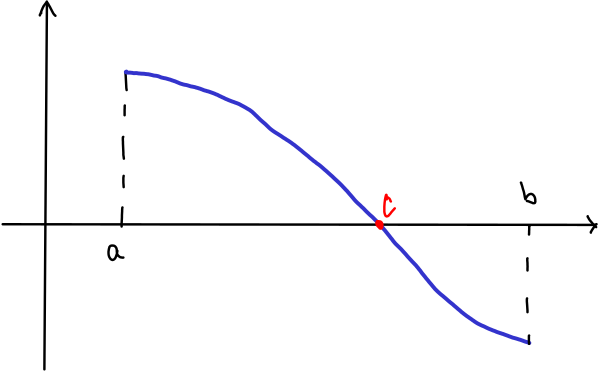

% Derivace & friends III
% Robert Mařík
% 2020

# Vlastnosti funkcí jedné proměnné (parita)

V následující definici se budeme zajímat o to, jestli existuje nějaký
vztah mezi funkční hodnotou v bodě $x$ z definičního oboru a v bodě
opačném.

> Definice (parita funkce).   Nechť funkce $f$ splňuje následující podmínku:   $x\in\mathrm{Dom}(x)\implies (-x)\in\mathrm{Dom}(f)$.
> 
> * Řekneme, že funkce $f$ je *sudá*
  pokud platí $f(-x)=f(x)$.
* Řekneme, že funkce $f$ je *lichá*
  pokud platí $f(-x)=-f(x)$.
* Řekneme, že funkce $f$ má *paritu*, je-li
  sudá nebo lichá.

Graf sudé funkce je osově souměrný podle osy $y$.  Graf liché funkce
je středově souměrný podle bodu $[0,0]$.

Sudé a liché funkce jsou, díky svým vlastnostem, v jistém smyslu pěkné. V matematice se často snažíme zapsat nějaký objekt pomocí podobných pěkných objektů. Uvidíme toto například později při popisu deformace. Jako ukázku přístupu si můžeme už teď ukázat následující snadnou (a pravděpodobně málo užitečnou) větu.

> Věta (o rozkladu funkce na součet sudé a liché funkce). Platí $$f(x)=\frac{f(x)+f(-x)}2 + \frac{f(x)-f(-x)}2.$$
Každou funkci definovanou na $(-\infty,\infty)$ je možné takto rozložit na součet sudé a liché funkce.

**Příklad.** Pro funkci $f(x)=e^x$ dostáváme
$$e^x=\frac{e^x+e^{-x}}2-\frac{e^x-e^{-x}}2.$$ Dvě funkce na pravé
straně mají význam v aplikacích a nazývají se hypebolický kosinus,
$\cosh x$, a hyperbolický sinus, $\sinh x$.

**Příklad.** Je-li funkce $f(x)$ polynom, potom rozkladem na sudou a lichou část dostaneme polynomy, které jsou tvořeny členy původního polynomu tak, že sudá část obsahuje právě členy se sudým exponentem a lichá část právě členy s lichým exponentem.

# Motivace: Jak najít minimum potenciálu?

\iffalse

\fi

V příkladě s aproximací potenciálu pomocí Taylorova polynomu se nám
povedlo potenciál aproximovat pomocí kvadratické funkce v okolí
vrcholu paraboly. To je častá úloha, protože systémy s potenciální
energií se často nacházejí ve stavu blízkému minimu této
energie. Otázka je, jak toto minimum najít. Budeme řešit poněkud
obecnější úlohu, jak hledat nejenom minimální hodnotu, ale i maximální
hodnotu. Zaměříme se na minima a maxima, která jsou lokální (platná
pouze na určitém intervalu, třeba i krátkém). 

# Lokální extrémy spojitých funkcí

Následující definice si všímají bodů které mají tu vlastnost, že v okolí není možné najít body buď s vyšší funkční hodnotou (potom se jedná o lokální maximum, nikde v okolí mi funkce neukáže více) nebo s nižší funkční hodnotou (analogicky, lokální minimum).

> Definice (lokální extrémy). Nechť $f\colon \mathbb R\to\mathbb R$.
>
>* Řekneme, že $f$ má v bodě $x_0$ *lokální maximum*, pokud platí $$f(x)\leq f(x_0)$$ pro všechna $x$ z nějakého okolí bodu $x_0$.
>* Řekneme, že $f$ má v bodě $x_0$ *lokální minimum*, pokud platí $$f(x)\geq f(x_0)$$ pro všechna $x$ z nějakého okolí bodu $x_0$.
>* Řekneme, že $f$ má v bodě $x_0$ *lokální extrém*, pokud v tomto bodě má buď lokální maximum nebo lokální minimum.

Přímo z definice lokálních extrémů a rostoucí a klesající funkce plyne, že funkce nemůže mít lokální extrém v bodě, kde je rostoucí nebo kde je klesající. Tuto skutečnost vyjadřuje pomocí derivací následující věta.

>Věta (Fermatova o lokálním extrému). Má-li funkce $f$ v bodě $x_0$ lokální extrém, potom je derivace funkce $f$ v bodě $x_0$ nulová, nebo neexistuje. 

Předchozí věta eliminuje obrovské množství bodů z definičního oboru
funkce. V prakticky využitelných případech nám po této eliminaci často
zůstane jenom jediný bod, podobně jako v následující úloze.

# Nosník maximální tuhosti

\iffalse

\fi

**Příklad.** Z kulatiny o průměru $d$ chceme získat nosník
obdélníkového průřezu, který se při zatížení co nejméně prohýbá. Z
fyzikálních úvah víme, že musí být maximální součin $bh^3$, kde $b$
je šířka a $h$ výška nosníku.

*Trik 1: Budeme měřit jednotky v násobcích průměru.* Proto je
$d=1$. Můžeme tedy bez újmy na obecnosti předpokládat, že kulatina má
jednotkový průměr.

Z Pythagorovy věty (nakreslete si průřez, tj. obdélník vepsaný do
kružnice) plyne $b=\sqrt{1-h^2}$ a snažíme se tedy řešit úlohu
$$bh^3=h^3 \sqrt{1-h^2}\to \mathrm{MAX},$$
která má fyzikální smysl na intervalu $(0,\infty)$.

*Trik 2: Protože uvažujeme jenom 
kladné délky, je funkce kladná a bude maximální tam, kde bude
maximální její druhé mocnina.* Je tedy možné studovat ekvivalentní
úlohu
$$(bh^3)^2=h^6(1-h^2)=h^6-h^8\to \mathrm{MAX}$$
na intervalu $(0,\infty)$. Výhoda je zřejmá: místo součinu dvou
funkcí, z nichž jedna je navíc složená, studujeme dvoučlenný
polynom. Pro funkci $$f(h)=h^6-h^8$$ dostáváme
$$ \frac{\mathrm df}{\mathrm dh}=6h^5-8h^7=2h^5(3-4h^2).$$
Tato derivace je nulová pro 
$$h^2=\frac 34$$
tj. $$h=\frac{\sqrt 3}2.$$ Pro tuto výšku bude mít nosník maximální
hodnotu tuhosti. Šířka nosníku bude
$$b=\sqrt{1-h^2}=\sqrt{1-\frac 34}=\sqrt{\frac 14}=\frac 12.$$
Poměr výšky a šířky u nosníku maximální tuhosti tedy bude $\sqrt{3}:1$
a šířka bude rovna polovině průměru.

[Online výpočet.](https://sagecell.sagemath.org/?z=eJwrSyzSUM9QSFHX5OVK08jQtM2IM9YqLiwq0UiJM9LNiDMCihdn5JdrpOmlZKaBVGAI6BXn55SlgmQAYWkWzQ==&lang=sage)

# Závěrečné poznámky k lokálním extrémům

> Poznámka. Někdy se při studiu lokálních extrémů hodí dva následující triky.
>
1. Vhodnou volbou jednotek dokážeme eliminovat některé
parametry. Přesněji, vhodnou volnou jednotek dokážeme některým
parametrům dát konkrétní numerickou hodnotu. Vyšetřovaná funkce je
potom často jednodušší.
1. Je-li $g$ rostoucí, potom z definice rostoucí funkce plynou ekvivalence
$$
\begin{gathered}
  f(x)\leq f(x_0) \iff   g(f(x))\leq g(f(x_0)),\\
    f(x)\geq f(x_0) \iff   g(f(x))\geq g(f(x_0))
\end{gathered}
$$
a proto funkce $f(x)$ a $g(f(x))$ mají lokální extrémy ve stejných
bodech. Toho je možné využít, pokud vidíme, že při vhodné volbě funkce
$g$ by byla funkce $g(f(x))$ vhodnější pro hledání lokálních
extrémů. Podobně je možné uvažovat i pro klesající funkce $g$, ale
protože klesající funkce obrací směr nerovností, mění se lokální
maximum na lokální minimum a naopak.

Pokud řešíme úlohu s praktickým zadáním, je z povahy úlohy často
zřejmé, že lokální extrém požadovaného typu existuje a často to bývá
jediný bod, kde je derivace nulová. Pokud takových bodů máme více,
nebo pokud je situace méně zřejmá, můžeme existenci lokálního extrému
posoudit pomocí následující věty.

> Věta (postačující podmínka pro lokální extrémy). Je-li $f$ spojitá v bodě $x_0$ a mění-li se v bodě $x_0$ funkce $f$ z rostoucí na klesající, má funkce $f$ v bodě $x_0$ lokální maximum. Analogicky, lokální minimum nastává při změně z klesající na rostoucí.

Podle této věty jsou intervaly monotonie zásadní informací pro
nalezení lokálních extrémů. Vzhledem k souvislosti monotonie s
derivací je tedy nutné se věnovat nalezení intervalů, kde má funkce
kladnou derivaci a intervalů, kde má funkce zápornou derivaci.

# Bolzanova věta

Bolzanova věta je poměrně názorné tvrzení. Hlavním přínosem pražského
matematika Bernarda Bolzana bylo, že si uvědomil, že toto tvrzení není
snadným důsledkem definice spojitosti a že přes názornost tohoto
tvrzení je nutno podat jeho přesný důkaz, který rozhodně není
jednoduchý. Jiná, zdánlivě nevinná tvrzení, však pravdivá být
nemusí. Zde se nabízí souvislost se spojitostí funkce a nakreslitelností jedním tahem. Bolzano například našel funkci, která je spojitá, ale její
graf je tak komplikovaný, že se nedá nakreslit.

Podmínka $f(a)f(b)<0$ v následující větě znamená, že funkční hodnoty
funkce $f$ v bodech $a$ a $b$ se liší znaménkem.

> Věta (Bolzanova věta). Nechť $f$ je spojitá funkce na intervalu $[a,b]$ a $f(a)f(b)<0$. Potom existuje $c$ na intervalu $(a,b)$ takové, že platí $f(c)=0.$

**Důsledek.**

* Na intervalu, kde je funkce spojitá a různá od nuly, se zachovává
znaménko funkce, tj. funkce je zde buď pořád kladná nebo pořád
záporná. Mezi oběma variantami se můžeme rozhodnout testováním
znaménka funkce v jednom libovolném bodě intervalu.
* Na intervalu, kde má funkce spojitou a od nuly různou derivaci, se
zachovává monotonie funkce, tj. funkce je zde buď pořád rostoucí nebo
pořád klesající. Mezi oběma variantami se můžeme rozhodnout testováním
monotonie (tj. znaménka derivace) v jednom libovolném bodě intervalu.

**Poznámka.** Lokální extrém nastává tam, kde je funkce spojitá a kde
se mění monotonie. Nenastává tam, kde se monotonie spojité funkce
nemění. Přirozeně nenastává ani tam, kde funkce není definována.

**Příklad.** Najděte lokální extrém funkce $y=\frac x{x^2+1}$. Derivace je $y'=\frac{(1+x)(1-x)}{(x^2+1)^2}$. 

**Příklad.** Najděte lokální extrém funkce $y=\frac{x^3}{x+2}$. Derivace je $y'=\frac{2(x+3)x^2}{(x+2)^2}$.

Řešení příkladů bude na přednášce. Další příklady ve cvičení.

# Funkce více proměnných

Funkce má na vstupu více proměnných, na výstupu reálné číslo. Některé pojmy, jako například monotonie, ztrácejí ve světě funkcí více proměnných smysl, například monotonie nebo inverzní funkce. Proměnné značíme pomocí jejich fyzikálního označení. Bez fyzikálního kontextu zpravidla používáme funkce dvou, tří, nebo $n$ proměnných v následujícím tvaru.

* $f:\mathbb R^2\to\mathbb R$, $f(x,y)$ Geometricky můžeme chápat jako výšku přiřazenou bodu v rovině a výsledkem je [plocha ve 3D](https://sagecell.sagemath.org/?z=eJxNzc0OwiAQBOA7Ce-wN34CPbTxyM34HqhUm4AQQN19e1tTEy-Tb-YyL1-lIKE4m2tO0CgVGkrMvS-PGyyp5Nph69OVM87as87-EqYjuH2VB42adMAiLWo9WlpDGZBo7Gi-op8w-nOITqAwQLtpdbvntzv52IL6uxi2WaoP-CUxIw==&lang=python&interacts=eJyLjgUAARUAuQ==), nebo barvu přiřazenou bodu v rovině a výsledkem je [obarvená rovina](https://sagecell.sagemath.org/?z=eJw1iksKhDAQBfeCd-hdEmw3jtvcwrUSRZmBHlvaD-nbG_wsHlUFL6KChyOINRHVuDybbBLnY6FtVcY0bT95NvC88S7dQrxZuD-AkFjWWF-qtyJMPyLfyD4iUOhHWp8YmFj6IG_-w-LNdz2MOwFGSShb&lang=sage&interacts=eJyLjgUAARUAuQ==).
* $f:\mathbb R^3\to\mathbb R$, $f(x,y,z)$ Geometricky můžeme chápat jako barvu přiřazenou bodu v prostoru a výsledkem je obarvený prostor.
* $f:\mathbb R^n\to\mathbb R$, $f(x_1,x_2,\dots,x_n)$ Geometrická představa zde není možná, chápeme čistě abstraktně. 

# Vektorové funkce

Výstupem funkce je vektor. Vstupem je buď reálné číslo (funkce jedné proměnné), nebo vektor. V prvním případě se jedná o parametrickou křivku v [rovině](https://sagecell.sagemath.org/?z=eJxTVghILErMTS0pykzOrlSoSkxJzEtUyC7KLMtO5OXi5SqxLUss0lAvUdfk5SqAq4wvyMkv0YhOzi_WKNHUUSjOzAPSsToKGgY6BZmamgDCkhs_&lang=sage&interacts=eJyLjgUAARUAuQ==) nebo v [prostoru](https://sagecell.sagemath.org/?z=eJxTVghILErMTS0pykzOrlSoSkxJzEtUyC7KLMtO5OXi5SqxLUss0lAvUdfk5SqAq4wvyMkvMU7RiC7RSs4v1ijR1FEo0SrOzAOxSmJ1FDQMdMy0CjI1NQHngx4S&lang=sage&interacts=eJyLjgUAARUAuQ==), ve druhém případě bývá zpravidla na vstupu stejný počet veličin jako na výstupu a jedná se o vektorové pole (každému bodu v rovině je přiřazen [rovinný vektor](https://sagecell.sagemath.org/?z=eJyr0KnUqbItSyzSUK9QqFSoUtfk5SrIyS-JL0tNLskvik_LTM1J0dDQrdSp0NRR0KjQ0TXUMQSxKqGsxOICoMr4osSSzHxbQ00A7BcYPA==&lang=sage&interacts=eJyLjgUAARUAuQ==), každému bodu v prostoru je přiřazen [prostorový vektor](https://sagecell.sagemath.org/?z=eJwrzUtJTcvMS00BABLKA7M=&lang=sage&interacts=eJyLjgUAARUAuQ==)). Vektory zapisujeme pomocí jejich komponent následovně.
$$\vec F=(P,Q,R)=P\vec i+Q\vec j+R\vec k = P\vec e_1+Q\vec e_2+R\vec e_3$$

# Gradient

Rovnici vedení tepla ve 2D a 3D uvedeme později. Může nastat problém s
tím, že teplo neteče stejným směrem jaký odpovídá gradientu
teploty. Je to podobné, jako pohyb vzduchu nebo podzemní vody
způsobený rozdílem tlaku: voda nebo vzduch míří do míst s nižším
tlakem, ale přitom volí cestu menšího odporu. Problém vyřešíme
nástrojem, který umožní změnit směr vektoru: matice a maticové
násobení. Teď uvedeme jenom veličinu, která umožní kvantifikovat,
jakým směrem působí síla uvádějící příslušnou stavovou veličinu do
pohybu.

> Definice (gradient). Buď $f(x,y)$ funkce dvou proměnných, která má
parciální derivace. *Gradientem* funkce $f$ rozumíme
vektor
$$\mathop{\text{grad}}f:=\left(\frac{\partial f}{\partial
    x},\frac{\partial f}{\partial y}\right).$$

**Poznámka.** Formálně též často píšeme
$$\left(\frac{\partial}{\partial x},\frac\partial{\partial y}\right)f$$
nebo
$$\nabla f,$$
kde
$\nabla=\left(\frac{\partial}{\partial x},\frac\partial{\partial
    y}\right)$ je operátor, se kterým pracujeme jako s
vektorem. Nazývá se *nabla* nebo *Hamiltonův operátor*. Výsledkem
gradientu je vektor ve směru maximálního růstu veličiny $f$. V praxi
nás většinou zajímá směr maximálního poklesu, tj. $-\nabla f$.

# Lineární aproximace rovinné transformace

Následující pasáže rozšiřují lineární aproximaci na případ, kdy chceme
popsat transformaci roviny. Protože v tomto případě pracujeme se dvěma
souřadnicemi, je nutno uvažovat dvě funkce (pro každou souřadnici
jednu funkci) a každá funkce závisí na dvou proměnných (na obou
souřadnicích). Popis, který si představíme, využijeme při popisu
matematického namáhání při odvození veličin, na nichž je založen obecný
Hookův zákon dávající do souvislosti deformaci materiálu a působení
vnější síly.

Lineární aproximaci funkce jedné proměnné můžeme zapsat ve tvaru
$$f(x+\Delta x)\approx f+\frac{\mathrm df}{\mathrm dx}\Delta x,$$
kde na pravé straně pro stručnost nevypisujme závislost na
$x$. Podobně můžeme zapsat lineární aproximaci pro funkci dvou
proměnných $x_{1}$ a $x_{2}$ ve tvaru
$$
f(x_{1}+\Delta x_{1}, x_{2})\approx f +\frac{\partial f}{\partial x_{1}},\qquad
f(x_{1}, x_{2}+\Delta x_{2})\approx f +\frac{\partial f}{\partial x_{2}}.
$$

Uvažujme nyní mechanické namáhání, kdy se těleso posunuje, rotuje a
deformuje vlivem působení vnější síly a bod $(x_{1}, x_{2})$ se
posune o $(u_{1}(x_{1},x_{2}),u_{2}(x_{1},x_{2})).$
Pomocí lineárních
aproximací
$$
\begin{aligned}
  u_{1}(x_{1}+\Delta x_{1}, x_{2}+\Delta x_{2})&\approx u_{1}+\frac{\partial u_{1}}{\partial x_{1}}\Delta x_{1}+\frac{\partial u_{1}}{\partial x_{2}}\Delta x_{2}\\
  u_{2}(x_{1}+\Delta x_{1}, x_{2}+\Delta x_{2})&\approx u_{2}+\frac{\partial u_{2}}{\partial x_{1}}\Delta x_{1}+\frac{\partial u_{2}}{\partial x_{2}}\Delta x_{2}
  \end{aligned}
$$
dostáváme aproximace této transformace. Při
transformaci ve $3D$ je situace podobná, jenom jsou zde další členy
od třetích souřadnic. Aby se situace nestala nepřehlednou, je klasický
způsob zápisu neudržitelný. Nástroj pro přehlednou formulaci lineární
aproximace dostaneme k dispozici později po probrání maticového počtu
a maticového násobení. Poté budeme díky lineární aproximaci schopni
zformulovat souvislost mezi deformací a působením vnější síly.

Za výše uvedenou lineární aproximaci však platíme jistou daň. Lineární
zobrazení mimo jiné transformuje přímky na přímky, rovnoběžky na
rovnoběžky, střed úsečky na střed úsečky. Deformaci, která tyto
podmínky nesplňuje, tím pádem nemůžeme podchytit. Lineární aproximace
je přesná jenom pro relativně malé deformace. Proto se také výsledný
produkt, ke kterému se v průběhu semestru dopracujeme, nazývá tenzor
malých deformací.

