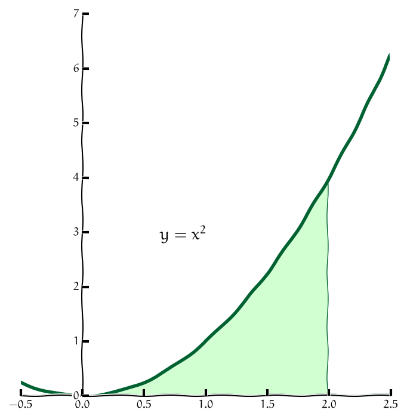

% Dvojný integrál
% Robert Mařík
% 7.5.2019

V praxi pracujeme s řadou veličin, které se počítají tak, že se parametr systému násobí obsahem. 

* Z plošné hustoty a obsahu násobením obdržíme hmotnost. 
* Z hloubky nádrže a obsahu obdržíme násobením objem. 
* Z tlaku a obsahu obdržíme násobením tlakovou sílu. 

Je však otázka, jak tento přístup použít v případě, že daný parametr není po celé ploše na které je rozložen konstantní. Deska může být nehomogenní, nádrž nemusí mít vodorovné dno a ponořená deska nemusí mít všechny své části ve stejné hloubce. 

Řešení této nesnáze je použití dvojného integrálu, který si nyní představíme.

\iffalse

# Motivace 1 (hmotnost nehomogenní desky)

* Hmotnost desky $\Omega$ je možno vypočítat jako součin plošné
  hustoty (hmotnost na jednotku obsahu) a obsahu desky. $$M=\sigma S$$
* Toto funguje pro desky s konstantní plošnou hustotou, kdy má deska
  ve všech místech stejné fyzikální vlastnostmi.
* Pokud je deska slepená z konečného počtu malých homogenních desek o
  různných plošných hustotách, určíme hmotnost každé jednotlivé desky
  samostatně a výsledky potom sečteme.
  $$m=\sigma_1 S_1+\sigma_2 S_2+\cdots + \sigma_n S_n$$
* Pokud není možné nebo vhodné použít předchozí bod, musíme
  předpokládat, že hustota je obecnou funkcí. Potom namísto součtu
  konečného počtu sčítanců následuje nekonečný počet sčítanců a
  vybudujeme aparát, který nám umožní psát
  $$m=\iint_\Omega \sigma \,\mathrm dS.$$

# Motivace 2 (objem vody v jezeře)

* Objem vody $V$ v nádrži nebo bazénu (se svislými stěnami, ale jinak
  i nepravidelného půdorysu $\Omega$) vypočteme jako součin obsahu
  hladiny $S$ a hloubky vody $h$, tj. $$V=Sh$$ To ovšem platí jenom,
  pokud je v každém místě stejná hloubka.
* Pokud má jedna část bazénu jinou hloubku než část druhá, vypočteme
  objem u každé hloubky samostatně a příspěvky sečteme,
  tj. $$V=S_1h_1+S_2h_2.$$
* Předchozí postup je možné aplikovat pro konečně mnoho hloubek, ale
  někdy to je nevhodné nebo, v případě spojitě se měnící hloubky,
  dokonce nemožné. Potom místo součtu konečně mnoha příspěvků
  použijeme dvojný integrál a dostáváme $$V=\iint_\Omega h\mathrm dS.$$

# Motivace 3 (průtok)

* Teče-li průřezem $\Omega$ tekutina kolmo na průřez rychlostí $v$, je
  celkový průtok $Q$ (objem, který proteče průřezem za jednotku času)
  dán součinem $$Q=vS,$$ kde $S$ je plošný obsah průřezu.
* Teče-li různými místy průřezu voda různou rychlostí, sečteme
  jednotlivé příspěvky.  $$Q=v_1S_1+v_2S_2+\dots +v_nS_n$$
* Myšlenku z předchozího bodu není snadné udělat, pokud se rychlost
  mění spojitě. Například v potrubí je rychlost rozdělena parabolicky
  a ubývá se vzdáleností od středu. Situaci zachraňuje dvojný integrál
  $$Q=\iint_\Omega v\,\mathrm dS.$$

\fi

# Dvojný integrál

Uvažujme plošný materiál (desku) s danou plošnou hustotou. Budeme se snažit
vypočítat hmotnost.

* Pokud je deska homogenní, je její (plošná) hustota desky konstantní
  a její hmotnost je možno získat jednoduše jako součin této hustoty a
  obsahu.
* Pokud deska není homogenní, ale skládá se z konečného počtu homogenních kousků, určíme
  postupem z minulého bodu hmotnost každého kousku a tyto hmotnosti
  poté sečteme.
* Zbývá případ, kdy je hustota dána nějakou obecnou funkcí. Pokud se
  hustota desky mění a v\ obecném bodě $(x,y)$ je dána funkcí
  $f(x,y)$, můžeme myšlenkově rozdělit desku na malé kousky, v\ rámci
  každého malého kousku hustotu aproximovat konstantou a postupovat
  jako u desky z konečného počtu (malých) homogenních částí.
* Získaná veličina je aproximací celkové hmotnosti. Pro jemnější
  dělení se přesnost aproximace zlepšuje.

V\ limitním přechodu kdy rozměry všech kousků na něž je deska dělena
jde k\ nule dostáváme **dvojný integrál** 
$$ \iint_\Omega f(x,y)\mathrm{d}x \mathrm{d}y , $$ 
kde $\Omega$ je oblast v\ rovině $(x,y)$ definovaná uvažovanou deskou. V aplikacích je častý též zápis
$$ \iint_\Omega f(x,y)\mathrm{d}A$$ 
nebo 
$$ \iint_\Omega f(x,y)\mathrm{d}S.$$ 

\def\maxfactor{0.3}

\iffalse

\fi

# Linearita a aditivita

Dvojný integrál je odvozen (tak jako všechny integrály) pro aditivní
veličiny a proto se "dobře snáší" se sčítáním (ať už integrovaných
funkcí, nebo integračních oborů) a s násobení integrované funkce
konstantou. Přesněji, platí následující věty.

> Věta (linearita dvojného integrálu).   Buď $f_1$, $f_2$ funkce integrovatelné v $\Omega$ a $c_1$, $c_2$   libovolná reálná čísla. Platí
\dm$$     \iint_{\Omega} \bigl[c_1f_1(x,y)+c_2f_2(x,y)\bigr]\mathrm dx\mathrm dy     =     c_1\iint_{\Omega} f_1(x,y)\mathrm dx\mathrm dy+     c_2\iint_{\Omega} f_2(x,y)\mathrm dx\mathrm dy $$

> Věta (aditivita vzhledem k oboru integrace).  Nechť je množina $\Omega$ rozdělena na dvě oblasti $\Omega_1$   a $\Omega_2$, které mají společné nejvýše hraniční body. Platí $$     \iint_\Omega f(x,y)\mathrm dx\mathrm dy=     \iint_{\Omega_1} f(x,y)\mathrm dx\mathrm dy+     \iint_{\Omega_2} f(x,y)\mathrm dx\mathrm dy. $$

# Výpočet (oblast mezi funkcemi proměnné $x$)

V\ závislosti na tom, jakými nerovnostmi množinu $\Omega$ definujeme,
můžeme pro výpočet dvojného integrálu použít následující věty. Tyto
věty udávají, jak je možno dvojný integrál přepsat jako dvojnásobný
integrál. Mají název **Fubiniovy věty**.

> Věta (Fubiniova věta). Nechť $f$ je funkce spojitá v\ uzavřené oblasti
> $$  
>   \Omega=\{(x,y)\in\mathbb{R}^2:{a\leq x\leq b}\text{ a }
>   {\varphi (x)\leq y\leq \psi (x)}\}.$$ 
> Potom 
> $$
>   \iint_{\Omega}f(x,y)\mathrm{d}x \mathrm{d}y ={\int_{a}^{b}}
>   \Bigl[ \int_{\varphi (x)}^{\psi(x)}   
>   f(x,y){\mathrm{d}y }\Bigr]{\mathrm{d}x }.
> $$

# Výpočet (oblast mezi funkcemi proměnné $y$)

> Věta (Fubiniova věta pro jiné pořadí integrace). Nechť $f$ je funkce spojitá v\ uzavřené oblasti
> $$  \Omega=\{(x,y)\in\mathbb{R}^2:{a\leq y\leq b}\text{ a }
>   {\varphi (y)\leq x\leq
>   \psi (y)}\}.
> $$
> Potom 
> $$
>   \iint_{\Omega}f(x,y)\mathrm{d}x \mathrm{d}y ={\int_a^b}\Bigl[ 
>   {\int_{\varphi (y)}^{\psi(y)}}
>   f(x,y){\mathrm{d}x }\Bigr]{\mathrm{d}y }.
> $$
> 

Často je možné oblast integrace zapsat pomocí obou možností uvedených
na předchozích slidech. Například oblast na obrázku je možno zapsat
buď jako
$$\begin{gathered}
0\leq x \leq 2\\
0\leq y\leq x^2
\end{gathered}$$
nebo
$$\begin{gathered}
0\leq y \leq 4\\
\sqrt{y}\leq x\leq  2.
\end{gathered}$$

Pro integrál funkce $f(x,y)$ přes takovou množinu tedy máme dvě alternativy:
$$\int_0^2 \int _0^{x^2} f(x,y)\;\mathrm{d}y\;\mathrm{d}x$$
a
$$\int_0^4 \int _{\sqrt y}^{2} f(x,y)\;\mathrm{d}x\;\mathrm{d}y.$$

Všimněte si, že nestačí prosté prohození integrálů. Je nutno
přepočítávat meze a hraniční křivky je nutno vyjádřit jednou jako
funkce proměnné $x$ a jednou jako funkce proměnné $y$. V důsledku
tohoto dochází v průběhu výpočtu dvěma různými způsoby k\ tomu, že
pracujeme se dvěma různými integrály. Výsledky jsou stejné, nemusí
však být dosažitelné srovnatelnou námahou, jedna z cest může být
snazší.

# Výpočet (obdélníková oblast)

Výše uvedené problémy se stanovením a případným přepočítáváním mezí
při záměně pořadí integrace se nevyskytují při integrování přes
obdélníkovou oblast.

>   Věta (Fubiniova věta na obdélníku). Nechť $R=[a,b]\times[c,d]$ je uzavřený obdélník v $\mathbb{R}^2$ a
>   $f$ funkce definovaná a spojitá na $R$. Pak platí
>   $$    \begin{aligned}\iint_R f(x,y)\mathrm{d}x \mathrm{d}y 
>     &=
>     \int_a^b\Bigl[\int_c^d f(x,y)\mathrm{d}y \Bigr]\mathrm{d}x 
>     \\&=
>     \int_c^d\Bigl[\int_a^b f(x,y)\mathrm{d}x \Bigr]\mathrm{d}y .\end{aligned}
>   $$
> 
>   Platí-li dokonce rovnost $f(x,y)=g(x)h(y)$, pak
>   $$
>         \iint_R f(x,y)\mathrm{d}x \mathrm{d}y  =     \int_a^b g(x) \mathrm{d}x  \int_c^d h(y)\mathrm{d}y .
>   $$
> 

# Matematické aplikace dvojného integrálu

* **Obsah** $\mu(\Omega)$ množiny $\Omega$ vypočteme jako integrál
    $$\mu(\Omega)=\iint_\Omega \mathrm{d}x \mathrm{d}y.$$
* **Integrální střední hodnota** funkce $f(x,y)$ definované na množině
  $\Omega$ je 
  $$ \frac{\iint_\Omega f(x,y)\mathrm{d}x \mathrm{d}y }{\mu (\Omega)},$$ 
  kde $\mu (\Omega)=\iint_\Omega\mathrm{d}x\mathrm{d}y$ je obsah
  množiny $\Omega$.

  \iffalse

# Objem kopce nebo jezera pomocí vrstevnic

* Obsah množiny ohraničené vrstevnicí na mapě vynásobený rozestupem
mezi vrstevnicemi je přibližně roven objemu vrstvy mezi dvěma
vrstevnicemi.
* Pokud sečteme obsahy všech vrstevnic a vynásobíme rozestupem mezi
těmito vrstevnicemi, dostaneme odhad pro objem kopce. Vlastně je to
jako bychom kopec rozřezali na stejně tlusté plátky, naskládali je
vedle sebe, sečetli obsahy postav takto vzniklých těles a vynásobili
výškou.
* Podobně je možné odhadnout objem jezera.
* V tomto případě je dvojný integrál pouze koncept. Samozřejmě nemáme
ambice vyjadřovat vrstevnice v analytickém tvaru a integrovat pomocí
Fubiniovy věty. Ke slovu přijde spíše numerický výpočet integrálu.

  \fi
  
# Fyzikální aplikace dvojného integrálu

* **Hmotnost** množiny $M$ je $$m=\iint_M \sigma(x,y)\mathrm{d}x
  \mathrm{d}y,$$ kde $\sigma(x,y)$ je **plošná hustota** (hmotnost
  vztažená na jednotku povrchu).
* **Lineární momenty** hmotné množiny $M$ vzhledem k\ osám $y$ a $x$
  jsou rovny $$\iint_M x\sigma(x,y)\mathrm{d}x \mathrm{d}y$$ a
  $$\iint_M y\sigma(x,y)\mathrm{d}x \mathrm{d}y.$$
* **Moment setrvačnosti** hmotné množiny $M$ vzhledem k\ ose je
  $$J=\iint_M \rho^2(x,y)\sigma(x,y)\mathrm{d}x \mathrm{d}y ,$$ kde
  $\rho(x,y)$ je vzdálenost bodu $(x,y)$ od osy otáčení. Například pro
  osu $x$ je $\rho(x,y)=y$ a pro osu $y$ je $\rho (x,y)=x$. Pro osu
  procházející kolmo počátkem je $\rho(x,y)=\sqrt{x^2+y^2}$.

# Techniké aplikace dvojného integrálu

\iffalse

. Zdroj: https://www.taus.eu](I-nosniky.jpg)

\fi

* **Souřadnice těžiště** množiny jsou podílem lineárních momentů a
  celkové hmotnosti množiny.
* **Kvadratický moment průřezu** (což je moment setrvačnosti pro
  $\sigma(x,y)=1$, anglicky *second moment of area*) je veličina,
  která hraje podstatnou roli v\ mechanice (nábytek, stavby) při
  dimenzování (polic, nosných tyčí, nosníků).
* V technické praxi zpravidla neuvažujeme nekonstantní plošnou hustotu. Potom je možné je bez újmy na obecnosti nahradit jedničkou.
  Vzorce pro obsah, $x$-ovou souřadnici těžiště ($x_0$), $y$-ovou
  souřadnici těžiště ($y_0$), kvadratický moment vzhledem k\ ose $x$
  ($I_x$) a kvadratický moment vzhledem k\ ose $y$ ($I_y$) (pro množinu $M$ s plošnou hustotou $1$) jsou
  $$
  \begin{alignedat}{2}
	  %  S&=\iint_M\mathrm{d}x \mathrm{d}y \\
	  x_0&=\frac 1S \iint_M x\mathrm{d}x \mathrm{d}y ,&\qquad    I_x&= \iint_M y^2\mathrm{d}x \mathrm{d}y, \\
	  y_0&=\frac 1S \iint_M y\mathrm{d}x \mathrm{d}y , &    I_y&= \iint_M x^2\mathrm{d}x \mathrm{d}y, \\
  \end{alignedat}
  $$
  kde $S=\mu (M)$ je obsah množiny $M$.
  Poloha těžiště je tedy střední hodnotou funkcí $x$ a $y$.

# Aplikace dvojného integrálu - tuhost nosníků, stabilita stromů

\iffalse

\fi

Tuhost (odolnost vůči deformaci) pro nosník obdélníkového průřezu o výšce $b$ a
šířce $a$ je dána kvadratickým momentem obdélníkového průřezu vzhledem
k vodorovné ose procházející těžištěm. 
$$\begin{aligned}I_x&=
\iint_{\left[-\frac a2,\frac a2\right]\times \left[-\frac b2,\frac b2\right]} y^2\,\mathrm dx\mathrm dy\\
&=
\int_{-\frac a2}^{\frac a2} \,\mathrm dx\int_{-\frac b2}^{\frac b2}
y^2 \,\mathrm dy=
a\left[\frac 13 y^3\right]_{-\frac b2}^{\frac b2}
=\frac 1{12}ab^3
\end{aligned}
$$
Odsud máme okamžitě několik pozorování

* Pokud šířka vzroste dvakrát, tuhost vzroste také dvakrát. Pokud ale
  dvakrát vzroste výška, tuhost vzroste dokonce osmkrát. Pro nosník s
  poměrem stran 1:2 je poměr tuhostí při poloze naplacato a nastojato roven 1:4.
* Pro nosník čtvercového průřezu ($a=b$) roste tuhost se čtvrtou
  mocninou rozměrů. Obsah (a tedy i hmotnost) roste s druhou
  mocninou. Pokud tedy u nosníku se čtvercovým průřezem zdvojnásobíme
  množství materiálu, tuhost vzroste čtyřnásobně. Toto si můžeme představit tak, že jsme původní nosník obalili trubkou vyrobenou ze stejného množství materiálu. Protože společná tuhost je čtyřnásobná, znamená to, že přidaná trubka má trojnásobnou tuhost než původní tyč. Proto se v konstrukcích nepoužívají tyče, ale trubky nebo analogické struktury (I-čka apod). I příroda zná tyto zákonitosti a kosti tvořící opěrný aparát živočichů jsou trubkovitého tvaru. 
* Pro čtvercový průřez roste tuhost se čtvrtou mocninou délky
  strany $$I_x=\frac 1{12} a^4.$$  Stejná závislost (přímá úměrnost mezi kvadratickým momentem a čtvrtou mocninou rozměru) musí být u\ každého průřezu
  jednoparametrického tvaru, například pro kruh. To plyne například z věty nazývané [Buckinghamův $\Pi$ teorém](https://en.wikipedia.org/wiki/Buckingham_%CF%80_theorem). Jako aplikaci uvažujme strom modelovaný jako nosník s\ kruhovým průřezem. Například strom, ve
  kterém je dutina o\ velikosti poloviny průměru kmene většinou vyvolá
  obavy ze stability. I když taková dutina vypadá obrovská, tuhost se
  sníží o\ původní tuhost vynásobenou koeficientem
  $$(0.5)^4=0.0625\approx 6\%.$$ 
  Vidíme, že i s hrozivě vypadající dutinou má kmen pořád tuhost 
  $94\%$ původní tuhosti (za předpokladu dutiny uprostřed
  kmene). Z hlubšího fyzikálního rozboru, který je nyní nad rámec našeho popisu,  pevnost roste jenom s třetí
  mocninou a proto odolnost vůči zlomení klesne o něco více než
  tuhost.

# Aplikace dvojného integrálu - těžiště složeného obrazce

Uvažujme množinu $M$ s jednotkovou plošnou hustotou, rozdělenou na dvě
disjunktní části $M_1$ a $M_2$. Tyto množiny mají $x$-ovou polohu
těžiště v bodě
$$x_{0i}=\frac1{S_i}{\iint_{M_i}x\,\mathrm dx\mathrm dy}, \qquad S_i=\iint_{M_i}\,\mathrm dx\mathrm dy,\qquad i=1,2.$$
Poloha těžiště není aditivní veličinou. Dvojný integrál však aditivní veličinou je. Platí
$$
\begin{aligned}
\iint _{M} x\,\mathrm dx\mathrm dy&=\iint _{M_1} x\,\mathrm dx\mathrm dy + \iint _{M_2} x\,\mathrm dx\mathrm dy\\
&=S_1 x_{01} + S_2 x_{02}
\end{aligned}
$$
a těžiště množiny $M$ je
$$
\begin{aligned}
x_0&=\frac 1{S_1+S_2}\iint _{M} x\,\mathrm dx\mathrm dy\\
&=\frac 1{S_1+S_2}(S_1 x_{01} + S_2 x_{02})\\
&=\frac {S_1 x_{01} + S_2 x_{02}}{S_1+S_2}.
\end{aligned}
$$
Totéž je možné provést pro $y$-ovou souřadnici, nebo pro libovolný
konečný počet částí. Podobně je možné odvodit vzorec s\ obecnou
nekonstantní plošnou hustotou.  Poloha těžiště složeného obrazce je
tedy *váženým průměrem* těžišť jednotlivých složek, kde váha každé
složky je určena její hmotností. Protože se jedná o vážený průměr,
tj. vlastně o lineární kombinaci bodů, kdy součet koeficientů je roven
jedné, okamžitě vidíme, že těžiště složeného obrazce je na úsečce mezi
těžišťmi jednotlivých částí.

Zobecnění výše uvedených myšlenek na množinu rozdělenou na více částí
je již snadné.

# Aplikace dvojného integrálu - Steinerova věta

Nechť je dána množina $M$ s plošnou hustotou $\sigma(x,y)$. *Ukážeme,
že vzhledem k ose procházející těžištěm je nejmenší moment
setrvačnosti.* Ukážeme si dále, že pomocí momentu setrvačnosti
vzhledem k ose procházející těžištěm je možné vyjádřit momenty
setrvačnosti i k libovolným rovnoběžným osám. Pro jednotkovou plošnou
hustotu dostáváme jako speciální případ vzorce pro kvadratický moment,
důležité ve statice.

Nechť $m=\iint \sigma(x,y)\,\mathrm dx\mathrm dy$, $y_0=\frac
1{m}\iint_M y\sigma(x,y)\,\mathrm dx\mathrm dy$ a $I_{xT}=\iint_M
(y-y_0)^2\sigma(x,y)\,\mathrm dx\mathrm dy$ jsou hmotnost, $y$-ová poloha těžiště
a moment setrvačnosti vzhledem k ose jdoucí těžištěm rovnoběžně s osou
$x$. Moment setrvačnosti vhledem k ose  $x$ je
$$I_{x0}=\iint y^2\sigma(x,y)\,\mathrm dx\mathrm dy.$$
Platí (píšeme zkráceně $\sigma$ místo $\sigma(x,y)$)
$$\begin{aligned}
I_{xT}&=\iint_M
(y-y_0)^2\sigma\,\mathrm dx\mathrm dy\\
&=\iint_M
(y^2-2yy_0+y_0^2)\sigma\,\mathrm dx\mathrm dy\\
&=\iint_M
y^2\sigma\,\mathrm dx\mathrm dy
-2y_0
\iint_M
y\sigma\,\mathrm dx\mathrm dy
+y_0^2
\iint_M
\sigma\,\mathrm dx\mathrm dy\\
&=I_{x0}
-2y_0 m y_0
+
y_0^2 m
\\
&=I_{x0}
-m y_0^2.
\end{aligned}
$$
Odsud dostáváme
$$I_{x0}=I_{xT}+my_0^2,$$
což lze interpretovat tak, že *moment setrvačnosti vhledem k ose $o$
je součtem momentu setrvačnosti vzhledem k ose procházející těžištěm rovnoběžně s $o$
a momentu setrvačnosti hmotného bodu ležícího
v těžišti množiny a o stejné hmotnosti jako je hmotnost množiny vzhledem k ose $o$.*

# Aplikace dvojného integrálu - tlak na svislou plochu

\iffalse

\fi

Vzorec pro tlakovou sílu $F=pS$ není možné použít například pro
výpočet celkové síly působící na svislou stěnu nebo hráz, protože tlak $p$ se
mění s hloubkou a není tedy konstantní na celém průřezu o obsahu
$S$. Pro obdélníkovou stěnu jsme úlohu vyřešili (viz [Mojžíšův most](http://user.mendelu.cz/marik/mt/mat-slidy/integraly/index_h.html#aplikace-ur%C4%8Dit%C3%A9ho-integr%C3%A1lu-tlakov%C3%A1-s%C3%ADla)) pomocí integrálu, pro stěnu obecného tvaru použijeme integrál dvojný.

Uvažujme svislou rovinnou hráz $M$. Hrází je přitom myšlena rovinná
množina s jednotkovou plošnou hustotou, ne postavený trojrozměrný
objekt. Počátek kartézské soustavy souřadnic volíme u hladiny, osa $y$
směřuje dolů, osa $x$ vodorovně. Tlak v hloubce $y$ je roven $p=y\rho
g$, kde $\rho$ je hustota vody a $g$ tíhové zrychlení. Na plochu o
rozměrech $\Delta S$ v hloubce $y$ působí tlaková síla
$$\Delta F=y\rho g \Delta S.$$
Tato tlaková síla má ve všech bodech hráze stejný směr a celkovou sílu
na hráz je možno zjistit sečtením sil v jednotlivých bodech. Podobná
myšlenková úvaha jako v úvodu pro hmotnost desky, nebo přesný
matematický popis, nás dovedou k tomu, že celková síla na hráz je dána
integrálem
$$F=\iint _M y\rho g \,\mathrm d x\mathrm dy.$$
Protože $g$ a $\rho$ jsou konstanty, je možno psát
$$F=\rho g\iint _M y \,\mathrm d x\mathrm dy.$$
Využijeme-li vzorec pro $y$-ovou souřadnici těžiště, má výsledný vztah tvar
$$F=\rho g y_0 S,$$
kde $S$ je obsah hráze. Formálně tento vztah odpovídá vzorci
$$F=p_0 S,\tag{H1}\label{H1}$$
kde $p_0=\rho g y_0$ je tlak v těžišti. *Proto v praxi stačí znát těžiště
hráze a pro výpočet síly na hráz použít celkovou plochu hráze a tlak
v\ těžišti.* Protože jsme pracovali s obecnou množinou $M$, není tento
poznatek nijak vázán na konkrétní tvar hráze. Musí být však splněna
podmínka, že všechny body hráze leží v\ jedné rovině.

Ve výpočtu výše jsme uvažovali svislou rovinu, ale zobecnění na šikmou
rovinu je snadné. Stačí opravit vztah pro hloubku, protože když svislou množinu
i s kartézskými souřadnicemi pootočíme okolo osy procházející
hladinou, hloubka všech bodů se sníží faktorem $\sin \alpha$, kde
$\alpha$ je úhel mezi vodorovnou hladinou a rovinou hráze. Formálně
tato operace dopadne stejně, jako kdybychom tekutinu nahradili tekutinou
s hustotou $\sin\alpha$-krát nižší. Protože však vztah $\eqref{H1}$
nezávisí na hustotě, nic se na něm nezmění. Také zobecnění na několik rovin
je snadné. Zobecnění na zakřivenou plochu je náročnější a vyžaduje
jiný typ integrálu.

V předchozím textu jsme proměnnou veličinu popisující tlak na hráz
jako funkci hloubky nahradili konstantní veličinou, udávající tlak v
těžišti. Výsledný účinek na hráz se nezměnil. To je přesně smysl
střední hodnoty. V matematických pojmech je možno říci, že střední
hodnota tlaku na svislou hráz je rovna tlaku v těžišti hráze. (Protože
hrází myslíme spíše rovinnou plochu, tak by přesnější terminologie
měla používat raději pojem geometrický střed. Budeme se však držet
ustálené terminologie.)

Nikde ve výpočtu jsme nepoužili konkrétní meze pro integraci. Výsledek
tedy platí nejenom pro hráz dosahující k hladině, ale například i pro
poklop výpusti, který je celý pod vodou.

# Aplikace dvojného integrálu - působiště tlakové síly

Budeme pokračovat v předchozím příkladě a hledat působiště výsledné
tlakové síly.

Tlaková síla působící na svislou hráz má celkový nulový moment
vzhledem k ose proházející působištěm. Je-li hráz definována množinou
$M$ a je-li $y_c$ působiště výsledné tlakové síly, je v hloubce $y$
tlak na plošku o velikosti $\Delta S$ roven $y\rho g \Delta S$ a
součin $(y_c-y)y\rho g\Delta S$ je příspěvek k\ otáčivému momentu
vzhledem k\ ose, procházející vodorovně působištěm tlakové
síly. Součet všech těchto příspěvků se nuluje, tedy musí platit
$$\iint_M (y_c-y)y\rho g\,\mathrm dx\mathrm dy=0.$$
Odsud po vydělení konstantami $\rho g$ dostáváme
$$\iint_M (y_c-y)y\,\mathrm dx\mathrm dy=0$$
a po roznásobení závorky, rozdělení integrálu na dva a vytknutí konstanty
$$y_c\iint_M y\,\mathrm dx\mathrm dy = \iint_M y^2\,\mathrm dx\mathrm dy.$$
Nyní již snadno dostaneme výsledný vztah
$$y_c=\frac{\iint_M y^2\,\mathrm dx\mathrm dy}{\iint_M y\,\mathrm dx\mathrm dy}.\tag{H2}\label{H2}$$
Pokud je množina $M$ obdélník, je možné ji (po vhodné změně jednotek) brát jako jednotkový čtverec. Protože platí
$$\iint_{[0,1]\times [0,1]}y\,\mathrm dx\mathrm dy=\frac 12, \quad
\iint_{[0,1]\times [0,1]}y^2\,\mathrm dx\mathrm dy=\frac 13,
$$
dostáváme $y_c=\frac{\frac 13}{\frac 12}=\frac 23$
a působiště na obdélníkovou hráz je v hloubce odpovídající dvěma třetinám celkové hloubky.

Formálně vztah pro $y_c$ odpovídá vztahu pro těžiště množiny s plošnou
hustotou $y$. Na tomto pozorování a na skutečnosti, že u pravidelných
množin umíme těžiště najít geometricky, je založena metoda nalezení
působiště tlakové síly pomocí [zatěžovacího obrazce](https://en.wikipedia.org/wiki/Pressure_prism).

Kvadratický moment v čitateli zlomku $\eqref{H2}$ vyjadřujícího $y_c$ je často
výhodnější rozepsat pomocí Steinerovy věty. Ve jmenovateli je součin
obsahu $S$ a $y$-ové souřadnice těžiště $y_0$. Tím dostaneme
$$y_c=\frac{I_{x0}+Sy_0^2}{Sy_0}=\frac{I_{x0}}{Sy_0}+y_0,$$
kde $I_{x0}$ je kvadratický moment vzhledem k ose procházející vodorovně těžištěm.
Působiště tlakové síly $y_c$ je tedy posunuto směrem dolů od těžiště
$y_0$ o hodnotu odpovídající kvadratickému momentu vzhledem k
vodorovné ose těžištěm $I_{x0}$ vyděleném součinem obsahu hráze $S$ a
$y$-ové polohy těžiště $y_0$.

