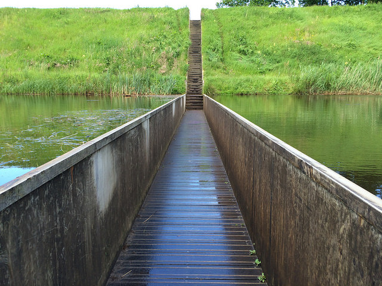

% Integrál na třetí
% Robert Mařík
% 2019

Naučili jsme se pracovat s derivacemi, tedy s rychlostí změny.
Známe-li funkci a zderivujeme ji, dostanem rychlost změny. Pokud potom
původní funkci "ztratíme" a zůstane nám jenom derivace, je otázka,
jestli dokážeme původní funkci najít z derivace. Odpověď je zní "v
jistém smyslu ano". Spojení "v jistém smyslu" naznačuje, že souvilost
nebude tak snadná jako je souvilost u navzájem inverzních
funkcí. Derivováním totiž můžeme ztratit aditivní konstanty, které v
derivaci dávají nulu a zpětně není možné rekosntruovat, derivováním
jaké konstanty jsme tuto nulu dostaly. A protože problém uchopíme
poněkud obecněji, uvedeme si dokonce hned tři různé "protijedy" na
derivování.

Jeden je představíme jako opak derivace (neurčitý integrál), druhý
jako změnu funkce vypočtenou ze zadané rychlosti změn (Newtonův určitý
integrál) a třetí jako náhradu součtu pro případ, kdy potřebujeme
sčítat nekonečně mnoho příspěvků, z nichž každý má v podstatě nulovou
hodnotu (Riemannův integrál).

Intervalem $I$ budeme rozumět otevřený interval.

# Motivace:  Jak z rychlosti změny vypočítat změnu?

Derivace umožní z veličiny v prvním sloupci získat veličinu v
pravém sloupci. Pohledem na tyto příklady věříme, že bude fungovat i
něco, co naopak z rychlosti zrekonstruje původní veličinu, která se
touto rychlostí mění.

Závislá proměnná|Nezávislá proměnná|Derivace|
|------------------------|-----------------------|------------------------|
|veličina $x$|čas|rychlost růstu veličiny $x$|
|výška stromu|čas|rychlost růstu do výšky|
|objem kmene stromu (smrk)|čas|rychlost růstu ve smyslu přírůstu dřevní hmoty|
|dráha při pohybu při pohybu po přímce i vzdálenost od referečního bodu|čas doba od začátku pohybu nebo od referečního okamžiku|rychlost|
|rychlost|čas|zrychlení|
|teplota v místě tyče (např. stěna, což je v podstatě extrémně krátká a široká tyč)|poloha|gradient teploty, veličina udávající intenzitu toku tepla tyčí resp. stěnou|
|hmotnost části tyče (např od zvoleného bodu doleva)|poloha na tyči (např. vzdálenost od levého konce)|lineární hustota tyče|
|všeobecná cenová hladina (cca náklady na živobytí)|čas|inflace|
|nadmořská výška na trase treku|poloha|stoupání trasy|
|graf funkce $f(x)$|$x$|růst grafu (směrnice tečny)|

# Motivace: Jak z vlastnosti křivky získat celou křivku

Na této úloze si připomenem další roli derivace (směrnice tečny) a
představíme si úžasný druh mostů -- mosty zavěšené na nosných lanech,
které mohou překlenout neuvěřitelně dlouhou vzdálenost v porovnání s
jinými konstrukcemi mostů.

U zavěšeného mostu lano nese hmotnost rovnoměrně rozloženou ve
vodorovném směru. Je potřeba zvolit vhodnou délku svislých lan tak, aby
síla působící na nosné lano byla vždy ve směru tohoto lana. Potom
je systém nejstabilnější. 

Díky symetrii stačí uvažovat jenom půlku lana. Na část lana nad
intervalem $[0,x]$ působí následující síly.

* Tahová síla lana v minimu ($x=0$) o velikosti $T$ doleva.
* Gravitační síla o velikosti $\mu x g$ směrem dolů, kde $\mu$ je
  lineární hustota (hmotnost jednotkové délky mostu) a $\mu x$ je
  hmotnost části mostu, odpovdající intervalu $[0,x]$.
* Tahová síla doprava nahoru na pravém konci. Její velikost a směr
  jsou takové, aby součet všech sil působících na uvažovaný element
  byl roven nule. Chceme, aby v tomto bodě směr síly určoval směr
  lana, tj. aby síla byla tečná k nosnému lanu.
  
Všechny tři síly tedy tvoří pravoúhlý trojúhelník (protože vektorový
součet má být nulový) a poměr odvěsen $\frac{\mu g x}{T}$ udává
směrnici přepony. Křivka udávájící směr nosného lana tedy musí mít
tvar funkce, která splňuje $$y'=\frac{\mu g}{T} x,$$ kde $\mu$, $g$, a
$T$ jsou pro danou úlohu konstanty.

# Neurčitý integrál

Představíme se nástroj, který nám umožní odpovědět na následujíí otázky.

* Je znám směr křivky v každém bodě (tj. směr tečny, derivace). Jaká
je rovnice křivky?
* Je známa rychlost, s jakou se mění veličina $f$. Jaká je rovnice
uvávající závislost veličiny $f$ na čase?

> Definice (neurčitý integrál). Řekneme, že funkce $F$ je *primitivní funkcí* k funki $f$ na intervalu $I$, jestliže platí $$F'(x)=f(x)$$ na intervalu $I$. Množina všech primitivních funkcí k funkci $f$ se nazývá *neurčitý integrál* funkce $f$ a značí $$\int f(x)\,\mathrm dx.$$

Otázkou existence primitivní funkce se budeme zabývat na další
přednášce. Otázku (ne-)jednoznačnosti řeší následující věta.

> Věta (jednoznačnost primitivní funkce). Primitivní funkce je dána jednoznačně, až na aditivní konstantu.
>
> * Je-li $F$ primitivní funkcí k funkci $f$ na intervalu $I$,
>    platí totéž i pro funkci $G(x)=F(x)+c$, kde $c\in\mathbb R$.
> * Jsou-li $F$ a $G$ primitivní funkce k téže funkci $f$ na
>    intervalu $I$, existuje $c\in\mathbb R$ takové, že
>    $$     F(x)=G(x)+c $$ na $I$.

**Příklad.** Funkce $x^2$ má primitivní funkce například $\frac 13 x^3$, nebo $\frac 13 x^3+7$,  nebo $\frac 13 x^3+\pi$, protože derivace všech těchto tří funkcí je $x^2$. Platí $$\int x^2 \,\mathrm dx=\frac 13 x^3+c,\qquad c\in\mathbb R.$$

**Vzorce.**

> Věta (linearita neurčitého integrálu). Neurčitý integrál zachovává součet a násobení konstantou. Tedy pro libovolné funkce $f$, $g$ a libovolnou konstantu $c$ platí $$
\begin{aligned}
  \int f+g\,\mathrm dx&=\int f\,\mathrm dx + \int g\,\mathrm dx,\\
  \int cf\,\mathrm dx&=c\int f\,\mathrm dx.
\end{aligned}
$$

# Aplikace neurčitého integrálu

**Příklad.** Teplota klesá rychlostí $\frac{\mathrm dT}{\mathrm dt}=-0.1 e^{-0.01 t} \,{}^\circ \mathrm C/\mathrm{min}.$ Teplota jako funkce času je dána integrálem
$$T=\int - 0.1 e^{-0.01t} \,\mathrm dt=10 e^{-0.01t}+C.$$ Hodnota $C$ souvisí s počáteční teplotou. Například pro $T=28 ^\circ \mathrm{C}$ v čase $t=0$ určíme $C$ z podmínky $$28=10 e^0 +C,$$ tj. $C=18 ^\circ \mathrm C$. Funkce udávající v takovém případě závislost teploty místnosti na čase je tedy $$T=\left(18+10 e^{-0.01 t}\right)\,{}^\circ \mathrm C.$$

**Příklad.** Na jednom z předchozích slidů jsme viděli, že křivka,
která je přirozená pro nosné lano zavěšeného mostu splňuje
rovnici $$y'=\frac{\mu g}{T}x.$$ Pouze za této podmínky bude lano
namáháno ve směru své nejvyšší pevnosti, tj. v podélném směru, ve
směru své osy. Integrací získáme
$$y=\int \frac{\mu g}{T}x\,\mathrm dx=\frac{\mu g}{2T }x^2+C.$$
Lano tedy bude namáháno pouze v podélném tedy směru pokud má tvar
paraboly. Prohnutí paraboly je dáno hmotností mostu a tahem
napínajícím lano.

# Určitý integrál (Newtonův)

Odvodíme mírnou modifikaci neurčitého integrálu. Rychlost změny
nebudeme používat k hledání předpisu funkce, ale budeme hledat změnu
funkce na zadaném intervalu.

> Definice (Newtonův určitý integrál). Buď $f$ funkce a $F$ její primitivní funkce na intervalu $I$. Buď $[a,b]\subset I$ podinterval v $I$. Určitým integrálem funkce $f$ na intervalu $[a,b]$ rozumíme veličinu označenou a definou vztahem
$$\int_a^b f(x)\mathrm dx:=F(b)-F(a).$$

**Označení.** Výraz $F(b)-F(a)$, tj. změnu funkce $F(x)$ na intervalu $[a,b]$, označujeme také $[F(x)]_a^b$. Tento zápis se často používá jako mezivýpočet při výpočtu určitého integrálu.
$$\int_0^1 x^2 \,\mathrm dx=\left[\frac 13 x^3\right]_0^1=\frac 13 (1)^3 -\frac 13 (0)^3=\frac 13$$

> Věta (linearita určitého integrálu). Určitý integrál zachovává součet a násobení konstantou. Tedy pro libovolné funkce $f$, $g$ a libovolnou konstantu $c$ platí $$
\begin{aligned}
  \int_a^b f+g\,\mathrm dx&=\int_a^b f\,\mathrm dx + \int_a^b g\,\mathrm dx,\\
  \int_a^b cf\,\mathrm dx&=c\int_a^b f\,\mathrm dx.
\end{aligned}
$$

Snadným důsledkem definice určitého integrálu je následující věta.

> Věta (záměna mezí a rovnost mezí v určitém integrálu). Platí $$
\begin{aligned}
  \int _a^a f(x)\,\mathrm dx&=0,\\
  \int _a^b f(x)\,\mathrm dx&=-  \int _b^a f(x)\,\mathrm dx.
\end{aligned}
$$

# Aplikace určitého integrálu

**Příklad.** Teplota klesá rychlostí $\frac{\mathrm dT}{\mathrm dt}=-0.1 e^{-0.01 t} \,{}^\circ \mathrm C/\mathrm{min}.$ Neurčitý integrál 
$$\int - 0.1 e^{-0.01t} \,\mathrm dt=10 e^{-0.01t}+C$$ jsme vypočítali v podkapitole s neurčitým integrálem.
Za první hodinu bude změna teploty
$$\int_0^{60} - 0.1 e^{-0.01t} \,\mathrm dt=\left[10 e^{-0.01t}\right]_0^{60}=
10 e^{-0.01\cdot 60} - 10 e^{-0.01\cdot 0}\approx  -4.5 ^\circ \mathrm C.
$$
Za druhou hodinu bude změna teploty
$$\int_{60}^{120} - 0.1 e^{-0.01t} \,\mathrm dt=\left[10 e^{-0.01t}\right]_{60}^{120}=
10 e^{-0.01\cdot 120} - 10 e^{-0.01\cdot 60}\approx  -2.5 ^\circ \mathrm C.
$$

[Online výpočet.](https://sagecell.sagemath.org/?z=eJwrSyzSUC9R1-TlStMo0VSwVdA10DNU0FJIrSjQADINDLVKgHIFRZl5JQpAnJpelFiSqgFSq6NRomOgY2agiUfezEDH0AioAgB6XhvR&lang=sage)

# Určitý integrál (Riemannův)

# Aplikace určitého integrálu (dráha)

1. Těleso pohybující se po dobu $\Delta t$ konstantní rychlostí $v$ po přímce  urazí dráhu $$s=v\Delta t.$$
1. Těleso pohybující se po dobu $\Delta t_1$ konstantní rychlostí $v_1$ po přímce a poté po dobu $\Delta t_2$ rychlostí $v_2$ urazí celkovou dráhu $$s=v_1\Delta t_1+v_2\Delta t_2.$$ Toto je možné zobecnit na libovolný pohyb skládající se z konečného počtu úseků, kdy se těleso pohybuje konstantní rychlostí.
$$s=v_1\Delta t_1+v_2\Delta t_2+\cdots v_k t_k=\sum_{i=1}^k v_i\Delta t_i$$
Příspěvek za každou část pohybu, kdy je rychlost konstantní, je $$\Delta s=v\Delta, $$ kde $v$ a $\Delta t$ jsou příslušná rychlost a doba pohybu, po kterou je rychlost konstantní.
1. Pokud se rychlost mění spojitě a $a$ a $b$ jsou počáteční a koncový okamžik pohybu $$s=\int_a^b v(t)\,\mathrm dt.$$

# Aplikace určitého integrálu (tlaková síla)

Mojžíšův most (Holandsko, pevnost Fort de Roovere) je v celosvětovém
měřítku unikátním mostem. Je postavený ze dřeva a zanořený do vodního
příkopu okolo pevnosti tak, aby splýval s krajinou. Představme si
zjednodušeně, že vodní masu drží svislá dřevěná stěna a budeme se
snažit najít celkovou sílu. (Ve skutečnosti most leží na dně a dno
se zvedá směrem ke stěnám mostu. Google umí najít stavební plán mostu.) Délku mostu označíme $L$, výšku stěny (přesněji vzdálenost ode dna po hladinu vody) označíme $H$.

1. Tlaková síla na rovinnou plochu o obsahu $S$ vyvolaná tlakem $p$ je rovna $$F=pS.$$ Tlak v hloubce $h$ je dán vzorcem $$p=h\rho g,$$
kde $\rho$ je hustota vody a $g$ tíhové zychlení.
1. Myšlenkově rozdělíme celou stěnu na části. Tlaková síla na celou
stěnu je rovna součtu tlakových sil, které působí na jednotlivé části. Má smysl
volit části tak, aby na nich byl tlak konstantní. Myšlenkově tedy stěnu
rozřežeme na vodorovné pásky.
2. Na myšlený vodorovný pás, který má výšku $\Delta x$ a je v hloubce $x$, působí tlak $p=x\rho g$. Obsah pásu je podle vzorce pro obsah obdélníka $\Delta S=L\Delta x$. Celková síla působící na tento pás je $$\Delta F=p\Delta S=L\rho g x\Delta x.$$
3. Celkovou sílu na celou stěnu najedme sečtením všech příspěvků. Formálně $$F=\sum L\rho g x\Delta x.$$ Protože těchto příspěvků je nekonečně mnoho, sečteme je integrálem
$$F=\int_0^H L\rho gx\,\mathrm dx.$$
4. Po výpočtu dostáváme
$$F=\int_0^H L\rho gx\,\mathrm dx=L\rho g\int_0^H x\,\mathrm dx
=L\rho g \left[\frac 12 x^2\right]_0^H=L\rho g \left[\frac 12 H^2-\frac 12 0^2\right]=\frac 12 LH^2 \rho g.
$$
Formálně je tento vztah stejný, jako kdyby na celou plochu o
velikosti $LH$ působila tlaková síla vyvolaná tlakem
$\frac 12 H\rho g$, tj. tlakem v poloviční hloubce.

# Aplikace určitého integrálu (práce při čerpání vody)

Pokud potřebujeme vyčerpat vodu z rezervoáru, musíme ji dopravit za
stěnu. Představme si, že po opadnutí vody v okolí Mojžíšova mostu
zůstane uvnitř voda o výšce hladiny, kterou je potřeba vyčerpat. Tím
se most proměnil v nádrž o hloubce $H$. Povrch hladiny ve chvíli, kdy
je voda $x$ jednotek délky pod okrajem mostu označme $S$. (Pro nádrž
ve tvaru kvádru by $S$ bylo konstantní a rovno obsahu dna.)

1. Pro vyvednutí tělesa o hmotnosti $m$ o výšku $h$ musíme vykonat
práci $W=mgh,$ abychom vykompenzovali nárůst potenciální energie.
2. Vodu v nádrži rozdělíme na vodorovné vrstvy o výšce $\Delta
x$. Hmotnost vrstvy o výšce $\Delta x$ v hloubce $x$ pod okrajem
nádrže každé vrstvy tedy bude $\Delta m=S\Delta x\rho$ a abychom vodu
dostali přes okraj, musíme vykonat práci
$$\Delta W=\Delta m gx=S\Delta x\rho gx.$$
3. Celková práce na vyčerpání vody se vypočte jako součet jednotlivých
příspěvků, tedy pro spojitě se měnící veličinu integrálem
$$W=\int_0^H S\rho gx \,\mathrm dx=\rho g\int_0^H Sx \,\mathrm dx.$$
4. Pro nádrže ve tvaru kvádru by
veličina $S$ byla konstantní a integrál by vycházel
$$W=S\rho g\int_0^H x\,\mathrm dx=S\rho g\frac 12 H^2=(SH\rho)\frac 12
H.$$ Výraz $SH\rho$ je celková hmotnost a práce je tedy stejná, jako
kdybychom těleso o stejné hmotnosti jako je hmotnost vodní masy zvedli
z poloviční hlouky pod hladinou na úroveň hladiny. Je to stejná práce,
jakou bychom vykonali, kdyby všechna voda byla stlačena v těžišti a my
bychom tuto vodu zvedli na úroveň okraje nádrže.
