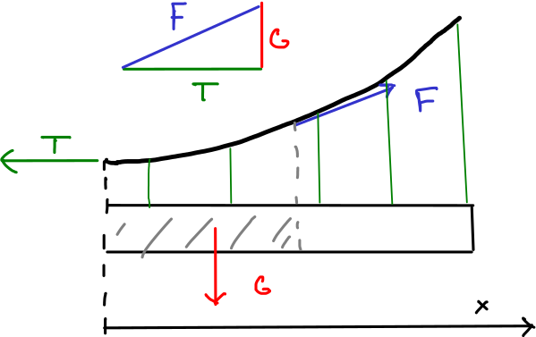

% Integrál, integrál a integrál
% Robert Mařík
% 12. 3. 2019

Naučili jsme se pracovat s derivacemi, tedy s rychlostí změny.
Známe-li funkci a zderivujeme ji, dostaneme rychlost změny. Pokud potom
původní funkci "ztratíme" a zůstane nám jenom derivace, je otázka,
jestli dokážeme původní funkci z této derivace najít. Odpověď je zní, že v
jistém smyslu ano. Spojení "v jistém smyslu" naznačuje, že souvislost
nebude tak snadná jako je souvislost u navzájem inverzních
funkcí. Derivováním totiž můžeme ztratit aditivní konstanty, které v
derivaci dávají nulu a zpětně není možné rekonstruovat, derivováním
jaké konstanty jsme tuto nulu dostaly. A protože problém uchopíme
poněkud obecněji, uvedeme si dokonce hned tři různé "protijedy" na
derivování.

Jeden představíme jako opak derivace (**neurčitý integrál**), druhý
jako změnu funkce vypočtenou ze zadané rychlosti změny (**Newtonův určitý
integrál**) a třetí jako náhradu součtu pro případ, kdy potřebujeme
sčítat nekonečně mnoho příspěvků, z nichž každý má v podstatě nulovou
hodnotu (**Riemannův určitý integrál**).

Intervalem $I$ budeme rozumět otevřený interval.

\iffalse 

# Motivace:  Jak z rychlosti změny vypočítat změnu?

Derivace umožní z veličiny v prvním sloupci získat veličinu v
pravém sloupci. Pohledem na tyto příklady věříme, že bude fungovat i
něco, co naopak z rychlosti zrekonstruuje původní veličinu, která se
touto rychlostí mění.

Závislá proměnná|Derivace podle času|
|------------------------|------------------------|
|veličina $x$|rychlost růstu veličiny $x$|
|výška stromu|rychlost růstu do výšky|
|objem kmene stromu (smrk)|rychlost růstu ve smyslu přírůstu dřevní hmoty|
|dráha|rychlost|
|rychlost|zrychlení|
|všeobecná cenová hladina (cca náklady na živobytí)|inflace|

\fi

# Motivace: Jak z derivace křivky získat rovnici křivky?

Na této úloze si připomeneme další roli derivace (směrnice tečny) a
představíme si úžasný druh mostů – mosty zavěšené na nosných lanech,
které mohou překlenout obrovské vzdálenosti.

U zavěšeného mostu lano nese prostřednictvím svislých lan hmotnost
rovnoměrně rozloženou ve vodorovném směru. Je potřeba zvolit vhodnou
délku svislých lan tak, aby síla působící na nosné lano byla vždy ve
směru tohoto nosného lana. Potom je systém nejstabilnější a nejpevnější.

Díky symetrii stačí uvažovat jenom půlku mostu. Na část lana nad
intervalem $[0,x]$ působí následující síly.

* Tahová síla lana v minimu ($x=0$) o velikosti $T$ doleva.
* Gravitační síla o velikosti $G=\mu x g$ směrem dolů, kde $\mu$ je
  lineární hustota (hmotnost jednotkové délky mostu) a $\mu x$ je
  hmotnost části mostu, odpovídající intervalu $[0,x]$.
* Tahová síla $F$ doprava nahoru na pravém konci. Protože je most v
  klidu, velikost a směr této síly jsou takové, aby součet všech sil
  působících na uvažovanou část mostu byl roven nule. Jako stavitelé mostu
  chceme, aby směr síly souhlasil se směrem lana, tj. aby síla byla
  tečná k nosnému lanu.
  
Vektorový součet sil musí být nulový a proto všechny tři síly tvoří
pravoúhlý trojúhelník. Poměr odvěsen $\frac{\mu g x}{T}$ udává
směrnici přepony. Křivka udávající směr nosného lana tedy musí mít
tvar funkce, která splňuje $$y'=\frac{\mu g}{T} x,$$ kde $\mu$, $g$, a
$T$ jsou pro danou úlohu konstanty.

Z rozboru vidíme, že máme dánu křivku danou pomocí derivace a tuto
křivku musíme najít. Formálně to je stejný problém, jako když máme
rychlost změny funkce a chceme najít časový průběh této
funkce. Mechanickým modelem může být například pohyb zadanou rychlostí
a úloha určit dráhu tohoto pohybu. Tento problém se na základní škole
redukuje na případ pohybu konstantní rychlostí ($s=vt$) a na střední
škole rozšiřuje na rychlost, která se mění jako lineární funkce
($s=\frac 12 at^2$). Nyní stojíme před úkolem, jak si poradit v
případě obecné rychlosti, měnící se libovolně. Přesně to je úkol pro
neurčitý integrál.

# Neurčitý integrál

Představíme nástroj, který nám umožní odpovědět na následující otázky.

* Je znám směr křivky v každém bodě (tj. směr tečny, derivace). Jaká
je rovnice křivky?
* Je známa rychlost, s jakou se mění veličina $f$. Jaká je rovnice
udávající závislost veličiny $f$ na čase?

> Definice (neurčitý integrál). Řekneme, že funkce $F$ je *primitivní funkcí* k funkci $f$ na intervalu $I$, jestliže platí $$F'(x)=f(x)$$ na intervalu $I$. Množina všech primitivních funkcí k funkci $f$ se nazývá *neurčitý integrál* funkce $f$ a značí $$\int f(x)\,\mathrm dx.$$

Otázkou existence primitivní funkce se budeme zabývat na další
přednášce. Otázku (ne-)jednoznačnosti řeší následující věta.

> Věta (jednoznačnost primitivní funkce). Primitivní funkce je dána jednoznačně, až na aditivní konstantu.
>
> * Je-li $F$ primitivní funkcí k funkci $f$ na intervalu $I$,
>    platí totéž i pro funkci $G(x)=F(x)+c$, kde $c\in\mathbb R$.
> * Jsou-li $F$ a $G$ primitivní funkce k téže funkci $f$ na
>    intervalu $I$, existuje $c\in\mathbb R$ takové, že
>    $$     F(x)=G(x)+c $$ na $I$.

**Příklad.** Funkce $x^2$ má primitivní funkce například $\frac 13 x^3$, nebo $\frac 13 x^3+7$,  nebo $\frac 13 x^3+\pi$, protože derivace všech těchto tří funkcí je $x^2$. Platí $$\int x^2 \,\mathrm dx=\frac 13 x^3+c,\qquad c\in\mathbb R.$$

**Vzorce.** 

1. $\int c\,\mathrm dx=cx+C$
1. $\int  x^n\,\mathrm dx= \frac{x^{n+1}}{n+1}+C$
1. $\int  \frac 1x\,\mathrm dx=\ln |x|+C$
1. $\int  e^x\,\mathrm dx=e^x+C$
1. $\int  \sin x\,\mathrm dx=-\cos x+C$
1. $\int  \cos x\,\mathrm dx=\sin x+C$
1. $\int  \frac 1{\cos^2 x}\,\mathrm dx=\mathop{\mathrm{tg}} x+C$
1. $\int  \frac 1{\sin^2 x}\,\mathrm dx=-\mathop{\mathrm{cotg}} x+C$
1. $\int  \frac 1{A^2+x^2}\,\mathrm dx=\frac 1A \mathrm{\mathrm {arctg}} \frac xA+C$
1. $\int  \frac1{\sqrt{A^2-x^2}}\,\mathrm dx=\arcsin\frac xA+C$
1. $\int  f(ax+b)\,\mathrm dx=\frac 1a F(ax+b)+C$, kde $F(x)=\int f(x)\,\mathrm dx$

> Věta (linearita neurčitého integrálu). Neurčitý integrál zachovává součet a násobení konstantou. Tedy pro libovolné funkce $f$, $g$ a libovolnou konstantu $c$ platí $$
\begin{aligned}
  \int f+g\,\mathrm dx&=\int f\,\mathrm dx + \int g\,\mathrm dx,\\
  \int cf\,\mathrm dx&=c\int f\,\mathrm dx.
\end{aligned}
$$

**Příklad.**

$$\int 2x^4-e^{4x}+\frac 1x\,\mathrm dx=\frac 25 x^5 -\frac 14 e^{4x}+\ln |x|+C$$

# Aplikace neurčitého integrálu

**Příklad.** Teplota klesá rychlostí $\frac{\mathrm dT}{\mathrm
dt}=-0.1 e^{-0.01 t} \,{}^\circ \mathrm C/\mathrm{min}.$ Teplota jako
funkce času je dána integrálem $$T=\int - 0.1 e^{-0.01t} \,\mathrm
dt=10 e^{-0.01t}+C.$$ Hodnota $C$ souvisí s počáteční teplotou. Je-li
například počáteční teplota $28 ^\circ \mathrm{C}$, dosadíme do vztahu
pro $T$ hodnoty $T=28 ^\circ \mathrm{C}$ a $t=0$ a ze vzniklé rovnice
určíme $C$. Dostáváme takto podmínku $$28=10 e^0 +C,$$ která implikuje
$C=18 ^\circ \mathrm C$. Funkce udávající závislost
teploty místnosti na čase je $$T=\left(18+10 e^{-0.01
t}\right)\,{}^\circ \mathrm C.$$

**Příklad.** Na jednom z předchozích slidů jsme viděli, že křivka,
která je přirozená pro nosné lano zavěšeného mostu, splňuje rovnici
$$y'=\frac{\mu g}{T}x.$$ Pouze za této podmínky bude lano namáháno ve
směru své nejvyšší pevnosti, tj. v podélném směru, ve směru své
osy. Integrací získáme $$y=\int \frac{\mu g}{T}x\,\mathrm dx=\frac{\mu
g}{2T }x^2+C.$$ Lano tedy bude v každém bodě namáháno ve směru své osy
pokud má tvar paraboly. Prohnutí paraboly (koeficient u $x^2$) je dáno
hmotností mostu a tahem napínajícím lano.

# Určitý integrál (Newtonův)

Představíme si mírnou modifikaci neurčitého integrálu. Rychlost změny
nebudeme používat k hledání předpisu funkce, ale budeme hledat změnu
funkce na zadaném intervalu.

> Definice (Newtonův určitý integrál). Buď $f$ funkce a $F$ její
primitivní funkce na intervalu $I$. Buď $[a,b]\subset I$ podinterval v
$I$. *Určitým integrálem funkce $f$ na intervalu $[a,b]$* rozumíme
veličinu označenou a definovanou vztahem $$\int_a^b f(x)\mathrm
dx:=F(b)-F(a).$$

**Označení.** Výraz $F(b)-F(a)$, tj. změnu funkce $F(x)$ na intervalu
$[a,b]$, označujeme také $[F(x)]_a^b$. Tento zápis se často používá
jako mezivýpočet při výpočtu určitého integrálu.
$$\int_0^1 x^2 \,\mathrm dx=\left[\frac 13 x^3\right]_0^1=\frac 13 (1)^3 -\frac 13 (0)^3=\frac 13$$

> Věta (linearita určitého integrálu). Určitý integrál zachovává
> součet a násobení konstantou. Tedy pro libovolné funkce $f$, $g$ a
> libovolnou konstantu $c$ platí $$
\begin{aligned}
  \int_a^b f+g\,\mathrm dx&=\int_a^b f\,\mathrm dx + \int_a^b g\,\mathrm dx,\\
  \int_a^b cf\,\mathrm dx&=c\int_a^b f\,\mathrm dx.
\end{aligned}
$$

Snadným důsledkem definice určitého integrálu je následující věta.

> Věta (záměna mezí a rovnost mezí v určitém integrálu). Platí $$
\begin{aligned}
  \int _a^a f(x)\,\mathrm dx&=0,\\
  \int _a^b f(x)\,\mathrm dx&=-  \int _b^a f(x)\,\mathrm dx.
\end{aligned}
$$

# Aplikace určitého integrálu (změna teploty)

**Příklad.** Teplota klesá rychlostí
$\frac{\mathrm dT}{\mathrm dt}=-0.1 e^{-0.01 t} \,{}^\circ \mathrm
C/\mathrm{min}.$ Neurčitý integrál
$$\int - 0.1 e^{-0.01t} \,\mathrm dt=10 e^{-0.01t}+C$$
jsme vypočítali v podkapitole s neurčitým integrálem. Potřebovali jsme
ještě znát počáteční hodnotu teploty a našli jsme teplotu jako funkci
času.

Nyní zapojíme určitý integrál. Nepotřebujeme informaci o počáteční
teplotě, ale zato jsme schopni určit jenom změnu teploty za daný
časový interval. Například za první hodinu bude změna teploty
\dm$$\int_0^{60} - 0.1 e^{-0.01t} \,\mathrm dt=\left[10 e^{-0.01t}\right]_0^{60}= 10 e^{-0.01\cdot 60} - 10 e^{-0.01\cdot 0}\approx  -4.5 ^\circ \mathrm C.$$
Za druhou hodinu bude změna teploty
\dm$$\int_{60}^{120} - 0.1 e^{-0.01t} \,\mathrm dt=\left[10 e^{-0.01t}\right]_{60}^{120}= 10 e^{-0.01\cdot 120} - 10 e^{-0.01\cdot 60}\approx  -2.5 ^\circ \mathrm C. $$

[Online výpočet.](https://sagecell.sagemath.org/?z=eJwrSyzSUC9R1-TlStMo0VSwVdA10DNU0FJIrSjQADINDLVKgHIFRZl5JQpAnJpelFiSqgFSq6NRomOgY2agiUfezEDH0AioAgB6XhvR&lang=sage)

# Další motivace

Ze středoškolské fyziky dobře známe vzorce pro dráhu, práci a tlakovou
sílu. Ovšem jenom v extrémně pěkných případech.

* Dráha rovnoměrného pohybu je určena vzorcem $$s=vt.\tag{1}$$ Tento
  vzorec není použitelný pro pohyb proměnnou rychlostí. Z kapitoly o
  neurčitém interálu víme, že obecný vzorec je $$s=\int v\,\mathrm
  dt.\tag{2}$$ Pokud je $v$ konstantní, vzorec (1) je důsledkem vzorce
  (2).
* Hydrostatická tlaková síla $F$ působící ve vodě v hloubce $h$ na
  plochu o velikosti $S$ se určí podle vztahu $$F=Sh\rho g,$$ kde
  $\rho$ je hustota vody a $g$ tíhové zrychlení. Tento vzorec však
  není možné použít, pokud různé části plochy jsou v různých
  hloubkách. Například není možné pomocí tohoto vzorce určit celkovou
  sílu na svislou stěnu reprezentující hráz přehrady.
* Práce vykonaná konstantní silou $F$ po dráze $s$ je $$W=Fs.\tag{3}$$
  Co když se ale síla nebo dráha mění? Pokud nás zajímá práce nutná k
  navinutí visícího řetězu na rumpál, síla se během namotávání plynule
  zmenšuje, protože visící kus řetězu se při namotávání
  zkracuje. Pokud nás zajímá práce nutná k vyčerpání vodní nádrže,
  musíme každý litr vody, který je na dně, "tahat" po delší dráze než
  každý litr vody, který je na hladině a proto se mění dráha. Vzorec
  (3) selhává v obou případech. Jednou kvůli nekonstantní síle,
  podruhé kvůli dráze.

* Obsah obrazce mezi konstantní funkcí $f$ a osou $x$ nad intervalem
  $[a,b]$ se vypočte snadno, protože se jedná o obdélník se stranami
  $f$ a $\Delta x=b-a$. Proto $$S=f\cdot \Delta x.$$ Tento přístup
  však není možné použít, pokud se funkce $f$ na intervalu $[a,b]$
  mění. Formálně je tato úloha stejná jako ostatní úlohy výše, má však
  snadnou geometrickou interpretaci. Právě tuto interpretaci využijeme
  v následujícím k definici druhého typu určitého integrálu
  (Riemannova).

# Určitý integrál (Riemannův)

**Úloha 1.** Snadným důsledkem vzorce pro obsah obdélníka je obsah
obrazce mezi grafem konstantní funkce a osou $x$. $$S=f\Delta x$$

**Úloha 2.** Obsah pod funkcí složené ze dvou konstantních funkcí
napojených na sebe se vypočte jako součet obsahů dvou
obdélníků. $$S=f_1\Delta x_1+f_2\Delta x_2$$ Toto se dá snadno
zobecnit na libovolný počet intervalů a pro libovolnou po částech
konstantní funkci.

Prostředky matematické analýzy je možné "zjemňovat dělení do
nekonečna". Díky tomu není nutné se omezovat na po částech konstantní
funkce, ale postup bude fungovat i pro velmi obecné funkce. Výsledným
produktem je Riemannův integrál. Tento integrál je velmi názorný, ale
poměrně obtížně se počítá, pokud postupujeme přímo podle
definice. Pokud však je funkce v určitém smyslu pěkná (má primitivní
funkci na intervalu, který uvnitř obsahuje interval $[a,b]$) jsou
Riemannův a Newtonův integrál stejné. Proto mezi nimi nerozlišujeme,
používáme jeden pojem **určitý integrál** a počítáme jej pomocí
definice Newtonova integrálu. Obsah obrazce pod křivkou $f(x)$ je
roven $$S=\int_a^b f(x)\,\mathrm dx.$$

V teorii Riemannova integrálu má vzorec
$$\int_a^b f(x)\mathrm dx=\left[F(x)\right]_a^b=F(b)-F(a)$$
postavení věty nazývané **Newtonova–Leibnizova věta** a je to věta
udávající, jak vypočteme určitý integrál pomocí neurčitého. Zajímavé
je, že v některých případech je vhodné postupovat naopak a určit
neurčitý integrál pomocí integrálu určitého, což si ukážeme v
následující přednášce.

# Aplikace určitého integrálu (dráha)

1. Těleso pohybující se po dobu $\Delta t$ konstantní rychlostí $v$ po
   přímce urazí dráhu $$s=v\Delta t.$$
1. Těleso pohybující se po dobu $\Delta t_1$ konstantní rychlostí
   $v_1$ po přímce a poté po dobu $\Delta t_2$ rychlostí $v_2$ urazí
   celkovou dráhu $$s=v_1\Delta t_1+v_2\Delta t_2.$$ Toto je možné
   zobecnit na libovolný pohyb skládající se z konečného počtu úseků,
   kdy se těleso pohybuje konstantní rychlostí.  $$s=v_1\Delta
   t_1+v_2\Delta t_2+\cdots v_k t_k=\sum_{i=1}^k v_i\Delta t_i$$
   Příspěvek za každou část pohybu, kdy je rychlost konstantní, je
   $$\Delta s=v\Delta t, $$ kde $v$ a $\Delta t$ jsou příslušná
   rychlost a doba pohybu, po kterou je rychlost konstantní.
1. Pokud se rychlost mění spojitě a $a$ a $b$ jsou počáteční a koncový
   okamžik pohybu, platí $$s=\int_a^b v(t)\,\mathrm dt.$$

# Aplikace určitého integrálu (tlaková síla)

[Mojžíšův
most](http://www.netherlands.cz/mkportal/modules/wiki/index.php/Moj%C5%BE%C3%AD%C5%A1%C5%AFv_most)
(Holandsko, pevnost Fort de Roovere) je v celosvětovém měřítku
unikátním mostem. Je postavený ze dřeva a zanořený do vodního příkopu
okolo pevnosti tak, aby splýval s krajinou. Představme si
zjednodušeně, že vodní masu drží svislá dřevěná stěna a budeme se
snažit najít celkovou sílu působící na tuto stěnu tlakem vodní
masy. (Ve skutečnosti most leží na dně a dno se zvedá směrem ke stěnám
mostu. Google umí najít stavební plán mostu.) Délku mostu označíme
$L$, výšku stěny (přesněji vzdálenost ode dna po hladinu vody)
označíme $H$.

1. Tlaková síla na rovinnou plochu o obsahu $S$ vyvolaná tlakem $p$ je
   rovna $$F=pS.$$ Tlak v hloubce $h$ je dán vzorcem $$p=h\rho g,$$
   kde $\rho$ je hustota vody a $g$ tíhové zrychlení.
1. Myšlenkově rozdělíme celou stěnu na části. Tlaková síla na celou
   stěnu je rovna součtu tlakových sil, které působí na jednotlivé
   části. Má smysl volit části tak, aby na nich byl tlak
   konstantní. Myšlenkově tedy stěnu rozřežeme na vodorovné pásky.
1. Na myšlený vodorovný pás, který má výšku $\Delta x$ a je v hloubce
   $x$, působí tlak $p=x\rho g$. Obsah pásu je podle vzorce pro obsah
   obdélníka $\Delta S=L\Delta x$. Celková síla působící na tento pás
   je $$\Delta F=p\Delta S=L\rho g x\Delta x.$$
1. Celkovou sílu na celou stěnu najdeme sečtením všech
   příspěvků. Formálně $$F=\sum L\rho g x\Delta x.$$ Protože těchto
   příspěvků je nekonečně mnoho, sečteme je integrálem
   $$F=\int_0^H L\rho gx\,\mathrm dx.$$
1. Po výpočtu dostáváme
   \dm $$F=\int_0^H L\rho gx\,\mathrm dx=L\rho g\int_0^H x\,\mathrm dx =L\rho g \left[\frac 12 x^2\right]_0^H=L\rho g \left[\frac 12 H^2-\frac 12 0^2\right]=\frac 12 LH^2 \rho g. $$
   Tento vztah je stejný, jako kdyby na celou plochu o velikosti $LH$
   působila tlaková síla vyvolaná tlakem $\frac 12 H\rho g$,
   tj. tlakem v poloviční hloubce.

# Aplikace určitého integrálu (práce při čerpání vody)

Pokud potřebujeme vyčerpat vodu z rezervoáru, nádrže, rybníka nebo
jezera, musíme ji dopravit za stěnu (za hráz, dostat na břeh,
...). Představme si, že po opadnutí vody v okolí Mojžíšova mostu
zůstane uvnitř voda, kterou je potřeba vyčerpat. Tím se most proměnil
v nádrž o hloubce $H$. Povrch hladiny ve chvíli, kdy je voda $x$
jednotek délky pod okrajem mostu označme $S$. (Pro nádrž ve tvaru
kvádru by $S$ bylo konstantní a rovno obsahu dna.)

1. Pro vyzvednutí tělesa o hmotnosti $m$ o výšku $h$ musíme vykonat
   práci $W=mgh,$ abychom vykompenzovali nárůst potenciální energie.
2. Vodu v nádrži rozdělíme na vodorovné vrstvy o výšce $\Delta
   x$. Hmotnost vrstvy o výšce $\Delta x$ v hloubce $x$ pod okrajem
   nádrže bude $\Delta m=S\Delta x\rho$ a abychom vodu dostali přes
   okraj, musíme vykonat práci $$\Delta W=\Delta m gx=S\Delta x\rho
   gx.$$
3. Celková práce na vyčerpání vody se vypočte jako součet jednotlivých
   příspěvků. Spojitě se měnící veličinu sčítáme integrálem, což vede
   na vztah $$W=\int_0^H S\rho gx \,\mathrm dx=\rho g\int_0^H Sx
   \,\mathrm dx.$$
4. Pro nádrže ve tvaru kvádru by veličina $S$ byla konstantní a
   integrál by vycházel $$W=S\rho g\int_0^H x\,\mathrm dx=S\rho
   g\left[\frac 12 x^2\right]_0^H=S\rho g\frac 12 H^2=(SH\rho)\frac 12
   H.$$ Výraz $SH\rho$ je celková hmotnost. Práce je tedy stejná, jako
   kdybychom těleso o stejné hmotnosti jako je hmotnost vodní masy
   zvedli z poloviční hloubky pod hladinou na úroveň hladiny. Je to
   stejná práce, jakou bychom vykonali, kdyby všechna voda byla
   stlačena v těžišti a my bychom tuto vodu zvedli na úroveň okraje
   nádrže.

# Aplikace určitého integrálu (moment setrvačnosti tyče nebo trámu)

* Kinetická energie tělesa o hmotnosti $m$ pohybujícího se posuvným
  pohybem rychlostí $v$ je dána vztEnergie potřebná k vyvolání
  rotačního pohybu je úměrná momentu setrvačnosti. Moment setrvačnosti
  je tedy jakousi mírou odolnosti vůči silám, které se jej snaží uvést
  do rotačního pohybu. Větší ahem $E=\frac 12 mv^2$. Kinetická energie
  tělesa o momentu setrvačnosti $J$ pohybujícího se otáčivým pohybem
  úhlovou rychlostí $\omega$ je dána vztahem $E=\frac 12 J\omega
  ^2$. Odsud vidíme, že energie potřebná k vyvolání rotačního pohybu
  je úměrná momentu setrvačnosti. Moment setrvačnosti je tedy jakousi
  mírou odolnosti tělesa vůči silám, které se jej snaží uvést do
  rotačního pohybu. Zjednodušeně, větší moment setrvačnosti znamená,
  že těleso je stabilnější.
* Moment setrvačnosti hmotného bodu o hmotnosti $m$ vzhledem k ose
  otáčení vzdálené $r$ od tohoto bodu je $J=mr^2$. Pro soustavu
  hmotných bodů stačí příspěvky sečíst. Pro případ tělesa se spojitě
  rozloženou hmotností bychom museli "sečíst nekonečně mnoho nekonečně
  malých příspěvků" a proto sčítáme integrálem.

Budeme studovat rotaci tyče o hmotnosti $m$ a délce $L$ okolo osy
kolmé k tyči. Nechť je tyč položena podél osy $x$ a rotuje okolo osy
$y$. Kousek tyče o délce $\Delta x$ má hmotnost $\frac{\Delta x}{L}m$
a pokud je jeho vzdálenost od osy $y$ rovna $x$, příspěvek k celkovému
momentu setrvačnosti je $$\Delta J= \frac{\Delta x}{L}m x^2
=\frac{m}{L} x^2\Delta x.$$ Celkový moment setrvačnosti je dán
integrálem, ale závisí na poloze tyče vzhledem k ose otáčení.

1. Pro tyč umístěnou levým koncem v počátku dostáváme moment vzhledem
   k ose procházející koncem tyče ve tvaru $$J=\int_0^L \frac{m}{L}
   x^2\,\mathrm dx=\frac mL \left[\frac 13 x^3\right]_0^L= \frac mL
   \frac 13 L^3=\frac 13 mL^2.  $$
1. Pro tyč umístěnou středem v počátku dostáváme moment vzhledem k ose
   procházející středem ve tvaru
   \dm$$J=\int_{-\frac L2}^{\frac L2} \frac{m}{L} x^2\,\mathrm dx=\frac mL \left[\frac 13 x^3\right]_{-\frac L2} ^{-\frac L2} = \frac mL \left[\frac 13 \frac {L^3}8 - \frac 13 (-1)^3 \frac {L^3}8\right] = \frac 1{12} mL^2. $$

**Závěr.**

* Na roztočení tyče okolo konce je potřeba více energie, než na
  roztočení okolo středu. Čtyřikrát více. (Z praxe víme, že s dlouhým
  žebřem se manipuluje nejlépe, pokud jej držíme uprostřed.)
* Tyč o konstantní délkové hustotě $\tau$ (dané použitým průřezem a
  materiálem) má hmotnost $m=\tau L$ a moment setrvačnosti vzhledem ke
  středu $$J=\frac1{12}\tau L^3.$$ Vidíme, že moment setrvačnosti
  roste dramaticky při zvětšování délky, s třetí mocninou. Proto
  provazochodci nosí na laně dlouhou tyč a proto při extrémních
  výkonech, jako je přechod Grand Canyon, bývá použita extrémně dlouhá
  tyč (pro Grand Canyon 9.1 metrů a 20 kilogramů, viz [Nik
  Wallenda](https://en.wikipedia.org/wiki/Nik_Wallenda#Canyon_walk)).

