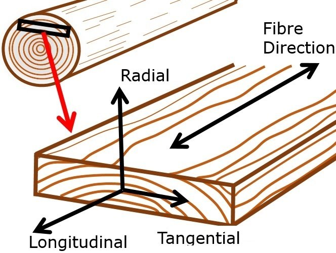

% Lineární algebra (inverzní matice a determinanty)
% Robert Mařík
% 9.4.2019

# Inverzní matice

U reálných čísel máme doplňkové operace ke sčítání a násobení. Jsou to
odečítání a dělení. Odečítání matic můžeme implementovat jako sčítání
matice s maticí vynásobenou minus jedničkou: $A-B=A+(-B)$. Oproti tomu
operace dělení matic vůbec není implementována. U reálných čísel lze
dělení nahradit násobením převrácenou hodnotou: $\frac
{a}{b}=ab^{-1}$. Tuto proceduru částečně rozšíříme pro
matice. Připomeňme ještě, že roli neutrálního prvku při násobení matic
hraje jednotková matice. Například pro matice $3\times 3$ je
jednotková matice
  $$
 I=
 \begin{pmatrix}
   1&0&0\\
   0&1&0\\
   0&0&1
 \end{pmatrix}
.
$$

> Definice (inverzní matice).
  Buď $A\in\mathbb R^{n\times n}$ čtvercová matice řádu $n$. Jestliže
  existuje čtvercová matice $A^{-1}$ řádu $n$, splňující vztahy
  $$A^{-1}A=I=A A^{-1},$$
  nazýváme matici $A^{-1}$ *inverzní maticí k\ matici $A$*.

**Poznámka.** Předchozí definice nezaručuje existenci inverzní
matice. K\ některým čtvercovým maticím inverzní matice existuje, k\ některým ne. Později uvidíme, že existuje jednoduchá charakterizace
matic, ke kterým inverzní matice existuje, pomocí determinantu matice.

> Věta (inverze maticového součinu).
Inverzní matice k součinu dvou matic je součinem jednotlivých inverzních matic, ale v opačném pořadí, tj. $$(AB)^{-1}=B^{-1}A^{-1}.$$

\iffalse

\fi

**Příklad.** Pomocí matic a jejich součinu je možné zapsat libovolnou permutaci konečněprvkové množiny. Známým permutačním hlavolamem je Rubikova kostka. Na ní snadno vidíme, že pokud kostku zamícháme ze složeného stavu tahem v horní stěně a poté v pravé stěně, pro opětovné složení musíme vracet tahy v opačném pořadí, tj. nejdřív vrátit tah v pravé stěně a poté ve stěně horní. Pěkně to jde vidět na [následující animaci](https://alg.cubing.net/?alg=R_U_%0A%2F%2F_dva_tahy,_ka%C5%BEd%C3%BD_je_mo%C5%BEn%C3%A9_reprezentovat_matic%C3%AD_permutace_%0AU-_R-_%0A%2F%2F_vr%C3%A1cen%C3%AD_tah%C5%AF_v_opa%C4%8Dn%C3%A9m_po%C5%99ad%C3%AD_slo%C5%BE%C3%AD_kostku_zp%C4%9Bt), kterou můžete spustit nebo přehrávat po jednotlivých krocích.

# Využití inverzní matice pro řešení soustavy lineárních rovnic

\iffalse

\fi

Z minulé přednášky víme, že pomocí maticového násobení je možné soustavu lineárních rovnic zapsat ve tvaru $$AX=B,$$ kde $A$ je matice soustavy, $X$ je sloupcový vektor neznámých a $B$ je vektor pravých stran. Pokud má matice $A$ inverzní matici, můžeme pomocí této matice soustavu vyřešit. Po vynásobení rovnice inverzní maticí zleva dostáváme
$$A^{-1}(AX)=A^{-1}B$$
a po uplatnění asociativního zákona 
$$(A^{-1}A)X=A^{-1}B.$$
Protože výraz v závorce je součinem matice s maticí inverzní, je tento
součin roven jednotkové matici, která je neutrálním prvkem při
násobení a proto okamžitě dostáváme řešení soustavy ve tvaru 
$$X=A^{-1}B.$$
Jako přirozený důsledek vidíme, že řešení je určeno
jednoznačně. Známe-li inverzní matici, můžeme řešení dokonce vypočítat
pro libovolnou pravou stranu velmi pohodlně a rychle pomocí maticového
násobení. Bohužel, výpočet inverzní matice je zpravidla velmi drahý
(vyžaduje velké množství operací) a numericky málo stabilní. Proto je
tento postup užitečným teoretickým nástrojem, ale v praxi postupujeme
poněkud odlišně.

# Inverzní matice k matici popisující rotaci v rovině

Pro matici rotace $$R_\theta=\begin{pmatrix}
  \cos\theta & -\sin \theta\\
  \sin\theta & \cos\theta
\end{pmatrix}$$ z minulé přednášky platí
\dm $$(R_\theta)^{-1}=R_{-\theta} =  \begin{pmatrix}   \cos(-\theta) & -\sin (-\theta)\\   \sin(-\theta) & \cos(-\theta) \end{pmatrix} =
\begin{pmatrix}   \cos\theta & \sin \theta\\   -\sin\theta & \cos\theta \end{pmatrix}$$
což je přirozené pokud si uvědomíme, že inverzní operací k pootočení
roviny o úhel $\theta$ je pootočení roviny o úhel opačný.

Odsud mimo jiné vidíme, že platí
\dm$$(R_\theta)^{-1}=\begin{pmatrix}   \cos\theta & -\sin \theta\\   \sin\theta & \cos\theta \end{pmatrix}^{-1}=\begin{pmatrix}   \cos\theta & \sin \theta\\   -\sin\theta & \cos\theta \end{pmatrix} =\begin{pmatrix}   \cos\theta & -\sin \theta\\   \sin\theta & \cos\theta \end{pmatrix}^T=(R_\theta)^T,$$
tj. že inverzní a transponovaná matice jsou v případě matice rotace stejné. To je velká náhoda, ale přesto matice s touto vlastností hrají tak důležitou roli, že si vysloužily vlastní název představený na dalším slidu.

# Ortogonální matice

> Definice (ortogonální matice). *Ortogonální matice* je matice, jejíž transponovaná matice je současně maticí inverzní.

Řádky ortogonální matice jsou tvořeny navzájem kolmými vektory
jednotkové délky. Má-li například symetrická čtvercová matice $A$ řádu
$n$ celkem $n$ lineárně nezávislých jednotkových vlastních vektorů,
potom matice vytvořená tak, že sloupce nebo řádky matice jsou tyto
vektory, je ortogonální.

# Inverzní matice k diagonální matici

Diagonální matice (tj. matice, které mají nenulové prvky jenom na hlavní
diagonále) se vzhledem k násobení chovají velice hezky: součinem je
taková matice, která je diagonální a na hlavní diagonále má prvky
vytvořené jako součin odpovídajících prvků násobených matic.

$$
\begin{pmatrix}
  2&0&0 \\
  0&3&0 \\
  0&0&12  
\end{pmatrix}
\begin{pmatrix}
  5&0&0 \\
  0&7&0 \\
  0&0&1  
\end{pmatrix}
=
\begin{pmatrix}
  10&0&0 \\
  0&21&0 \\
  0&0&12  
\end{pmatrix}
$$

Proto je snadné zařídit, aby v hlavní diagonále vyšly jedničky. Stačí
uvažovat podobně jako v následujícím příkladě.
$$
\begin{pmatrix}
  2&0&0 \\
  0&3&0 \\
  0&0&12  
\end{pmatrix}
\begin{pmatrix}
  \frac 12&0&0 \\
  0&\frac 13&0 \\
  0&0&\frac1{12}  
\end{pmatrix}
=
\begin{pmatrix}
  1&0&0 \\
  0&1&0 \\
  0&0&1  
\end{pmatrix}
$$
a tedy
$$
\begin{pmatrix}
  2&0&0 \\
  0&3&0 \\
  0&0&12  
\end{pmatrix}^{-1}
=
\begin{pmatrix}
  \frac 12&0&0 \\
  0&\frac 13&0 \\
  0&0&\frac1{12}  
\end{pmatrix}.
$$

# Iterační metoda řešení soustav lineárních rovnic

Na předchozím slidu jsme viděli, že je jednoduché najít inverzní
matici k matici diagonální. Toho využijeme pro řešení soustavy
lineárních rovnic iterační metodou. Představíme si nejednodušší, přesto však velmi mocnou metodu, **Jacobiho metodu**.

V minulé přednášce jsme modelovali rozložení teploty ve dvourozměrné
desce pomocí soustavy rovnic
$$
\begin{pmatrix}
 \phantom{-}4&-1& \phantom{-}0&-1\\
 -1& \phantom{-}4&-1& \phantom{-}0\\
 \phantom{-}0 &-1& \phantom{-}4&-1\\
 -1& \phantom{-}0&-1& \phantom{-}4
\end{pmatrix}
\begin{pmatrix}
  x_1\\x_2\\x_3\\x_4
\end{pmatrix}
=
\begin{pmatrix}
  30\\60\\70\\40
\end{pmatrix}.
$$
Pro
$$A=\begin{pmatrix}
 \phantom{-}4&-1& \phantom{-}0&-1\\
 -1& \phantom{-}4&-1& \phantom{-}0\\
 \phantom{-}0 &-1& \phantom{-}4&-1\\
 -1& \phantom{-}0&-1& \phantom{-}4
\end{pmatrix}, \quad
X=\begin{pmatrix}
  x_1\\x_2\\x_3\\x_4
\end{pmatrix}
,\quad
B=\begin{pmatrix}
  30\\60\\70\\40
\end{pmatrix}
$$
tedy $$AX=B.\tag{1}$$

Rozdělíme matici $A$ na součet diagonální matice a matice s nulami v hlavní diagonále, tj. na součet matic
$$D=
\begin{pmatrix}
 4&0&0&0\\
 0& 4&0&0\\
0 &0& 4&0\\
 0&0&0& 4
\end{pmatrix}
\quad \text{a}\quad
T=
\begin{pmatrix}
 \phantom{-}0&-1& \phantom{-}0&-1\\
 -1& \phantom{-}0&-1& \phantom{-}0\\
 \phantom{-}0 &-1& \phantom{-}0&-1\\
 -1& \phantom{-}0&-1& \phantom{-}0
\end{pmatrix}
$$
Potom můžeme psát rovnici ve tvaru
$$(D+T)X=B$$
a odsud
$$\begin{aligned}DX+TX&=B\\
DX&=B-TX
\end{aligned}$$
a využitím inverzní matice
$$X=D^{-1}(B-TX).\tag{2}$$
Definujme nyní iterační vzorec
$$X_{k+1}=D^{-1}(B-TX_k).\tag{3}$$
Podobně jako u Markovových řetězců můžeme najít postupnými iteracemi z
vhodného (nebo libovolného) počátečního stavu stacionární stav, kdy se
$X_k$ dalšími iteracemi nemění a tím dostaneme řešení rovnice (2),
která je ekvivalentní rovnici (1). Protože inverzní matici počítáme
pro matici diagonální, je tento výpočet velice rychlý a levný. Vlastně
není vůbec nutné mít k dispozici maticový počet. Iterace dostaneme
tak, že z první rovnice osamostatníme $x_1$, z druhé rovnice $x_2$
atd. Výchozí odhad dosadíme do pravých stran a obdržíme zpřesněný
odhad. Postup opakujeme, dokud nejsou dvě následující iterae
dostatečně blízké.

**Poznámka.** Předchozí postup je možné použít jenom v případě, že
iterační proces (3) konverguje. Pokud by nekonvergoval, není možné o
řešení rovnice nic říct, pouze to, že Jacobiho metoda
nefunguje. Postačující podmínka, kdy Jacobiho metoda konverguje, je
aby každý řádek měl v hlavní diagonále číslo, které je v absolutní
hodnotě větší než je součet absolutních hodnot zbylých čísel v tomto
řádku. Matice, která splňuje tuto podmínku se nazývá *řádkově ostře
diagonálně dominantní matice* a pro takovou matici Jacobiho metoda
konverguje. Podobně je možné uvažovat *sloupcově ostře diagonálně
dominantní matice* porovnáním absolutních hodnot diagonálních prvků se
součty absolutních hodnot ostatních prvků v daných sloupcích a i pro
sloupcově ostře diagonální matice metoda konverguje. I přes
jednoduchost tohoto kriteria se s diagonálně dominantními maticemi
setkáváme v aplikacích poměrně často. Podíváme-li se, jak byla
odvozena soustava popisující rozložení teploty na tepelně vodivé
desce (poslední slajd minulé přednášky), není to až takové překvapení.

[Online výpočet.](https://sagecell.sagemath.org/?z=eJxtjzFrwzAQhXeD_8ORLrKRXYUqDQQ02Hjq1CGDwTVBRGpyQ05GFqH995Vj11CoEOLe3Xv6pErddPD4xbpO8mLLRTx63sVqlrGeWg8192fZ91ma1Gv4RfBXwfeCS9FnZfCaxsGNlkVTmjRK5mgsBQzfpyUh46RBuqvt8__Do6qKJk3aFbET_Hf_RcATDO6sgz0TgjNXbcDb0RJO7E_nAQEJov9i2S47pAnE1SpiEz9ndXHM2ywSB48UYPPmvNHk7hpuNjijD_BBG96WxAxeMIxKPj61uN8jiuwCnK3EqjLebP30uLzmsOZ-AAxjagI=&lang=sage&interacts=eJyLjgUAARUAuQ==)

Podobnými iteračními metodami je možné efektivně řešit soustavy o
tisících rovnic a neznámých. Výpočty probíhají rychle a nejsou náročné
na paměť jako u přímých metod, známých například ze střední
školy. Tímto způsobem se řeší soustavy rovnic při modelování namáhání
konstrukcí, vedení tepla, proudění vody apod.

# Determinant matice

> Definice (determinant).   Buď $A\in\mathbb R^{n\times n}$ čtvercová matice řádu $n$.   *Determinant matice $A$* je reálné číslo ${\det A}$   přiřazené matici $A$ následujícím způsobem:
>  
  * Je-li $A$ matice řádu $1$, tj. $A=(a_{11})$, je $\det A=a_{11}$.
  * Máme-li definován determinant z\ matice řádu $(n-1)$ označme
    symbolem $M_{ij}$ determinant matice řádu $(n-1)$, která vznikne
    z\ matice $A$ vynecháním $i$-tého řádku a $j$-tého sloupce.
    Definujme *algebraický doplněk* $A_{ij}$
    prvku $a_{ij}$ jako součin $A_{ij}=(-1)^{i+j}M_{ij}$.
  * Konečně, definujme determinant řádu $n$ následovně: zvolíme
    libovolný index $i\in\{1,2,\dots n\}$ a definujeme
    $$
     \det A= a_{i1}A_{i1}+ a_{i2}A_{i2}+\cdots+ a_{in}A_{in}.
    $$

Uff. Zacházejme vyjímečně s touto definicí stejně jako s definicí
limity: vezmeme na vědomí, že nějaká korektní definice existuje,
ale učit se ji nebudeme. Není to totiž tak úplně potřeba. bude nám
stačit naučit se několik málo speciálních případů.

Determinant matice $A$ označujeme též $|A|$. Je-li
$A=(a_{ij})$ píšeme zkráceně $|a_{ij}|$ místo $|(a_{ij})|$. K\ záměně
s\ absolutní hodnotou může dojít jedině v\ případě, že matice $A$ je
řádu jedna. V\ praxi se však obvykle s\ maticemi řádu jedna nepracuje.

> Definice (regulární a  singulární matice).   Buď $A$ čtvercová matice. Je-li $\det A=0$, říkáme, že matice $A$ je *singulární*, v\ opačném případě říkáme, že je *regulární*.

# Determinant matice $2\times 2$ (křížové pravidlo)

$$
    \begin{vmatrix}
      a &b\\ c& d
    \end{vmatrix}
=ad-bc
$$

Tento determinant je roven nule právě tehdy, když je jeden řádek
matice násobkem druhého a to bude právě tehdy když je jeden sloupec
matice násobkem druhého.

# Determinant matice $3\times 3$ (Sarusovo pravidlo)

$$
    \begin{vmatrix}
      a&b&c\\
      i&j&k\\
      x&y&z
    \end{vmatrix}
 =ajz+bkx+ciy-(cjx+biz+aky)
$$

*Mnemotechnická pomůcka:* opsat první dva řádky pod determinant,
vynásobit hlavní diagonálu a dvě diagonály pod tím, potom vynásobit
vedlejší diagonálu a dvě diagonály pod tím. Příspěvky od hlavní
diagonály a dvou šikmých řad pod ní se sčítají, příspěvky od vedlejší
diagonály a dvou šikmých řad pod ní se odečítají.

# Determinant matice ve schodovitém tvaru

> Definice (schodovitý tvar). 
  Řekneme, že matice $A$ je ve *schodovitém tvaru*, jestliže
  případné nulové řádky jsou uspořádány na konci matice a nenulové
  jsou uspořádány tak, že každý následující řádek začíná větším počtem
  nul než řádek předchozí.

**Příklad.** Matice
$$
\begin{pmatrix}
  4& 7 &0\\
  0 & -2 & 1\\
  0& 0& 5
\end{pmatrix}
$$
je ve schodovitém tvaru.
 

> Věta (determinant matice ve schodovitém tvaru). 
   Determinant matice, která je ve  schodovitém tvaru je
   roven součinu prvků v hlavní diagonále.

Totéž platí zejména pro matice diagonální, které mají nenulové
prvky jenom v hlavní diagonále a tedy jsou ve schodovitém tvaru.
   

**Příklad.** Platí
$$
\begin{vmatrix}
  4& 7 &0\\
  0 & -2 & 1\\
  0& 0& 5
\end{vmatrix}=4\cdot (-2)\cdot 5=-40.
$$

# Souvislost některých pojmů

Pojmy lineární algebry spolu krásně souvisí. 

> Věta. Buď $A$ čtvercová matice řádu $n$. Následující výroky
   jsou ekvivalentní:
>
1. K matici $A$ existuje matice inverzní $A^{-1}$.
1. Matice $A$ je  regulární, tj. $\det A\neq 0$.
1. Soustava lineárních rovnic $$AX=B$$ má pro libovolnou pravou stranu $B$ jediné řešení.
1. Homogenní soustava lineárních rovnic $$AX=0$$ má pouze nulové řešení.
1. Každý vektor z $\mathbb R^n$ lze vyjádřit jako lineární      kombinaci vektorů tvořených řádky (sloupci) matice      $A$, a to jednoznačně, až na pořadí.

Například je-li $\vec q$ vlastním vektorem matice $A$ příslušným vlastní hodnotě $\lambda$, platí
$$A\vec q=\lambda \vec q.$$
Odsud
$$\begin{aligned}A\vec q-\lambda \vec q&=0\\ A\vec q-(\lambda I )\vec q &=0\\ (A-\lambda I )\vec q &=0\end{aligned}.$$ 
Pokud chápeme poslední rovnost jako soustavu rovnic s koeficienty
$(A-\lambda I)$, nulovou pravou stranou a nenulovým řešením $\vec q$
(tj. bod 6 předchozí věty neplatí), musí být determinant matice
$A-\lambda I$ nulový (tj. bod 4 předchozí věty neplatí). Tím je
motivována následující definice a dokázána následující věta.

> Definice (charakteristická rovnice, charakteristický polynom). Rovnice
> $$\det (A-\lambda I)=0$$ s neznámou $\lambda$ se nazývá
> *charakteristická rovnice* matice $A$. Výraz na levé straně této rovnice je polynom proměnné $\lambda$ a nazývá se *charakteristický polynom* matice $A$.

> Důsledek (vlastní čísla). Vlastní čísla matice $A$ jsou právě řešení charakteristické rovnice.

# Změna báze a matice přechodu

Předpokládejme, že obě dvojice $\mathcal E=[\vec e_1,\vec e_2]$ a $\mathcal F=[\vec f_1,\vec f_2]$ jsou báze dvourozměrného vektorového prostoru. Tedy každý vektor můžeme zapsat jako jejich lineární kombinaci a to jednoznačně.
Pokud platí
$$X=a_1 \vec e_1 + a_2 \vec e_2 =  b_1 \vec f_1 + b_2 \vec f_2 ,$$
jsou 
$[X]_{\mathcal  E}=\begin{bmatrix}   a_1\\a_2 \end{bmatrix}$
souřadnice v bázi $\mathcal E$ a
$[X]_{\mathcal F}=\begin{bmatrix}   b_1\\b_2 \end{bmatrix}$
souřadnice v bázi $\mathcal F$. Pro dvojici bází existuje matice  $P$  typu $2\times 2$ taková, že
$$\begin{bmatrix}   a_1\\a_2 \end{bmatrix}
=
P
\begin{bmatrix}   b_1\\b_2 \end{bmatrix}
$$
Tato matice se nazývá matice přechodu a umožňuje najít souřadnice
vektoru v jedné bázi pomocí souřadnic vektoru v jiné bázi. Matice přechodu musí být regulární a proto evidentně můžeme mezi bázemi přecházet i v opačném směru směru pomocí inverzní matice
$$P^{-1}\begin{bmatrix}   a_1\\a_2 \end{bmatrix}
=
\begin{bmatrix}   b_1\\b_2 \end{bmatrix}.
$$

\iffalse

\fi

Ukážeme si důležité využití matice přechodu. Předpokládejme, že máme
zobrazení $f\colon X\to Y$, které je možno charakterizovat maticemi.  Na
vstupu i výstupu jsou tedy vektory a jejich směry si obecně nemusí
odpovídat.
Může se jednat třeba o zobrazení, které působícím silám přiřadí
deformaci tělesa, což uvidíme v Hookově zákoně na dalším slidu. Může
se jednat také o zobrazení, které vektoru charakterizujícímu změnu tlaku v
podzemní vodě přiřadí směr proudění. (Oba směry si nemusí odpovídat,
protože voda je poháněna rozdílem tlaků ve směru největšího poklesu
tlaku, ale současně si v anizotropním prostředí hledá cestu nejmenšího
odporu).

Nechť je naše zobrazení vyjádřeno v nějaké bázi $\mathcal B$ maticí $A$,
tj. $$Y=AX,$$ kde $X$ a $Y$ jsou souřadnice vzoru a obrazu v dané bázi. Budeme chtít
zobrazení vyjádřit v jiné bázi. Například v bázi $\mathcal b$ takové, že platí
$X=Px$ a $Y=Py$, kde malá písmena jsou souřadnice v "malé" bázi
$b$. Dosazením získáme
$$Py=APx$$
a po vynásobení inverzní maticí
$$P^{-1}(Py)=P^{-1}(APx),$$
tj
$$y=(P^{-1}AP)x.$$ V bázi $b$ je tedy zobrazení charakterizováno maticí
$P^{-1}AP$. Pro vhodně zvolenou matici $P$ může být matice v nové bázi
podstatně jednodušší než matice v bázi původní.

V následujícím příkladě si ukážeme, že vhodně zvolenou maticí $P$
můžeme dosáhnout toho, že $P^{-1}AP$ je diagonální matice. Na dalším
slidu již rovnou zvolíme vhodnou bázi a matice, která bude sice
impozantních rozměrů $6\times 6$, bude plná nul a proto relativně pěkná. 

**Příklad.**
Pro matice $A=
\begin{pmatrix}
  1 & 0 \\ 1 &2
\end{pmatrix}$
a $P=
\begin{pmatrix}
  0& -1 \\ 1 &1
\end{pmatrix}$
platí (po chvilce počítání)
$$  P^{-1}AP=
\begin{pmatrix}
  2& 0 \\ 0 & 1
\end{pmatrix}.
$$
Odsud vidíme, že v souřadnicích ke kterým bychom přešli pomocí matice
$P$ je vyjádření zobrazení matice $A$ mnohem jednodušší, protože matice
$P^{-1}AP$ je diagonální.

Častým úkolem je zapsat vztahy mezi veličinami tak, aby byly co
nejjednodušší a proto jeden z častých úkolů v lineární algebře bývá
takovou šikovnou bázi nalézt. Nastíníme neoptimističtější variantu
postupu, případné detaily a řešení zádrhelů je možné najít v odborné
literatuře. Zpravidla vyjadřujeme zobrazení v bázi tvořené
ortonormálními vlastními vektory matice $A$. Sloupce matice $P$ jsou
vlastní vektory matice $A$. Pokud je matice $A$ symetrická, je matice
$P$ navíc ortogonální, její inverze je tedy matice
transponovaná. Tomuto procesu se říká diagonalizace matice, protože
$P^{-1}AP$ vychází diagonální a v diagonále vychází právě vlastní
čísla matice.

\iffalse

[Ukázka](https://sagecell.sagemath.org/?z=eJytkU1v2zAMhu8G_B8INEWkRM3ioOlNB5-GHQb4sJuRFYqtzmoV0ZNlr_Gw_z469ryP9lJgBkzT4ks9fMFUnlTw5pnl-V7sDiLfUTxwuAI6N4WOo-y3InnXfPWB7bm42f1Kh5b5eBbQFZvglWtqbDTjMN8HtddFhWULJUJjnrBzGo6q1xBHVxAUHWA7FSihioFGg1NtYU4aKqtLFaDGvtSPJo7iqKnwG7AqnCzzy0Uqr5uFgEU2fJfXzKqgn1nKxZhknB6apVelcqbr0Z8ly7diSy6SKSYUt5u9SDZ3Qzb-U43_y8o-f79JfqQTagSwbGNcp_1gmq_SVTbyJu8dOOwudi-jv5n_P1YRR3j0qj_LPFt1ugjomeHwgB4MGAeXmQ5x9OHje1mjcYGNcgEFWvRy6XW5FLSgXsvbLV_XaM9f0L2uUraulCQzfG2N06-J-Iiidz3iLgPMgFl7tK3-WzxyJ_mDsVZ-8q3-A_qid1gfo2bSNDVZv_e0FpQJ_wkl8e8J&lang=sage&interacts=eJyLjgUAARUAuQ==)

\fi

# Hookův zákon, matice tuhosti a poddajnosti

V minulé přednášce jsme odvodili tvar tenzoru malých deformací pro popis deformace tuhého tělesa ve tvaru
$$\begin{pmatrix}
        \frac{\partial u_{1}}{\partial x_{1}} & \frac 12\left(\frac{\partial u_{1}}{\partial x_{2}}+\frac{\partial u_{2}}{\partial x_{1}}\right)\\
        \frac 12\left(\frac{\partial u_{1}}{\partial x_{2}}+\frac{\partial u_{2}}{\partial x_{1}}\right)& \frac{\partial u_{2}}{\partial x_{2}}
      \end{pmatrix}$$

\makeatletter
\def\maxwidth{\ifdim\Gin@nat@width>0.5\linewidth 0.5\linewidth\else\Gin@nat@width\fi}
\makeatother

Toto můžeme zapsat symbolicky $$\varepsilon_{ij}=\frac 12\left(\frac{\partial u_{i}}{\partial x_{j}}+\frac{\partial u_{j}}{\partial x_{i}}\right).\tag{*}$$ Pro deformaci v prostoru máme nikoliv dvě, ale tři souřadnice a tenzor deformací je tedy $3\times 3$ symetrická matice, tj. matice, která má šest nezávislých komponent. (Zbylé tři komponenty dostaneme ze symetrie.) Tyto komponenty dostaneme postupnou volbou indexů ve vzorci (*) a můžeme je sestavit do sloupcového vektoru $$(\varepsilon_{11},\varepsilon_{22},\varepsilon_{33},\varepsilon_{23},\varepsilon_{13},\varepsilon_{12})^T$$ Podobně, působící sílu můžeme rozdělit podle působení v jednotlivých směrech a tím dostaneme tenzor napětí, šest veličin charakterizujících napětí. (Zbylé tři jsou dány podmínkou, že se deformované těleso nepohybuje.)
Pro další úvahy složky tenzoru napětí uspořádáme do sloupcového vektoru
$$(\sigma_{11},\sigma_{22},\sigma_{33},\sigma_{23},\sigma_{13},\sigma_{12})^T.$$

Následující poučka je fyzikálně ověřený fakt, že vztah mezi složkami
tenzoru napětí a tenzoru deformace je lineární. To nás nepřekvapí,
protože z přednášek o derivacích na začátku semestru víme, že
**jakákoliv** funkční závislost se dá linearizovat. Podstatné zde však
je, že interval, na kterém má linearizace smysl, není příliš malý,
tj. že tato linearizace platí pro prakticky významné případy.

> **Hookův zákon deformace (volná slovní formulace).** Do určité hranice zatížení je libovolná složka tenzoru deformace úměrná libovolné složce tenzoru napětí.

K tomu si přidejme, že příspěvky k deformaci, způsobené různými složkami tenzoru napětí, se přirozeně sčítají. Matematicky vyjádřeno proto platí
$$
\begin{pmatrix}\varepsilon_{11}\\\varepsilon_{22}\\\varepsilon_{33}\\\varepsilon_{23}\\\varepsilon_{13}\\\varepsilon_{12}\end{pmatrix}
    =
    S
\begin{pmatrix}\sigma_{11}\\\sigma_{22}\\\sigma_{33}\\\sigma_{23}\\\sigma_{13}\\\sigma_{12}\end{pmatrix},
$$
kde $S$ je čtvercová $6\times 6$ matice.

Fyzikální úvahy ukazují, že matice $S$ je určitě symetrická a obsahuje celkem ne 36, ale jenom 21 nezávislých
veličin. Nazývá se *matice poddajnosti*. V obecném případě tedy musíme
pro popis deformace mít celkem 21 materiálových konstant. Tento počet
se však výrazně redukuje, pokud je materiál například izotropní nebo
ortotropní. Například ortotropní materiál jakým je dřevo, můžeme
umístit do soustavy souřadnic tak, aby byl invariantní vůči symetrii
podle jednotlivých průměten. Poté je [možné
odvodit](https://en.wikipedia.org/wiki/Orthotropic_material#Stiffness_and_compliance_matrices_in_orthotropic_elasticity),
že nejobecnější možný tvar matice $S$ je
$$ S=
   \begin{pmatrix}
  S_{11} & S_{12} & S_{13} & 0 & 0 & 0 \\
S_{12} & S_{22} & S_{23} & 0 & 0 & 0  \\
S_{13} & S_{23} & S_{33} & 0 & 0 & 0 \\
0 & 0 & 0  & S_{44} & 0 & 0 \\
0 & 0 & 0  & 0 & S_{55} & 0\\
0 & 0 & 0  & 0 & 0 & S_{66} \end{pmatrix},$$
tj. tvar, obsahující jenom devět materiálových konstant. Odsud vidíme,
že v takovém materiálu se smykové napětí projeví jenom na jedné
komponentě tenzoru deformace, protože poslední tři sloupce, které
udávají složky jednotlivých deformací způsobených napětími
$\sigma_{23}$, $\sigma_{13}$ a $\sigma_{12}$ mají jenom jednu
nenulovou složku.

Pokud bychom použili k popisu obecnou soustavu souřadnic, nebylo by
možné se na symetrii odvolávat. Matice $S$ by obsahovala všechny prvky
a bylo by nutné hledat bázi, v níž je její vyjádření nejjednodušší. U
dřeva je však snadné rozpoznat význačné směry. Když soustavu souřadnic
zvolíme tak, aby byla v souladu s těmito význačnými směry, docílíme
tohot, že obdržíme matici $S$ již přímo ve tvaru s co nejvíce nulami.

Někdy je vhodné umět určit napětí pomocí deformací. K tomu stačí
Hookův zákon vynásobit maticí $S^{-1}$ a obdržíme
$$
\begin{pmatrix}\sigma_{11}\\\sigma_{22}\\\sigma_{33}\\\sigma_{23}\\\sigma_{13}\\\sigma_{12}\end{pmatrix}=
S^{-1}
\begin{pmatrix}\varepsilon_{11}\\\varepsilon_{22}\\\varepsilon_{33}\\\varepsilon_{23}\\\varepsilon_{13}\\\varepsilon_{12}\end{pmatrix}.
$$
Matice $S^{-1}$ se nazývá *matice tuhosti* a označuje $C$. 

Souvislostí vlastních vektorů matice tuhosti a matice poddajnosti
(nebo obecněji souvislostí vlastních vektorů matice a matice inverzní)
se budeme zabývat na následujícím slidu.

# Vlastní vektory matice a matice inverzní

Fyzikální úvaha snadno vede k závěru, že matice a matice inverzní mají
stejné vlastní vektory. To proto, že pokud v některém směru je
materiálová odezva násobkem podnětu, je i opačně podnět násobkem
materiálové odezvy. To, že matice $A$ a $A^{-1}$ mají stejné vlastní
vektory plyne i z toho, že pokud definiční vztah pro vlastní vektor
matice $A$, tj. vztah 
$$A\vec u=\lambda\vec u,$$ 
vynásobíme zleva maticí $\frac 1\lambda A^{-1}$, dostaneme vzhledem k
identitě $\frac 1\lambda A^{-1}A \vec u=\frac 1\lambda I \vec u =\frac
1\lambda \vec u$ rovnici 
$$\frac 1\lambda \vec u=A^{-1}\vec u,$$ 
která vyjadřuje, že $\vec u$ je vlastním vektorem matice $A^{-1}$ s
vlastním číslem $\frac 1\lambda.$

