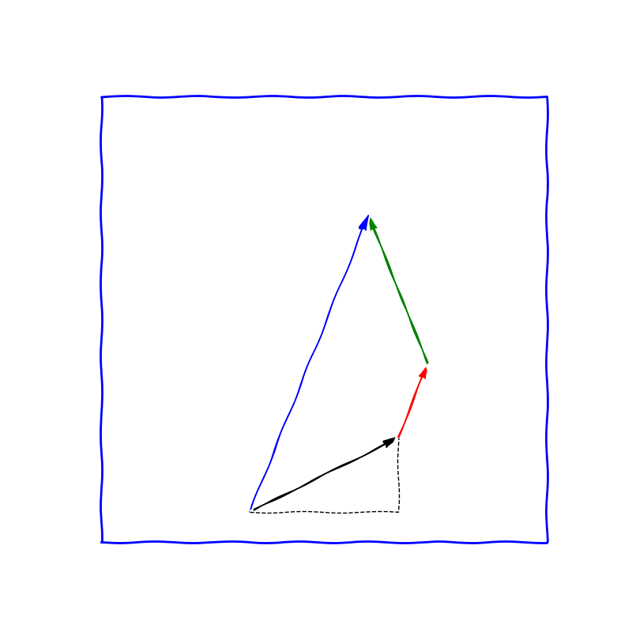
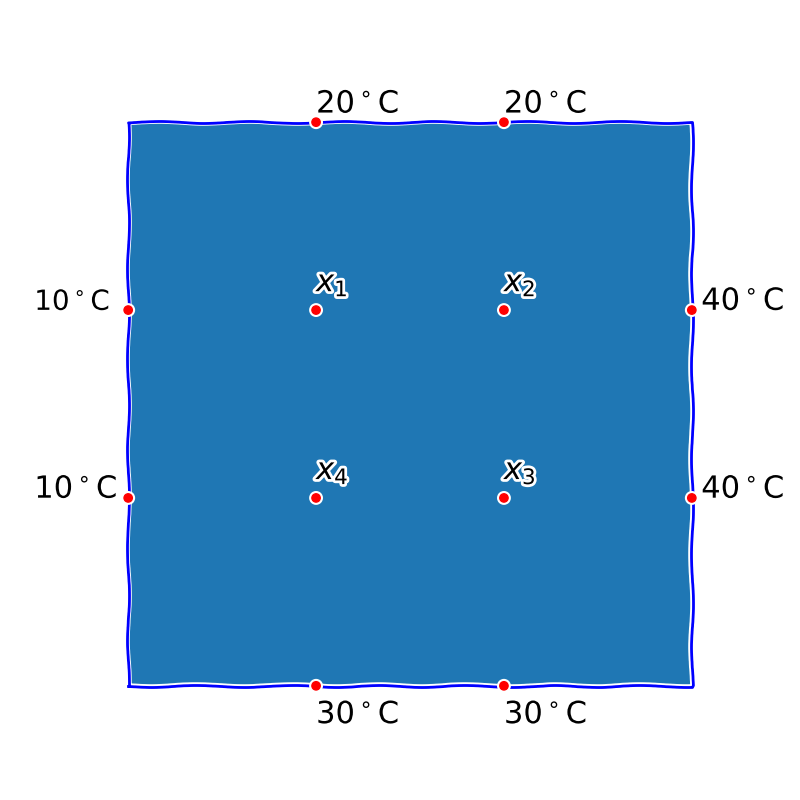

% Lineární algebra
% Robert Mařík
% 2019

# Vektory a operace s nimi

Vektorem rozumíme uspořádanou $n$-ti objektů, pro které má smysl
operace sčítání a násobení číslem. Počet komponent v této $n$-tici se
nazývá dimenze vektoru. Tyto komponenty jsou zpravidla čísla nebo
skalární funkce.

> Definice (vektory, vektorový prostor).
> Množinu $V$ uspořádaných $n$-tic  $(a_1,
  a_2,\dots, a_n)$ s operacemi sčítání a násobení reálným číslem
  definovanými
  $$
  \begin{gathered}
    (a_1, a_2,\dots, a_n)+(b_1, b_2,\dots, b_n)=(a_1+b_1,
    a_2+b_2,\dots, a_n+b_n)\\
    c\cdot (a_1, a_2,\dots, a_n)=(c\cdot a_1, c\cdot a_2,\dots,c\cdot a_n)
  \end{gathered}
  $$
  pro všechna $c\in\mathbb R$ a $(a_1, a_2,\dots, a_n),(b_1, b_2,\dots,
  b_n)\in V$ nazýváme *vektorovým
    prostorem*. Prvky tohoto prostoru nazýváme *vektory*. Prvky $a_1, \dots,
  a_n$ nazýváme *složky vektoru* $(a_1,a_2,\dots, a_n)$. Číslo
  $n$ nazýváme *dimenze prostoru $V$*.

 Vektorový prostor, jehož komponenty jsou uspořádané $n$-tice reálých čísel označujeme $\mathbb R^n$.

 Často pracujeme se sloupcovými vektory. Zápis je potom přehlednější.
 
$$
\begin{pmatrix}
  1\\-2\\1
\end{pmatrix}
+
3
\begin{pmatrix}
  -1\\5\\2
\end{pmatrix}
=
\begin{pmatrix}
  1-3\\-2+15\\1+6
\end{pmatrix}
=
\begin{pmatrix}
  -2\\13\\7
\end{pmatrix}
$$

Neutrálním prvkem vzhledem ke sčítání vektorů je *nulový vektor*, jehož
všechny komponenty jsou nulové. Vektor, ke kterému přičteme nulový
vektor, se nezmění.

# Vektory ve 2D a 3D -- geometrie

Dvourozměrné vektory s komponentami danými reálnými čísly můžeme
reprezentovat graficky pomocí orientovaných úseček. Ve zvolené
soustavě souřadnic a při zvoleném výchozím bodu vektor znázorníme
takovou orientovanou úsečkou, že komponenty vektoru označují změnu
směru vzhledem k jednotlivým souřadnicím. Pokud tyto vektory označují
změnu polohy, mluvíme o vektorech posunutí. Sčítání vektorů poté
odpovídá posunutí počátečního bodu druhého vektoru do koncového bodu
prvního vektoru a nahrazení dvou částečných posunutí jedním
celkovým. Je přirozené zavést délku vektoru $\vec u=
\begin{pmatrix}
  u_1\\u_2
\end{pmatrix}$ pomocí Pythaghorovy věty vzorcem $|\vec
u|=\sqrt{u_1^2+u_2^2}$. Násobení vektoru kladným číslem poté odpovídá
změně délky vektoru. Násobení záporným číslem odpovídá změně délky a
otočení směru.

# Sčítání vektorů a integrace cesty u migrujících živočichů

Staří námořníci navigovali tak, že zaznamenávali směr a rychlost
pohybu. Z těchto informací je možné určit relativní polohu vzhledem k
výchozímu bodu. Podobnou strategii si vyvinuli živočichové žijící v
oblasti bez viditelných orientačních bodů například pouštní mravenci
Cataglyphis fortis. Při hledání potravy registrují vzdálenost a změnu
směru. Tím vlastně registrují vektor posunutí. Jednotlivé vektory
posunutí po sečtení dávají celkové posunutí a tím je dána i nejkratší
cesta zpět. Stačí výsledné celkové posunutí obrátit. V jistém smyslu
tedy mravenec dokáže sčítat vektory a tuto schopnost používá k přežití
v komplikovaném prostředí.

https://en.wikipedia.org/wiki/Path_integration

# Lineární kombinace, lineární závislost a nezávislost vektorů

> Definice (lineární kombinace).
> Nechť $\vec u_1$, $\vec u_2$, $\dots$ $\vec u_k$ je
konečná posloupnost vektorů z vektorového prostoru $V$. Vektor
$\vec u$, pro který platí
$$
  \vec u=t_1\vec u_1+t_2\vec u_2+\cdots +t_k \vec u_k,
$$
kde $t_1$, $t_2$, $\dots$, $t_k$ jsou nějaká reálná čísla, se nazývá
*lineární kombinace* vektorů $\vec u_1$, $\vec u_2$, $\dots$, $\vec
  u_k$.
Čísla $t_1$, $t_2$, $\dots$, $t_k$ nazýváme *koeficienty lineární
  kombinace*.

> Definice (lineární závislost a nezávislost).
>  Řekneme, že vektory $\vec u_1$, $\vec u_2$, $\dots$, $\vec u_k$ jsou
  ***lineárně závislé***, jestliže existuje alespoň jedna
  netriviální lineární kombinace těchto vektorů, jejímž
  výsledkem je nulový vektor, tj. existují-li reálná čísla $t_1$,
  $t_2$, $\dots$, $t_k$, z nichž alespoň jedno je různé od nuly, taková,
  že platí
$$
    \vec o=t_1\vec u_1+t_2\vec u_2+\cdots +t_k \vec u_k.
$$
   V opačném případě říkáme, že vektory jsou ***lineárně nezávislé***.

# Migrace mezi městem a venkovem

\iffalse 

\fi

Každý rok měříme velikosti populací ve městě a na
venkově. Procentuální složení zaznamenáváme ve formě
vektoru. Například vektor $$ X_0=
\begin{pmatrix}
  0.6 \\ 0.4
\end{pmatrix}
$$
znamená, že $60\%$ populace žije ve městě a $40\%$ na venkově. Každý
rok zůstane $95\%$ městské populace ve městě a $5\%$ se stěhuje na
venkov. Podobně $97\%$ obyvatelstva venkova zůstává a $3\%$ se stěhuje
do města. Po jednom roce je tedy rozložení populace dáno vektorem
$$ X_1=
\begin{pmatrix}
  0.95 \\ 0.05 
\end{pmatrix}
0.6
+
\begin{pmatrix}
  0.03 \\ 0.97
\end{pmatrix}
0.4
.
$$
Koeficienty vektoru $X_0$ jsou koeficienty v této lineární
kombinaci.

Podobně, rozložení po dvou letech bude dáno lineární
kombinací s koeficienty, danými vektorem $X_1$.
Pokud bychom potřebovali znát rozložení populace po $k$ letech, situace se komplikuje, dostali bychom rekurentní vzorec, který je nutno stále opakovat. Pro odstranění tohoto nepohodlí se zavádí pojem matice, viz níže.

   
# Matice a jejich lineární kombinace

> Definice (matice). *Maticí řádu $m\times n$*  rozumíme schema
$$
A=
\begin{pmatrix}
a_{11}& a_{12}& a_{13}& \cdots{}& a_{1n}\\
a_{21}& a_{22}& a_{23}& \cdots{}& a_{2n}\\
\vdots{}& \vdots{}& {}& \ddots{}& \vdots{}\\
a_{m1}& a_{m2}& \cdots{}& \cdots{}& a_{mn}
\end{pmatrix}
$$
kde $a_{ij}$ pro $i=1..m$ a $j=1..n$ jsou reálná čísla nebo funkce. Množinu
všech matic řádu $m\times n$, jejichž prvky jsou reálná čísla, označujeme symbolem $\mathbb R^{m\times n}$.
Zkráceně zapisujeme též
${A=(a_{ij})}$.
>
> Je-li $m=n$ nazývá se matice $A$ *čtvercová
  matice*, jinak *obdélníková matice*. Je-li $A$ čtvercová
matice, nazýváme prvky tvaru $a_{ii}$, tj. prvky, jejichž řádkový
a sloupcový index jsou stejné, *prvky hlavní diagonály*.

Pro matice definujeme sčítání a násobení číslem stejně jako u vektorů,
tj. po složkách. Má potom smysl mluvit o lineární kombinaci matic a o
jejich lineární závislosti či nezávislosti. Tyto operace přirozeně
přebírají všechny důležité vlastnosti operace sčítání, jako jsou
asociativita, komutativita, existence neutrálního prvku nebo existence
opačného prvku.

V této fázi je vlastně jedno, jestli prvky jsou uspořádány jako
řádkový nebo sloupcový vektor nebo jako matice. Odlišení matic a
vektorů provedeme zavedením maticového součinu.

# Maticový součin

> Definice (součin matic).
  Buďte $A=(a_{ij})$ matice řádu $m\times n$ a $B=(b_{ij})$ matice
  řádu $n\times p$. *Součinem matic* $A$ a $B$
    (v tomto pořadí) rozumíme matici $G=(g_{ij})$ řádu $m\times p$,
  kde
$$
    g_{ij}=a_{i1}b_{1j}+a_{i2}b_{2j}+\cdots +a_{in}b_{nj}
$$
  pro všechna
  $i=1..m$, $j=1..p$. Zapisujeme $${G=AB}$$ (v tomto pořadí).
  >
  >Slovy: v $j$-tém sloupci matice $AB$ je lineární kombinace sloupců matice $A$, přičemž koeficienty této lineární kombinace jsou prvky z $j$-tého sloupce matice $B$.

  Maticový součin
  
  * je asociativní,
  * je distributivní vzhledem ke sčítání,
  * není však komutativní.

  Můžeme tedy měnit uzávorkování, můžeme
roznásobovat závorky, nesmíme však měnit pořadí matic při násobení.

# Migrace mezi městem a venkovem

\iffalse 

\fi

Budeme pokračovat v příkaldě s migrací. Viděli jsme, že po jednom roce je tedy rozložení populace dáno vektorem
$$ X_1=0.6
\begin{pmatrix}
  0.95 \\ 0.05 
\end{pmatrix}
+0.4
\begin{pmatrix}
  0.03 \\ 0.97
\end{pmatrix}.
$$
Koeficienty vektoru $X_0=\begin{pmatrix}
  0.6\\0.4
\end{pmatrix}$ jsou koeficienty v této lineární
kombinaci.
To lze zapsat jako maticový součin
$$ X_1= \begin{pmatrix}   0.95 & 0.03 \\ 0.05 & 0.97 \end{pmatrix}
\begin{pmatrix}
  0.6\\0.4
\end{pmatrix}.
$$
Pro matici $A=\begin{pmatrix}   0.95 & 0.03 \\ 0.05 & 0.97 \end{pmatrix}$
platí $$X_1=AX_0$$ a dále
$$X_2=AX_1=A(A X_0)=(AA)X_0=A^2 X_0.$$
Po $k$ letech je rozložení populace dáno vektorem $$X_k=A^k X_0$$

Další informace:

* Linear algebra, Lay

# Leslieho matice

\iffalse 

\fi

Leslieho model růstu populace zohledňuje věkovou strukturu
populace. Původně byl odvozen pro modelování populace samic, dá se
však adaptovat na populaci obecně. Model předpokládá, že populace je
rozdělena do několika věkových kategoriií a v každé kategorii je dána
pravděpodobnost dožití se do další kategorie a průměrný počet potomků. 

Příslušný model například pro populaci rozdělenou do tří věkových kategorií by byl dán rovnicí
$$\begin{pmatrix} x_1(k+1) \\ x_2(k+1) \\ x_3 (k+1)
\end{pmatrix}
=
\begin{pmatrix}
  f_1 & f_2 & f_3 \\ p_1 & 0 & 0\\ 0 & p_2 & 0
\end{pmatrix} \begin{pmatrix} x_1(k) \\ x_2(k) \\ x_3 (k)
\end{pmatrix}
$$

Další informace:

* [Z. Pospíšil, Maticové populační modely](http://portal.matematickabiologie.cz/index.php?pg=analyza-a-modelovani-dynamickych-biologickych-dat--maticove-populacni-modely--prolog--leslieho-model-rustu-populace#pro14)

# Skalární součin

* Transponovaná matice
* Skalární součin jako maticový součin

# Transformace souřadnic

# Rozložení teploty na tepelně vodivé desce

\iffalse 

\fi

Uvažujme kovovou desku, kterou si rozdělíme sítí na $12$ uzlových bodů
(rohy zanedbáme) jak je uvedeno na obrázku.  V uzlových bodech na
okraji desky je teplota zadána (okrajová podmínka), zajímá nás
rozložení teploty v ostatních uzlových bodech.

Učiníme (poměrně realistický) předpoklad, že teplota v každém uzlovém
bodě je díky tepelné vodivosti desky ovlivněna sousedníi uzlovými
body. Každý sousední bod má stejný vliv, proto teplota v uzlovém bodě
bude přibližně rovna aritmetickému průměru teplot v sousedních
bodech. Kvantitativně zformulováno, platí 
$$
\begin{aligned}
  x_1&=\frac 14(30+x_2+x_4)\\
  x_2&=\frac 14(60+x_1+x_3)\\
  x_3&=\frac 14(70+x_2+x_4)\\
  x_4&=\frac 14(40+x_1+x_3)
\end{aligned}
$$
anebo po úpravě
$$
\begin{aligned}
  4x_1-x_2-\qquad x_4&=30\\
  -x_1+4x_2-x_3\qquad&=60\\
  \qquad-x_2+4x_3-x_4&=70\\
  -x_1\qquad-x_3+4x_4&=40
\end{aligned}
$$
Dostali jsme soustavu lineárních rovnic o čtyřech neznámých. V maticovém tvaru (s vynechanými nulami uvnitř matice)
$$
\begin{pmatrix}
 \phantom{-}4&-1&&-1\\
 -1& \phantom{-}4&-1&\\
 &-1& \phantom{-}4&-1\\
 -1&&-1& \phantom{-}4
\end{pmatrix}
\begin{pmatrix}
  x_1\\x_2\\x_3\\x_4
\end{pmatrix}
=
\begin{pmatrix}
  30\\60\\70\\40
\end{pmatrix}.
$$
Úloha je tedy převoditelná na úlohu řešení soustavy lineárních
rovnic. Pro podrobnější popis použijeme stejnou myšlenku, ale mnohem
více uzlových bodů. Postup je stejný, pouze vznikne soustava s více
neznámými a více rovnicemi.

Poznámka: Rovnice popisující vedení tepla je poměrně komplikovaně
řešitelná a proto se zpravidla převádí na problém lineární
algebry. Výše uvedený postup se nazývá metoda konečných diferencí, ale
jsou i další metody, například metoda konečných prvků. Společným
znakem je rozdělení oblasti našeho zájmu na velké množství bodů a
aproximace fyzikálních zákonů pro sledovaný jev v každém bodě pomocí
lineární rovnice. Tím vznikne úloha na řešení soustavy rovnic. Tato
soustava je velmi řídká, má hodně nul. Je tedy možné ji rychle vyřešit
i v případě tisíců rovnic. Používá se k modelování proudění tepla nebo
vody, k modelování mechanického namáhání od jednoduchých nosníků po
komplikované stroje nebo stromy.
