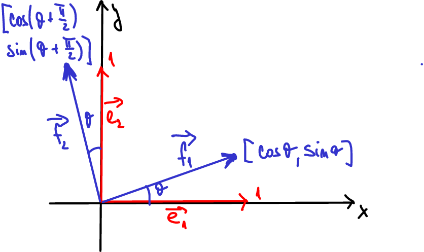
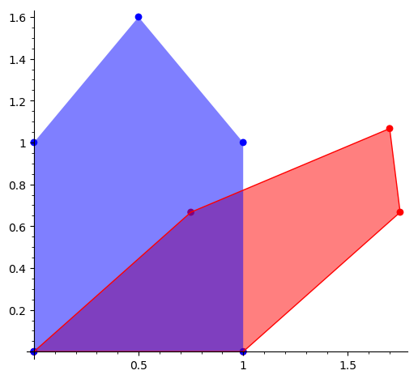

% Lineární algebra (operace s vektory a maticemi)
% Robert Mařík
% 2.4.2019

# Vektory a operace s nimi

Vektorem rozumíme uspořádanou $n$-tici objektů, pro které má smysl
operace sčítání a násobení číslem. Počet komponent v této $n$-tici se
nazývá dimenze vektoru. Tyto komponenty jsou zpravidla čísla nebo
skalární funkce. Aby se s vektory dalo rozumně pracovat, musí tvořit
vhodnou strukturu. Například každý vektor musí mít neutrální prvek a
každý vektor musí mít opačný prvek.

> Definice (vektory, vektorový prostor).
> Množinu $V$ uspořádaných $n$-tic  $(a_1,
  a_2,\dots, a_n)$ s operacemi sčítání a násobení reálným číslem
  definovanými
  $$
  \begin{gathered}
    (a_1, a_2,\dots, a_n)+(b_1, b_2,\dots, b_n)=(a_1+b_1,
    a_2+b_2,\dots, a_n+b_n)\\
    c\cdot (a_1, a_2,\dots, a_n)=(c\cdot a_1, c\cdot a_2,\dots,c\cdot a_n)
  \end{gathered}
  $$
  pro všechna $c\in\mathbb R$ a $(a_1, a_2,\dots, a_n),(b_1, b_2,\dots,
  b_n)\in V$ nazýváme *vektorovým
    prostorem*. Prvky tohoto prostoru nazýváme *vektory*. Prvky $a_1, \dots,
  a_n$ nazýváme *složky vektoru* $(a_1,a_2,\dots, a_n)$. Číslo
  $n$ nazýváme *dimenze prostoru $V$*.

Vektorový prostor, jehož komponenty jsou uspořádané $n$-tice reálých čísel označujeme $\mathbb R^n$.

Často pracujeme se sloupcovými vektory. Zápis je potom přehlednější.
$$
\begin{pmatrix}
  1\\-2\\1
\end{pmatrix}
+
3
\begin{pmatrix}
  -1\\5\\2
\end{pmatrix}
=
\begin{pmatrix}
  1-3\\-2+15\\1+6
\end{pmatrix}
=
\begin{pmatrix}
  -2\\13\\7
\end{pmatrix}
$$

Neutrálním prvkem vzhledem ke sčítání vektorů je *nulový vektor* $\vec o$, jehož
všechny komponenty jsou nulové. Vektor, ke kterému přičteme nulový
vektor, se nezmění.
$$\vec u +\vec o=\vec u$$

# 2D a 3D a vektory v geometrii

Dvourozměrné vektory s komponentami danými reálnými čísly můžeme
reprezentovat graficky pomocí orientovaných úseček. Ve zvolené
soustavě souřadnic a při zvoleném výchozím bodu vektor znázorníme
takovou orientovanou úsečkou, že komponenty vektoru označují změnu
polohy v jednotlivých směrech. Sčítání vektorů 
odpovídá posunutí počátečního bodu druhého vektoru do koncového bodu
prvního vektoru a nahrazení dvou částečných posunutí jedním
celkovým. Je přirozené zavést délku vektoru $\vec u=
\begin{pmatrix}
  u_1\\u_2
\end{pmatrix}$ pomocí Pythaghorovy věty vzorcem $|\vec
u|=\sqrt{u_1^2+u_2^2}$. Násobení vektoru kladným číslem odpovídá
změně délky vektoru. Násobení záporným číslem odpovídá změně délky a
otočení směru.

# Sčítání vektorů a integrace cesty u migrujících živočichů

\iffalse

\fi

Staří námořníci navigovali tak, že zaznamenávali směr a rychlost
pohybu. Z těchto informací je možné určit relativní polohu vzhledem k
výchozímu bodu. Podobnou strategii si vyvinuli živočichové žijící v
oblasti bez viditelných orientačních bodů například pouštní mravenci
Cataglyphis fortis. Při hledání potravy registrují vzdálenost a změnu
směru. Tím vlastně registrují vektor posunutí. Jednotlivé vektory
posunutí po sečtení dávají celkové posunutí a tím je dána i nejkratší
cesta zpět. Stačí výsledné celkové posunutí obrátit. V jistém smyslu
tedy mravenec dokáže sčítat vektory a tuto schopnost používá k přežití
v komplikovaném prostředí.

Další informace: [Wikipedia, Path integration](https://en.wikipedia.org/wiki/Path_integration)

# Lineární kombinace

> Definice (lineární kombinace).
> Nechť $\vec u_1$, $\vec u_2$, $\dots$ $\vec u_k$ je
konečná posloupnost vektorů z vektorového prostoru $V$. Vektor
$\vec u$, pro který platí
$$
  \vec u=t_1\vec u_1+t_2\vec u_2+\cdots +t_k \vec u_k,
$$
kde $t_1$, $t_2$, $\dots$, $t_k$ jsou nějaká reálná čísla, se nazývá
*lineární kombinace* vektorů $\vec u_1$, $\vec u_2$, $\dots$, $\vec u_k$.
Čísla $t_1$, $t_2$, $\dots$, $t_k$ nazýváme *koeficienty lineární kombinace*.

**Příklad.** Lichoběžníkové pravidlo   $$
    \int_a^bf(x)\,\mathrm dx\approx \frac h2\Bigl(
    {y_0}+2y_1+2y_2+\cdots+2y_{n-1}+{y_n}\Bigr).
  $$  
ukazuje, že určitý integrál je možno aproximovat lineární kombinací
funkčních hodnot na pravidelné mřížce rozdělující obor integrace. Koeficienty lineární kombinace jsou dvojky s vyjímkou prvního  a posledního koeficientu, které jsou jednotkové. Existují i další aproximační vzorce, které používají jiné koeficienty a jsou založeny například na aproximaci funkce parabolami namísto přímek.

**Příklad.** V metodě konečných diferencí (viz závěr přednášky o diferenciálních rovnicích)  se derivace aproximují výrazy, které jsou lineární kombinací po sobě jdoucích funkčních hodnot hledané funkce na pravidelné mřížce délky $h$. Pro konkrétnost, pro první derivaci máme
$$\frac{\mathrm df}{\mathrm dx}\approx\frac{f(x+h)-f(x-h)}{2h} =\frac 1{2h}f(x+h)-\frac 1{2h}f(x-h), $$
a pro druhou derivaci
$$ \frac{\mathrm d^2f}{\mathrm dx^2}\approx\frac{f(x-h)-2f(x)+f(x+h)}{h^2}=\frac{1}{h^2} f(x-h) - \frac{2}{h^2} f(x) + \frac{1}{h^2} f(x+h).$$

# Lineární závislost a nezávislost vektorů

V $n$-rozměrném prostoru existuje $n$-tice vektorů, pomocí
nichž můžeme dostat libovolný vektor jako lineární kombinaci. Taková
$n$-tice se nazývá *báze*. Dá se ukázat, že bází je nekonečné mnoho a
pro zadanou bázi a vektor je vyjádření vektoru pomocí bázových
vektorů jednoznačné až na pořadí. Nejjednodušší báze je tvořena
jednotkovými vektory, které mají všechny komponenty kromě jedné
nulové. Například pro bázové vektory $\vec e_1=(1,0)$ a $\vec e_2=(0,1)$
dvourozměrného vektorového prostoru a pro vektor $\vec v=(4,3)$ platí
$$\vec v=(4,3)=(4,0)+(0,3) = 4 (1,0) +3 (0,1) = 4\vec e_1+3 \vec e_2.$$
Koeficienty lineární kombinace se nazývají souřadnice. Například
souřadnice vektoru $\vec v=(4,3)$ v uvažované bázi jsou
$\begin{bmatrix} 4\\3 \end{bmatrix}_{e_1,e_2}$. Pro bázové vektory $\vec \varepsilon_1=(2,1)$ a $\vec
\varepsilon_2=(0,1)$ platí
$$\vec v=(4,3)=2(2,1)+1(0,1)=2\vec \varepsilon_1+\vec \varepsilon_2$$
a souřadnice vektoru $\vec v=(4,3)$ v nové bázi jsou $\begin{bmatrix} 2\\1 \end{bmatrix} _{\varepsilon_1,\varepsilon_2}$. Tady vidíme
výhodu "pěkné volby" bázových vektorů.

Aby použití souřadnic mělo smysl, musí existovat jediná možnost jak daný vektor vyjádřit pomocí lineární kombinace zadaných bázových vektorů. Tato úloha se dá redukovat na úlohu, zda taková jednoznačnost existuje u nulového vektoru. Tím je motivována následující úvaha a z ní vyplývající definice.

Výsledkem triviální lineární kombinace, tj. lineární kombinace s
nulovými koeficienty, je nulový vektor.  Pro některé vektory můžeme
nulový vektor dostat i jako jinou lineární kombinaci, než je ta
triviální. Ukazuje se, že je důležité identifikovat tyto případy a pro
rozlišení toho, zda se nulový vektor dá nebo nedá vyjádřit jako
netriviální lineární kombinace zavedeme nové pojmy, lineární závislost
a nezávislost.

> Definice (lineární závislost a nezávislost).
>  Řekneme, že vektory $\vec u_1$, $\vec u_2$, $\dots$, $\vec u_k$ jsou
  *lineárně závislé*, jestliže existuje alespoň jedna
  netriviální lineární kombinace těchto vektorů, jejímž
  výsledkem je nulový vektor $\vec o$, tj. existují-li reálná čísla $t_1$,
  $t_2$, $\dots$, $t_k$, z nichž alespoň jedno je různé od nuly, taková,
  že platí
$$
    \vec o=t_1\vec u_1+t_2\vec u_2+\cdots +t_k \vec u_k.
$$
   V opačném případě říkáme, že vektory jsou *lineárně nezávislé*.

Platí následující.

* Vektory, které tvoří bázi, jsou lineárně nezávislé.
* Je-li vektorů větší počet, než je dimenze prostoru, jsou tyto vektory lineárně závislé.
* Je-li v posloupnosti vektorů některý vektor násobkem jiného vektoru nebo lineární kombinací ostatních vektorů, jedná se o lineárně závislou posloupnost vektorů.

Ve výše uvedených případech poznáme lineární závislost snadno. Mimo
tyto případy je to snadné pouze pro dvojici vektorů, které jsou
lineárně závislé právě tehdy když je jeden vektor násobkem druhého. V
tom případě říkáme, že vektory mají stejný směr. V ostatních případech
se lineární závislost a nezávislost naučíme posuzovat později při
výpočtu hodnosti.

# Pootočení vektoru

Ve dvourozměrném vektorovém prostoru uvažujme jednotkové vektory ve směru souřadných os $\vec e_1=(1,0)$ a $\vec e_2=(0,1)$.
Pokud pootočíme vektory o úhel $\theta$ v kladném směru, mají pootočené vektory $\vec f_1$, $\vec f_2$ souřadnice
$$\vec f_1=(\cos \theta,\sin\theta)$$ (plyne přímo z definice funkcí sinus a kosinus na jednotkové kružnici) a
$$\vec f_2=(-\sin\theta,\cos\theta)$$ (plyne z předchozího přičtením úhlu $\frac\pi 2$ a využitím identit $\cos\left(\theta+\frac\pi 2\right)=-\sin\theta$ a $\sin\left(\theta+\frac\pi 2\right)=\cos\theta$). Pomocí lineární kombinace můžeme psát
$$
\begin{aligned}
\vec f_1&=\cos(\theta) \vec e_1 +\sin(\theta)\vec e_2,\\
\vec f_2&=-\sin(\theta)\vec  e_1 +\cos(\theta)\vec e_2.
\end{aligned}
$$
Je-li úhel $\theta$ malý, platí (viz cvičení z derivací) $\sin\theta\approx\theta$, $\cos\theta\approx 1$ a dostáváme
$$
\begin{aligned}
\vec f_1&= (1,\theta) = \vec e_1 +\theta\vec  e_2,\\
\vec f_2&= (-\theta,1) = -\theta\vec e_1 +\vec e_2.
\end{aligned}
$$

# Model migrace jako přepínání stavů

\iffalse 

\fi

Na příkladě si ukážeme, kdy je přirozené pracovat s lineárními
kombinacemi vektorů. Pokusíme se na jednoduchém modelu migrace mezi
městem a venkovem demonstrovat přístup, který se používá v případech,
kdy je možné rozdělit jednotlivé části systému do konečného počtu
navzájem disjunktních stavů a jednotlivé části mohou měnit svůj stav,
přičemž pravděpodobnost změny je dána pouze současným stavem a ne
například historií předchozích stavů. Aplikace zahrnují například
modelování vegetace na stanovištích (zájmová oblast je rozdělena na
stanoviště a ke každému stanovišti je přiřazen převažující typ
vegetace), pro modelování změn druhového složení v lese nebo v
krajině, ale i v hydrologických modelech, předpovědi počasí a
jinde. Základní model má řadu rozšíření a ukážeme si jej jen v
nejjednodušší formě a na případě dvou stavů.

**Slovní formulace:** Každý rok měříme velikosti populací ve městě a na
venkově. Na počátku $60\%$ populace žije ve městě a $40\%$ na venkově. Každý
rok zůstane $95\%$ městské populace ve městě a $5\%$ se stěhuje na
venkov. Podobně $97\%$ obyvatelstva venkova zůstává a $3\%$ se stěhuje
do města.

**Matematický model:**
Procentuální složení zaznamenáváme ve formě
vektoru. Na počátku bude $$ \vec q_0=
\begin{pmatrix}
  0.6 \\ 0.4
\end{pmatrix}.
$$
Po jednom roce je rozložení populace dáno vektorem
$$ \vec q_1=
\begin{pmatrix}
  0.95 \\ 0.05 
\end{pmatrix}
0.6
+
\begin{pmatrix}
  0.03 \\ 0.97
\end{pmatrix}
0.4
.
$$
Intenzita migrace jednotlivými směry je ve sloupcových vektorech na
pravých stranách. Koeficienty v této lineární kombinaci jsou
koeficienty vektoru $\vec q_0$.

Podobně, rozložení po dvou letech bude dáno lineární kombinací s
koeficienty, danými vektorem $\vec q_1$.  Pokud bychom potřebovali
znát rozložení populace po $k$ letech, situace se komplikuje. Dostali
bychom rekurentní vzorec, který je nutno stále opakovat. Pro
odstranění tohoto nepohodlí se zavádí pojem matice, viz níže.

   
# Matice a jejich lineární kombinace

> Definice (matice). *Maticí řádu $m\times n$*  rozumíme schema
$$
A=
\begin{pmatrix}
a_{11}& a_{12}& a_{13}& \cdots{}& a_{1n}\\
a_{21}& a_{22}& a_{23}& \cdots{}& a_{2n}\\
\vdots{}& \vdots{}& {}& \ddots{}& \vdots{}\\
a_{m1}& a_{m2}& \cdots{}& \cdots{}& a_{mn}
\end{pmatrix}
$$
kde $a_{ij}$ pro $i=1..m$ a $j=1..n$ jsou reálná čísla nebo funkce. Množinu
všech matic řádu $m\times n$, jejichž prvky jsou reálná čísla, označujeme symbolem $\mathbb R^{m\times n}$.
Zkráceně zapisujeme též
${A=(a_{ij})}$.
>
> Je-li $m=n$ nazývá se matice $A$ *čtvercová
  matice*, jinak *obdélníková matice*. Je-li $A$ čtvercová
matice, nazýváme prvky tvaru $a_{ii}$, tj. prvky, jejichž řádkový
a sloupcový index jsou stejné, *prvky hlavní diagonály*.

Pro matice definujeme *sčítání* a *násobení číslem* stejně jako u vektorů,
tj. po složkách. Má potom smysl mluvit o lineární kombinaci matic a o
jejich lineární závislosti či nezávislosti. Tyto operace přirozeně
přebírají všechny důležité vlastnosti operace sčítání, jako jsou
asociativita, komutativita, existence neutrálního prvku nebo existence
opačného prvku.

V této fázi je vlastně jedno, jestli prvky jsou uspořádány jako
řádkový nebo sloupcový vektor nebo jako matice. Odlišení matic a
vektorů provedeme zavedením maticového součinu.

# Maticový součin

> Definice (součin matic).
  Buďte $A=(a_{ij})$ matice řádu $m\times n$ a $B=(b_{ij})$ matice
  řádu $n\times p$. *Součinem matic* $A$ a $B$
    (v tomto pořadí) rozumíme matici $G=(g_{ij})$ řádu $m\times p$,
  kde
$$
    g_{ij}=a_{i1}b_{1j}+a_{i2}b_{2j}+\cdots +a_{in}b_{nj}
$$
  pro všechna
  $i=1..m$, $j=1..p$. Zapisujeme $${G=AB}$$ (v tomto pořadí).
  >
  >Slovy: v $j$-tém sloupci matice $AB$ je lineární kombinace sloupců matice $A$, přičemž koeficienty této lineární kombinace jsou prvky z $j$-tého sloupce matice $B$.

Na maticový součin můžeme pohlížet i pomocí pojmů  známých z analytické geometrie. Prvky v součinu matic jsou skalárními součiny řádků první matice se sloupci druhé matice.

Maticový součin
  
  * je asociativní $$(AB)C=A(BC)=ABC,$$
  * je distributivní vzhledem ke sčítání $$A(B+C)=AB+AC\qquad \text {a}\qquad (B+C)A=BA+CA,$$
  * není však komutativní ($AB$ je obecně různé od $BA$, proto v předchozím máme roznásobování závorky zleva i zprava),
  * ale při násobení skalárem komutativní je:
  $$A(\lambda B)=\lambda (AB),$$
  kde $\lambda$ je reálné číslo a $A$ a $B$ jsou matice.

Můžeme tedy měnit uzávorkování, můžeme
roznásobovat závorky, nesmíme však měnit pořadí matic při násobení.

# Neutrální prvek maticového součinu

U každé operace nás zajímá neutrální prvek, což je prvek, který se v dané operaci nijak neprojeví. Třeba u sčítání čísel je neutrálním prvkem nula, při násobení čísel je neutrálním prvkem jednička. Pokud nějaký prvek potřebujeme zapsat ve tvaru součinu, zapíšeme ho jako součin sebe sama s jedničkou. To využijeme například při vytýkání ve kterém u vytýkaného prvku nefiguruje v některém členu druhý součinitel, jako třeba ve výpočtu $$3x^2+x=3x \cdot x + 1\cdot x = (3x+1)\cdot x.$$ Ukážeme si, že podobný neutrální prvek existuje i u násobení matic a trik podobný výše uvedenému využijeme později, až budeme mluvit o vlastních vektorech matice.

Neutrálním prvkem při násobení matic čtvercových  je čtvercová
matice, která má jedničky v hlavní diagonále a nuly mimo tuto
diagonálu. Tato matice se nazývá *jednotková matice* a označuje
$I$. Mají-li čtvercové matice $A$ a $I$ stejný počet řádků a sloupců,
platí $$AI=IA=A.$$ 

Například pro matice $3\times 3$ je jednotková matice $$ I=
\begin{pmatrix} 1&0&0\\ 0&1&0\\ 0&0&1 \end{pmatrix} .$$ Je-li $A$
matice $3\times 3$, kterou násobíme zprava maticí $I$, výsledná matice
$AI$ bude mít tři sloupce (matice $I$ má tři sloupce), v prvním
sloupci bude první sloupec matice $A$ (lineární kombinace sloupců
matice $A$ s koeficientem 1 pro první sloupec a koeficienty 0 pro
všechny další sloupce) atd. Jako výsledek součinu dostaneme přirozeně
matici $A$. Že stejný výsledek dostaneme i pro opačné pořadí v součinu
je možné pro nějaký konkrétní případ ověřit přímo a že toto funguje
obecně se nejsnáze ukáže, až si představíme operaci transponování
matice a její vztah k maticovému součinu.

# Markovovy řetězce

\iffalse 

\fi

Budeme pokračovat v příkladě s migrací. Viděli jsme, že po jednom roce je tedy rozložení populace dáno vektorem
$$ \vec q_1=0.6
\begin{pmatrix}
  0.95 \\ 0.05 
\end{pmatrix}
+0.4
\begin{pmatrix}
  0.03 \\ 0.97
\end{pmatrix}.
$$
Koeficienty vektoru $\vec q_0=\begin{pmatrix}
  0.6\\0.4
\end{pmatrix}$ jsou koeficienty v této lineární
kombinaci.
To lze zapsat jako maticový součin
$$ \vec q_1= \begin{pmatrix}   0.95 & 0.03 \\ 0.05 & 0.97 \end{pmatrix}
\begin{pmatrix}
  0.6\\0.4
\end{pmatrix}.
$$
Pro další rok tento postup opakujeme. 
Pro matici $A=\begin{pmatrix}   0.95 & 0.03 \\ 0.05 & 0.97 \end{pmatrix}$
platí $$\vec q_1=A\vec q_0.$$
Je-li $\vec q_k$ vektor charakterizující rozložení po $k$ letech, rozložení v následujícím roce získáme ze vztahu
$$\vec q_{k+1}=A\vec q_k.$$
Pro stav po dvou letech platí
$$\vec q_2=A\vec q_1=A(A \vec q_0)=(AA)\vec q_0=A^2 \vec q_0.$$
Po $k$ letech je rozložení populace dáno vektorem $$\vec q_k=A^k \vec q_0.$$
Pokud pro některý vektor $\vec q$ platí $$\vec q=A\vec q$$ znamená to, že systém je
ve stacionárním stavu a procentuální zastoupení stavů se
nemění. Například v\ našem modelu to znamená, že stejný počet lidí
přestěhovaných z města do vesnice je stejný, jako počet lidí
přestěhovaných opačným směrem. Tento stacionární stav se dá najít opakovanými iteracemi z náhodného výchozího stavu. [Online výpočet.](https://sagecell.sagemath.org/?z=eJxztM1NLCnKrNCIjjbQszTVMdAzMI7VAbINQGxL89hYTV6uCLgiAz0zoLBJrKZeSVFiXnFBfnGqBlBBcUZ-uYajXp5GSmZ6ZkmxrZEmTDACTTDC1lErggw5sGBGSW6OhpKenp5CYkmKAog2NDBQSEnMObrw8NrkDIXMktSixOTDa5VAOtLyixQyFTLzFIAOTU9V0AAq1bTi5VIAAqhFOOwzw-MWAnIAy25f0Q==&lang=sage&interacts=eJyLjgUAARUAuQ==)

Takový rekurentní vzorec je možno chápat jako jakýsi stavový automat,
který řídí přepínání mezi dvěma stavy (obyvatel města, obyvatel
vesnice). V matematice se nazývá *Markovův řetězec*. Protože uvnitř
matice jsou pravděpodobnosti a v každém sloupci vždy nastane právě
jeden z jevů, který tyto pravděpodobnosti reprezentují, je součet
čísel v každém sloupci matice roven jedné. V obecných stavových
modelech, kde se nepracuje s pravděpodobností, jako je například
Leslieho model růstu populace níže, tato podmínka platit nemusí.

(Podle D. Lay, Linear algebra. Markovovy řetězce viz též Wikipedie,
ale pozor: někdy se místo zde představeného zápisu používá zápis s
řádkovým vektorem nalevo od matice popisující změnu stavů.)

# Růst populace pomocí Leslieho matice

\iffalse 

\fi

Leslieho model používá matice pro modelování vývoje populace, který
zohledňuje věkovou strukturu populace. Model předpokládá, že populace
je rozdělena do několika věkových kategorií a v každé kategorii je
dána pravděpodobnost dožití se do další kategorie a průměrný počet
potomků. Situace je podobná jako u Markovova řetězce s tím, že
nenulový prvek matice bude jenom tam, kde dochází k přesunu do další
věkové kategorie nebo tam, kde kumulujeme počet nově narozených
jedinců v nejnižší věkové kategorie pro jednotlivé věkové skupiny
rodičů.

Příslušný model například pro populaci rozdělenou do tří věkových
kategorií by byl dán rovnicí
$$\begin{pmatrix} x_1(k+1) \\ x_2(k+1) \\ x_3 (k+1)
\end{pmatrix}
=
\begin{pmatrix}
  f_1 & f_2 & f_3 \\ p_1 & 0 & 0\\ 0 & p_2 & 0
\end{pmatrix} \begin{pmatrix} x_1(k) \\ x_2(k) \\ x_3 (k)
\end{pmatrix}
$$

Opakovaným násobením získáme věkovou strukturu populace v další
generaci a toto se opakuje podobně jako u Markovova řetězce.

Původně byl Leslieho model odvozen pro modelování populace samic, dá se
však adaptovat na populaci obecně.

Další informace:

* [Z. Pospíšil, Maticové populační modely](http://portal.matematickabiologie.cz/index.php?pg=analyza-a-modelovani-dynamickych-biologickych-dat--maticove-populacni-modely--prolog--leslieho-model-rustu-populace#pro14)

# Matice jako zobrazení v geometrii

\makeatletter
\def\maxwidth{\ifdim\Gin@nat@width>0.5\linewidth 0.5\linewidth\else\Gin@nat@width\fi}
\makeatother

Je-li $A$ čtvercová matice, můžeme každému vektoru $\vec q$ přiřadit vektor
$Y=A\vec q$ a tím definovat zobrazení $n$-rozměrného prostoru do sebe. Dá
se ukázat, že takto dostaneme všechna zobrazení, která zobrazují úsečky na úsečky, počátek nechávají v počátku  a jsou pěkná v tom smyslu, že zachovávají středy úseček, rovnoběžnost a lineární kombinaci vektorů. [Ukázka zobrazení ve 2D](https://sagecell.sagemath.org/?z=eJxtUU9LwzAUvxf6HQIe1nTPrd2mByGH7SIeCqV4K51kNXPR2FfSON0-vUk71ooN5JGX37_wcjyjPrEgjyAqII8vNbY1mt1BPLt3p663GPW9NfvkRsufIM8XLTuCReGATQ_EsJyvOmi-bEFzEIazWs6Xvpf2xBKboIXodgGNrC5N2N9bl9H7AXvr8skNqTW-i49S-F42lgC3veSPKwzSWiONhjsb39ujJgmRFcnXsIEUMsjCFNIwKx58j9iFO83PJ5Yn4VGUBnUgKXEi6URHN9uiIz4lj6xGWZmgkwApUaFmEy1eJ0AaeRZsFdFpjer0htU4i6v6wJn9GDpVshJjJNrH2T3tItuHXEOu_J36Ev8FXf5FspdKsWf9JQbho_rmgN8kSAZdYO2sqqntYF40NxJZTH8BrAC_iQ==&lang=sage&interacts=eJyLjgUAARUAuQ==).

Podobně je možné definovat i zobrazení mezi prostory jiných dimenzí. Například [projekce 3D objektu do 2D](https://sagecell.sagemath.org/?z=eJx9UbFugzAU3JH4B492MQFDSSUkDyytOmTtYlkVSklricapQTTp1_fZJqQhqEgY37u75-dj-NHmxLFIaSqpYOPKYE1XBWWrtd15DBwJgxdryN-4gIISIFeCSYl22iCF1B4NlpcoQkIUSf6PJAzCYFP3attw8Vn3Rh2xsAO4EeBI-EpC0UT5kpsD5rmiLq4FKva2mCWZ3c94Wxl56iQ3fpZ0X6bHGTkPNuGFo84cNPLqq5I1uHvbKCobhQ-gDAMEj4uWi-puaLa9NliRS2Zj7BJZuxU_b574Qbend73HjhQl_Cu0U23LH-u2a4jXTR1cgBnN6b0czxvbRLM-aaTKLFIy8vABYAFvzJbaL_jX5Vzopd2H_sYV-QPATFHdHeC6rwaS0JwBPjbd6PwFZwa9tw==&lang=sage&interacts=eJyLjgUAARUAuQ==). Protože zobrazení zachovává rovnoběžnost, není možné takto jednoduše obdržet například perspektivu. Protože se zachovává počátek, není možné zahrnout ani posunutí. V obou případech si pomáháme trikem, že [přidáme další souřadnici](https://sagecell.sagemath.org/?z=eJxtkc9Og0AQh-8kvMMkHspagmD8c9qz8dCbtw1ptjC2I3SH7AIK7-RT-GJuu02r0QObAb6Z78cwzmwnmag8zctUFaez8Gee3adF9nCowr1_J-JoJfe6t_SRqAOd5tljIHx1HyhPlwKuwHNUIXTsBjPEURzxxup5Wu94L1Wyuh6x6tkmipSXkvKOohQCXtkCARkYD9HKOLqCzlKt9whvWBuqmgHedMPQW-wJGt53bND0A2iYyTXaIHgFb9EYAseD1YcuhHEy2vGG_CAXwn19ntOFbFId09yQug2RjlV5yXT5hFMwHLFGP7FmaLTtcXbNVO0u2iyOnldPsmMyfRK6U6i4ZSsXFutFCo5mlHe5WHbcTls2_1O67XZa-h2LZUsG_4NEUPlrGXTHBZ4FZ3bTDvgbDt4T_kptK1_sgD-kf3rdjt8hWWUmqWlLvZO34vQ08SN9p-v8311bv2WWhfgGgVHIOg==&lang=sage&interacts=eJyLjgUAARUAuQ==), více viz Wikipedie a heslo [Grafické transformace](https://cs.wikipedia.org/wiki/Grafick%C3%A9_transformace) nebo [Camera matrix](https://en.wikipedia.org/wiki/Camera_matrix).

Například matice $$R_\theta=
\begin{pmatrix}
  \cos\theta & -\sin \theta\\
  \sin\theta & \cos\theta
\end{pmatrix}
$$
zobrazí vektory $e_1=(1,0)$ a $e_2=(0,1)$ na
$$\begin{pmatrix}
  \cos\theta & -\sin \theta\\
  \sin\theta & \cos\theta 
\end{pmatrix}
\begin{pmatrix}
  1\\0
\end{pmatrix}
=
\begin{pmatrix}
  \cos\theta \\
  \sin\theta
\end{pmatrix}
$$
a
$$\begin{pmatrix}
  \cos\theta & -\sin \theta\\
  \sin\theta & \cos\theta 
\end{pmatrix}
\begin{pmatrix}
  0\\1
\end{pmatrix}
=
\begin{pmatrix}
  -\sin\theta \\
  \cos\theta
\end{pmatrix}.
$$
Proto matice $R_\theta$ definuje zobrazení, které pootočí rovinu o\ úhel
$\theta$ a nazývá se matice rotace. Matice malých rotací je (použitím
lineární aproximace $\sin\theta\approx \theta$ a $\cos \theta\approx 1$
v\ okolí nuly)
$$R_{\theta,0}=
\begin{pmatrix}
  1 & - \theta\\
  \theta & 1
\end{pmatrix}.
$$
Tuto matici budeme potřebovat při studiu deformace při odvození matematického popisu malých deformací.

# Matice jako zobrazení v materiálovém inženýrství

\iffalse 

\fi

Matice chápejme jako zobrazení, které má na vstupu vektor a na výstupu opět vektor. Vstupem bývá většinou podnět, kde rozhodující je nejenom síla podnětu, ale i jeho směr. Například nerovnováha tlaku. Výstupem bývá odezva, například proudění vyvolané nerovnováhou tlaku. Tato odezva v izotropním prostředí má směr podnětu, v prostředí s určitou strukturou by se však směr odezvy mohl odchýlit. 

Užitečnost maticového součinu v materiálovém inženýrství si můžeme znázornit na proudění vody po povrchu země. Voda teče z kopce dolů, tento směr však můžeme ovlivnit vyoráním brázd. Hnací síla je gravitace, která směřuje z kopce dolů. Odezvou na gravitaci je tok vody, který směřuje velkou rychlostí dolů, pokud je pooráno po spádnici, malou rychlostí dolů, pokud je pooráno po vrstevnici a pokud je pooráno našikmo, tak něco mezi směrem dolů a směrem brázdy. V materiálu se může odehrávat totéž. 

Výše popsané chování pozorujeme i u proudění podzemní vody, kde hnací silou kromě hladiny podzemní vody může být tlak, nebo u proudění vody ve dřevě, kde hnací silou definující pojem "z kopce dolů" je nerovnoměrnost v rozložení koncentrace vody ve dřevě (jedna část dřeva má větší vlhkost než jiná část) nebo  nerovnoměrnost v teplotě (termodifuze, Sorettův efekt, transport vlhkosti vyvolaný rozdílem teplot). Výsledné proudění však nemusí přesně sledovat pokles koncentrace vlhkosti. Například dřevo vede podélně vlhkost zpravidla více než desetkrát lépe než v jiných směrech a chová se tedy, jako by v něm byly brázdy odklánějící vodu do podélného směru.

**Matematický prostředek, který umožňuje snadno vektoru změnit velikost nebo i směr je právě matice a maticový součin.**

Na následujícím slidu se naučíme hledat v materiálu "směry brázd".

# Vlastní čísla a vlastní vektory

U zobrazování vektorů pomocí maticového násobení nás velice zajímá, které směry se zachovávají, tj. kdy bude obrazem vektoru jeho násobek.

> Definice (vlastní vektor a vlastní hodnota matice). Řekneme, že nenulový vektor $\vec u$ je *vlastním vektorem* matice $A$ příslušným *vlastní hodnotě* $\lambda$, jestliže platí $$A \vec u=\lambda \vec u.$$

Vlastní čísla se nazývají též vlastní hodnoty matice. Každý nenulový
vlastní násobek vlastního vektoru je vlastní vektor příslušný téže
vlastní hodnotě.

> Poznámka (vlastní vektory a materiálové inženýrství). Vlastní vektory jsou nesmírně důležité, protože definují směry, podél nichž se zobrazení chová "pěkně". Tímto zobrazením může být třeba to, jak se působení vnější síly na těleso projeví na deformaci tohoto tělesa nebo jak se gradient teploty nebo vlhkosti projeví na proudění tepla či vody ve dřevě, půdě nebo jiném materiálu. Často se v aplikacích maticové zobrazení objevuje v *konstitučních vztazích*, vztazích mezi podnětem a materiálovou odezvou. Vlastní směry jsou tedy směry, ve kterých má odezva stejný směr jako podnět.  
>
> Pro pravidelně rostlé dřevo je snadné tyto směry určit, jsou to anatomické směry dřeva. Pro zkroucené dřevo nebo při studiu proudění vody, vzduchu či ropy v půdě to již tak snadné není a je nutné tyto směry vypočítat. To se naučíme později.

\iffalse

\fi

**Příklad.** Matice rotace nemá žádnou vlastní hodnotu (pokud tedy
  uvažujeme vlastní hodnoty v množině reálných čísel), protože pootočením se
  změní směr všech vektorů. Vlastní hodnoty existují pouze pro otočení o násobky $180^\circ$.

**Příklad.** Matice $\begin{pmatrix} 3 & 0\\ 0 & 3 \end{pmatrix}$ (trojnásobek jednotkové matice) zobrazuje každý vektor na trojnásobek a všechny vektory jsou vlastními vektory této matice. Příslušná vlastní hodnota je $3$.

**Příklad.** Matice $\begin{pmatrix} 3 & 0\\ 0 & 0 \end{pmatrix}$ má vlastní vektor $(1,0)$ příslušný vlastní hodnotě $3$ a
vlastní vektor $(0,1)$ příslušný vlastní hodnotě $0$. Protože vlastními vektory jsou i nenulové násobky, je vlastním vektorem každý nenulový vektor, který má nulovou druhou komponentu (vlastní hodnota je $3$) nebo první komponentu (vlastní hodnota je $0$).

**Příklad.** Platí $\begin{pmatrix} 3 & -2\\ -1 & 4 \end{pmatrix} \begin{pmatrix}   2\\1 \end{pmatrix} = \begin{pmatrix}   4\\2 \end{pmatrix}$
a matice $\begin{pmatrix} 3 & -2\\ -1 & 4 \end{pmatrix}$ má vlastní vektor $(2,1)$ příslušný vlastní hodnotě $2$. Vlastním vektorem je i každý nenulovvý násobek vektoru $(2,1)$.

**Příklad.** Stacionární stav Markovova řetězce je vlastním vektorem
matice, která tento řetězec reprezentuje. Příslušná vlastní hodnota je
$1$. To plyne hned z rovnosti $$M\vec q=\vec q.$$ Kromě toho mohou
existovat i další vlastní hodnoty, z praktického hlediska méně
zajímavé.

**Příklad.** Vlastní hodnoty a vektory jsou jedním z hlavních
  stavebních kamenů
  [algoritmu](https://cs.wikipedia.org/wiki/PageRank), kterým Google
  provádí hodnocení důležitosti webových stránek. Vlatní vektory se
  počítají iteračně, odpovídá to vlastně modelu, kdy Markovův řetězec
  začneme v libovolném výchozím stavu a postupným iterováním se
  dostaneme do stacionárního stavu reprezentovaného vlastním vektorem.

**Příklad.** Leslieho matice má jednu kladnou vlastní
hodnotu. Příslušný vlastní vektor definuje rozložení četnosti
zastoupení jednotlivých věkových kategorií u populace ve stacionárním
stavu. (Toto není tvrzení patrné na první pohled, ale dá se dokázat.)

V aplikacích často bývá matice "symetrická podle diagonály" a u takové
matice vlastní vektory vždy existují. Co se přesně myslí pod pojmem
"symetrická matice" si uvedeme na následujícím slidu.

# Transponovaná matice

> Definice (transponovaná matice).  Buď $A=(a_{ij})\in\mathbb R^{m\times n}$ matice. Matice, která vznikne
  záměnou řádků matice $A$ za sloupce se nazývá *matice     transponovaná k\ matici $A$*. Matici
  transponovanou označujeme symbolem $A^T$. Platí tedy
  $A^T\in\mathbb R^{n\times m}$ a
  $$     A^T=(a_{ji}), $$
  kde $a_{ij}$  jsou prvky matice $A$.

**Příklad.** Matice transponovaná k matici $A=
\begin{pmatrix}
  1& -2& 3\\
  0& 1 &3\\
  2& 1 &9
\end{pmatrix}$ je $A^T=\begin{pmatrix}  1& 0 &2 \\  -2& 1& 1\\  3 &3 &9 \end{pmatrix}.$

**Příklad.** Skalární součin sloupcových vektorů (chápaných jako matice) $u= \begin{pmatrix}   1\\-2\\ a \end{pmatrix}$
a $v= \begin{pmatrix}   2\\-4\\ 1 \end{pmatrix}$
je možno zapsat jako maticový součin $$u^T v= \begin{pmatrix}   1& -2 & a \end{pmatrix} \begin{pmatrix}   2\\-4\\ 1 \end{pmatrix} =(a+10).$$

**Příklad.** Matice, která se nemění transponováním,
tj. $a_{ij}=a_{ji}$ se nazývá **symetrická**. Matice, která splňuje
$a_{ij}=-a_{ji}$ se nazývá **antisymetrická**. Pro libovolnou čtvercovou
matici $A$ platí
$$A=\frac{A+A^T}2+\frac{A-A^T}2.$$ První matice v tomto součtu je symetrická a druhá antisymetrická. Takto je možné rozložit matici na součet symetrické a antisymetrické matice. Například matice
$$A=
\begin{pmatrix}
  -4 & 7 \\ -1 & 2
\end{pmatrix}
$$
má tento rozklad ve tvaru 
$$A=
\begin{pmatrix}
  -4 & 3 \\ 3 & 2
\end{pmatrix}
+
\begin{pmatrix}
  0 & 4 \\ -4 & 0
\end{pmatrix}.
$$
Tento trik použijeme pro odvození tvaru tenzoru malých deformací.

> Věta (souvislost transponování matice a maticového součinu). Pro čtvercové matice platí $$(AB)^T=B^T A^T.$$

**Příklad.** Pro Markovův řetězec s maticí a sloupcovými vektory $\vec q$ dostaneme transponováním vztahu
$$\vec q_{k+1}=A\vec q_k$$
vztah
$$\vec q^T_{k+1}=\vec q^T_k A^T$$
s řádkovými vektory a maticí, která má součet čísel v každém řádku roven 1. Takto jsou Markovovy řetězce také často zaváděny, například na [Wikipedii](https://cs.wikipedia.org/wiki/Markov%C5%AFv_%C5%99et%C4%9Bzec#Popis_Markovova_%C5%99et%C4%9Bzce).

# Tenzor malých deformací

\iffalse 

\fi

Zobrazení roviny do sebe, kterým je možné popsat deformaci tělesa působením síly je možné popsat dvojicí funkcí $u_1(x_1,x_2)$, $u_2(x_1,x_2)$. Lineární aproximace těchto funkcí v okolí bodu $(x_1,x_2)$ dávají (viz závěr prezentace z přednášky věnované derivací, kdy ještě vpravo pro stručnost vynecháváme argument $(x_1,x_2)$)
$$\begin{aligned}
  u_{1}(x_{1}+\Delta x_{1}, x_{2}+\Delta x_{2})&\approx u_{1}+\frac{\partial u_{1}}{\partial x_{1}}\Delta x_{1}+\frac{\partial u_{1}}{\partial x_{2}}\Delta x_{2},\\
  u_{2}(x_{1}+\Delta x_{1}, x_{2}+\Delta x_{2})&\approx u_{2}+\frac{\partial u_{2}}{\partial x_{1}}\Delta x_{1}+\frac{\partial u_{2}}{\partial x_{2}}\Delta x_{2},
  \end{aligned}
  $$ což je možné zapsat maticově jako
  $$ \begin{pmatrix}
    u_1 (x_{1}+\Delta x_{1}, x_{2}+\Delta x_{2}) \\
        u_1 (x_{1}+\Delta x_{1}, x_{2}+\Delta x_{2}) 
      \end{pmatrix}
      \approx
      \begin{pmatrix}
        u_1\\u_2
      \end{pmatrix}+
      \begin{pmatrix}
        \frac{\partial u_{1}}{\partial x_{1}} & \frac{\partial u_{1}}{\partial x_{2}}\\
        \frac{\partial u_{2}}{\partial x_{1}} & \frac{\partial u_{2}}{\partial x_{2}}
      \end{pmatrix}
      \begin{pmatrix}
      \Delta x_1 \\ \Delta x_2   
      \end{pmatrix}.
      $$
      Člen $\begin{pmatrix} u_1\\u_2 \end{pmatrix}$ je posunutí, proto nás zajímá až druhý člen, obsahující deformaci. Pokud 
      matici $$D=      \begin{pmatrix}
        \frac{\partial u_{1}}{\partial x_{1}} & \frac{\partial u_{1}}{\partial x_{2}}\\
        \frac{\partial u_{2}}{\partial x_{1}} & \frac{\partial u_{2}}{\partial x_{2}}
      \end{pmatrix}
      $$
       rozdělíme stejným obratem jako na předešlém slidu na součet symetrické a
antisymetrické matice, dostaneme
\dm$$D=  \overbrace{\begin{pmatrix}         \frac{\partial u_{1}}{\partial x_{1}} &  \frac 12\left(\frac{\partial u_{1}}{\partial x_{2}}+\frac{\partial u_{2}}{\partial x_{1}}\right)\\         \frac 12\left(\frac{\partial u_{1}}{\partial x_{2}}+\frac{\partial u_{2}}{\partial x_{1}}\right)& \frac{\partial u_{2}}{\partial x_{2}}       \end{pmatrix}     }^{D_{\text{sym}}}  +  \underbrace{ \begin{pmatrix}         0 &  \frac 12\left(\frac{\partial u_{1}}{\partial x_{2}}-\frac{\partial u_{2}}{\partial x_{1}}\right)\\        - \frac 12\left(\frac{\partial u_{1}}{\partial x_{2}}-\frac{\partial u_{2}}{\partial x_{1}}\right)&  0       \end{pmatrix}}_{D_{\text{asym}}}.$$
      Druhá část reprezentuje pootočení, což snadno nahlédneme, pokud
tuto informaci sečteme s identitou reprezentovanou jednotkovou maticí
na
$$ D_{\text{asym}}+I=\begin{pmatrix}
        1 & \frac 12\left(\frac{\partial u_{1}}{\partial x_{2}}-\frac{\partial u_{2}}{\partial x_{1}}\right)\\
       - \frac 12\left(\frac{\partial u_{1}}{\partial x_{2}}-\frac{\partial u_{2}}{\partial x_{1}}\right)& 1
      \end{pmatrix}
      $$
      abychom měli celou část zobrazení (ne jenom deformaci). Porovnáním s maticí malých rotací
      $$R_{\theta,0}=
\begin{pmatrix}
  1 & - \theta\\
  \theta & 1
\end{pmatrix}
$$
odvozenou na jednom z předchozích slidů 
získáme přímo pootočení. V teorii deformace nás zajímá spíše symetrická část, tj. matice
$$ D_{\text{sym}}=\begin{pmatrix}
        \frac{\partial u_{1}}{\partial x_{1}} & \frac 12\left(\frac{\partial u_{1}}{\partial x_{2}}+\frac{\partial u_{2}}{\partial x_{1}}\right)\\
        \frac 12\left(\frac{\partial u_{1}}{\partial x_{2}}+\frac{\partial u_{2}}{\partial x_{1}}\right)& \frac{\partial u_{2}}{\partial x_{2}}
      \end{pmatrix}
      $$
      popisující změnu tvaru a nazývaná [*tenzor malých deformací*](https://cs.wikipedia.org/wiki/Deformace#Tenzor_mal%C3%BDch_deformac%C3%AD). Ten se ještě někdy rozděluje na součet vhodného konstantního násobku jednotkové matice (souvisí se zvětšením nebo zmenšením, tj. se změnou objemu) a deviátor (souvisí se zmenou tvaru bez započtení zvětšení či zmenšení).

Pro využití v dřevařských úlohách viz též A. Požgaj, Štruktúra a
vlastnosti dreva str 318 nebo P. Horáček, Fyzikální a mechanické
vlastnosti dřeva I, str. 40. Analogicky, ale pro rychlosti, je
definován tenzor rychlosti přetvoření (deformační rychlost) používaný
v hydrodynamice. Můžeme ji dostat jako derivaci tenzoru malých
deformací (při studiu deformací), nebo jako [symetrickou
část](https://en.wikipedia.org/wiki/Strain-rate_tensor#Symmetric_and_antisymmetric_parts)
matice vytvořené gradienty jednotlivých komponent rychlosti
proudění. Pro proudění vody viz J. Říha, Matematické modelování
hydrodynamických a disperzních jevů, kap. 3.3.

[Obrázky a online výpočty.](https://sagecell.sagemath.org/?z=eJydU8tq20AU3Rv8DxdlESmaKLbadBEyBbeFkoU3behGmDCWbuKpRzNiNHIr_UO-oKt8QL7C-bBePeq42FCoQGIe555z7kMnMI3gi2nWSmRglphqBGeFLu-NzUWKoAUYZ1LUEgSUdY7OynRtqn2UHI9OIH7l2cEOuWRjnDUFsaWidESZ4UYKZywtdmTj0aYxtuZ-MmGTBUumw3dK30l0yabRu3bV7-kuGI9mPBck-dNPkojgUXzZYSeX7DyKFx3ils-izk5hSvTp5MMdGeX-LJzdBhdxuxf9wflwcALf6nKDTrXZ97dXsIbCyrLAzbpisHZoa7BYWGxQu-o7QpOjrv7ULGctOhM5gswIIB0FiWWdrkwOOSoqA6qDYrZWqFC8M9h6TsnvRXw2UNR3Q65xlwRVsEeed1EHtun-3667NqQSTDa0SMuVaWMKkVX_mQQtYQ5SQ5LMmPcR1fZp12X0qD99SZk3I87dzBDo5XH7VDpSNVTGl0fU22eCQ9JlybyvR6BN_vKLxstthK0GLOXBvJth3rbPA7RH1n8hKXnmfaIKbJ_2J7FVXVyNR0CPWVrR1Dzx58lkER42IjjbYErBvgygzVu2eXdTvOgJbuafeWGkdn5PxSA1ylh-ajE7ZVDKBvnbSRAWRtUPRh9HCVWsBKdfIAiV1HgMFLzK0Rv2kp2RncgOv1QVHgb0-kPIvVSK39oK98SPxpcr88NfuVz53vUqfu-F82S6CL3ri3YT7IHA110RGWTyQbqSv9m_9ckDSdGkpu7OCicNnx5TsC3pb7sKl7c=&lang=sage&interacts=eJyLjgUAARUAuQ==)

# Rozložení teploty na tepelně vodivé desce

\iffalse 

\fi

Uvažujme čtvercovou desku, kterou si rozdělíme sítí na $12$ uzlových bodů
(rohy zanedbáme) jak je uvedeno na obrázku.  V uzlových bodech na
okraji desky je teplota zadána (okrajová podmínka), zajímá nás
rozložení teploty v ostatních uzlových bodech.

Učiníme (poměrně realistický) předpoklad, že teplota v každém uzlovém
bodě je díky tepelné vodivosti desky ovlivněna sousedními uzlovými
body. Každý sousední bod má stejný vliv, proto teplota v uzlovém bodě
bude přibližně rovna aritmetickému průměru teplot v sousedních
bodech. Kvantitativně zformulováno, platí 
$$
\begin{aligned}
  x_1&=\frac 14(30+x_2+x_4)\\
  x_2&=\frac 14(60+x_1+x_3)\\
  x_3&=\frac 14(70+x_2+x_4)\\
  x_4&=\frac 14(40+x_1+x_3)
\end{aligned}\tag{1}
$$
anebo po úpravě
$$
\begin{aligned}
  4x_1-x_2-\qquad x_4&=30\\
  -x_1+4x_2-x_3\qquad&=60\\
  \qquad-x_2+4x_3-x_4&=70\\
  -x_1\qquad-x_3+4x_4&=40
\end{aligned}
$$
Dostali jsme soustavu lineárních rovnic o čtyřech neznámých.
Tuto úlohu je možno zformulovat pomocí lineární kombinace
$$
\begin{pmatrix}
  4\\-1\\0\\-1
\end{pmatrix} x_1
+
\begin{pmatrix}
  -1\\4\\-1\\0
\end{pmatrix} x_2
+
\begin{pmatrix}
  0\\-1\\4\\-1
\end{pmatrix} x_3
+
\begin{pmatrix}
  -1\\0\\-1\\4
\end{pmatrix} x_4
=
\begin{pmatrix}
  30\\60\\70\\40
\end{pmatrix} 
$$
nebo pomocí maticového násobení (s vynechanými nulami uvnitř matice)
$$
\begin{pmatrix}
 \phantom{-}4&-1&&-1\\
 -1& \phantom{-}4&-1&\\
 &-1& \phantom{-}4&-1\\
 -1&&-1& \phantom{-}4
\end{pmatrix}
\begin{pmatrix}
  x_1\\x_2\\x_3\\x_4
\end{pmatrix}
=
\begin{pmatrix}
  30\\60\\70\\40
\end{pmatrix}.
$$
Úloha je tedy převoditelná na úlohu řešení soustavy lineárních
rovnic. Pro podrobnější popis použijeme stejnou myšlenku, ale mnohem
více uzlových bodů. Postup je stejný, pouze vznikne soustava s více
neznámými a více rovnicemi. 

**Poznámka.** Rovnice popisující vedení tepla na základě fyzikálních
principů je poměrně komplikovaně řešitelná a proto se zpravidla
převádí na problém lineární algebry. Může to znít překvapivě, ale
skončíme u něčeho podobného jako v našem jednoduchoučkém modelu. Výše
uvedený postup se nazývá metoda konečných diferencí, ale jsou i další
metody, například metoda konečných prvků. Společným znakem je
rozdělení oblasti našeho zájmu na velké množství bodů a aproximace
fyzikálních zákonů pro sledovaný jev v každém bodě pomocí lineární
rovnice. Tím vznikne úloha na řešení soustavy rovnic. Používá se k
modelování proudění tepla nebo vody, k modelování mechanického
namáhání od jednoduchých nosníků po komplikované konstrukce nebo stromy.
Soustava vytvořená pomocí takových modelů je velmi řídká, má hodně
nul. Je proto možné ji rychle vyřešit i v případě tisíců rovnic. My se
později například naučíme chytře využít toho, že každý řádek má v
hlavní diagonále větší číslo, než je součet zbylých čísel v tomto
řádku.

**Poznámka.** Ukážeme řešení soustavy (1) iterační metodou. Zatím
budeme postupovat intuitivně, vyjdeme z libovolného odhadu řešení
a teplotu v každém bodě budeme opakovaně nahrazovat průměrem teplot v
okolních bodech, dokud se hodnoty neustálí. Kdy tento postup funguje a jak se dá zformalizovat si ukážeme později (Jaobiho metoda).

[Online výpočet.](https://sagecell.sagemath.org/?z=eJxljcEKgzAMhu-C75Cb6Ra2WMsGAw_6FAXx0IPbPGhHlS2PvzoYIoaEhD__l1Tl4ObQCzYNU06xWmp-nThOe61VaVKvUMF0YboymWV1moMbp5efOoy2twuYSQ6iQQoQk0XNrqjkJJqkIDE7dHr6DyBWB3us1dlsQc30zx149wF66EeI4qMD1KxuaQIxbDluDi4v0KovMJNFkw==&lang=sage&interacts=eJyLjgUAARUAuQ==)

