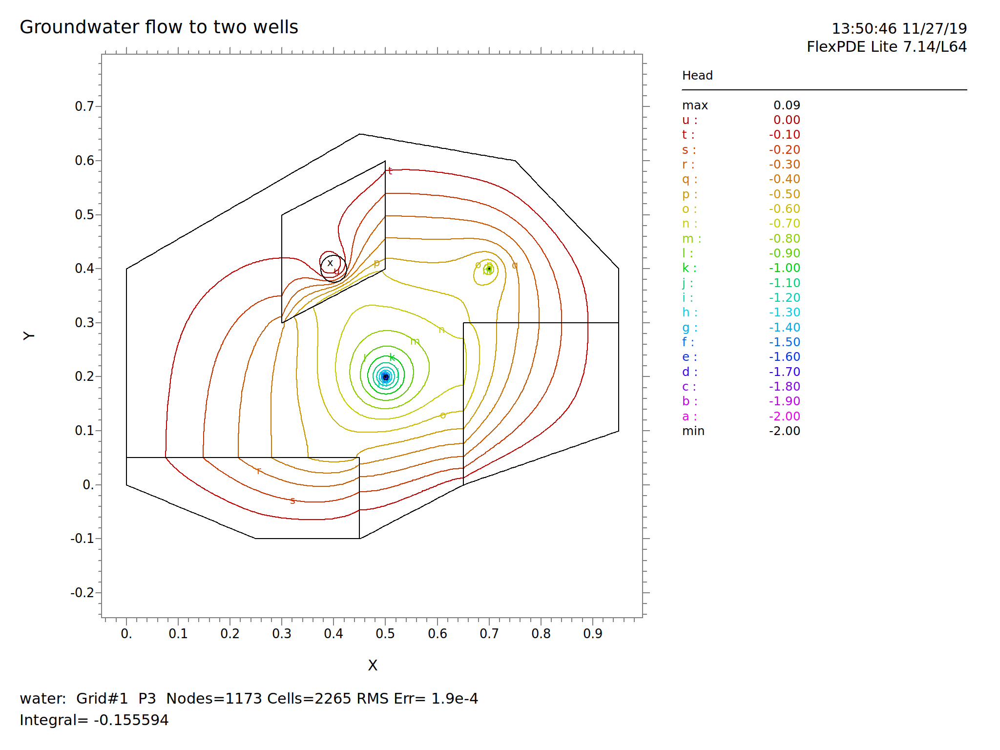
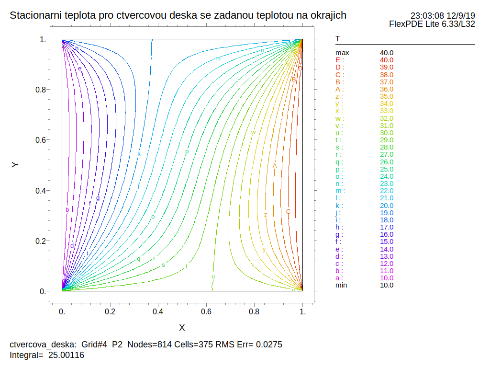
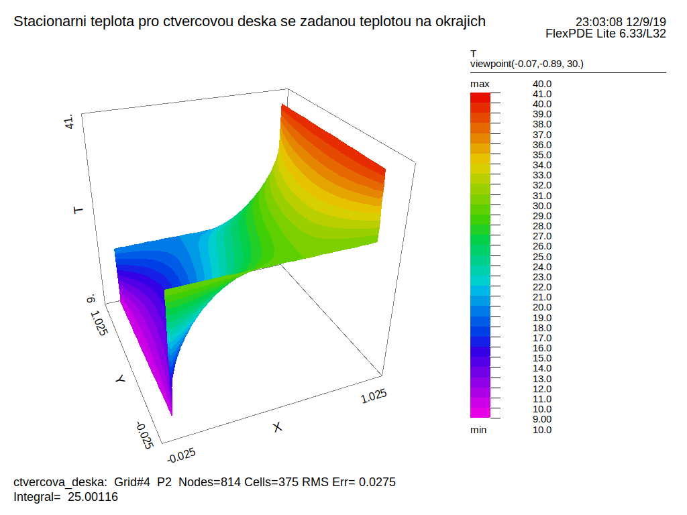

% Vybrané postupy numerické matematiky
% Robert Mařík
% listopad 2019

	
# Nondimenzionalizace a bezrozměrné veličiny

Rovnice vedení tepla v jedné dimenzi (prostup tepla stěnou, vedení
tepla tyčí) má tvar (viz minulá přednáška) $$\rho c \frac{\partial T}{\partial
t}=\frac{\partial }{\partial x} \left(D\frac{\partial  T}{\partial x}\right),$$ kde $T(x,t)$ je teplota v
místě $x$ a čase $t$, $\rho$ je hustota, $c$ je měrná tepelná
kapacita, $D$ je teplotní vodivost.
Pro homogenní stěnu nebo tyč a lineární materiálovou odezvu je $D$ konstanta a můžeme ji vytknout z derivace na pravé straně a psát
$$\rho c \frac{\partial T}{\partial
t}=D\frac{\partial^2  T}{\partial x^2}.$$
Pro úplnou formulaci úlohy na
nalezení teploty v jednotlivých místech stěny musíme zadat polohu
stěny, teplotu na vnějším a vnitřním okraji stěny a počáteční
rozložení teploty ve stěně. Nechť tedy okraje jsou $x=0$ a $x=L$, a
teploty na okrajích a počáteční rozložení teploty jsou
$$\begin{aligned}T(0,t)&=T_0\\T(L,t)&=T_1\\
T(x,0)&=f(x)\end{aligned}.$$ Analogicky jako u obdobného příkladu s
chladnutím tělesa podle Newtonova zákona (viz přednáška o
diferenciálních rovnicích) zavedeme bezrozměrnou teplotu tak, aby se
podmínky na okrajích redukovaly na konstanty. Zavedeme-li bezrozměrnou
teplotu $$\xi(x,t) =\frac{T(x,t)-T_0}{T_1-T_0}$$ a bezrozměrnou vzdálenost $\mu =\frac xL$, redukuje se model podle stejných pravidel, jaká jsme poznali u obyčejných rovnic, na
$$\begin{aligned}
\rho c \frac{\partial \xi}{\partial
t}&=D\frac 1{L^2}\frac{\partial ^2 \xi}{\partial \mu^2},\\
\xi(0,t)&=0,\\
\xi(1,t)&=1,\\
\xi(\mu,t)&=f_\xi(\mu),
\end{aligned}$$
kde $f_\xi(\mu)$ je počáteční rozložení teploty transformované do nových veličin.
Přepíšeme-li rovnici na tvar
$$\frac 1{\frac {D}{L^2\rho c}} \frac{\partial \xi}{\partial
t}=\frac{\partial ^2 \xi}{\partial \mu^2},$$
vidíme, že zavedení bezrozměrného času vztahem $\tau=\frac{Dt}{\rho c L^2}$ redukuje úlohu z původního tvaru (kde každý člen má svůj fyzikální význam a přímou interpretaci)
$$\boxed{\begin{aligned}
\rho c \frac{\partial T}{\partial
t}&=D\frac{\partial ^2 T}{\partial x},\\
T(0,t)&=T_0,\\
T(L,t)&=T_1,\\
T(x,t)&=f(x),
\end{aligned}}$$
na tvar
$$\boxed{\begin{aligned}
\frac{\partial \xi}{\partial
\tau}&=\frac{\partial ^2 \xi}{\partial \tau^2},\\
\xi(0,\tau )&=0,\\
\xi(1,\tau )&=1,\\
\xi(\mu, 0)&=f_\xi(\mu),
\end{aligned}}$$
který je mnohem jednodušší pro následnou numerickou analýzu nebo
analytické studium. Mimo jiné je tím ukázáno, že pro danou úlohu
nemají podstatný význam jednotlivé veličiny samy o sobě, ale veličina
$\tau = \frac{Dt}{\rho c L^2}$, definující bezrozměrný čas. Tato
veličina se nazývá Fourierovo číslo. Obdobným postupem získáme jiná
čísla důležitá pro popis jiných procesů, jako jsou Biotovo číslo
(vedení tepla), Reynoldsovo číslo (proudění tekutin), Froudeho číslo
(proudění tekutin) apod. Podobná nondimenzionalizace pro vlhkostní
pole ve dřevě je v publikaci Horáček P., Fyzikální a mechanické
vlastnosti dřeva. Viz též [eopora](https://is.mendelu.cz/eknihovna/opory/zobraz_cast.pl?cast=9180), rovnice (144) a rovnice následující.

# Metoda konečných diferencí

Vraťme se s aparátem matematického popisu vedení tepla k úloze hledání
rozložení teploty na čtvercové desce, kterou jsme představili v
přednášce o lineární algebře: Je dána deska čtvercového tvaru, jejíž okraje udržujeme na konstatních teplotách (každý okraj obecně na jiné teplotě) a hledáme rovnovážné rozložení teploty. Dvourozměrná rovnice vedení tepla pro homogenní izotropní desku s materiálovými charakteristikami $\rho$, $c$ a $D$ má tvar
$$\rho c \frac{\partial T}{\partial t}=D\frac{\partial^2 T}{\partial x^2}+D\frac{\partial^2 T}{\partial y^2}.$$
Ve stacionárním stavu se teplota nemění s časem a proto je levá strana nulová a rovnice se redukuje na
$$\frac{\partial^2 T}{\partial x^2}+\frac{\partial^2 T}{\partial y^2}=0.$$

Použijeme stejnou myšlenku jako v lineární algebře: rozdělíme desku
čtvercovou sítí na malé oblasti a budeme studovat teplotu v bodech
této sítě, tj. v rozích jednotlivých čtverců, na které je deska
čtvercovou sítí rozdělena.

Z přednášky o derivacích a aproximaci víme, že funkci můžeme aproximovat v okolí námi zvoleného bodu Taylorovým polynomem a v kapitole o diferenciálních rovnicích jsme tuto aproximaci použili pro aproximaci druhé derivace konečnými diferencemi ve tvaru $$f''(x)\approx \frac{1}{h^2}[f(x+h)-2f(x)+f(x-h)].$$ Podobně pro parciální derivace funkce dvou proměnných $f(x,y)$ dostáváme

$$\begin{aligned}
\frac {\partial ^2 f}{\partial x^2}&\approx \frac{1}{h^2}[f(x+h,y)-2f(x,y)+f(x-h,y)]\\
\frac {\partial ^2 f}{\partial y^2}&\approx \frac{1}{h^2}[f(x,y+h)-2f(x,y)+f(x,y-h)]
\end{aligned}
$$
a odsud
\dm$$ \frac {\partial ^2 f}{\partial x^2} + \frac {\partial ^2 f}{\partial y^2} \approx \frac{1}{h^2}[f(x+h,y)+f(x-h,y)+f(x,y+h)+f(x,y-h)-4f(x,y)]. $$
Z rovnice $$\frac {\partial ^2 f}{\partial x^2}
+ \frac {\partial ^2 f}{\partial y^2}
=0,$$
popisující rozložení teploty vyplývá, že výraz v hranaté závorce musí být nulový, tj.
$$f(x,y)=\frac 14 [f(x+h,y)+f(x-h,y)+f(x,y+h)+f(x,y-h)].$$
To však znamená, že teplota v každém uzlovém bodě je průměrem teplot v
okolních uzlových bodech. Přesně, jak jsme se (možná poněkud naivně)
domnívali při představení úlohy v přednášce z lineární algebry. Nyní
tento postup stavíme na solidní vědecký základ, založený na rovnici
popisující fyzikální proces (rovnice vedení tepla) a na numerické
aproximaci, která převede parciální diferenciální rovnici na soustavu
lineárních rovnic.

\iffalse

\fi

Výše popsaná myšlenka je základem **metody konečných diferencí.** Bohužel je tato metoda 
poměrně omezená nutností, mít ekvidistantní rozložení uzlů. Proto se v
praxi používají vyspělejší metody, metoda konečných prvků nebo metoda
konečných objemů. Základní myšlenka je stejná (parciální diferenciální
rovnice se převede na soustavu lineárních rovnic) a praktické
provedení zpravidla matematicky triviální, protože vše potřebné pro
výpočty je předprogramováno v softwaru určenému pro danou úlohu. Máme
takto software umožňující simulovat vedení tepla, tepelné úniky,
tepelné nebo mechanické namáhání, tok podzemní i povrchové vody a
další důležité praktické aplikace. Uživatel jenom zadá geometrii, typ
problému a okrajové a počáteční podmínky a program vypočte potřebná
řešení a dle požadavků je různým způsobem interpretuje.

# Ukázka programu FlexPDE

Existuje široká škála programů pro řešení diferenciálních rovnic. V
mnoha jsou předpřipravené modely, předdefinované fyzikální úlohy a
někdy dokonce databáze materiálových vlastností. V jiných programech
je řešená rovnice plně pod kontrolou autora modelu a je možné snadno
řešit i multifyzikální úlohy (například současně modelovat teplotu a
vlhkost v materiálu). Zástupce druhé skupiny je FlexPDE firmy [PDE
Solutions Inc.](https://www.pdesolutions.com/) Úloha s rozložením
tepoty na čtvercové desce se zadanými teplotami na okrajích, na kterou
jsme několikrát jako na motivaci narazili v lineární algebře a
připomněli na předchozím slidu, by měla následující zápis a výstup.

~~~
TITLE 'Stacionarni teplota pro ctvercovou desku se zadanou teplotou na okrajich' 
VARIABLES T 
EQUATIONS T: div(grad(T))=0
INITIAL VALUES T=10

BOUNDARIES
REGION 1
    START(0,0) VALUE(T)=30 LINE TO (1,0) 
    VALUE(T)=40 LINE TO (1,1)
    VALUE(T)=20 LINE TO (0,1) 
    VALUE(T)=10 LINE TO CLOSE 

PLOTS
  CONTOUR(T)
  SURFACE(T)
END
~~~

Rovnice je v popisu modelu zadána jako divergence gradientu, což v kartézských souřadnicích ve 2D vede právě na rovnici 
$$\frac{\partial^2 T}{\partial x^2}+\frac{\partial^2 T}{\partial y^2}=0.$$
Jiná forma zápisu je přímo pomocí druhých parciálních derivací ve tvaru `DXX(T)+DYY(T)=0`.

