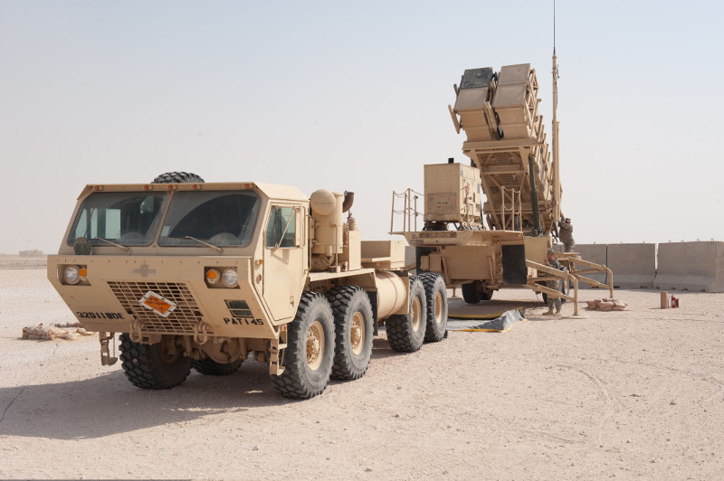

% Diferenciální rovnice 
% Robert Mařík
% 26.3.2019

# Obyčejná diferenciální rovnice prvního řádu

Obyčejná diferenciální rovnice je rovnice, kde vystupuje neznámá
funkce a její derivace. Setkáváme se s\ ní například všude tam, kde
rychlost růstu nebo poklesu veličiny souvisí s\ její
velikostí. Například rychlost s\ jakou se mění teplota horkého tělesa
je funkcí teploty samotné. Rychlost tepelné výměny mezi dvěma tělesy
je totiž úměrná rozdílu jejich teplot (Newtonův zákon). Takto se
přirozeně diferenciální rovnice objevují v modelech nejrůznějších dějů
jevů. Podstatu děje, který modelujeme, musí dodat fyzika, biologie
nebo jiná aplikovaná věda. To v matematice obsaženo není. Matematika
poté poslouží k analýze, jaké jsou pozorovatelné důsledky a tím se
ověří, jestli příslušná aplikovaná věda správně vystihuje podstatu
modelovaného děje.

> Definice (diferenciální rovnice). *Obyčejnou diferenciální rovnicí prvního řádu rozřešenou vzhledem
> k derivaci* (stručněji též diferenciální rovnicí, DR) s neznámou $y$
> rozumíme rovnici tvaru $$ \frac{\mathrm{d}y}{\mathrm{d}x}=\varphi(x,y) \tag{1}$$ kde $\varphi$ je funkce
> dvou proměnných.

(anglicky ordinary differential equation, ODE)

**Další formy zápisu** rovnice (1) jsou
  $$y'=\varphi(x,y),$$
  $${\mathrm{d}y}=\varphi(x,y)\mathrm{d}x,$$
  $${\mathrm{d}y}-\varphi(x,y)\mathrm{d}x=0.$$

**Příklad.**  Najděte všechny funkce splňující $y'=2xy$. (Naučíme se řešit později.)

Diferenciální rovnice udává scénář vývoje systému. K\ jednoznačnému
předpovězení budoucího stavu je ovšem nutno znát nejenom, jaký
mechanismus ovlivňuje vývoj systému, ale také stav současný.

> Definice (počáteční podmínka, Cauchyova úloha). Nechť $x_0$, $y_0$ jsou reálná čísla. Úloha najít
> řešení rovnice  
> $$  \frac{\mathrm{d}y}{\mathrm{d}x}=\varphi(x,y), \tag{1}$$
> které splňuje zadanou *počáteční podmínku*
> $$  y(x_0)=y_0 \tag{2}$$
> se nazývá *počáteční* (též *Cauchyova*) *úloha*. 
> 
> Řešení Cauchyovy úlohy nazýváme též *partikulárním řešením
> rovnice*. Graf libovolného partikulárního řešení se nazývá *integrální
> křivka*.

(anglicky initial condition, IC, initial value problem, IVP)

**Příklad.** Najděte všechny funkce splňující $y'=2xy$ a $y(0)=3$. (Naučíme se řešit později.)

> Věta (existence a jednoznačnost řešení Cauchyovy úlohy). Má-li funkce $\varphi (x,y)$ ohraničenou parciální derivaci $\frac{\partial \varphi}{\partial y}$ v okolí počáteční podmínky, potom má počáteční úloha (1)-(2) právě jedno řešení definované v nějakém okolí počáteční podmínky.

**Příklad.** Rovnice $$y'=y\tag{3}$$ má řešení $y=e^x$, což nahlédneme
  snadno, protože exponenciální funkce se nemění
  derivováním. Dosazením je možné ukázat, že má dokonce řešení
  $$y=Ce^x,\tag{4}$$ kde $C$ je libovolné číslo.

**Příklad.** Řešení počáteční úlohy $$y'=y, \quad y(x_0)=y_0$$ najdeme tak, že využijeme řešení (4) a zařídíme, aby byla splněna počáteční podmínka. Tj. řešením počáteční úlohy je
  $$y=  (y_0 e^{-x_0}) e^x.$$ Vidíme, že toto řešení existuje pro každou počáteční podmínku a proto vzorec (4) popisuje dokonce **všechna** řešení rovnice (3).

# Obecné a partikulární řešení

Řešení diferenciální rovnice je nekonečně mnoho. Zpravidla je dokážeme
zapsat pomocí jediného vzorce, který obsahuje nějakou (alespoň do
jisté míry libovolnou) konstantu $C$. Takový vzorec se nazývá **obecné
řešení rovnice**. Pokud není zadána počáteční podmínka a mluvíme o
**partikulárním řešení**, máme tím na mysli jednu libovolnou funkci
splňující diferenciální rovnici.

**Příklad:** Obecným řešením diferenciální rovnice $$y'=2xy$$ je
  $$y=Ce^{x^2}, \quad C\in\mathbb{R}.$$ Žádná jiná řešení neexistují,
  všechna řešení se dají zapsat v tomto tvaru pro nějakou vhodnou
  konstantu $C$.  Partikulárním řešením je například
  $y=5e^{x^2}$. Řešením počáteční úlohy $$y'=2xy, \quad y(0)=3$$ je
  $$y=3e^{x^2}.$$

\iffalse

**Online řešiče ODE (symbolicky):**

* [Wolfram Alpha](http://www.wolframalpha.com/input/?i=solve+y%27%2Bx*y%3Dx%2Fy)
* [Mathematical Assistant on Web](http://um.mendelu.cz/maw-html/index.php?lang=cs&form=ode&ode2=y%27%2Bx*y%3Dx%2Fy)
* [Sage](http://user.mendelu.cz/marik/akademie/sagecell.php?short=1&in=y%3Dfunction%28%27y%27%2Cx%29%0A%0A%23+rovnice+y%27%3Dy%2Fx%2B1%0Arovnice+%3D+diff%28y%2Cx%29+%3D%3D+y%2Fx+%2B+1%0A%0A%23+%3Fe%3Fen%3F%0Adesolve%28rovnice%2C+y%29.show%28%29%0A%23+%3Fe%3Fen%3F+v+rozn%3Fsoben%3Fm+tvaru%0Adesolve%28rovnice%2C+y%29.expand%28%29.show%28%29)

\fi

# Příklad - tepelná výměna

\iffalse

\fi

* Z fyziky víme, že *rychlost tepelné výměny mezi dvěma tělesy je úměrná rozdílu jejich
  teplot* (Newtonův zákon).
* Z přednášek o derivacích víme, že rychlost je matematicky
  derivace. Proces tepelné výměny probíhající podle Newtonova zákona
  je tedy možno modelovat diferenciální rovnicí $$ \frac{\mathrm
  dT}{\mathrm dt}=-k(T-T_0).  $$
* Rovnice udává, že teplota $T$ horkého tělesa se mění (rychlost změny
  je derivace) tak, že klesá (znaménko minus) rychlostí úměrnou
  (konstanta $k$) teplotnímu rozdílu mezi teplotou tělesa a teplotou
  okolí $T_0$ (člen $T-T_0$).
* K rovnici v ideálním případě dodáváme materiálovou charakteristiku
  (konstantu úměrnosti $k$) a počáteční teplotu. Řešením rovnice je
  funkce udávající závislost teploty na čase. Chceme-li znát teplotu
  za určitý čas, není nutné provádět pokus a čekat na uplynutí
  požadované doby. Můžeme teplotu přímo vypočítat.
* Někdy může být vhodné nesledovat teplotu $T$, ale rozdíl oproti
  okolní teplotě, $\tau=T-T_0$. Rovnice se potom zjednoduší na $$
  \frac{\mathrm d\tau}{\mathrm dt}=-k\tau,$$
  tedy na rovnici, kdy rychlost změny je úměrná funkční hodnotě.

# Příklad - datování pomocí uhlíku

\iffalse

\fi

* Při datování archeologických nálezů pozůstatků živých organismů se
  využívá fyzikálního poznatku, že radioaktivní prvky se rozpadají
  rychlostí, která je úměrná množství dosud nerozpadnutého materiálu.
* Rychlost, s jakou se mění množství (a tedy i koncentrace $y$ v daném
  vzorku) nerozpadnutého radioaktivního materiálu je tedy matematicky popsána rovnicí
  $$\frac{\mathrm dy}{\mathrm dt}=-\lambda y,$$
  kde $\lambda$ je konstanta úměrnosti. Tato rovnice je přirozeným
  důsledkem toho, že pro daný nestabilní izotop mají všechny atomy
  stejnou pravděpodobnost, že u nich dojde k rozpadu a tato
  pravděpodobnost se s časem nemění.
* Vhodný radioaktivní prvek vybereme podle toho, jak starý vzorek
  chceme datovat. Nejčastěji měříme množství radioaktivního uhlíku
  $^{14}C$ vztažené k množství stabilního $^{12}C$. Počáteční podmínka
  je známa (předpokládáme stejný poměr zastoupení jako relativně
  nedávno, před průmyslovou revolucí) a díky tomu můžeme najít funkci
  udávající, jak s časem klesá zastoupení radioaktivního uhlíku. Obsah
  radioaktivního i stabilního uhlíku je možné změřit a tím získáme
  odhad, kolik procent radioaktivního
  uhlíku se rozpadlo. Řešení počáteční úlohy poté použijeme pro odhad
  doby, kdy organismus přestal spotřebovávat uhlík z atmosféry,
  tj. odhad stáří vzorku.
* Při pokusu o datování kostí dinosaurů klesne množství
  radioaktivního uhlíku pod měřitelnou úroveň. Proto se
  v tomto případě používají látky s delším poločasem rozpadu.

# Příklad - rovnice samočištění jezer

\iffalse

\fi

* Nechť veličina $y$ udává množství látky, která znečišťuje vodu v\ jezeře o\ objemu $V$.
* Předpokládejme, že do jezera přitéká čistá voda a stejnou rychlostí
  odtéká voda s\ nečistotami (hladina se nemění, je v\ ustáleném
  stavu). Nechť veličina $r$ udává, jaký objem vody se v\ jezeře takto
  vymění za jeden den.  Předpokládejme dále (poněkud nerealisticky),
  že rozdělení znečišťujících částic v\ jezeře je rovnoměrné.
* Úbytek hmotnosti nečistot za časovou jednotku je dán derivací
  $\frac{\mathrm dy}{\mathrm dt}$.
* Tento úbytek hmotnosti je možno vyjádřit též ve tvaru $\frac rVx$, kde
  $\frac rV$ je pro dané jezero kladná konstanta udávající, jak velká
  část z\ celkového množství vody se v\ jezeře vymění za časovou jednotku.
  Označíme-li tuto konstantu symbolem $k$, je proces úbytku nečistot
  v\ jezeře popsán diferenciální rovnicí
  $$
  \frac{\mathrm dy}{\mathrm dt}  =-ky.
  $$
* Výše uvedená rovnice na nazývá *rovnice samočištění jezer*, ale
  tento název je čistě formální. Jedná se vlastně o stejnou rovnici,
  která popisuje radioaktivní rozpad nebo
  změnu rozdílu mezi teplotou horkého nápoje a místnosti při chladnutí
  nápoje.
* Stejnou rovnicí je možné popsat nejenom odbourávání nečistot z
  životního prostředí, ale i odbourávání léků nebo drog z
  těla. Považujme krevní oběh za jezero a lék nebo drogu za
  znečišťující látku. V případě, že rychlost odbourávání je úměrná
  koncentraci (platí pro farmakokinetiku prvního řádu, toto splňuje
  většina léčiv za běžných koncentrací), řídí se proces odbourávání
  stejnou diferenciální rovnicí.

\iffalse

# Příklad - akutní normovolemická hemodiluce

* Při chirurgické operaci dochází ke krvácení. Pacient ztrácí krev s
  ní i krvinky. Při konstantní intenzitě krvácení to znamená, že
  pacient ztrácí krvinky rychlostí úměrnou počtu krvinek. Formálně na
  krvinky v krvi můžeme pohlížet stejně jako na znečištění
  jezera. Jedná se o stejný proces vyplavování látek obsažených v
  tekutině, jenom měníme interpretaci veličin.
* Pokud očekáváme takový průběh operace, že i po uvedeném poklesu bude
  pořád množství krvinek nad minimální přípustnou hodnotou, je možné
  před operací toto množství snížit tím, že se část krve odebere a
  krev se poté doplní vhodnými roztoky.
* Protože pacient bude po výše uvedeném zákroku už od začátku operace
  menší počet krvinek, ztrácí tyto krvinky pomaleji a celkový úbytek
  během operace je menší. Na konci operace se pacientovi vrátí dříve
  odebraná krev. Výsledkem je, že po operaci v jeho těle koluje více
  krvinek, než pokud by byl operován s "původní krví".
* Aby metoda fungovala, je nutné odhadnout ztrátu krve během
  operace. Modelování pomocí diferenciálních rovnic dokáže
  předpovědět, kolik krve odebrat na začátku tak, aby i po plánované
  době operace zůstaly krevní hodnoty pacienta v bezpečných
  mezích. Pokud na začátku operace část krve dáme bokem a poté tekutiny
  doplňujeme fyziologickým roztokem (s tím, že vlastní krev vrátíme po
  skončení operace), jedná se o stejný proces a stejnou rovnici jako
  samočištění jezer. Pokud krev doplňujeme během operace z krve
  dopředu odebrané,
  dokážeme model samočištění jezer modifikovat pro daný proces.
* Metoda *akutní normovolemické hemodiluce* nachází v současné praxi
  široké využití v řadě operačních oborů. Poskytuje totiž možnost
  vyhnout se podání alogenní krevní transfuze a tím eliminovat rizika
  z ní vyplývající. Současně je tato metoda výrazně finančně levnější
  a její přínos je tak i ekonomický. (Podle https://zdravi.euro.cz/)

\fi

# Příklad - vývoj populace a její ekologický lov

\iffalse

\fi

* Zkoumejme velikost $y$  určité populace, v prostředí s nosnou kapacitou $K$.
* Realistickým předpokladem dodaným biologickými vědami je, že v prostředí s omezenými úživnými
  vlastnostmi specifická míru růstu populace (rychlost s jakou
  se velikost populace zvětšuje vztažená na jednotkové množství
  populace) klesá s tím, jak se velikost populace přibližuje k nosné
  kapacitě, a rychlost růstu populace je modelována funkcí $ry\left(1-\frac yK\right)$.  Podle
  velkosti koeficientů v této rovnici dělíme živočichy na [r-stratégy
  a K-stratégy](http://cs.wikipedia.org/wiki/%C5%BDivotn%C3%AD_strategie) a
  toto dělení odráží, jak se snaží druh vyrovnávat se změnami prostředí.
* Za uvedených předpokladů je možno vývoj populace popsat rovnicí 
  $$\frac{\mathrm dy}{\mathrm dt}=ry\left(1-\frac yK\right).$$	  
* Pokud lovem snížíme přírůstky populace, můžeme tento proces modelovat rovnicí 
  $$\frac{\mathrm dy}{\mathrm dt}=ry\left(1-\frac yK\right)-h(y),$$
  kde $h(y)$ je intenzita lovu populace o velikosti $y$. Modelování
  tohoto procesu umožní nalezení ekonomicky výhodné ale přitom trvale
  udržitelné strategie lovu.

# Geometrická interpretace ODE

Protože derivace funkce v bodě udává směrnici tečny ke grafu funkce
v tomto bodě, lze rovnici $$y'=\varphi(x,y)\tag{1}$$ chápat jako předpis, který
každému bodu v rovině přiřadí směrnici tečny k integrální křivce,
která tímto bodem prochází.  Sestrojíme-li v dostatečném počtu
(například i náhodně zvolených) bodů $[x,y]$ v rovině vektory
$(1,\varphi(x,y))$, obdržíme **směrové pole diferenciální rovnice** —
systém lineárních elementů, které jsou tečné k integrálním křivkám.

Počáteční podmínka $y(x_0)=y_0$ geometricky vyjadřuje skutečnost, že graf
příslušného řešení prochází v rovině bodem $[x_0,y_0]$. Má-li tato
počáteční úloha jediné řešení, neprochází bodem $[x_0,y_0]$ žádná další
křivka. Má-li každá počáteční úloha jediné řešení (což bude pro nás
velice častý případ), znamená to, že integrální křivky se *nikde
neprotínají*.

Křivky s konstantní hodnotou $\varphi(x,y)$ mají tu vlastnost, že je
všechna řešení protínají pod stejným úhlem, měřeným od kladné části
osy $x$. Například v bodech kde platí $\varphi(x,y)=0$ míří všechny
integrální křivky vodorovně. Proto se křivky, kde je $\varphi(x,y)$
konstantní, nazývají **izokliny**.

# Numerické řešení IVP

Řešení počáteční úlohy lze numericky aproximovat poměrně snadno:
začneme v bodě zadaném počáteční podmínkou a v okolí tohoto bodu
nahradíme integrální křivku její tečnou. Tím se dostaneme do dalšího
bodu, odkud opět integrální křivku aproximujeme tečnou.  Směrnici
tečny zjistíme z diferenciální rovnice, buď přímo z derivace (Eulerova
metoda).

Počáteční úloha: $$y'=\varphi(x,y), \quad y(x_0)=y_0$$

Lineární aproximace řešení v bodě $[x_0,y_0]$: $$y=y_0+\varphi(x_0,y_0)(x-x_0).$$

Funkční hodnota v bodě $x_0+h$, kde $h$ je krok Eulerovy metody: $$y(x_0+h)=y_0+\varphi(x_0,y_0)h.$$

Iterační formule Eulerovy metody: $$\begin{aligned}x_{n+1}&=x_n+h, \\ y_{n+1}&=y_n+\varphi(x_n,y_n)h.\end{aligned}$$

Stačí tedy mít zvolen *krok* numerické
metody (délku intervalu, na kterém aproximaci tečnou použijeme) a
výstupem metody bude aproximace integrální křivky pomocí lomené čáry.

**Vylepšení**

* Pro přesnější aproximaci je možné zjemnit krok $h$ (buď všude, nebo
  jenom tam, kde "je to potřeba").
* Pro přesnější aproximaci je možné použít místo $\varphi(x_n,y_n)$
  lepší směrnici, která dokáže zohlednit, jestli se růst zrychluje
  nebo zpomaluje (metoda Runge Kutta druhého nebo čtvrtého řádu, ...).
* Modely obsahující diferenciální rovnice obsahují zpravidla sadu
  parametrů charakterizujících fyzikální vlastnosti studovaných
  objektů. Pro numerické řešení musíme těmto parametrům dát konkrétní
  hodnoty a přicházíme tak o cennou informaci, jak řešení závisí na
  těchto parametrech. Vhodnou úpravou rovnice dokážeme počet parametrů
  eliminovat. Jednoduchým a často dostatečným způsobem je volba
  jednotek, obecnější metodou je transformace diferenciální rovnice
  uvedená v následujícím textu.

**Online řešiče ODE (numericky):**

* [dfield](http://math.rice.edu/~dfield/dfpp.html)
* [Sage](http://user.mendelu.cz/marik/akademie/sagecell.php?short=1&in=f%28x%2Cy%29%3Dy*%28x-y%29%0A%0Aymin%2C+ymax+%3D+0%2C+2%0A%0Aics1%3D%5B0%2C0.1%5D%0Aics2%3D%5B0%2C1%5D%0A%0AP2%3Ddesolve_rk4%28f%28x%2Cy%29%2Cy%2Cics%3Dics1%2Civar%3Dx%2Cend_points%3D%5B0%2C3%5D%2Coutput%3D%27slope_field%27%29%0AP1%3Ddesolve_rk4%28f%28x%2Cy%29%2Cy%2Cics%3Dics2%2Civar%3Dx%2Cend_points%3D%5B0%2C3%5D%2Coutput%3D%27plot%27%2C+color%3D%27red%27%29%0A%0A%28P1%2BP2%29.show%28ymax%3Dymax%2Cymin%3Dymin%29)

# Transformace diferenciální rovnice

 ukazuje, že při modelování procesu ve zmenšeném měřítku je nutné transformovat ostatní veličiny, například čas. Pro nás klíčová slova v čase 39:21 dokumentu jsou "v přepočtu pro simulaci se jedná o zhruba čtyři sekundy". Čas ve zmenšeném modelu ubíhá jinou rychlostí než čas v reálném ději. Foto: Wikipedia.](Vajont.jpg)

Naučíme se vyjadřovat diferenciální rovnici v jiných proměnných tak,
aby bylo možné snížit počet parametrů v této rovnici. Pro jednoduchost
budeme uvažovat jenom případ, kdy nová proměnný je lineární funkcí
původní proměnné.

Uvažujme funkci $y$ proměnné $x$. Připomeneme si vzorce pro derivaci
součtu, derivaci konstantního násobku a derivaci složené funkce, ale
uvedeme si je v kontextu vhodném pro studium diferenciálních rovnic.

* Z derivace součtu a z derivace konstanty plyne pro funkci $y$ a konstantu $y_0$ vztah
 $$ \frac{\mathrm d (y\pm y_0)}{\mathrm dx} = \frac{\mathrm d y}{\mathrm dx} \pm \frac{\mathrm d y_0}{\mathrm dx} = \frac{\mathrm d y}{\mathrm dx} \pm 0= \frac{\mathrm d y}{\mathrm dx}.$$
* Z derivace konstantního násobku funkce plyne pro funkci $y$ a konstantu $k$ vztah
 $$ \frac{\mathrm d (ky)}{\mathrm dx} = k\frac{\mathrm d y}{\mathrm dx}.$$
* Z derivace složené funkce plyne pro konstantu $k$ a veličinu $X = kx$ vztah
  $$ \frac{\mathrm d y}{\mathrm d x} =    \frac{\mathrm d y}{\mathrm dX}   \frac{\mathrm d X}{\mathrm dx} =   \frac{\mathrm d y}{\mathrm d x} k   $$
  tj.
  $$  \frac{\mathrm d y}{\mathrm d X} =   \frac{\mathrm d y}{\mathrm d (kx)} =   \frac 1k \frac{\mathrm d y}{\mathrm d x}.$$
* Celkem  tedy pro $Y=k_1(y-y_0)$ a $X=k_2 x$ platí
  $$  \frac{\mathrm d Y}{\mathrm d X} =   \frac{\mathrm d \Bigl(k_1(y-y_0)\Bigr)}{\mathrm d (k_2 x)} = \frac{k_1}{k_2} \frac{\mathrm dy}{\mathrm dx}.$$
  Výraz nalevo neobsahuje konstanty, které jsou ve výrazu
  napravo. Tyto konstanty jsou v definici nových veličin $X$ a
  $Y$. Navíc odvozené vzorce silně připomínají klasické počítání se
  zlomky. Proto máme Lagrangeův tvar zápisu derivací $\frac{\mathrm
  dy}{\mathrm dx}$ při studiu diferenciálních rovnic více v oblibě než
  zápis Newtonův, $y'$.

**Příklad.** Diferenciální rovnice tepelné výměny $$\frac{\mathrm dT}{\mathrm dt}=-k(T-T_0)\tag{*}$$ obsahuje dva parametry, teplotu okolního protředí $T_0$ a konstantu $k$ související s fyzikálními vlastnostmi prostředí. Postupně můžeme posunout hodnotu $T$ o $T_0$
$$\frac{\mathrm d(T-T_0)}{\mathrm dt}=-k(T-T_0)$$
vydělit konstantou $k$
$$\frac{\mathrm d(T-T_0)}{k\mathrm dt}=-(T-T_0)$$
a přeškálovat pomocí konstanty $k$ čas
$$\frac{\mathrm d(T-T_0)}{\mathrm d(kt)}=-(T-T_0).$$
Po substituci $y=T-T_0$, $x=kt$ má rovnice tvar
$$\frac{\mathrm d y}{\mathrm d x}=-y. \tag{**}$$
Nová rovnice (**) *neobsahuje žádné parametry* a proto je pro studium
jednodušší. Přesto je v ní obsažena veškerá informace obsažená v
rovnici (*). Tuto informaci je však nutno interpretovat v kontextu
definice nových proměnných. Například to, že všechna řešení rovnice (**) konvergují k nule
znamená, že všechna řešení rovnice (*) konvergují k $T_0$. To, že řešení rovnice (**) klesne na poloviční hodnotu za čas $\ln 2$ znamená, že vzdálenost řešení rovnice (*) od rovnovážného stavu se na polovinu zmenší za čas $\frac 1k \ln 2$.

Proces eliminace parametrů z modelu popsaného diferenciální rovnicí se
nazývá nondimenzionalizace modelu, protože eliminaci parametrů je
vhodné provádět tak, aby výsledné nové veličiny vycházely bez
fyzikálních jednotek. K tomu se provádí rozbor jednotek jednotlivých
veličin. V jednoduchých případech však stačí primitivní postup
popsaný v odstavcích výše a ukázaný na příkladu.

\iffalse 

# Malá odbočka - zaokrouhlovací chyby v numerických výpočtech

Uvedli jsme, že počáteční úlohu umíme vyřešit numericky. Ukázali jsme
si základní algoritmus (Eulerův) a řekli, že existují algoritmy
pokročilejší. Na tomto místě upozorníme na záludnosti skryté v
numerických výpočtech. Je iluzorní se domnívat, že zjemněním kroku při
numerickém řešení diferenciální rovnice vždy dostaneme přesnější
řešení. Toto platí jenom dokud se nedostaneme ke kritické hodnotě
kroku, kdy další snižování vede k tomu, že zpřesnění díky kratšímu
kroku se přebije akumulovanou chybou z velkého množství výpočtů nutně
zatížených zaokrouhlováním a dalším zjemňováním přesnost ztrácíme.

Zajímavá léčka je v samé podstatě výpočtů na počítači a to v
reprezentaci desetinných čísel ve dvojkové soustavě. Například číslo
0.1 je ve dvojkové soustavě periodické! Proto desetinásobným sečtením
tohoto čísla nedostaneme (překvapivě) jedničku! Je to podobné, jako
bychom třikrát sečetli jednu třetinu v desetinném tvaru
reprezentovaném konečným počtem desetinných míst, tj. například
třikrát sečetli číslo $0.33333333$. Nedostaneme přesně jedničku. 

Tento efekt měl i tragický důsledek. Software systému protiraketového
systému Patriot počítal čas postupným přičítáním desetiny
sekundy. Protože systém byl vytvořen a testován na mobilním zařízení,
které se často restartovalo a běželo krátkou dobu, ničemu to
nevadilo. Nasazení v systému Patriot však byla chyba. Při ostrém
nasazení systém běžel dlouho, zaokrouhlovací chyba se kumulovala
například 100 hodin. I když za tu dobu chyba dosáhla pouze zlomku
sekundy, raketa letící vysokou rychlostí již byla jinde, než systém
Patriot propočítal.  Dne 25.2.1991 systém Patriot během operace
Pouštní bouře na osvobození Kuvajtu od irácké okupace nesestřelil
útočící raketu Scud a ta zabila 28 vojáků osvobozující armády a okolo
100 osob zranila.

S chybami plynoucími ze zaokrouhlování se setkáme i při výpočtech mimo modelování diferenciálních rovnic. Viz například [Floating-point arithmetic may give
inaccurate results in
Excel](https://support.microsoft.com/en-us/help/78113/floating-point-arithmetic-may-give-inaccurate-results-in-excel).

\fi

# ODE tvaru $\frac{\mathrm dy}{\mathrm dx}=f(y)$

Rovnice $$\frac{\mathrm dy}{\mathrm dx}=f(y)\tag{♣}$$ se nazývá
autonomní, nebo též nezávislá na čase. Je speciálním případem rovnice
se separovanými proměnnými, která je uvedena na dalším slidu a naučíme
se ji řešit analytickou cestou. Proto se nyní nebudeme zaměřovat na
hledání obecného řešení, ale pokusíme se popsat chování řešení, aniž
bychom tato řešení znali. Pokusíme se s co nejmenší námahou říct, jak
se budou řešení chovat.

* Je-li $f(y_0)=0$, je konstantní funkce $y(x)=t_0$ řešením rovnice
  (♣). Protože derivace konstantní funkce je nula, vidíme, že řešením
  rovnice $$f(y)=0$$ obdržíme všechna konstantní řešení rovnice (♣).
* Rovnici $$\frac{\mathrm dy}{\mathrm d x}=ky,$$ kde $k$ je konstanta,
  je možno přetransformovat na rovnici $\frac{\mathrm dy}{\mathrm d(kx)}=y$, kterou jsme studovali na jednom z úvodních slidů.  Proto není težké se přesvědčit, že obecným řešením této
  rovnice je funkce $$y=Ce^{kx}. \tag{♣♣}$$
  Jediné konstantní řešení této rovnice je $y=0$.  
    * Pro $k>0$ jsou funkce (♣♣)
    jsou neohraničené (kladné rostoucí nebo záporné klesající, podle
    znaménka konstanty $C$) na intervalu $[0,\infty)$. Jakákoliv
    odchylka od rovnovážného stavu neohraničeně naroste, konstantní
    řešení $y=0$ se proto klasifikuje jako nestabilní.
    * Pro $k<0$ je funkce (♣♣) na intervalu $[0,\infty)$
    blíží k nule. Ať je počáteční podmínka libovolná, všechna řešení se
    v čase blíží k nule. Jakákoliv
    odchylka od rovnovážného stavu neohraničeně časem vymízí. Nulové
    řešení je stabilní.

Vyzbrojeni předchozími speciálními případy budeme sledovat řešení
rovnice $$\frac{\mathrm dy}{\mathrm dx}=f(y)$$ v okolí bodu $y_0$
splňujícího $f(y_0)=0.$
To můžeme chápat tak, že modelovaný systém je ve stacionárním stavu s
konstantním řešením $y(x)=y_0$ a nějakými vnějšími vlivy došlo k
drobnému vychýlení z tohoto stavu.
Lineární aproximace (viz úvodní přednášky derivacích)
$$f(y)\approx f'(y_0)(y-y_0)$$ nám umožní rovnici aproximovat rovnicí
$$\frac{\mathrm dy}{\mathrm dx}=f'(y_0)(y-y_0)$$
neboli
$$\frac{\mathrm d(y-y_0)}{\mathrm dx}=f'(y_0)(y-y_0)$$ a po substituci $Y=y-y_0$, $k=f'(y_0)$ dostáváme rovnici
$$\frac{\mathrm dY}{\mathrm dx}=kY,$$
což je rovnice typu (♣). Stabilitu takové rovnice máme prozkoumánu a
proto můžeme udělat následující závěr.

> Věta (stabilita konstantních řešení). Jestliže platí $f(y_0)=0$, je konstantní funkce $y(x)=y_0$ konstantním
řešením rovnice $$\frac{\mathrm dy}{\mathrm dx}=f(y).$$ Toto řešení je
stabilní pokud $f'(y_0)<0$ a nestabilní pokud $f'(y_0)>0$.

# ODE tvaru $\frac{\mathrm dy}{\mathrm dx}=f(x)g(y)$ (rovnice se separovanými proměnnými)

> Definice (ODE se separovanými proměnnými). Diferenciální rovnice tvaru
> $$    y'=f(x)g(y) \tag{S}$$
> kde $f$ a $g$ jsou funkce spojité na (nějakých) otevřených intervalech
> se nazývá *obyčejná diferenciální rovnice se separovanými proměnnými.*

**Příklad:** Rovnice $$y'+xy +xy^2=0$$ je rovnicí se separovanými
  proměnnými, protože je možno ji zapsat ve tvaru $$y'=-xy(y+1).$$
  Rovnice $$y'=x^2-y^2$$ není rovnice se separovatelnými proměnnými.

# Řešení ODE se separovanými proměnnými

1.  Má-li algebraická rovnice $g(y)=0$ řešení $k_1$, $k_2$, …, $k_n$,
    jsou konstantní funkce $y\equiv k_1$, $y\equiv k_2$, …,
    $y\equiv k_n$ řešeními rovnice.

2.  Pracujme na intervalech, kde $g(y)\neq 0$ a odseparujeme proměnné.
    $$          \frac{\mathrm{d}y}{g(y)}=f(x)\mathrm{d}x$$

4.  Získanou rovnost integrujeme. Tím získáme obecné řešení v implicitním tvaru.
    $$
          \int \frac{\mathrm{d}y}{g(y)}=\int f(x)\mathrm{d}x+C$$

5.  Pokud je zadána počáteční podmínka, je možné ji na tomto místě
    dosadit do obecného řešení a určit hodnotu konstanty $C$. Tuto
    hodnotu poté dosadíme zpět do obecného řešení a obdržíme řešení
    *partikulární*.

6.  Pokud je to možné, převedeme řešení (obecné nebo partikulární) do
    explicitního tvaru (vyjádříme odsud $y$).

Poslední krok (převod do explicitního tvaru) je volitelný, zpravidla
záleží na tom, co dalšího hodláme s řešením dělat. Pro většinu výpočtů
je však explicitní tvar vhodnější než tvar implicitní a proto se o něj
vždy snažíme.

V případě počáteční podmínky $y(x_0) = y_0$ je možné spojit třetí a čtvrtý krok a použít určitý integrál
$$
\int_{y_0}^y \frac{\mathrm{d}t}{g(t)}=\int_{x_0}^x f(t)\mathrm{d}t.
$$

