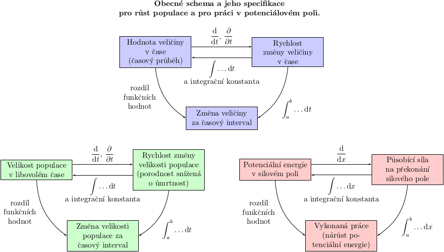

% Shrnutí za předmět Matematika
% Robert Mařík
% květen 2020

# Čísla a funkce

* K měření množství čehokoliv potřebujeme *čísla*.
* K vyjadřování vztahů mezi dvěma nebo více veličinami potřebujeme *funkce*.
    * Rostou obě veličiny současně? *rostoucí funkce*
    * Je růst jedné veličiny spojený s poklesem druhé?  *klesající funkce*
    * Lze z výstupu funkce zrekonstruovat vstupní data? Jak? *prostá funkce*, *inverzní funkce*

# Derivace

K měření rychlosti změn potřebujeme *derivace*.

* Derivace veličiny podle času udává rychlost změny veličiny v čase.
* Derivace veličiny podle prostorové souřadnice (jednorozměrný gradient) udává rychlost změny veličiny ve směru příslušné prostorové osy.
* Vektor z derivací veličiny podle prostorových souřadnic (vícerozměrný gradient) udává směr a rychlost změny veličiny.

První dvě operace jsou vlastně totéž, jenom pro jinou nezávislou proměnnou a umíme je i obrátit. Pro tyto potřeby jsme zavedli pojem integrál. Třetí operaci (kdy je zadaný gradient a máme najít původí funkci) se naučíme obrátit pomocí křivkového integrálu druhého druhu, pokud se spolu setkáme v předmětu Aplikovaná matematika v navazujícím studiu.

Symbolicky zapsáno, platí
$\int_a^b f(t)\mathrm dt=F(b)-F(a)$, kde $\int f(t)\,\mathrm dt=F(t)$ tj. $F'(t)=\frac{\mathrm dF}{\mathrm dt}=f(t)$.

# Lineární aproximace

*Vstup:* $y=f(x)$, $x=x_0$ *Výstup:* Aproximave funkce $f(x)$  v okolí bodu $x_0$ přímkou.

$$f(x)\approx f(x_0)+f'(x_0)(x-x_0)$$

* Výraz $f'(x_0)$ je změna funkce $f$ vyvolaná jednotkovou změnou proměnné $x$
* Výraz $x-x_0$ je změna ve vstupních datech, pokud hodnotu $x_0$ změníme na $x$
* Výraz $f'(x_0)(x-x_0)$ je odhad změny funkce $f$, pokud hodnotu $x_0$ změníme na $x$

Využití:

a) **Konstitutivní zákony** v 1D, kdy bereme $x_0=0$ a $f(x_0)=0$.
$$f(x)\approx 0+f'(0)(x-0)=kx$$
b) **Newtonova metoda** používá aproximaci pro $x_0=x_n$, $x=x_{n+1}$ a $f(x_{n+1})=0$, tj. 
$$0=f(x_n)+f'(x_n)(x_{n+1}-x_n)$$ a odsud
$$x_{n+1}=x_n-\frac {f(x_n)}{f'(x_n)}.$$
c) **Konstitutivní zákony ve 2D a 3D,** kdy rozšiřujeme zákon z 1D do vícerozměrného vztahu mezi vektory $$\vec j=A\vec q,$$
kde $\vec j$ je tok, $A$ symetrická matice a $\vec q$ podnět vyvolávající tok $\vec j$. V tomto případě nás zajímají vlastní směry jako neulové vektory splňující $$A\vec u=\lambda \vec u$$ pro vhodné reálné číslo $\lambda$. Pokud jsou  vlastní směry v souřadnicových osách, je matice $A$ diagonální a v diagonále jsou její vlastní čísla.

# Diferenciální rovnice

Pokud neznám časový průběh veličiny ani její rychlost, ale vím, jak spolu hodnoty veličiny s rychlostí souvisí, příslušným matematickým modelem je diferenciální rovnice.

* Obecná diferecnciální rovnice prvního řádu je $$\frac{\mathrm dy}{\mathrm dt}=f(y,t),$$
my jsme se naučili řešit dvojí integrací rovnice se separovanými proměnnými ve tvaru $$\frac{\mathrm dy}{\mathrm dt}=f(y)g(t).$$
* Diferenciální rovnice tvaru $$\frac{\mathrm dy}{\mathrm dt}=f(y)$$ má monotonii řešení dánu znaménkem pravé strany a odsud mohu posoudit i stabilitu konstantních řešení.
* Diferenciální rovnice tvaru $$\frac{\mathrm dy}{\mathrm dt}=f(y)-g(y)$$ je stejného typu jako předchozí rovnice a monotonie řešení stabilita vyplyne ze vzájemného srovnání obou funkcí na pravé straně.

# Transportní děje

Tento přístup používáme v situacích, kdy rychlost změny veličiny souvisí se změnami v toku, který tuto veličinu přenáší.

Celkovou bilanci je možno vyjářit vztahem dávajícím do relace rychlost akumulace stavové veličiny a součet přírůstku ze zdrojů s přírůstkem díky toku.
$$\frac{\partial u}{\partial t}=\sigma -\nabla\cdot\vec j$$

* Výraz $\vec j$ vyjařuje tok (přesněji hustotu toku).
* Výraz $\nabla\cdot\vec j$ vyjadřuje nárůst hustoty toku, tj. jeho zesílení v daném místě.
* Výraz $-\nabla\cdot\vec j$ vyjadřuje pokles hustoty toku, tj. jeho zeslabení toku v daném místě.

Celková bilance se nazývá rovnice kontinuity.

# Od gradientu k toku

Gradient vyjadřuje směr a intenzitu růstu skalární veličiny. Tok je iniciován záporně vzatým gradientem (směr a intenzita poklesu).

Od záporně vzatého gradientu k toku nás odvedou konstitutivní zákony. Tyto umíme formulovat v jedné i více dimenzích a zpravidla je formulujeme v lineární aproximaci.

Tok je vyvolán nerovnoměrnostmi v prostorovém rozložení veličiny, tj. *gradientem*.

## Jedna dimenze

V 1D je nárůst vyjádřen prostorovou derivací $\frac{\partial u}{\partial x}$ (jednorozměrný gradient) a pokles výrazem $-\frac{\partial u}{\partial x}$ (záporně vzatý jednorozměrný gradient). Tok je $$\vec j=- k \frac{\partial u}{\partial x},$$ kde $k$ je reálná konstanta.

## Více dimenzí

* Ve 2D a 3D je nárůst vyjádřen gradientem $\nabla u=\begin{pmatrix}\frac{\partial u}{\partial x}\\\vdots\end{pmatrix}$ a pokles záporně vzatým gradientem $-\nabla u$. Tok je $$\vec j=- D \nabla u,$$ kde $D$ je $2\times 2$ nebo $3\times 3$ matice.

# Difuzní rovnice

Difuzní rovnice vznikne spojením rovnice kontinuity $$\frac{\partial u}{\partial t}=\sigma -\nabla\cdot\vec j$$
a konstitutivního zákona $$\vec j=- D \nabla u,$$ do jedné rovnice
$$\frac{\partial u}{\partial t}=\sigma -\nabla\cdot\left(- D \nabla u\right)$$
tj. 
$$\frac{\partial u}{\partial t}=\sigma +\nabla\cdot\left( D \nabla u\right)$$

a) Transport vázané vody ve dřevě, kdy hustotou stavové veličiny je koncentrace vody a rovnice je bezzdrojová, tj. $$\frac{\partial u}{\partial t}=\nabla\cdot\left( D \nabla u\right)$$
b) Transport energie vedením tepla, kdy hustotou stavové veličiny je hustota energie (entalpie), platí $$\frac{\partial E}{\partial t}=\rho c \frac{\partial T}{\partial t}, \quad \sigma=0$$
$$\vec j=-k\nabla T$$
$$\rho c\frac{\partial T}{\partial t}=\nabla\cdot\left(k\nabla T\right).$$

# Numerická aproximace

1. Rovnice, viz Newtonova metoda.
2. Derivace aproximujeme pomocí dvou nebo tří po sobě jdoucích hodnot. $$\begin{aligned}\frac{\mathrm df}{\mathrm dx}&=\frac{f(x+h)-f(x)}{h}+O(h)\\\frac{\mathrm df}{\mathrm dx}&=\frac{f(x+h)-f(x-h)}{2h}+O(h^2)\\ \frac{\mathrm d^2f}{\mathrm dx^2}&=\frac{f(x+h)-2f(x)+f(x-h)}{h^2}+O(h^2)\end{aligned}$$ Při použití v rovnici vedení tepla nebo v difuzní rovnici vede na soustavu lineárních rovnic $AX=B$. Tato soustava může být velká (stovky rovnic a proměnných)  a je velmi řídká (v každé rovnici několik málo neznámých). Proto řešíme numerickými metodami odvozenými pro tyto typy soustav.
3. Integrál můžeme aproximovat lichoběžníkovou metodou jako obsah pod lomenou čarou.
4. Diferenciální rovnici $$\frac{\mathrm dy}{\mathrm dt}=f(y,t)$$ můžeme aproximovat podobně jako ve druhém případě, ale s výhodou, že rovnice se dají řešit postupně od počáteční podmínky dopředu nebo dozadu.
$$\begin{aligned}y_{n+1}&=y_n+f(y_n,t_n)h \\ t_{n+1}&=t_n+h\end{aligned}$$

<!--
# Co tu najdete

* Definice jsou neformální, vyjádřeny slovně a proto někdy bohužel poněkud vágně.
* Hlavní je uvědomit si při druhém čtení souvislosti mezi pojmy a aplikační potenciál jednotlivých pojmů.

# Vlastnosti funkcí

## Prostá funkce

* Definice:  Prostá funkce nabývá každou funkční hodnotu jenom jednou.
* Lze u ní zrekonstruovat vstupní data, tj. definovat inverzní funkci.
* Pokud v rovnici vystupují prosté funkce, dá se tato rovnice řešit
  (pomocí inverzních funkcí).

## Rostoucí funkce

* Definice: Rostoucí funkce  zachovává uspořádání vzorů i pro funkční hodnoty.
* Rostoucí funkční můžeme detekovat pomocí znaménka derivace.
* Podobně je definována klesající funkce. U spojitých funkcí změna
  růstu na klesání nebo naopak signalizuje lokální extrém.
* Monotonie umožní modifikovat úlohu na lokální extrémy. Například úloha s nosníkem maximální tuhosti: úloha $x^3\sqrt{1-x^2}\to\max$ je na intervalu $x\in (0,\infty)$
  ekvivalentní mnohem jednodušší úloze pro druhou mocninu funkce,
  tj. $x^6(1-x^2)\to\max$.

## Spojitá funkce

* Definice: Spojitá funkce má v každém bodě stejnou limitu a funkční hodnotu.
* Nespojité funkce jsou nepředvídatelné a jejich chování je
  neintuitivní.  Například změna monotonie si bez spojitostí nemusí
  vynutit existenci lokálního extrému. Spojité jsou v určitém smyslu
  pěkné. Spojitost je vyžadována například pro Bolzanovu větu a ta je základním nástrojem pro vyšetřování průběhu funkce (umožní najít intervaly kde je fuknce kladná a záporná, kde je funkce rostoucí a klesající, kde je funkce konvexní a konkávní).
* Spojitost je automaticky zaručena, jakmile existuje derivace.
* Elementární funkce jsou spojité na svém definičním oboru.

# Derivace

## Obyčejná derivace 

* Definice: $\frac{\mathrm df}{\mathrm dx}=\lim_{h\to 0} \frac{f(x+h)-f(x)}h$
* Okamžitá rychlost změny $f$, tj. změna veličiny $f$ vztažená na
  jednotku veličiny $x$.
* Jednotka je stejná, jako bychom veličiny $f$ a $x$ dělili.   
* Derivace umožní detekovat monotonii.
* Derivace umožní kvantitativně pracovat s rychlostí změny a tím umožní lineární
  aproximaci. Ta se uplatní při přibližných výpočtech (odvození
  Newtonovy věty, u parciálních derivací odvození tenzoru malých
  deformací a odvození vzorce pro divergenci vektorového pole).
* Derivace umožní formulovat modely založené na rychlostech, kdy
  rychlost měnící se veličiny souvisí s velikostí této nebo jiné 
  veličiny. Většina fyzikálních zákonů je v tomto
  tvaru. (Např. Newtonův zákon ochlazování, rychlost s jakou se mění
  teplota tělesa při tepelné výměně je úměrná rozdílu teplot.)
* Vzorec pro derivaci složené funkce se používá i v případě, že jsou
  dvě veličiny svázány vzorcem, jedna veličina se mění zadanou
  rychlostí a snažíme se identifikovat, jakou rychlostí se mění
  veličina související. (related rates problems) 
* Vzorce pro derivaci konstantního násobku, derivaci složené funkce a derivaci součtu se (kromě přímého využití při derivování) používají často při eliminaci konstant z diferenciální rovnice. Zde vhodnou záměnou za jiné veličiny (často bezrozměrné -- nondimenzionalizace) dosáhneme toho, že úloha má menší počet parametrů a je možné ji snáze řešit, zejména pokud musíme použít numerické metody.

## Gradient

* Definice: Gradient funkce (většinou více proměnných) je vektor sestavený z parciálních derivací funkce.
* Je důležitý při studiu materiálové odezvy, protože podnětem pro reakci
materiálu bývá gradient stavové veličiny, viz například Fickův zákon,
Fourierův zákon, Darcyho zákon.
* Gradient (přesněji vektor z parciálních derivací podle prostorových proměnných) umožní formulovat fyzikální zákony charakterizující proudění stavové veličiny způsobené nerovnoměrným prostorovým rozložením této veličiny. (Například teplota se mění dodáním nebo odebráním tepla a teplo proudí ve směru daném Fourierovým zákonem. V izotropním protředí tedy ve směru gradientu teploty vynásobeného faktorem $-1$, tj. ve směru maximálního poklesu teploty.)

## Obyčejná derivace versus parciální

* Obyčejná derivace udává, jak reaguje veličina závisející na jedné
  proměnné na změnu vstupních dat. Parciální derivace udává, jak
  reaguje veličina závisející na více proměnných na změnu vstupních
  dat, pokud se mění jenom jedna z proměnných. Ostatní bereme jako
  parametry a proto se dá používat stejná pravidla pro výpočet jako u
  obyčejné derivace.
* Parciální derivace však mají smysl zejména proto, že je seskupujeme
  do operátorů jako jsou například divergence nebo gradient a tyto
  operátory jsou přirozeným jazykem pro formulaci přírodních zákonů.
* Parciální derivace umožňují studovat změny funkcí více proměnných a
  použili jsme je například pro tenzor malých deformací ve
  dvourozměrném nebo trojrozměrném případě.

# Divergence, tok a zákony zachování

* Definice: Divergence vektorového pole je celková bilance toku z
  daného místa přes hranici myšlené (nekonečně malé) množiny, dělená
  mírou (objemem ve 3D nebo plochou ve 2D) této množiny.
* V 1D je divergence parciální derivace jednorozměrného toku podle prostorové proměnné. Odpovídá to tomu, že při proudění jedním směrem (představme si nataženou hadici) nemusí v jiném průřezu být stejný průtok. 
* Rovnice kontinuity je vyjádření říkající, že rychlost změny stavové
  veličiny v daném místě je dána vydatností zdrojů v tomto místě
  zmenšené o tok z daného místa.
* K rovnici kontinuity často přidáváme konstituční zákon. Většinou má
  roli vztahu vyjadřujícího, že intenzita toku je záporně vzatý
  gradient stavové veličiny vynásobený materiálovou konstantou
  (difuzní rovnice, obecně tenzorového charakteru, tj. matice).
* Někdy nás zajímá stacionární případ, kdy je nastolena
  rovnováha. Potom $\frac{\partial u}{\partial t}=0.$
* Někdy nás zajímá případ, kdy nejsou přítomny zdroje. Potom
  $\sigma=0.$ Často toto je u rovnice vedení tepla (uvnitř dřeva
  nejsou tepelné zdroje) a vlhkosti (uvnitř dřeva se nijak
  nesyntetizuje voda).
* Výraz popisující tok, tj. $\mathrm{div}(D\nabla u)$, může mít v
  různých prostředí různou míru zjednodušení.

    * Nejjednodušší tvar je pro homogenní izotropní prostředí. Potom se jedná o rovnici typu (např. ve dvou rozměrech) $$\frac{\partial u}{\partial t}=\sigma + D\frac{\partial ^2 u}{\partial x^2}+ D\frac{\partial ^2 u}{\partial y^2}.$$
    * Pro ortotropní materiál (např dřevo) je možné identifikovat vlastní směry, ale v každém vlastním směru je jiná materiálová chrakteristika, tj. místo společného $D$ u obou členů s derivacemi podle souřadnic bude mít každý člen svoji konstantu. $$\frac{\partial u}{\partial t}=\sigma + D_x\frac{\partial ^2 u}{\partial x^2}+ D_y\frac{\partial ^2 u}{\partial y^2}$$
    * Pro ortotropní nehomogení materiál není možné pro členy v difuzní rovnici využít pravidlo pro derivaci konstanty a maximální míra zjednodušení je $$\frac{\partial u}{\partial t}=\sigma + \frac{\partial}{\partial x}\left(D_x\frac{\partial  u}{\partial x}\right) + \frac{\partial}{\partial y}\left(D_y\frac{\partial  u}{\partial y}\right).$$

# Integrály

## Neurčitý integrál

Neurčitý integrál má na vstupu funkci a na výstupu funkci. Je-li na vstupu rychlost, s jakou se mění veličina $F$ v čase, na výstupu je funkce popisující časový průběh veličiny $F$ v čase a ta je dána až na aditivní konstantu.

## Newtonův integrál

Newtonův integrál má na vstupu funkci a interval a na výstupu číselnou
hodnotu. Je-li na vstupu rychlost, s jakou se mění veličina $F$ v čase
a časový interval, na výstupu je změna veličiny $F$ za daný
interval. Ta se počítá pomocí neurčitého integrálu jako rozdíl hodnot
funkce $F$ za uvažovaný časový interval. Na aditivní konstantě u
funkce $F$ nezáleží díky tomu, že pracujeme se změnou a ne s
absolutními čísly. V případě konstantní rychlosti (integrál z
konstantní funkce) se redukuje na násobení funkce a délky
intervalu. Má tedy smysl pro procesy probíhající nekonstantní
rychlostí.

## Riemannův integrál

Na vstupu je interval a funkce, na výstupu číselná hodnota. Je odvozen
pro aditivní veličinu, kterou v případě konstantních parametrů
počítáme pomocí součinu. Pokud parametry nejsou konstantní, přechází
součin na integrál. Například práce konstantní síly je součin
velikosti síly a posunutí, ale pro proměnnou sílu musíme práci počítat
jako určitý integrál síly.

Pro spojité funkce vychází stejně jako Newtonův integrál a takto se
většinou i počítá, ale je možné jej i aproximovat numericky
(lichoběžníkové pravidlo).

## Dvojný integrál

Jako Riemannův, ale studovaná funkce je definovaná nad dvourozměrnou
množinou.

# Maticový součin

* Slouží k efektivnímu zápisu lineárních vztahů mezi vícerozměrnými
  veličinami, kdy se jednotlivé příspěvky sčítají. Například Hookův
  zákon: každá složka tenzoru napětí (definovaný působící silou) se
  může s lineární odezvou projevit deformací v kterémkoliv směru a pro
  každý směr se příspěvky od jednotlivých složek tenzoru napětí
  sčítají.
* Umožňuje definovat fyzikální zákony mezi vektory, které nemusí mít
  stejný směr (konstituční zákony jako Fickův apod).
* Umožňuje modelovat vývoj systémů se skokovou změnou v čase (Leslieho
  matice, Markovovy řetězce).
* Umožňuje efektivně zapsat soustavu lineárních rovnic.
* Umožňuje přecházet k jiným souřadnicovým systémům, např. umožňuje
  pootočení soustavy souřadnic. To se dělá zejména v případě, že v jiné soustavě je formulace problému jednodušší, například je systém charakterizován diagonální maticí, namísto symetrické matice. O jednoduchosti diagonálních matic viz níže.

# Vlastní číslo a vlastní vektor matice

* Definice: Vektor $\vec u$ je vlastní vektor matice $A$ příslušný vlastní
  hodnotě $\lambda$, pokud $A\vec u=\lambda \vec u$.
* Vlastní vektor k matici $A$ se působením matice $A$ neodchýlí od
  původního směru. V řeči materiálů tedy materiálová odezva má stejný
  směr jako podnět, pokud je podnět ve vlastním směru. Například pokud
  tlak klesá směrem, ve kterém pórovité prostředí vede nejochotněji
  tekutinu, tak tato tekutina proudí přesně ve směru maximálního poklesu tlaku. Pokud tlak klesá jiným směrem, tok tekutiny se stáčí
  do směru, ve kterém materiál vede tekutinu "ochotněji".
* Vlastní vektory a čísla odpovídají směrům, ve kterých má reakce
  materiálu na vnější podnět maximum nebo minimum.

# Transponovaná matice

* Definice: Matica transponovaná je matice, ve které jsou řádky zaměněny za sloupce.
* Slouží například při vyjádření tenzoru deformace k odfiltrování
  pootočení z matice popisující změnu polohy bodů v tělese,
  tj. (matematicky vyjádřeno) k rozkladu matice na součet symetrické a
  antisymetrické matice.
* Pro speciální matice (ortogonální) je transponovaná matice současně
  maticí inverzní. Takové matice přirozeně vychází například při
  transformaci matice do souřadnic mířících vlastními směry matice.

# Inverzní matice

* Definice: $A A^{-1}=A^{-1}A=I$
* Existuje pouze pokud je determinant matice $A$ nenulový.
* Inverzní matice se používá při studiu soustav lineárních rovnic. Teoreticky je řešením soustavy lineárních rovnic $AX=B$ vektor $X=A^{-1}B$. V praxi je výpočet inverzní matice nestabilní a používáme inverzi jenom k jednodušším maticím (Jacobiho metoda používá inverzi k diagonální matici, Gaussova-Seidelova inverzi k trojúhelníkové matici, ale obě metody jsou iterační)
* Maticový součin se používá pro vyjádření transformace souřadnic, inverzní matice je potom nástroj pro cestu zpět k původním souřadnicím. Je-li přechod mezi souřadnicemi $X$ a $X'$ dán vztahem $X=AX'$, v opačném směru platí $X'=A^{-1}X$.
* Inverzní matice se používá pro vyjádření fyzikálních zákonů v soustavách souřadnic, které vzniknou pootočením původních souřadnic. Je-li fyzikální zákon (Hookův, Fickův, ...) mezi vektory ve tvaru $Y=AX$ a přechod do čárkovaných souřadnic je umožněn rovnicemi $Y=PY'$, $X=PX'$, je $Y'=P^{-1}AP X'$ a $P^{-1}AP$ je vyjádření tenzoru $A$ v čárkovaných souřadnicích. Používá se zejména při otočení souřadnic.

# Determinant

* Charakterizuje svou nulovostí nebo nenulovostí neexistenci nebo existenci inverzní matice.
* Úloha na hledání vlastních čísel (maximální a minimální materiálová odezva na podnět) vede na výpočet jistého determinantu.

# Soustava lineárních rovnic

* Úloha na hledání vlastních směrů (směr ve kterém je extrém
  materiálové odezvy na podnět) vede na řešení jisté soustavy
  lineárních rovnic.
* Přibližné řešení difuzní rovnice nebo rovnice vedení tepla je možné
  realizovat převodem na soustavu lineárních rovnic. Například v
  metodě konečných diferencí hraje při aproximaci roli Taylorův
  polynom.
* Univerzální metodou řešení je Gaussova eliminace, numericky
  výhodnější pro soustavy s jedním řešením a pro diagonálně dominantní matice jsou iterační metody, například Jacobiho a Gaussova-Seidelova.
* Ve vektorové podobě jde o vyjádření zadaného vektoru jako lineární
  kombinace jiných zadaných vektorů. Tedy například rozklad vektoru do
  daných směrů.
  

# Diagonální matice

* Součin matice $A$ s diagonální maticí $D$ je snadné, protože v součinem $AD$ je matice, která má sloupce tvořené násobky sloupců matice $A$.
* Determinant diagonální matice je součin prvků v diagonále. 
* Vlastní čísla diagonální matice jsou právě čísla v diagonále. Příslušné vlastní vektory jsou jednotkové vektory se směru jednotlivých os.
* Po transformaci symetrické matice do soustavy souřadnic ve které osy míří do vlastních směrů je výsledná matice diagonální a proto má všechny pěkné vlastnosti uvedené v předchozích bodech.
* Soustava lineárních rovnic s diagonální maticí je triviální. Stejně tak nalezení inverzní matice je triviální záležistost. Toho můžeme využít i v případě, že soustava nemá diagonální matici, ale matici, která je k diagonální matici jenom v jistém smyslu blízká. Tovo využívají základní iterační metody pro řešení soustav, zejména Jacobiho metoda.

# Věty z diferenciálního počtu

V tomto seznamu **není** znění vět uvedených v semestru, ale je zde
naznačen jejich význam. Plné znění vět je v přednáškách (v prezentacích
žlutě).

## Věta o spojitosti elementárních funkcí

Udává, že běžné funkce jsou spojité v každém bodě, kde jsou definovány.

## Věta o souvislosti derivace a monotonie

*Má-li funkce kladnou derivaci, je rostoucí. Má-li funkce zápornou derivaci, je klesající. *

Představuje efektivní nástroj pro detekci množin, na kterých je funkce
rostoucí nebo klesající.

## Věta o lineární aproximaci

Jedno z nejdůležitějších využití derivace - lineární aproximace
funkce. Využívá se například v odvození tenzoru malých
deformací. Vztahy získané linearizací přesných zákonů se 
používají v "běžné" fyzice ($E=mgh$ nebo $E=\frac 12 mv^2$). Přes
jednoduchost může být překvapivě silná, např. u Newtonovy metody
řešení rovnic se každým krokem přibližně zdvojnásobí počet desetinných
míst, která jsou správně.

## Taylorova věta

Vyjadřuje skutečnost, že pokud se snažíme aproximovat funkci
polynomem, je při zadaném stupni polynomu optimální aproximací
Taylorův polynom. Tento polynom můžeme použít například pro aproximaci
potenciálu v okolí lokálního extrému (první derivace tam je nulová a
nijak by nepomohla) nebo pro aproximaci druhé derivace v metodě
konečných diferencí (při řešení rovnice vedení tepla přibližnými
metodami).

## Fermatova věta o lokálním extrému

Fermatova věta umožňuje soustředit se při hledání extrémů na relativně
málo bodů - na body, kde je derivace rovna nule nebo není definovaná
vůbec.

## Věta o souvislosti monotonie s lokálními extrémy

*V bodě lokálního extrému derivace buď neexistuje nebo je nulová.*

Efektivní nástroj, jak u spojitých funkcí detekovat lokální extrémy
pomocí první derivace (ta souvisí s monotonií).

## Bolzanova věta

*Funkce která je na uzavřeném intervalu spojitá a mění zde znaménko má mezi znaménkovými změnami nulový bod.*

Prostředek na nalezení intervalů, kde je zadaný výraz kladný nebo
záporný. Na této větě je založeno například hledání lokálních extrémů
pomocí derivace, protože potřebujeme intervaly, kde je derivace funkce
kladná a kde je záporná.

## Výpočet divergence

Divergence je důležitá veličina používaná pro obecnou formulaci zákonů
zachování v rovnici kontinuity. V kartézských souřadnicích je možné ji
vyjádřit pomocí parciálních derivací.

# Věty z integrálního počtu

## Věta o jednoznačnosti primitivní funkce (až na aditivní konstantu)

Udává, že pokud známe rychlost s jakou se mění funkce, je tato funkce dána jednoznačně, až na aditivní konstantu související s počáteční hodnotou.

## Věta o monotonii integrálu vzhledem k funkci

Zobecňuje názornou myšlenku, že pokud se zvýší rychlost, s jakou se mění nějaká veličina, je za stejný čas změna výraznější.

## Lichoběžníkové pravidlo

Umožňuje aproximovat určitý integrál vhodnou lineárních kombinací funkčních hodnot. Jedná se o nástroj, jak odhadnout určitý integrál bez znalosti primitivní funkce.

## Metoda per-partés

Převádí integrál z jednoho součinu na integrál z jiného
součinu. Má smysl pro případ, kdy nový integrál je jednodušší. Jedná se
o jakousi částečnou náhradu za neexistující vzorec pro integrál ze
součinu funkcí.

## Substituční metoda

Převádí integrál z jedné proměnné do jiné proměnné. Má smysl
pro případ, kdy nový integrál je jednodušší. Jedná se o jakousi
částečnou náhradu za neexistující vzorec pro integrál složené funkce.

## Integrál jako funkce horní meze

Většinou určitý integrál počítáme pomocí integrálu neurčitého. Někdy to ale nejde, protože neumíme najít primitivní funkci. V takovém případě můžeme díky této větě napsat primitivní funkci ve tvaru určitého integrálu a počítat hodnoty numericky, například lichoběžníkovým pravidlem. Tato věta otevírá cestu do světa funkcí, které nejsou elementární.

## Postačující podmínka pro existenci primitivní funkce

Udává, že prakticky zajímavé funkce (spojité) jsou vždy
integrovatelné, tj. mohou být rychlostmi změn veličin.

# Věty o diferenciálních rovnicích 

## Věta o jednoznačnosti řešení počáteční úlohy

Uváděli jsme si celkem dvě věty, které zajistí jednoznačnost
řešení. Jednu speciální pro diferenciální rovnici se separovanými
proměnnými, kdy stačí kontrolovat nenulovost pravé strany a druhou pro
obecnou diferenciální rovnici, kdy stačí kontrolovat ohraničenost
parciální derivace pravé strany podle $y$.

## Věta o stabilitě řešení rovnice $y'=f(y)$

Umožní posoudit, která řešení jsou prakticky zajímavá, bez řešení
diferenciální rovnice.

# Věty z lineární algebry

## Věta o hodnosti matice ve schodovitém tvaru

Spolu a větou identifikující operace zachovávající hodnost je to efektivní nástroj pro zjištění hodnosti matice nebo pro ověření lineární nezávislosti vektorů.

## Frobeniova věta

*Soustava lineárních rovnic má řešení právě tehdy, když hodnosti matice soustavy a rozšířené matice soustavy jsou stejné.*

Nutná a postačující podmínka řešitelnosti soustavy lineárních rovnic pomocí pojmů hodnost matice a hodnost rozšířené matice soustavy. 

## Věta o vlastních číslech symetrické matice

*Reálná symetrická matice řádu $n$ má $n$ reálných vlastních čísel (počítáno i s násobností).*

Vyjadřuje, že ve fyzikálně relevantních případech (matice je
symetrický tenzor) existují vlastní čísla a vlastní směry. To je
výhodné, protože těchto směrech je formulace fyzikálních zákonů
formálně jednodušší než ve směrech zcela obecných.

## Věta o diagonalizaci čtvercové matice

Udává přímo návod, jaká transformace převede fyzikální zákon vyjádřený
pomocí maticového násobení do co nejjednoduššího tvaru.
-->
