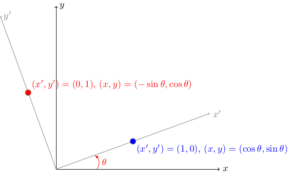
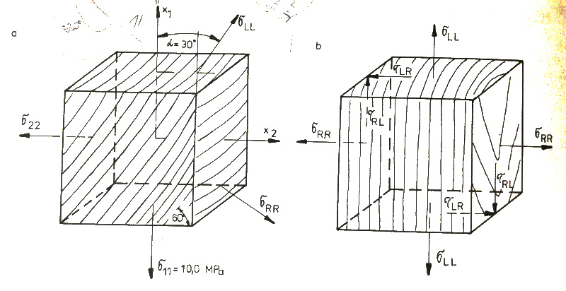
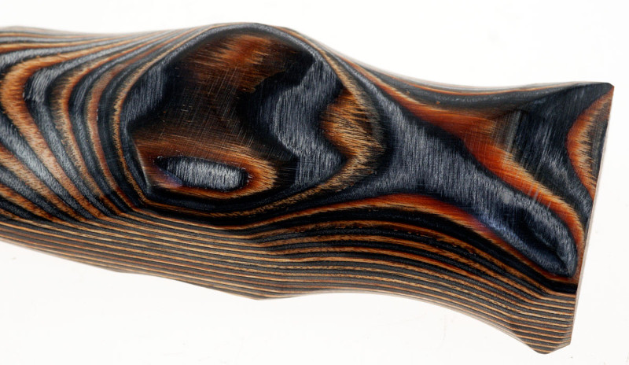

% Lineární algebra (soustavy lineárních rovnic, transformace tenzorů)
% Robert Mařík
% 16.4.2019

# Varianty zápisu soustavy lineárních rovnic

Uvažujme následující tři problémy: 

1. Najděte všechna reálná čísla $x_1$, $x_2$, splňující dvojici rovnic $$ \begin{aligned}   4x_1&+5x_2=7\\   \phantom{4}x_1&-2x_2=4 \end{aligned} $$
1. Najděte všechna reálná čísla $x_1$, $x_2$, splňující vektorovou rovnici $$   \begin{aligned} \begin{pmatrix}       4\\1     \end{pmatrix}     x_1     +     \begin{pmatrix}       5\\-2     \end{pmatrix}     x_2     =     \begin{pmatrix}       7\\4     \end{pmatrix}   \end{aligned}$$
1. Najděte všechna reálná čísla $x_1$, $x_2$, splňující maticovou rovnici $$\begin{aligned}     \begin{pmatrix}       4&5\\1&-2     \end{pmatrix}     \begin{pmatrix}       x_1\\x_2     \end{pmatrix}     =     \begin{pmatrix}       7\\4     \end{pmatrix}   \end{aligned} $$

Všechny problémy jsou ekvivalentní a jedná se o jiný zápis téhož.
Jednou však používáme soustavu rovnic, vektory a jejich lineární
kombinaci a jednou matice a maticový součin!

# Soustava lineárních rovnic

> Definice (soustava lineárních rovnic).
*Soustavou $m$ lineárních rovnic  o $n$ neznámých* nazýváme
soustavu rovnic $$ \tag{1}
\begin{gathered}
  a_{11}x_1+a_{12}x_2+a_{13}x_3+\cdots+a_{1n}x_n=b_1 \\
  a_{21}x_1+a_{22}x_2+a_{23}x_3+\cdots+a_{2n}x_n=b_2 \\
  a_{31}x_1+a_{32}x_2+a_{33}x_3+\cdots+a_{3n}x_n=b_3 \\
  \vdots \\
  a_{m1}x_1+a_{m2}x_2+a_{m3}x_3+\cdots+a_{mn}x_n=b_m 
\end{gathered} $$
Proměnné $x_1$, $x_2$, \dots, $x_n$ nazýváme *neznámé*. Reálná
čísla $a_{ij}$ nazýváme *koeficienty levých stran*, reálná
čísla $b_j$ *koeficienty pravých stran* soustavy rovnic.
*Řešením soustavy rovnic* rozumíme uspořádanou $n$-tici
reálných čísel $[t_1, t_2, \ldots, t_n]$ po jejichž dosazení za
neznámé (v\ tomto pořadí) do soustavy dostaneme ve všech rovnicích
identity.

> Definice (matice soustavy). Matici 
  $$
   A=\left(
    \begin{matrix}
      a_{11}& a_{12}& a_{13}& \cdots{}& a_{1n}\\
      a_{21}& a_{22}& a_{23}& \cdots{}& a_{2n}\\
      \vdots{} &\vdots{}& {} &\ddots{}& \vdots{}\\
      a_{m1}& a_{m2}& a_{m3}& \cdots{}& a_{mn}\\      
    \end{matrix}\right)
  $$
nazýváme *maticí soustavy* (1).
Matici $$
A_r=\left(
  \begin{array}{ccccc|c}
    a_{11}& a_{12}& a_{13}& \cdots{}& a_{1n}&b_1\\
    a_{21}& a_{22}& a_{23}& \cdots{}& a_{2n}&b_2\\
    \vdots{} &\vdots{}& {} &\ddots{}& \vdots{}&\vdots\\
    a_{m1}& a_{m2}& a_{m3}& \cdots{}& a_{mn}&b_m\\
  \end{array}
\right)
$$
nazýváme *rozšířenou maticí soustavy* (1).

# Vektorový zápis soustavy lineárních rovnic

  Soustavu (1) lze ekvivalentně přepsat do vektorového
  tvaru
$$    \begin{pmatrix}
      a_{11}\\a_{21}\\\vdots\\a_{m1}
    \end{pmatrix}
    x_1+
    \begin{pmatrix}
      a_{12}\\a_{22}\\\vdots\\a_{m2}
    \end{pmatrix}
    x_2+
    \begin{pmatrix}
      a_{13}\\a_{23}\\\vdots\\a_{m3}
    \end{pmatrix}
    x_3+\cdots+
    \begin{pmatrix}
      a_{1n}\\a_{2n}\\\vdots\\a_{mn}
    \end{pmatrix}
    x_n=
    \begin{pmatrix}
      b_{1}\\b_{2}\\\vdots\\b_{m}
    \end{pmatrix}.
 $$
  Vidíme tedy, že se vlastně jedná o\ problém, vyjádřit vektor složený
  z\ čísel na pravé straně soustavy rovnic jako  lineární
  kombinaci vektorů, které tvoří sloupce  matice
  soustavy.

# Maticový zápis soustavy lineárních rovnic
  
Soustavu (1) lze ekvivalentně přepsat do maticového
tvaru pomocí  maticového součinu
$$
\left(
    \begin{matrix}
      a_{11}& a_{12}& \cdots{}& a_{1n}\\
      a_{21}& a_{22}&  \cdots{}& a_{2n}\\
      \vdots{} &\vdots{} &\ddots{}& \vdots{}\\
      a_{m1}& a_{m2}&  \cdots{}& a_{mn}\\
    \end{matrix}\right) 
\left(  \begin{matrix}
    x_1\\x_2\\ \vdots \\x_n
  \end{matrix}
\right)    = \left(  \begin{matrix}
    b_1\\b_2\\ \vdots \\b_m
  \end{matrix}
\right).
$$
  Tento tvar se používá často v\ inženýrských výpočtech pro
  úspornost. Symbolicky zpravidla píšeme soustavu lineárních rovnic ve
  tvaru 
$$
    A\vec x=\vec b,
    $$
    nebo $$AX=B$$
  kde $A$ je  matice soustavy a $\vec b$ resp. $B$ je vektor pravých stran.

# Hodnost matice

Matice řádu $m\times n$ obsahuje celkem $m\cdot n$ čísel. Jedná se tedy
o\ relativně komplikovaný objekt. V\ matematice se často snažíme
složitější objekty nějakým způsobem charakterizovat pomocí objektů
jednodušších, např. pomocí čísel. Jedno už známe, determinant. Dalším 
z\ těchto čísel je hodnost matice, kterou si nadefinujeme nyní.

> Definice (hodnost matice).
  Buď $A$ matice. *Hodností matice* rozumíme
  maximální počet lineárně nezávislých řádků matice.
  Hodnost matice $A$ označujeme ${h(A)}$.

Poznámka: Hodnost je v anglické literatuře označována jako *rank*.

Schodovitý tvar jsme si představili u determinantu. U matice ve
schodovitém tvaru je určení determinantu velmi jednoduché. Podobný
efekt vidíme i u hodnosti.

> Definice (schodovitý tvar).
  Řekneme, že matice $A$ je ve *schodovitém tvaru*, jestliže
  případné nulové řádky jsou uspořádány na konci matice a nenulové
  jsou uspořádány tak, že každý následující řádek začíná větším počtem
  nul než řádek předchozí.

> Věta (hodnost matice ve schodovitém tvaru).
   Hodnost matice, která je ve schodovitém
  tvaru je rovna počtu jejích nenulových řádků.

**Příklad.**  Matice $A=   \begin{pmatrix}     2&2&2&3&-1&5\\     0&0&1&0&0&3\\     0&0&0&-1&2&1\\     0&0&0&0&0&0   \end{pmatrix}$ je ve schodovitém tvaru a $h(A)=3$. Matice   $B=  \begin{pmatrix}     2&2&2&3&-1&5\\      0&0&1&0&0&3\\      0&0&3&-1&2&1    \end{pmatrix}$ není ve  schodovitém tvaru a její  hodnost na první pohled nepoznáme.

# Výpočet hodnosti

Výpočet hodnosti se provádí postupným nahrazením zadané matice maticí, která má stejnou hodnost, ale postupně se přibližuje schodovitému tvaru. Uvedeme si jenom základní postup. Tento se sice dá vylepšit, pro nás je však důležité, že i bez jakýchkoliv vylepšení vždy vede k cíli. (Alespoň teoreticky.)

> Věta (řádkové operace zachovávající hodnost matice).
>  Následující operace nemění hodnost matice:
>
>  1. vynechání řádku složeného ze samých nul, nebo vynechání řádku,
    který je totožný s\ jiným řádkem, nebo vynechání řádku, který je
    násobkem jiného řádku,
 1. vynásobení nebo vydělení libovolného řádku nenulovým číslem,
 1. záměna pořadí řádků,
 1. ponechání jednoho řádku beze změny a opakované přičtení
    libovolných násobků tohoto řádku k\ nenulovým násobkům ostatních
    řádků matice.
>
>  Libovolnou matici lze konečným počtem těchto úprav převést do schodovitého tvaru.

Následující věta udává, že veškerá tvrzení, uvedená v souvislosti s
hodností pro řádky matice, se dají přeformulovat i pro sloupce matice.

> Věta. 
  Transponování nemění  hodnost matice.

# Existence a jednoznačnost řešení soustavy lineárních rovnic  

V případě, že matice soustavy je čtvercová již víme, že řešení je
určeno jednoznačně právě tehdy, když má matice soustavy matici
inverzní.  O počtu řešení v obecném případě obdélníkové matice, kdy
matici inverzní nemá smysl uvažovat, nám dávají informaci dvě
následující věty.  První se týká existence řešení a druhá identifikuje
případ, kdy řešení je určeno jednoznačně.

> Věta (Frobeniova věta, Kronecker-Capelliho věta). Soustava lineárních rovnic je řešitelná právě tehdy, když její matice soustavy a rozšířená matice soustavy mají stejnou hodnost.

> Věta (jednoznačnost řešení). Nechť soustava lineárních rovnic má řešení. Toto řešení je právě jedno, pokud je společná hodnost matice soustavy a rozšířené matice soustavy rovna počtu neznámých. V opačném případě je společná hodnost matice a rozšířené matice soustavy menší než počet neznámých. 

# Gaussova eliminace

Spočívá v reprezentaci soustavy pomocí rozšířené matice soustavy a
převodu této matice na schodovitý tvar pomocí řádkových operací
zachovávajících hodnost. Tyto operace zachovávají i množinu řešení
soustavy. Jakmile je matice ve schodovitém tvaru, zpětnou substitucí
postupně dopočítáváme jednotlivé proměnné. (Formálně to u čtvercových
regulárních matic odpovídá použití inverzní matice k matici, která má
pod hlavní diagonálou nuly. Ale postup funguje i pro obecnější matice
a dá se realizovat jednoduchými prostředky a postupným dosazováním.)

Gaussova eliminace je velice flexibilní a univerzální, umožní nám
řešit i soustavy mající nekonečně mnoho řešení. V tomto případě
dokážeme zapsat řešení pomocí parametrů.

# Gaussova-Seidelova iterační metoda

Gaussova-Seidelova iterační metoda je jakýsi mezikrok mezi Jacobiho
iterační metodou a Gausovou eliminací. Postupujeme jako v Jacobiho
metodě, ale všechny zpřesněné hodnoty použijeme okamžitě, když jsou k
dispozici. Nikoliv až v další iteraci jako u Jacobiho metody. Metoda
konverguje za stejných podmínek jako Jacobiho metoda, ale rychleji a
přesto nevznikají vyšší nároky na výpočetní výkon.

Použijeme příklad z [Wikipedie]().
Soustavu $$\begin{array}{rrrrl}
10x_1 &-   x_2 &+  2x_3 &       & = 6, \\
 -x_1 &+ 11x_2 &-   x_3 &+ 3x_4 & =  25, \\
 2x_1 &-   x_2 &+ 10x_3 &-  x_4 & =  -11, \\
      &   3x_2 &-   x_3 &+ 8x_4 & =  15.
\end{array}$$
s diagonálně dominantní maticí převedeme na iterační tvar
$$
\begin{aligned}
  x_1 & = x_2/10 - x_3/5 + 3/5, \\           
x_2 & = x_1/11 + x_3/11 - 3x_4/11 + 25/11, \\
x_3 & = -x_1/5  + x_2/10 + x_4/10  - 11/10, \\
x_4 & = -3x_2/8  + x_3/8 + 15/8.
\end{aligned}
$$
Poté vyjdeme z počátečního odhadu řešení a dosazujeme do pravých
stran.

U Jacobiho metody pro počáteční odhad vypočteme nejprve všechny
pravé strany a dosadíme do proměnných na levé straně jako zpřesnění
počáteční aproximace. Tento postup opakujeme.

U Gaussovy-Seidlovy metody nejprve pomocí počátečního odhadu vypočteme
z první rovnice $x_1$ a tuto hodnotu ihned použijeme při výpočtu $x_2$
z další rovnice. Obojí, $x_1$ i $x_2$ už využijeme při výpočtu $x_3$ a
tak dále. Po výpočtu $x_4$ je první iterace dokončena a postup opět
opakujeme, dokud dvě po sobě jdoucí iterace nejsou dostatečně blízké.

S nulovou počáteční aproximací dostáváme v prvním průchodu
$$
\begin{aligned}
x_1 & = 3/5 = 0.6, \\
x_2 & = 0.6/11 + 25/11 = 2.3272, \\
x_3 & = -0.6/5 +(2.3272)/10-11/10 = -0.9873,\\ 
x_4 & = -3(2.3272)/8 +(-0.9873)/8+15/8 = 0.8789.
\end{aligned}
$$
Jak vidno, vypočtenou hodnotu $x_1$ ihned použijeme pro výpočet $x_2$. Obě tyto hodnoty ihned použijeme pro výpočet $x_3$ a tak dále. V dalších iteracích postup [opakujeme](https://sagecell.sagemath.org/?z=eJytUMsKwjAQvBf6D0tPPlLSTVIpQs-CV69eqlYJSJRWYfP3bkwR8aAiJpDJ7swO7Jw76y6QLZvtaWPXro4nSxNCQUqQFmTqQtxvmuxPHViwDrrGHdoRFuN5mgAfj1ADKYkF5EBaljCF8MJAq0CjROQ-04w56AmZ2FEl46DUrMxZyrPTwZHRBOQZxPAZpCZI2UXJCqJvxYClrKLgeQWPwivhtfAmkuf74la4EctgZw_20tezcajVS61favNUp0k0ytZu0Vz7Pl-1dtceH0n-Fie9j5O-jpO-j5M-xfmnxG4PxZTh&lang=sage&interacts=eJyLjgUAARUAuQ==). Mimo jiné hodnoty v paměti přímo přepisujeme a nemusíme držet v paměti starou a novou hodnotu. 

# Pootočení souřadnic v rovině

V inženýrských problémech je častou aplikací lineární algebry
transformace úlohy do vhodných souřadnic, ve kterých je popis
jednodušší. Zpravidla se jedná o prosté otočení. Toto se používá při
studiu dřeva, které má anatomicky význačné směry, při studiu
vrstvených materiálů, při studiu chování vodorovně uložených
geologických vrstev. Nemusí však vždy jít jenom o materiál s
charakteristickými směry. Transformace mezi souřadnicemi se používá
například v letectví, kdy je jedna souřadná soustava spojena s trupem
a další dvě jsou pootočené ve směru křídel šípovitě připojených k
trupu.

Je-li v rovině dána souřadná soustava $(x,y)$ a soustava $(x',y')$
pootočená o úhel $\theta$ proti směru hodinových ručiček je vztah mezi souřadnicemi popsán vztahem
$$
\begin{pmatrix}
  x\\y
\end{pmatrix}
=
\begin{pmatrix}
  \cos \theta & -\sin\theta \\ \sin\theta & \cos\theta
\end{pmatrix}
\begin{pmatrix}
  x'\\y'
\end{pmatrix}.
$$
To je možné zkontrolovat podle obrázku a obrazu dvou bodů, pro další body roviny to poté funguje automaticky.
Matici transformace budeme zkráceně označovat $R$, pokud budeme potřebovat zdůraznit velikost úhlu, použijeme $R(\theta)$ a pokud budeme potřebovat matici rozepsat ve složkách, budeme zkracovat výrazy $\cos\theta$ a $\sin\theta$ na $C$ a $S$ a psát
$$R=
\begin{pmatrix}
  C & -S \\ S & C
\end{pmatrix}.
$$
Toto je snadné zkontrolovat pomocí souřadnic bodů $(x',y')=(1,0)$ a
$(x',y')=(0,1).$

V minulé přednášce jsme viděli, že je-li $A$ matice zobrazení v souřadnicích $(x,y)$, v souřadnicích $(x',y')$ má zobrazení vyjádření $R^{-1}AR,$ kde $R^{-1}=R(-\theta)=
\begin{pmatrix}
  C&S\\-S&C
\end{pmatrix}$ je matice pootočení v opačném směru. Stejným způsobem se transformují i tenzory.

V knize Podžgaj a kol., Štruktúra a vlastnosti dreva je následující
úloha. Dřevo v konfiguraci podle obrázku je namáháno pouze tahovou
silou svisle, tedy tenzor napětí má jenom jednu nenulovou
složku. Naším cílem je pootočit souřadnou soustavu tak, aby byl tenzor
napětí vyjádřen v anatomických směrech dřeva. Úloha je v knize vyřešena pomocí směrových kosinů. Ukážeme si alternativní způsob, který je výhodný v tom, že využívá pouze základní aparát lineární algebry. Původní souřadnice
$(x_1,x_2)$ označíme $(x,y)$, osa $x$ směřuje vodorovně vpravo (v obrázku $x_2$) a osa $y$ nahoru (v obrázku $x_1$). Tenzor napětí je $A=
\begin{pmatrix}
  0 & 0\\0& 10
\end{pmatrix}$ (tah pouze ve směru osy $y$). Souřadnice je nutno pootočit o $30$ stupňů po směru hodinových ručiček, tj. v záporném směru. [Nový tenzor napětí](https://sagecell.sagemath.org/?z=eJx9kDtvgzAUhXdL_g9XyhCDTGtKFXVhSLJ0aKSKFWVwwApuwUa2QUl_fc0jRRnS7T7O_XTPWcGHVIIbJYHXZ3EynMIFel1qo3slKFzB9tLWvmq1droQXqkhYWBd16rOT8E2wnTwnmHUc0PWrhKOrwOMsrThzsgLyfNCWzLOAxpZqeb6SPOloYvmePTXh-WaUealjMZs3HSVqNMoYc_xGwtbiVFrpHKgCMmebHeaKWk06IIgPIT382nsOYaXaSsHCkYYreBTlz9n_jU4bXQhR1-6vxYVfGv_Z-eTiec0MNrem0sSFnre5GIz1f7noXt5XVbwJxyd7P6B3M5myuYhZL9A4ltSU1CKbMN9uAt-AUSDllE=&lang=sage&interacts=eJyLjgUAARUAuQ==) je $$R(30^\circ)AR(-30^\circ)=
\begin{pmatrix}
   2.5 & -4.3\\
-4.3&  7.5
\end{pmatrix}.$$ V nových souřadnicích je směr $x'$ radiální a proto $\sigma_{RR}=2.5$
a $\sigma_{LL}=7.5$. Mimodiagonální složka udává komponentu $\sigma_{RL}=-4.3$. Tento výsledek je stejný, jak je uveden jiným postupem v knize. Použili jsme však jenom základní nástroje lineární algebry.

# Transformace tenzoru

Úloha na transformaci tenzoru, kterou jsme řešili na minulém slidu je
v aplikacích velmi důležitá. Proto existuje řada grafických nebo
inženýrských metod na řešení tohoto úkolu. Tyto metody jsou důvtipné a názorné, například metoda Mohrovy kružnice, oproti lineární algebře však mají zásadní nevýhodu: uživatel se musí učit něco nového. Použitím aparátu lineární algebry, stejně jako dokážeme v pootočených souřadnicích vyjádřit libovolné zobrazení, dokážeme vyjádřit v pootočených souřadnicích i libovolný tenzor. Vzorce jsou stejné a navíc při otočení v rovině je matice rotace ortogonální, tj. inverzní matice je maticí transponovanou. Pro symetrický tenzor $A=
\begin{pmatrix}
  a_{11} & a_{12} \\ a_{12} & a_{22}
\end{pmatrix}$
dostáváme v souřadnicích otočených o úhel $\theta$ proti směru hodinových ručiček
$$\begin{pmatrix}
  a'_{11} & a'_{12} \\ a'_{12} & a'_{22}
\end{pmatrix}
=
\begin{pmatrix}
  C&S\\-S&C
\end{pmatrix}
\begin{pmatrix}
  a_{11} & a_{12} \\ a_{12} & a_{22}
\end{pmatrix}
\begin{pmatrix}
  C&-S\\S&C
\end{pmatrix},
$$
kde [po výpočtu](https://sagecell.sagemath.org/?z=eJyFUMtugzAQvFvyP1hcYpCNCsdKHCKOkXLAvRFaORGolsBGxkElX981aaDpQ7G8fsx4Z8c7Sks37r12ksgkgUiJTFNy9EBOxCbECKMi66Sz6oOWZc64qFgpWF5VwG1XBtKZzwcWVgYq8wuMequ0I8GLlXpojO3MKPVEXK0vxj4fNP9zBBjtM0qL2Pm03gw1DcNoGxVhPKiub1UzvTXntqXhrcB-qXTQO9P1RtfaTT8KBMvr8qmCuV6TCuYd669fAEgu9uVJKwK_Vqf6X_c8IDAwmpO-Ne81ZQIijUSU-y7C2WP8BnDYmA9AObDQwavQ1dYst1raGe2saSVReqztRZvBPXZ25w8jOmvGw_k4UJFxEUYz8KvLn3iLnc0=&lang=sage&interacts=eJyLjgUAARUAuQ==)
$$
\begin{aligned}
a'_{11}&=C^2a_{11}  + S^2a_{22} + 2CSa_{12},\\
a'_{22}&=S^2a_{11}  + C^2a_{22} - 2CSa_{12},\\
a'_{12}&=-CSa_{11} + CSa_{22} + (C^2 - S^2)a_{12}.
\end{aligned}\tag{*}
$$
Tento vztah je lineání vzhledem ke všem komponentám a je možné jej zapsat pomocí maticového násobení
$$
\begin{pmatrix}
  a'_{11}\\a'_{22}\\a'_{12}
\end{pmatrix}
=
\begin{pmatrix}
  C^2 & S^2 & 2CS\\
  S^2 & C^2 & -2CS\\
  -CS  & CS & C^2-S^2
\end{pmatrix}
\begin{pmatrix}
  a_{11}\\a_{22}\\a_{12}
\end{pmatrix}.
$$
Tento vztah je uveden i v literatuře Podžgaj a kol., Štruktúra a vlastnosti
drevá a v e-opoře [Fyzikální a mechanické vlastnosti
dřeva](https://is.mendelu.cz/eknihovna/opory/zobraz_cast.pl?cast=9178). Zde
je také uvedena jedna z aplikací, transformace tenzoru deformací
naměřených při bobtnání dřeva do anatomických směrů dřeva. To je
možné udělat po změření sklonu vláken a pootočení tenzoru o příslušný
úhel. Získáme diagonální tenzor, který má v diagonále deformace v
anatomických osách dřeva. Jednodušší alternativou je určení vlastních hodnot
tenzoru deformace pomocí charakteristického polynomu, což je v tomto
případě polynom kvadratický. Která vlastní hodnota patří ke kterému
směru určíme ze znalosti uspořádání koeficientů bobtnání dřeva v
jednotlivých směrech podle velikosti. Při použití vlastních hodnot je
výhodou, že používáme standardní nástroje lineární algebry a metoda je
použitelná bez znalosti úhlu, který svírají vlákna dřeva s osami
soustavy, ve které určujeme tenzor deformace.

Inverzní operací je pootočení o úhel $-\theta$ a proto je snadné najít inverzní transformaci: vzhledem k sudosti funkce $\cos$ a lichosti funkce $\sin$ stačí změnit znaménko u členů s $S$, tj. 
$$
\begin{pmatrix}
  a_{11}\\a_{22}\\a_{12}
\end{pmatrix}
=
\begin{pmatrix}
  C^2 & S^2 & -2CS\\
  S^2 & C^2 & 2CS\\
  CS  & -CS & C^2-S^2
\end{pmatrix}
\begin{pmatrix}
  a'_{11}\\a'_{22}\\a'_{12}
\end{pmatrix}.
$$

**Poznámka.** Pokud vypočteme derivaci členů $a'_{11}$ a $a'_{22}$ podle $\theta$, dostaneme použitím
$$\frac{\mathrm d}{\mathrm d\theta}C^2=\frac{\mathrm d}{\mathrm d\theta}\cos^2\theta=2\cos\theta(-\sin\theta)=-2CS,$$
a analogicky
$\frac{\mathrm d}{\mathrm d\theta}S^2=2SC$, $\frac{\mathrm d}{\mathrm d\theta}CS=-S^2+C^2$ derivace 
$$
\begin{aligned}
  \frac{\mathrm d a'_{11}}{\mathrm d\theta}&=
  -2CSa_{11}+2SCa_{22}+2(C^2-S^2)a_{12}=2a'_{12},\\
  \frac{\mathrm d a'_{22}}{\mathrm d\theta}&=
  2SCa_{11}-2CSa_{22}+2(S^2-C^2)a_{12}=-2a'_{12}.\\
\end{aligned}
$$
To znamená, že lokální extrémy diagonálních prvků nastávají v
okamžiku, kdy jsou prvky mimo diagonálu nulové. Toto pozorování
pefektně ladí s výsledky, které známe v lineární algebře i bez hledání
lokálních extrémů a bez derivací a představíme na dalších
stránkách. Budeme ovšem potřebovat připomenout definici vlastních
vektorů a ukázat si jejich výpočet.

**Pozor.** V případě tenzoru deformace se někdy se namísto
mimodiagonální komponenty bere její dvojnásobek, protože ten má
názorný význam jako úhel smyku. Proto se někdy v literatuře uvádí
transformační vzorec pro deformace v upraveném tvaru, kdy u složek se
součinem $CS$ ve třetím sloupci není koeficient $2$ a u odpovídajících
složek ve třetím řádku tento koeficient naopak figuruje. Je proto
potřeba dávat pozor na to, s jakými komponentami je tenzor malých
deformací uvažován.

# Role vlastních vektorů při transformaci matic

Budeme zkoumat, kdy platí $$P^{-1}AP=D$$ pro čtvercové matice $P$, $A$
a diagonální čtvercovou matici $D$. Vynásobením maticí $P$ zleva
dostaneme
$$AP=PD.$$
Ve cvičení jsme násobili čtvercovou matici s maticí diagonální a není
těžké vidět obecný princip, že matice $PD$ má za sloupce násobky
sloupců matice $P$ s odpovídajícím číslem z hlavní diagonály matice
$D$. Například pro první sloupec matice $P$ a první číslo v hlavní
diagonále matice $D$, které označíme $\vec p_1$ a $\lambda_1$, dostáváme
$$A\vec p_1=\lambda_1p_1,$$
tj. (viz předchozí přednášky) $p_1$ je vlastní vektor matice $A$
příslušný vlastní hodnotě $\lambda_1$. Podobný princip platí pro
všechny sloupce. Je otázkou, jestli vlastních hodnot a vlastních
vektorů je tolik, kolik pro diagonalizaci "potřebujeme". Částečně
pozitivní odpověď na tuto otázku udávají věty na následujícím slidu.

# Transformace symetrické matice na diagonální tvar

> Věta (vlastní čísla symetrické matice).
> Symetrická čtvercová matice $A$  řádu $n$ má $n$ reálných vlastních čísel (počítáno i s případnou násobností).

> Věta (diagonalizace symetrické matice).
> Nechť má symetrická čtvercová matice $A$ řádu $n$ celkem $n$ reálných různých vlastních čísel $\lambda_i$. Označme odpovídajícé vlastní vektory jednotkové délky $\vec v_i$.
>
>* Matice $P$ sestavená tak, že sloupce této matice jsou tvořeny vektory $\vec v_i$ je ortogonální.
>* Matice $D$ definovaná vztahem $$D=P^TAP$$ je diagonální.
>* Diagonální prvky matice $D$ jsou právě vlastní čísla $\lambda_i$ a jsou ve stejném pořadí jako odpovídající vlastní vektory v matici $P$.

\iffalse 

\fi

Matice transformace $P$ z předchozí věty je ortogonální (její
transponovaná matice je současně její inverzní matice) a její
determinant je roven $1$ nebo $-1$. Pokud je determinant kladný,
reprezentuje matice pootočení soustavy souřadnic. Pokud je determinant
záporný, jedná se o pootočení spojené se zrcadlením jedné osy. Protože
tento případ většinou z fyzikálních důvodů nepreferujeme, sestavujeme
matici transformace tak, aby měla determinant kladný. V případě
záporného determinantu stačí prohodit dva vektory (sloupce matice
transformace) mezi sebou, nebo jeden vynásobit faktorem $-1$.

Pro kontrolu je zajímavé vědět, že determinant matice se pootočením
nemění a je tedy stejný pro původní i transformovanou matici. Totéž
platí pro součet prvků v hlavní diagonále (v lineární algebře se
nazývá stopa matice), pro charakteristický polynom a pro vlastní
hodnoty. Tenzor, jak jej uvažujeme v tomto textu, je matice, která má
navíc fyzikální význam a vzhledem ke své povaze pro ni platí speciální
transformační pravidla. Nicméně je to mimo jiné i matice a proto vše
výše uvedené platí i pro tenzory.

Ve videu [https://www.youtube.com/watch?v=xdxVpC856ms](https://www.youtube.com/watch?v=xdxVpC856ms) je pomocí vzorců odvozován diagonální tvar tenzoru napětí
$$
\begin{pmatrix}
  20 & 30 \\ 30 & -10
\end{pmatrix}.
$$
Ukážeme si řešení úlohy bez použití vzorců, jenom prostředky lineární algebry.
Charakteristický polynom této matice je
$$
\begin{vmatrix}
  20-\lambda & 30 \\ 30 & -10-\lambda
\end{vmatrix}=
(20-\lambda)(-10-\lambda)-30^2=\lambda^2-10\lambda-1100
$$
s kořeny $\lambda_1\approx 38.54$ a $\lambda_2\approx -28.54$. To
budou prvky v hlavní diagonále po transformaci tenzoru.

Pokud budeme chtít vědět, jak jsou nové osy orientovány vůči osám původním, musíme najít i vlastní vektory. Vlastní vektor příslušný hodnotě
$38.54$ je řešením soustavy s maticí soustavy
$$
\begin{pmatrix}
  -18.54 & 30 \\
  30  & -48.54
\end{pmatrix}
$$
a nulami vpravo.
Přibližným řešením je vektor $\vec u_1=
\begin{pmatrix}
  30 \\ 18.54
\end{pmatrix}$. (Toto plyne z první rovnice, druhá rovnice musí být splněna automaticky, protože jsme použili vlastní hodnotu a soustava musí mít nenulové řešení. Nicméně výpočet je zatížen zaokrouhlovací chybou.) Po vydělení normou vektoru dostáváme
$\begin{pmatrix}
  0.851 \\ 0.526
\end{pmatrix}$.
Druhý vlastní vektor je kolmý, tj. $\begin{pmatrix}
  -0.526 \\ 0.851 
\end{pmatrix}$.
Po transformaci maticí $P=
\begin{pmatrix}
  0.851 & -0.526 \\ 0.526 & 0.851
\end{pmatrix}$ [dostáváme (na dvě desetiná místa)](https://sagecell.sagemath.org/?z=eJxtkF1rgzAUhu8F_0OgN4n4kVg2ykCG7A94tV6IjEyzmlkTSeLR_vtZXUthg8DJ4bzvcz52qHVusC9JMk1TfNGjGz9FXOs-mbir21fI5mZ-H94OT8-99b0867kzcsZlmdJwT6uw3NMwYrSqCEI7tFRlLXzvmOWxkCehQNROG_th5Kl1mPgesEzhY8mq66ObazCgJIIzt-4aRbdYViWwBFistOnxIlyVAnSDFEffolHadRr0iBpx7sbFkK5o-ohuzNhe_qLTLII0gfTO_hd9Jxf3tYGFkFYkdoYrO2grNvOafi0sXi9tblewrZ5wQX4_CnMrFY6KbUISsANNBkludYSLRywJ8qBA5Ac7KIR8&lang=sage&interacts=eJyLjgUAARUAuQ==)
$$P^{T}\begin{pmatrix}
  20 & 30 \\ 30 & -10
\end{pmatrix}
P=\begin{pmatrix}
  38.54 & 0 \\ 0 & -28.54
\end{pmatrix}.
$$
To vlastně ani nemusíme počítat, věta v úvodu tohoto slidu zaručuje,
že výsledná matice bude diagonální a bude obsahovat vlastní hodnoty.
Z matice $P$ vidíme sinus a kosinus úhlu pootočení a odsud určíme
snadno, o kolik se souřadná soustava otáčí a v jakém směru.
      

