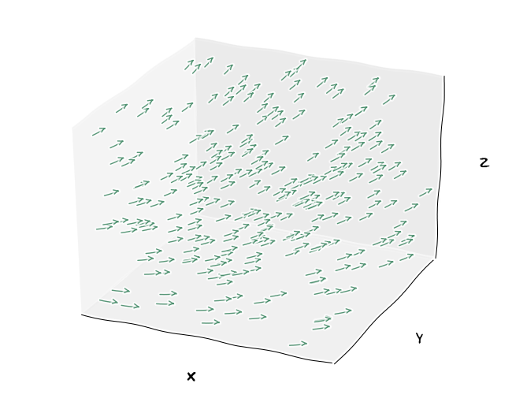
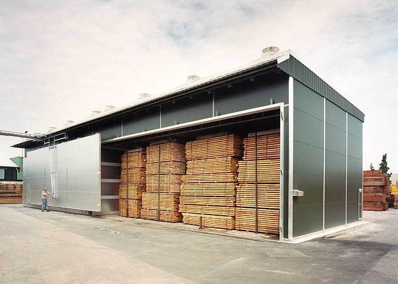

% Vektorová pole, tok, zákony zachování
% Robert Mařík
% 30.4.2019

# Připomenutí derivací

\iffalse

Každá věda se od určité úrovně automaticky stává částí matematiky. (David Hilbert, německý matematik.)

\fi

Derivace umožňují studovat a popisovat změny veličin, vyjadřovat kvantitativně jejich vzájemné souvislosti.

## (Obyčejná) derivace $\frac{\mathrm df}{\mathrm dt}$. 

* S touto derivací se pracuje u funkce jedné proměnné $f(t)$. Např. $f(t)=kt^2$, kde $k$ je parametr (reálné číslo).
* Derivace je okamžitá rychlost změny veličiny $f$ vzhledem k $t$, tj. nárůst veličiny $f$ vyvolaný jednotkovým nárůstem veličiny $t$. (Prakticky však veličinu $t$ změníme o malou hodnotu a nárůst přepočítáme na jednotovou změnu.)
* Jednotka derivace je stejná, jako bychom veličiny $f$ a $t$ dělili.
* V modelech a při praktickém využití pracujeme s definicí derivace jako s rychlostí změny. Při výpočtu ale využíváme dostupné vzorce pro výpočet derivace. Například pro funkci z prvního bodu platí $\frac{\mathrm df}{\mathrm dt}=2kt.$

## Parciální derivace $\frac{\partial f}{\partial t}$, $\frac{\partial f}{\partial x}$, $\dots$. 

* S touto derivací se pracuje u funkce více proměnných, typicky $f(x,y,z,t)$. Např. $f(x,y,z,t)=xt^2$
* Jedná se o obyčejnou derivaci podle jedné proměnné, přičemž ostatní proměnné považujeme za parametry. Tj. v případě funkce z minulého bodu je $\frac{\partial f}{\partial t}=2xt$, $\frac{\partial f}{\partial x}=t^2$,  $\frac{\partial f}{\partial y}=\frac{\partial f}{\partial z}=0$.
* Pro jednotku a výpočet platí totéž co u obyčejné derivace. 
* Při aplikacích často pracujeme s gradientem, tj. s vektorem sestaveným z parciálních derivací podle jednotlivých prostorových proměnných. Pro funkci tří proměnných $x$, $y$ a $z$ a pro 
potřeby matematické formulace fyzikálních zákonů gradient uvažujeme jako sloupcový
vektor
$$\nabla f =\begin{pmatrix}\frac{\partial f}{\partial x}\\\mathstrut \frac{\partial f \mathstrut}{\partial y \mathstrut}\\\frac{\partial f}{\partial z}\end{pmatrix}.$$
Pro úsporu místa jej někdy píšeme v transponovaném tvaru
$$\nabla f =\left(\frac{\partial f}{\partial x},\frac{\partial f}{\partial y},\frac{\partial f}{\partial z}\right)^T.$$ Gradient je vektor, který má směr odpovídající směru nejrychlejšího růstu skalární veličiny a velikost je stejná jako derivace v daném směru.

# Vektorové pole

Vektorové pole je vektorová funkce, dvou nebo tří proměnných. Můžeme
si ji představit jako zobrazení, které každému bodu v rovině nebo v
prostoru přiřadí vektor. Proto je vhodné tyto veličiny použít při
popisu proudění. Ať už hmatatelných látek (tekutina, elektrony) nebo
obecnější veličiny (teplo, elektrická intenzita). 

> Poznámka (stavová veličina). Veličiny charakterizující stav tělesa se nazývají *stavové veličiny*. Tyto veličiny závisí jenom na současném stavu a ne na historii, jak se těleso do daného stavu dostalo. Některé stavové veličiny se mohou měnit ("přenášet") tokem definovaným pomocí vhodného vektorového pole. Tok tohoto pole danou plochou vyjadřuje, kolik stavové veličiny projde touto plochou za jednotku času, přepočteno na jednotku povrchu plochy. 

Příkladem stavové veličiny může být množství vody v jednotkovém objemu
dřeva, tj. koncentrace vody ve dřevě. Protože se voda ve dřevě může
pohybovat, je tato stavová veličina přenášena jistým vektorovým polem
(rychlostní pole). Tok tohoto pole v daném bodě vyjadřuje, kolik vody
projde rovinnou plochou v daném místě za jednotku času. Orientace
plochy se volí dle potřeby (podle toho, se kterou komponentou proudění
chceme pracovat) a tok se přepočítává na jednotkovou plochu.

# Tok a gradient v konstitutivních zákonech

> Poznámka (konstitutivní zákony). V aplikacích často formulujeme pomocí gradientu a toku vektorového pole *konstitutivní zákony*. To jsou zákony nebo vztahy mezi fyzikálními veličinami specifickými pro danou látku nebo materiál a udávají odezvu tohoto materiálu na externí stimul. Viz. též [Wikipedie](https://en.wikipedia.org/wiki/Constitutive_equation).

\iffalse

\fi

Například vítr (tok
molekul vzduchu) je vyvolán nerovnoměrným rozložením vzduchu (jeho
hustoty a tím i tlaku) v prostoru a směřuje z míst s vyšším tlakem do
míst s tlakem nižším.  Větší rozdíl tlaků způsobí "větší vítr" a tím
větší tok vzduchu. Toto platí i pro jiné proudění, jak ukážeme dále.

Nerovnoměrnost v prostorovém rozložení charakterizuje gradient. 
V ustáleném stavu je pro široké rozmezí fyzikálních problémů závislost
intenzity toku na gradientu lineární.  A protože nulovému gradientu (nulovému stimulu) odpovídá nulový tok (nulová odezva),
bude tato lineární funkce přímou úměrností.

V dalším shrneme důležité praktické příklady, kdy je tok úměrný
gradientu.  Konstanta úměrnosti je obecně pouze konstantou pro daný
problém a dané hodnoty parametrů. Může se měnit s velikostí
studovaného objektu (například obsah průřezu geologické vrstvy, kterou
proudí voda), s fyzikálními vlastnostmi proudící látky
(např. viskozita nebo hustota tekutiny, stlačitelnost vzduchu), s
fyzikálními vlastnostmi prostředí (např. velikost pórů v pórovitém
prostředí nebo vlhkost dřeva). Proto je možné tyto zákony najít v
různých tvarech, s různými členy a případnými přídavnými konstantami,
které například odseparují vliv vlastností proudící látky a vliv vlastností prostředí. Vždy
záleží na konkrétní situaci, zvyklostech v příslušném podoboru, nebo
na přístupu autora. Není proto naší ambicí vést výklad dopodrobna,
všímejme si jenom základních myšlenek.

# Vybrané konstitutivní zákony

Zákony uvedené níže byly často odvozeny v jednorozměrném případě. V
moderní formulaci používáme obecný vektorový zápis, který zohledňuje i
směr. Konstanta úměrnosti potom zprostředkovává vztah mezi dvěma
vektory. Jedná se tedy z matematického pohledu o matici, která umožní
nejenom změnit délku vektoru a jeho jednotku, ale i směr. Tato matice
se navíc při změně báze transformuje speciálním způsobem, tak jako
vektory. Takové objekty nazýváme **tenzory**. Níže budeme pojmem
tenzor rozumět matici $3\times 3$ nebo $2\times 2$, podle
kontextu. (Obecněji je možno považovat skalární veličiny a vektory za
tenzory nižších řádů, toto my však dělat nebudeme.)

## Fickův zákon (difuze)

V roce 1855 německý lékař A. Fick objevil, že difuzní tok $\vec J$
(množství látky které projde při difuzi jednotkovou plochou za
jednotku času) je úměrný gradientu koncentrace $c$ této
látky. Matematicky vyjádřeno pomocí moderní terminologie to znamená, že platí
$$\vec J=-D\nabla c. $$
Veličina $D$ se nazývá difuzní koeficient. Pokud má $\vec J$ stejný
směr jako $\nabla c$, je $D$ skalární veličina. Pokud směry nejsou
stejné, je $D$ tenzor. Z fyzikálních důvodů je tenzor $D$ symetrický.

Difuzí se například dřevo zbavuje vlhkosti při vysoušení.

## Darcyho zákon (proudění podzemní vody)

\iffalse

 infiltruje vodu do podzemí. Znalost, co se tam s vodou děje a kudy a jak teče je nezbytná. Základním zákonem pro popis tohoto děje je Darcyho zákon. Zdroj: nase-voda.cz, Nina Havlová](karany.jpg)

\fi

V letech 1855 a 1856 francouzský inženýr H. Darcy pokusy prokázal
přímou úměru mezi rozdílem tlaků na koncích
trubice naplněné porézní zeminou (jednalo se vlastně o rozdíl výšek
pro šikmou trubici) a rychlost proudění vody touto trubicí. Tok
(množství vody, která proteče jednotkovou plochou za jednotku času) je
dán vztahem $$\vec q=-K\nabla p,$$ kde $p$ je tlak a $K$ je koeficient
vodivosti (někdy též koeficient filtrace), v obecném případě
symetrický tenzor, v izotropním případě, kdy $\vec q$ a $\nabla p$
mají stejný směr, veličina skalární.

Někdy se tento zákon neformuluje pomocí gradientu tlaku, ale pomocí
gradientu jiné veličiny, kterou zavádíme v hydrologii pro názorné
studium efektů, souvisejících s prouděním vody. Nejčastěji se jedná o
*vodní potenciál* a  hydraulickou výšku či 
[piezometrickou
hladinu](https://cs.wikipedia.org/wiki/Hladina_podzemn%C3%AD_vody). Piezometrická hladina je veličina používaná k tomu, abychom do jednoho
jednoduše modelovatelného faktoru (má rozměr stejný jako délka)
započítali všechny veličiny mající vliv na proudění podzemní vody, od
rozdílu nadmořských výšek, přes kapilární a osmotické jevy až po
vnější síly vyvolané tlakem geologických vrstev a jiné. Jedná se
vlastně o celkovou energii vody s tím, že některé části považujeme za
zanedbatelné. Například často neuvažujeme
kinetickou energii nebo osmózu a kapilární jevy.

## Fourierův zákon (vedení tepla)

Fourierův zákon se týká vedení tepla a vyjadřuje, 
že vektor hustoty tepelného toku $\vec q$ je úměrný gradientu teploty $\nabla T$
a má opačný směr, tj. 
$$\vec q=-D\nabla T.$$ 
Je-li materiál anizotropní, což je nejobecnější
případ, je veličina $D$ symetrickým
tenzorem. Je-li materiál izotropní, je
$k$ skalární veličinou, případně skalární veličina násobená
jednotkovou maticí, pokud potřebujeme zachovat její maticový chrakter.

## Soretův efekt (termodifúze)

Tok tepla je vyvolaný nerovnoměrným rozložením teploty. Difúze chemické
látky je vyvolána nerovnoměrným rozložením koncentrace této
látky. Většinou je hybatelem procesu nerovnoměrnost v rozložení látky,
která se tímto procesem transportuje. Nemusí to však být
vždy. Příkladem je termodifúze, což je pohyb prvků vyvolaný
nerovnoměrným rozložením teploty. Například při difúzi vody ve dřevě s
nerovnoměrným rozložením teploty je tok dán vztahem $$\vec J=-D\nabla c - sD\nabla T, $$
kde $s$ je koeficient termodifúze. Na rozdíl od předchozích zákonů, u
Sortetova efektu dochází k transportu nejenom ve
směru maximálního poklesu (záporného gradientu) teploty, ale někdy i ve směru 
gradientu teploty. Viz Wikipedia a heslo Thermophoresis.

# Speciální případy vztahu mezi gradientem a tokem

Uvažujme vztah mezi gradientem a tokem ve tvaru $$\vec j=-K\nabla \varphi,$$ kde $K$ je symetrický tenzor. Gradient má ve trorozměrném případě vyjádření
$$\nabla \varphi =\left(\frac{\partial \varphi}{\partial x},\frac{\partial \varphi}{\partial y},\frac{\partial \varphi}{\partial z}\right)^T$$
a ve 2D
$$\nabla \varphi =\left(\frac{\partial \varphi}{\partial x},\frac{\partial \varphi}{\partial y}\right)^T.$$ 

## Obecný případ (anizotropní)

Veličina $K$ je matice $$K=
\begin{pmatrix}
  k_{11}& k_{12} & k_{13}\\
  k_{21}& k_{22} & k_{23}\\
  k_{31}& k_{32} & k_{33}
\end{pmatrix}
$$
jejíž komponenty splňují $k_{ij}=k_{ji}$. Často jsou všechny
veličiny kladné a prvky v hlavní diagonále jsou dominantní.

Komponenty vektoru $\vec j=(j_x, j_y, j_z)$ jsou
$$
\begin{aligned}
  j_x&=-k_{11}\frac{\partial \varphi}{\partial x}-k_{12}\frac{\partial \varphi}{\partial y}-k_{13}\frac{\partial \varphi}{\partial z},\\
  j_y&=-k_{21}\frac{\partial \varphi}{\partial x}-k_{22}\frac{\partial \varphi}{\partial y}-k_{23}\frac{\partial \varphi}{\partial z},\\
  j_z&=-k_{31}\frac{\partial \varphi}{\partial x}-k_{32}\frac{\partial \varphi}{\partial y}-k_{33}\frac{\partial \varphi}{\partial z},
\end{aligned}
$$
což zjistíme prostým maticovým násobením. Prostor pro další úpravu není.

## Ortotropní případ, vhodně zvolené osy

\iffalse

\fi

V obecném případě je zpravidla možné transformovat soustavu souřadnic tak, aby tenzor $K$ byl diagonální. Pro praktické výpočty se toto však často nevyplatí. Pokud však je studovaný problém ortotropní, má charakteristické směry (přesněji, má tři roviny symetrie materiálových vlastností), je možné zvolit souřadnice v souladu s těmito směry a matice $K$ je diagonální. 

$$K=
\begin{pmatrix}
  k_{11}& 0 & 0\\
 0& k_{22} & 0\\
  0& 0 & k_{33}
\end{pmatrix}
$$

Komponenty vektoru $\vec j$ jsou
$$
\begin{aligned}
  j_x&=-k_{11}\frac{\partial \varphi}{\partial x},\\
  j_y&=-k_{22}\frac{\partial \varphi}{\partial y},\\
  j_z&=-k_{33}\frac{\partial \varphi}{\partial z}.
\end{aligned}
$$

S diagonální maticí se pracuje velmi dobře, protože má v hlavní
diagonále vlastní čísla. Tato vlastní čísla jsou fyzikální
charakeristikou úlohy. Například největší vlastní číslo a odpovídající
vlastní směr charakterizují směr, ve kterém je odezva materiálu na
vnější podnět maximální a vlastní číslo udává velikost této
reakce. Tyto fyzikální charakteristiky nemohou být závislé na volbě
souřadné soustavy, ve které úlohu popisujeme. Co se mění s volbou
souřadné soustavy jsou pouze souřadnice vlastního vektoru. Vlastní
čísla jsou však skalární a proto jsou invariantní při otočení soustavy
souřadnic. Pokud bychom neměli možnost zvolit
soustavu souřadnic tak, aby matice byla diagonální, máme alespoň
jistotu, že vlastní čísla zůstanou stejná. 

## Ortotropní případ ve 2D

Stejné jako ve 3D, pouze chybí třetí rovnice.

## Izotropní případ

Stejné jako ortotropní případ, ale navíc platí $k_{11}=k_{22}=k_{33}=k.$ Potom
$\vec j=-k\nabla \varphi$, kde $k$ je konstanta a vektory toku a gradientu mají opačný směr.

# Divergence

Budeme sledovat tok vektorového pole ze zvoleného 
místa. Vyjádříme bilanci, o kolik je větší tok vektorového pole z
daného místa ven ve srování s tokem tohoto pole dovnitř (viz krychlička na obrázku). Protože
záleží na objemu, ve kterém tok sledujeme, je  vztáhneme tento tok na
jednotku objemu.

Fyzikálně tok ven uvažujeme jako kladný a tok dovnitř jako záporný. Velikost toku rovinnou plochou určíme jako součin vektorového pole v tomto místě a  obsahu plochy.
Celkový tok $\vec q=(0,q_y,q_z)$ do krychle na obrázku je součtem toků levou boční stěnou a dolní stěnou, tj. 
$$Q_{in}=-q _y\Delta x \Delta z - q _z\Delta x \Delta y.$$
Podobně tok ven z krychle je  $$Q_{out}=\left(q_z+\frac {\partial q_z}{\partial z}\Delta z\right)\Delta x\Delta y + \left(q_y+\frac {\partial q_y}{\partial y}\Delta y\right)\Delta x\Delta z$$
a celková bilance je 
$$Q_{in}+Q_{out}=
\left(\frac {\partial q_y}{\partial y}+\frac {\partial q_z}{\partial z}\right)\Delta x\Delta y\Delta z.
$$
V případě proudění i v ose $x$ bude přítomen ještě další analogický člen charakterizující tuto dodatečnou položku. 
Těmito úvahami je motivována následující definice a věta.

> Definice (divergence). *Divergence* vektorového pole $\vec F$ v daném bodě je převis toku vektorového pole z tohoto místa nad tokem do tohoto místa. Tento převis je vztažený na jednotku objemu. Divergenci vektorového pole $\vec F$ označujeme $\mathop{\mathrm{div}}\vec F$ nebo $\nabla \cdot \vec F$.

> Věta (výpočet divergence).
> Pro vektorovou funkci $$\vec F=(P,Q,R)=P\vec i + Q\vec j + R\vec k,$$ kde $P$, $Q$ a $R$ jsou funkce tří proměnných $x$, $y$ a $z$ vypočteme divergenci vztahem 	  $$\mathop{\mathrm{div}}\vec F=\nabla\cdot\vec F=\frac{\partial P}{\partial x}+\frac{\partial Q}{\partial y}+\frac{\partial R}{\partial z}.$$
> Pro vektorovou funkci dvou proměnných vypočteme divergenci analogicky, pouze chybí třetí člen. 

Pokud při ustáleném proudění je v některém místě kladná divergence,
znamená to, že v tomto místě musí být zdroj této veličiny. Proto se
vektorové pole, jehož divergence je rovna nule, se nazývá **nezřídlové
pole**. 

Ze střední školy z fyziky umíme modelovat vektorové pole
pomocí siločar. Siločáry nezřídlového pole nikde nezačínají ani
nekončí a jsou to uzavřené křivky. 
Například stacionární magnetické pole je
nezřídlové. Absence zdrojů magnetického pole se projevuje tak, že rozříznutím tyčového magnetu vzniknou dva menší polnohodnotné magnety. Nevznikne samostatný jižní pól a samostatný severní pól magnetu. To je rozdíl oproti poli elektrickému, kdy rozdělením tyče s opačně nabitými konci vznikne jedna kladně nabitá a jedna záporně nabitá tyč poloviční délky.

# Výpočet gradientu a divergence

Viz přednáška.

# Rovnice kontinuity

\iffalse 

\fi

Zformulujeme zákon zachování pro zcela obecný případ zachovávající se veličiny. Díky obenému přístupu jsou rozsáhlé aplikace, ale k nim je nutné dodat další informace o studovaném problému (z biologie, geologie, fyziky, ...).

Předpokládejme, že tok vektorového pole přenáší nějakou stavovou
veličinu (veličinu, která charakterizuje stav látky nebo
tělesa). Množství této veličiny v jednotkovém objemu tělesa označíme
$\rho$. Budeme uvažovat obecný nestacionární stav, kdy se $\rho$ může
měnit s časem.

* Daným místem může protékat vektorové pole a celková bilance
(tj. množství, které vyteče za jednotku času z jednotkového objemu
sníženo o množství, které doteče) nemusí být nulová. Tato celková
bilance je v každém místě vyjádřena divergencí vektorového pole.
* Někdy se stavová veličina může v daném místě kumulovat, nebo může
ubývat. Rychlost s jakou množství stavové veličiny v daném místě
přibývá je dáno parciální derivací $\frac{\partial \rho}{\partial t}$.
* V obecném případě stavová veličina přenášená vektorovým polem může vznikat
nebo zanikat a tedy mohou být přítomny zdroje nebo spotřebiče této
stavové veličiny. Jejich vydatnost (přesněji množství stavové
veličiny, které vyprodukují v jednotkovém objemu za jednotku času)
označíme $\sigma$, přičemž spotřebiče bereme jako zdroje se zápornou
vydatností.

> Rovnice kontinuity je matematické vyjádření zákona zachování. Udává, že pro libovolnou malou reprezentativní část tělesa je rychlost změny množství stavové veličiny dáno celkovou vydatností zdrojů v této části snížené o tok z této části tělesa ven. 

Pro přesné odvození pro libovolnou část objemu
nemáme bohužel v základním kurzu matematiky dostateěné matematické prostředky.  (Bylo by nutné mít některá zobecnění integrálu.) I tak se však můžeme pokusit o
jakousi bilanci v obecném místě tělesa pomocí hustoty stavové veličiny
a divergence a detailnější popis je možné doplnit po prostudování dalších partií s nezbytnými matematickými nástroji. 

Podle výše uvedeného platí
$$\frac{\partial \rho}{\partial t}
=\sigma-\mathop{\mathrm{div}}  \vec j
$$
neboli $$\frac{\partial
\rho}{\partial t}+\mathop{\mathrm{div}}\vec j = \sigma.$$
Tato rovnice se nazývá *rovnice kontinuity* a díky své obecnosti
popisuje širokou škálu problémů týkajících se živé i neživé přírody. V
matematice často rovnice uvažujeme v právě tomto tvaru.  Při
praktickém použití většinou preferujeme názornou interpretaci
jednotlivých veličin a proto se v rovnici mohou objevit další
konstanty úměrnosti, které umožní sladit jednotky a fyzikální
interpretaci členů. Někdy se naopak snažíme konstanty co nejvíce redukovat metodami transformace popsanými v přednášce o diferenciálních rovnicích. Proto volíme vhodné násobky veličin vystupujících v mateamtické formulaci tak, aby se co nejvíce konstant eliminovalo, případně shluklo do jediné veličiny. Zkušenosti ukazují, že je vhodné volit veličiny bezrozměrné. Například v publikaci P. Horáček, Fyzikální a mechanické vlastnosti dřeva I je zavedena [bezrozměrná vlhkost, bezrozměrný čas a bezrozměrná vzdálenost](https://is.mendelu.cz/eknihovna/opory/zobraz_cast.pl?cast=9180;lang=cz) na straně 61 pro rovnici popisující difuzi a [charakteristická délka, Biotovo číslo (bezrozměrná tepelná vodivost) a bezrozměrná teplota, bezrozměrný čas a bezrozměrná vzdálenost](https://is.mendelu.cz/eknihovna/opory/zobraz_cast.pl?cast=9182;lang=cz) pro rovnici popisující vedení tepla na stranách 88 a 89.

V této rovnici není zahrnut případ, kdy se veličina přenáší ještě i prouděním hmotného prostředí (konvekce).

# Vedení tepla

\iffalse

\fi

Důležitým speciálním případem rovnice kontinuity je vedení tepla, kdy
dochází k přenosu energie a rovnice kontinuity vyjadřuje, že energie
nemizí ani se netvoří. Proto má rovnice vedení tepla zpravidla nulový
člen vyjadřující vydatnost zdrojů a tvar        
$$\rho c\frac{\partial T}{\partial t}+\mathop{\mathrm{div}}\vec j = 0,\tag{1}$$
kde $T$ je teplota, $\vec j$ tok tepla. Konstanty $\rho$ a $c$ jsou
hustota a měrná tepelná kapacita a slouží k přepočtení množství
dodaného tepla na lépe měřitelnou veličinu, na změnu teploty.

* Veličina $\frac{\partial T}{\partial t}$ udává, jak rychle roste teplota tělesa a koeficient $\rho c$ tuto hodnotu přepočítává na údaj, jak rychle roste vnitřní energie tělesa (kinetická energie molekul.)
* Člen $\mathop{\mathrm{div}}\vec j$ udává, kolik energie se v daném místě ubývá za jednotku času.
* Rovnice (1) vyjadřuje to, že energie, která do místa proudí, tj. $-\mathop{\mathrm{div}}\vec j$, se projeví odpovídajícím zvýšením teploty.

Pokud k tomuto tvaru rovnice kontinuity přidáme Fourierův zákon a divergenci převedeme na druhou stranu rovnice,
získáme
$$\rho c\frac{\partial T}{\partial t}=\mathop{\mathrm{div}} (D\nabla T).$$ 
To je zobecnění rovnice vedení tepla v jedné dimenzi, kterou jsme
odvodili primitivními prostředky (jenom pomocí parciálních derivací, bez gradientu a divergence) v úvodní přednášce.

V některých případech nemusí být člen charakterizující zdroje
nulový. Teplo může vznikat například při tření nebo při průchodu
elektrického proudu transformací z jiného druhu energie.

Ze střední školy známe [makroskopickou formu](https://cs.wikipedia.org/wiki/M%C4%9Brn%C3%A1_tepeln%C3%A1_kapacita#Vztah) rovnice (1) $$mc\Delta T=Q.$$ Ta je
zformulována pro těleso jako celek a $Q$ se uvažuje v opačném smyslu
než v rovnici kontinuity (teplo je kladné, pokud jej dodáváme).

V literatuře věnované problematice dřeva se rovnice vedení tepla ve dřevě označuje jako Druhý Fickův zákon (A. Požgaj a kol., Štruktúra a vlastnosti dreva, str. 202, Horáček, Fyzikální a mechanické vlastnosti dřeva I, str. 60)

# Proudění tekutiny v mechanice kontinua

\iffalse

\fi

V mechanice kontinua podobně jako u vedení tepla neuvažujeme zdroje. Rovnice kontinuity popisující proudění dané rychlostí $\vec u$ má poté tvar
$$\frac{\partial \rho}{\partial t} + \mathop{\mathrm{div}} (\rho \vec {u}) = 0,$$
kde $\rho$ je hustota. 
Tato rovnice napsána pro vzduch je jednou z rovnic používaných při [modelování vývoje počasí](http://www-history.mcs.st-and.ac.uk/HistTopics/Weather_forecasts.html)

Pro nestlačitelnou tekutinu je hustota dále konstantní a odsud
dostáváme $$\mathop{\mathrm{div}} \vec u =0.$$ Důsledkem této rovnice
je zvýšení rychlosti molekul pohybující se nestlačitelné tekutiny při
proudění místem s menším průřezem.

[Středoškolský makroskopický tvar](https://cs.wikipedia.org/wiki/Rovnice_kontinuity#Rovnice_kontinuity_ve_st%C5%99edo%C5%A1kolsk%C3%A9_fyzice) jednorozměrné rovnice kontinuity pro proudění nestlačitelné tekutiny je $$S u = \mathrm{konst}.$$

# Proudění vody ve dřevě

\iffalse

\fi

Jedná se o rovnici kontiunity pro koncentraci vody $c$. Voda ve dřevě
nevzniká ani nezaniká, jenom se transportuje mimo dřevo. Proto v
rovnici nebudou zdroje. Příslušným konstitutivním zákonem je Fickův
zákon. Rovnice popisující tento proces má tvar
$$\frac{\partial c}{\partial t}=\mathrm{\mathop{div}}(D\nabla c)\tag{*}$$
anebo (po započtení Soretova efektu)
$$\frac{\partial c}{\partial t}=\mathrm{\mathop{div}}(D\nabla c+sD\nabla T).$$
Ve druhém případě musíme tuto rovnici uvažovat společně s rovnicí
vedení tepla a mít tedy úlohu na soustavu dvou rovnic pro dvě
modelovaná pole.

V případě dřeva volíme pokud možno souřadné osy souhlasně s anatomickými směry dřeva a matice $D$ je poté diagonální. Proto se (*) redukuje na
$$
\frac{\partial c}{\partial t}=\frac{\partial }{\partial x}\left(D_x\frac{\partial c}{\partial x}\right)+\frac{\partial }{\partial y}\left(D_y\frac{\partial c}{\partial y}\right)+\frac{\partial }{\partial z}\left(D_z\frac{\partial c}{\partial z}\right)
$$
 Považujeme-li složky matice $D$ za konstanty vzhledem k jednotlivým prostorovým proměnným (nemusely by být, protože materiál nemusí být homogenní a může mít v jiných bodech jiné fyzikální vlastnosti), je možné psát rovnici ve tvaru
$$
\frac{\partial c}{\partial t}=D_x\frac{\partial^2 c}{\partial x^2}+D_y\frac{\partial^2 c}{\partial y^2}+D_z\frac{\partial^2 c}{\partial z^2},
$$
protože derivace konstantního násobku je násobek derivace.

# Proudění podzemní vody

\iffalse

\fi

Podzemní vodou se rozumí voda přítomná pod zemským povrchem, která teče porézním prostředím tvořeným propustnými horninami a geologickými vrstvami nad nepropustnou vrstvou (volná hladina) mnebo mezi dvěma nepropustnými vrstvami (napjatá hladina). 

Stavovou veličinou při proudění podzemní vody s [volnou hladinou](https://cs.wikipedia.org/wiki/Hladina_podzemn%C3%AD_vody) je [piezometrická
výška](https://cs.wikipedia.org/wiki/Hladina_podzemn%C3%AD_vody) $h$. (Pro jednoduchost si představme hladinu podzemní vody.)

Obecný tvar rovnice kontinuity pro podzemní vodu, ve kterém
uvažujeme nestlačitelnou kapalinu, nestacionární stav a 
zdroje či spotřebiče (například prosak do jiných geologických vrstev, mimo vodní kolektor)
má [tvar](https://is.muni.cz/th/eqgoo/dp.pdf)
$$\mathop{\mathrm{div}} \vec q=-S\frac{\partial h}{\partial t}+P,$$
kde $\vec q$ je tok, $P$
je celkový objem ze zdrojů, $h$ je piezometrická výška  a 
 $S$ je měrná objemová zásobnost (kolik vody se uvolní z\ jednotkového množství půdy při změně piezometrické výšky o jednotku). 
Tato rovnice vyjadřuje, že rozdíl mezi množstvím vody, které z místa vyteče a množstvím, které do místa vteče, je dán vydatností zdroje v tomto místě a tím, kolik vody v tomto místě ubude díky snížení piezometrické hladinyhladiny podzemní vody (u volné hladiny jde zejména o snížení hladiny podzemní vody, u napjaté hladiny souvisí zejména se změnou pórovitosti při změně tlaku).

S Darcyho zákonem vyjádřeným pomocí piezometrické výšky, tj. $$\vec q=-k\nabla h,$$ a bez dodatečných zdrojů ($P=0$) obdržíme
$$\mathop{\mathrm{div}} \left(k\nabla h\right)=S\frac{\partial h}{\partial t}.$$
Často je vertikální proudění zanedbatelné a úloha není trojrozměrná, ale ve
skutečnosti dvourozměrná a pro třetí souřadnici klademe $$\frac{\partial h}{\partial z}=0$$ ([Dupuitův předpoklad](https://en.wikipedia.org/wiki/Dupuit%E2%80%93Forchheimer_assumption)). Pokud je možnost zvolit soustavu tak, že geometrické vlastnosti jsou v souladu s fyzikálními (jedna osa je ve směru největší a druhá ve směru nejmenší vodivosti), je tenzor $k$ diagonální  a rovnice se redukuje na
$$\frac{\partial }{\partial x} \left(k_x \frac{\partial h}{\partial x}\right)
+
\frac{\partial }{\partial y} \left(k_y \frac{\partial h}{\partial y}\right)
=
S\frac{\partial h}{\partial t}.
$$
Pokud jsou fyzikální vlastnosti stejné ve všech bodech uvažované oblasti, jsou $k_x$ a $k_y$ konstanty a úloha se dále redukuje na 
$$k_x \frac{\partial^2 h}{\partial x^2}
+
k_y \frac{\partial^2 h}{\partial y^2}
=
S\frac{\partial h}{\partial t}.
$$

Pro ustálené proudění ($h$ se nemění v čase) v těchto rovnicích platí
$$\frac{\partial h}{\partial t}=0.$$
Je-li navíc $k_x=k_y$ (izotropie, stejné vlastnosti ve obou hlavních směrech a tedy i ve všech směrech ostatních), redukuje se tato rovnice popisující proudění podzemní vody na rovnici
$$\frac{\partial ^2 h}{\partial x^2}+\frac{\partial^2 h}{\partial y^2}=0.$$

# Rovnice vedení tepla ve 2D v různých podmínkách

Uvažujme rovnici vedení tepla ve dvou rozměrech a v  prostředí bez zdrojů.
$$\rho c\frac{\partial T}{\partial t}=\mathop{\mathrm{div}} (D\nabla T)\tag{**}$$

## Stacionární stav

Stacionární stav znamená, že stavové veličiny nezávisí na čase. Derivace podle času je v takovém případě nulová. Rovnice (**) se redukuje na 
$$\mathop{\mathrm{div}} (D\nabla T)=0.$$

## Homogenní izotropní materiál

Materiál má ve všech místech (homogenní) a ve všech směrech (izotropní) stejné vlastnosti.

Veličina $D$ je reálná skalární veličina (konstanta). Podle pravidla derivace konstantního násobku se rovnice (**) redukuje na  
$$\rho c\frac{\partial T}{\partial t}=D\mathop{\mathrm{div}} (\nabla T)$$
a ve složkách
$$\rho c\frac{\partial T}{\partial t}=D\left(\frac{\partial^2 T}{\partial x^2}+\frac{\partial^2 T}{\partial y^2}\right).$$
Pro $\tau=\frac{Dt}{\rho c}$ (změna jednotky času) dostáváme
$$\frac{\partial T}{\partial \tau}=\frac{\partial^2 T}{\partial x^2}+\frac{\partial^2 T}{\partial y^2}.$$

## Ortotropní materiál

Materiál má dva charakteristické směry související s rovinami
symetrie. Zvolíme soustavu souřadnic tak, aby osy byly orientovány ve
směru vlastních vektorů.

Veličina $D$ je diagonální matice. Pro $$D=\begin{pmatrix}D_x & 0\\ 0& D_y\end{pmatrix}$$ je tvar rovnice (**) ve složkách
$$\rho c\frac{\partial T}{\partial t}=\frac{\partial }{\partial x}\left(D_x\frac{\partial T}{\partial x}\right)
+\frac{\partial }{\partial y}\left(D_y\frac{\partial T}{\partial y}\right).$$

## Homogenní ortotropní materiál

Materiál má dva charakteristické směry související s rovinami symetrie a materiálové charakteristiky jsou ve všech místech stejné.

Jako předchozí případ, ale $D_x$ a $D_y$ nezávisí na souřadnicích a jedná se tedy o konstanty. Podle pravidla pro derivaci konstantního násobku se rovnice (**) redukuje na 
$$\rho c\frac{\partial T}{\partial t}=D_x\frac{\partial^2 T}{\partial x^2}+D_y\frac{\partial^2 T}{\partial y^2}.$$
